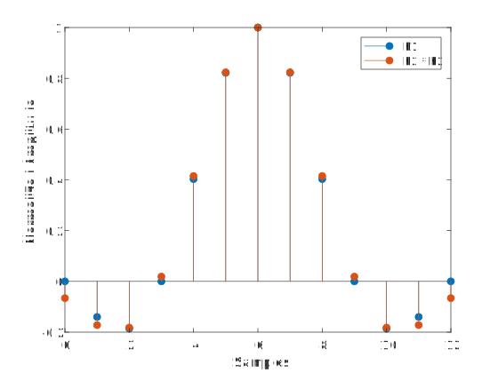

`rcosdesign`：升余弦 FIR 脉冲成形滤波器设计

# 语法

`b = rcosdesign(beta,span,sps)`

`b = rcosdesign(beta,span,sps,shape)`

<!-- more -->

# 说明

`b = rcosdesign(beta,span,sps)` 返回根升余弦（square-root raised cosine）FIR 滤波器的系数 `b`。根升余弦 FIR 滤波器的滚降系数（rolloff factor）为 `beta`。滤波器被截断（truncated）为 `span` 个符号，并且每个符号周期包含 `sps` 个采样点。滤波器的阶数 `sps * span` 必须是偶数。滤波器的能量为 1。[示例](#Examples-01)

`b = rcosdesign(beta,span,sps,shape)` 根据 `shape` 返回不同的滤波器。当 `shape` 为 `sqrt` 时，返回根升余弦滤波器；当 `shape` 为 `normal` 时，返回升余弦（raised cosine） FIR 滤波器。[示例](#Examples-02)

# 示例

## 设计根升余弦滤波器<a name="Examples-01"></a>

令滚降系数为 `0.25`，滤波器符号数为 `6` 个，每个符号 `4` 个采样点。验证 `sqrt` 是参数 `shape` 的默认值。

``` matlab
h = rcosdesign(0.25,6,4);
mx = max(abs(h-rcosdesign(0.25,6,4,'sqrt')))
```

> `mx = 0`

``` matlab
fvtool(h,'Analysis','impulse')
```


## 升余弦和根升余弦滤波器的脉冲响应<a name="Examples-02"></a>

将升余弦滤波器与根升余弦滤波器进行比较。一个理想的（无限长）升余弦脉冲成形滤波器等效于两个级联的理想的根升余弦滤波器。因此，FIR 升余弦滤波器的脉冲响应应类似于与其自身卷积的根升余弦滤波器的脉冲响应。

设计一个滚降系数为 `0.25`、符号数为 `4` 个、每个符号 `3` 个采样点的升余弦滤波器。

``` matlab
rf = 0.25;
span = 4;
sps = 3;

h1 = rcosdesign(rf,span,sps,'normal');
impz(h1)
```


**升余弦滤波器在 `sps` 的整数倍处具有零值点**。因此，它满足无码间串扰（ISI）的 Nyquist 准则。但是，根升余弦滤波器没有这样的特性：

``` matlab
h2 = rcosdesign(rf,span,sps,"sqrt");
impz(h2)
```


将根升余弦滤波器与自身进行卷积。在最大值处截断脉冲响应，使其长度与 `h1` 相同。使用最大值将响应归一化。然后，将卷积后的根升余弦滤波器与升余弦滤波器进行比较。

``` matlab
h3 = conv(h2,h2,"same");

stem(0:span*sps,[h1/max(abs(h1));h3/max(abs(h3))]',"filled")
xlabel("Samples")
ylabel("Normalized Amplitude")
legend("h1","h2 * h2")
```



由于卷积响应的长度是有限的，因此根升余弦滤波器与自身进行卷积得到的结果会与升余弦滤波器不一致。增加 `span` 可以在响应之间获得更紧密的一致性，并更好地符合 Nyquist 准则。

## 将信号通过升余弦滤波器<a name="Examples-03"></a>

本例说明如何将信号通过根升余弦滤波器。

指定滤波器参数。

``` matlab
rolloff = 0.25;     % 滚降系数
span = 6;           % 滤波器宽度（符号数）
sps = 4;            % 每个符号的采样点数
```

生成根升余弦滤波器的系数。

``` matlab
b = rcosdesign(rolloff, span, sps);
```

生成双极性数据向量。

``` matlab
d = 2*randi([0 1], 100, 1) - 1;
```

上采样并对数据进行滤波以实现脉冲成形。

``` matlab
x = upfirdn(d, b, sps);
```

添加噪声。

``` matlab
r = x + randn(size(x))*0.01;
```

对接收到的信号进行滤波和下采样以进行匹配滤波。

``` matlab
y = upfirdn(r, b, 1, sps);
```

有关如何使用根升余弦滤波器对信号进行插值和抽取的信息，请参见使[用 RRC 滤波器进行插值和抽取](https://ww2.mathworks.cn/help/releases/R2024a/comm/ug/filtering.html#mw_fa589f54-fcad-495e-b4f8-4a4ad52c1f1a)（Communications Toolbox）。

# 输入参数

## `beta` - 滚降系数

滚降系数，应为不大于 `1` 的**实非负标量**。滚降系数决定滤波器的多余带宽。滚降系数为 `0` 时为矩形滤波器（brick-wall filter），滚降系数为 `1` 时为纯升余弦滤波器。

**数据类型**：`double` | `single`

## `span` - 符号数

符号数，应为**正整数标量**。

**数据类型**：`double` | `single`

## `sps` - 每个符号的采样点数

> 正整数标量

每个符号的采样点数（上采样因子），应为**正整数标量**。

**数据类型**：`double` | `single`

## `shape` - 升余弦滤波器的形状

升余弦滤波器的形状，应为 `"normal"` 或 `"sqrt"`。

# 输出参数

## `b` - FIR 滤波器系数

升余弦滤波器的系数，以**列向量**的形式返回。

**数据类型**：`double` | `single`

# 提示

- 如果您有 Communications Toolbox™ 软件的许可证，则可以执行具有流式传输行为的多速率升余弦滤波。为此，请使用 System object™ 滤波器——`comm.RaisedCosineTransmitFilter` 和 `comm.RaisedCosineReceiveFilter`。

# 参考

[1] Tranter, William H., K. Sam Shanmugan, Theodore S. Rappaport, and Kurt L. Kosbar. *Principles of Communication Systems Simulation with Wireless Applications.* Upper Saddle River, NJ: Prentice Hall, 2004.

# 扩展功能

## C/C++ 代码生成

> 使用 MATLAB® Coder™ 生成 C 代码和 C++ 代码。

# 版本历史

在 R2013b 中推出

# 另请参阅

[`gaussdesign`](https://ww2.mathworks.cn/help/releases/R2024a/signal/ref/gaussdesign.html)

## 主题

[用 RRC 滤波器进行插值和抽取](https://ww2.mathworks.cn/help/releases/R2024a/comm/ug/filtering.html#mw_fa589f54-fcad-495e-b4f8-4a4ad52c1f1a)（Communications Toolbox）

> 原文参考：[https://ww2.mathworks.cn/help/releases/R2024a/signal/ref/rcosdesign.html](https://ww2.mathworks.cn/help/releases/R2024a/signal/ref/rcosdesign.html)
