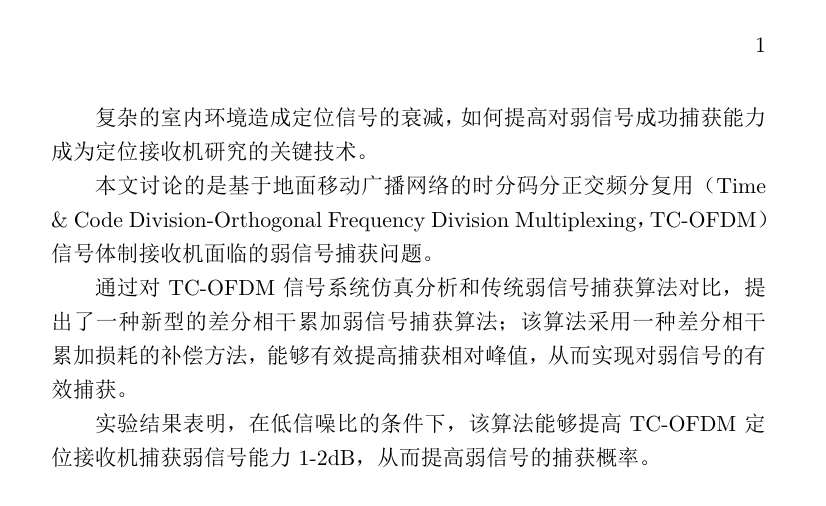
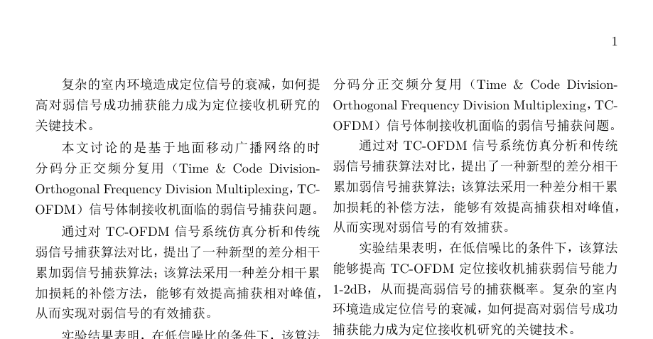
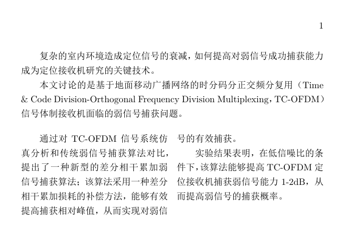

本文主要记录一些使用 LaTex 过程中碰到的问题与解决办法。

<!-- more -->

# 文档类及基本设置

# 文本格式

# 版式

## 分栏

### 全文单栏

在文档类声明时使用 `onecolumn`。

```latex
\documentclass[onecolumn]{ctexart}
```

<div align="center">
  
</div>

### 全文双栏

在文档类声明时使用 `twocolumn`。

```latex
\documentclass[twocolumn]{ctexart}
```

<div align="center">
  
</div>

### 部分双栏

使用宏包 `multicol`，创建双栏环境。

```latex
\documentclass[twocolumn]{ctexart}
\usepackage{multicol}
\begin{document}

复杂的室内环境造成定位信号的衰减，如何提高对弱信号成功捕获能力成为定位接收机研究的关键技术。

本文讨论的是基于地面移动广播网络的时分码分正交频分复用（Time  \& Code Division-Orthogonal Frequency Division Multiplexing，TC-OFDM）信号体制接收机面临的弱信号捕获问题。

\begin{multicols}{2}
    通过对TC-OFDM信号系统仿真分析和传统弱信号捕获算法对比，提出了一种新    型的差分相干累加弱信号捕获算法；该算法采用一种差分相干累加损耗的补偿方法，能够有效提高捕获相对峰值，从而实现对弱信号的有效捕获。

    实验结果表明，在低信噪比的条件下，该算法能够提高TC-OFDM定位接收机捕获弱信号能力 1-2dB，从而提高弱信号的捕获概率。
\end{multicols}

\end{document}
```

<div align="center">
  
</div>

### 参考

[如何用 latex 分双栏(分两列)](https://segmentfault.com/a/1190000019462299?utm_source=tag-newest)

# 数学公式

# 浮动环境
