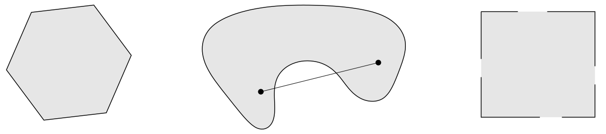
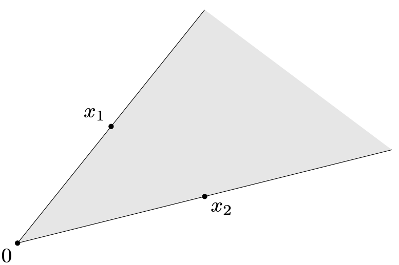

$$
\newcommand{\bfR}{\mathbf{R}}
\def\aff{\mathop{\bf aff}}
\def\relint{\mathop{\bf relint}}
\def\cl{\mathop{\bf cl}}
\def\conv{\mathop{\bf conv}}
\newcommand{\dd}{\mathrm{d}}
\newcommand{\prob}{\mathbf{prob}}
$$

# 1. 直线与线段

&emsp;&emsp;设 $x_1 \ne x_2$ 是 $\bfR^n$ 空间中的两个点，则具有下列形式的点

$$
y = \theta x_1 + (1-\theta)x_2,\theta \in \bfR
$$

组成一条穿过 $x_1$ 和 $x_2$ 的**直线**（*line*）。参数 $\theta = 0$ 和 $\theta = 1$ 分别对应 $y=x_2$ 和 $y = x_1$。参数 $\theta$ 的值在 0 和 1 之间变动，构成了 $x_1$ 和 $x_2$ 之间的（闭）线段（(closed) *line segment*）。

&emsp;&emsp;另一种 $y$ 的表示形式

$$
y = x_2 + \theta (x_1 - x_2)
$$

可以解释为：$y$ 是**基点**（*base point*）$x_2$（对应 $\theta = 0$）和**方向**（*direction*）$x_1 - x_2$（由 $x_2$ 指向 $x_1$）乘以参数 $\theta$ 的和。因此，$\theta$ 给出了 $y$ 在由 $x_2$ 通向 $x_1$ 的路上的位置。当 $\theta$ 由 $0$ 增加到 $1$, 点 $y$ 相应地由 $x_2$ 移动到 $x_1$。如果 $\theta > 1$，点 $y$ 在超越了 $x_1$ 的直线上。[图 1](#图1) 给出了直观的解释。

{width=600px}

<!-- more -->

# 2. 仿射集合和凸集

&emsp;&emsp;如果通过集合 $C \subseteq \bfR^n$ 中任意两个不同点的直线仍然在集合 $C$ 中，那么称集合 $C$ 是**仿射**（*affine*）的。也就是说，$C \subseteq \bfR^n$ 是仿射的等价于：对于任意 $x_1, x_2 \in C$ 及 $\theta \in \bfR$ 有 $\theta x_1 + (1-\theta)x_2 \in C$。换言之，$C$ 包含了 $C$ 中任意两点的系数之和为 $1$ 的线性组合。

&emsp;&emsp;这个概念可以扩展到多个点的情况。若 $\theta_1 + \cdots + \theta_k = 1$，则称具有 $\theta_1 x_1 + \cdots + \theta_k x_k$ 形式的点为 $x_1, \cdots, x_k$ 的**仿射组合**（*affine combination*）。利用仿射集合的定义（即仿射集合包含其中任意两点的仿射组合），可以归纳出以下结论：一个仿射集合包含其中任意点的仿射组合，即如果 $C$ 是一个仿射集合，$x_1, \cdots, x_k \in C$，并且 $\theta_1 + \cdots + \theta_k = 1$，那么 $\theta_1 x_1 + \cdots + \theta_k x_k$ 仍然在 $C$ 中。

&emsp;&emsp;如果 $C$ 是一个仿射集合并且 $x_0 \in C$，则集合

$$
V = C - x_0 = \left\{ x - x_0 \middle| x \in C \right\}
$$

是一个子空间，即关于加法和数乘是封闭的。

> 简单说明：设 $v_1, v_2 \in V$，$\alpha, \beta \in \bfR$，则有 $v_1 + x_0 \in C$，$v_2 + x_0 \in C$。因为 $C$ 是仿射的，且 $\alpha + \beta + (1 - \alpha - \beta) = 1$，所以
>
> $$
> \alpha v_1 + \beta v_2 + x_0 = \alpha (v_1 + x_0) + \beta(v_2 + x_0) + (1 - \alpha - \beta)x_0 \in C
> $$
>
> 由 $\alpha v_1 + \beta v_2 + x_0 \in C$，可知 $\alpha v_1 + \beta v_2 \in V$。

&emsp;&emsp;因此，仿射集合 $C$ 可以表示为

$$
C = V + x_0 = \left\{ v + x_0 \middle| v \in V \right\}
$$

即一个子空间加上一个偏移。与仿射集合 $C$ 相关联的子空间 $V$ 与 $x_0$ 的选取无关，所以 $x_0$ 可以是 $C$ 中的任意一点。定义仿射集合 $C$ 的维数为子空间 $V = C - x_0$ 的维数，其中 $x_0$ 是 $C$ 中的任意元素。

&emsp;&emsp;由集合 $C \subseteq \bfR^n$ 中的点的所有仿射组合组成的集合称为 $C$ 的**仿射包**（*affine hull*），记为 $\aff{C}$：

$$
\aff{C} = \left\{ \theta_1 x_1 + \cdots + \theta_k x_k \middle| x_1, \cdots, x_k \in C, \theta_1 + \cdots + \theta_k = 1 \right\}
$$

仿射包是包含 $C$ 的最小的仿射集合，也就是说：如果 $S$ 是满足 $C \subseteq S$ 的仿射集合，那么 $\aff{C} \subseteq S$。

# 3. 仿射维数与相对内部

&emsp;&emsp;集合 $C$ 的仿射维数定义为其仿射包的维数。仿射维数在凸分析及凸优化中十分有用，但它与其他维数的定义常常不相容。

> 举例：考虑 $\bfR^2$ 上的单位圆环 $\left\{x\in\bfR^2\middle| x_1^2 + x_2^2 = 1 \right\}$。它的仿射包是全空间 $\bfR^2$，所以其仿射维数为 $2$。但是，在其他大多数维数的定义下，$\bfR^2$ 上的单位圆环的维数为 $1$。

&emsp;&emsp;如果集合 $C \subseteq \bfR^n$ 的仿射维数小于 $n$，那么这个集合在仿射集合 $\aff C \ne \bfR^n$ 中。定义集合 $C$ 的**相对内部**（*relative interior*）为 $\aff C$ 的内部，记为 $\relint C$，即

$$
\relint C = \left\{ x \in C \middle| B(x,r) \cap \aff C \subseteq C\ 对于某些\ r > 0 \right\}
$$

其中 $B(x,r) = \left\{ y \middle| \left\| y-x \right\| \leqslant r \right\}$，即半径为 $r$，中心为 $x$ 并由范数 $\| \cdot \|$ 定义的球（这里的 $\| \cdot \|$ 可以是任意范数，并且所有范数定义了相同的相对内部）。于是可以定义集合 C 的**相对边界**（*relative boundary*）为 $\cl C\ \backslash \relint C$，此处 $\cl C$ 表示 $C$ 的闭包。

# 4. 凸集

&emsp;&emsp;集合 $C$ 被称为**凸集**（*convex set*），如果 $C$ 中任意两点间的线段仍然在 $C$ 中，即对与任意 $x_1, x_2 \in C$ 和满足 $0 \leqslant \theta \leqslant 1$ 的 $\theta$ 都有

$$
\theta x_1 + (1-\theta)x_2 \in C
$$

粗略地看，如果集合中的每一点都可以被其他点沿着它们之间一条无阻碍的路径看见，那
么这个集合就是凸集。所谓无阻碍，是指整条路径都在集合中。由于仿射集包含穿过集
合中任意不同两点的整条直线，任意不同两点间的线段自然也在集合中。因而仿射集是
凸集。[图 2](#图2) 显示了 $\bfR^2$ 空间中一些简单的凸和非凸集合。

{width=1000px}

&emsp;&emsp;集合 $C$ 中所有点的凸组合的集合称为集合 $C$ 的凸包，记为 $\conv C$：

顾名思义，凸包 $\conv C$ 总是凸的。它是包含 $C$ 的最小的凸集。也就是说，如果 $B$ 是包含 $C$ 的凸集，那么 $\conv C \subsetneq B$。[图 3](#图3) 展示了凸包的定义。

$$
\conv C = \left\{ \theta_1 x_1 + \cdots + \theta_k x_k \middle| x_i \in C, \theta_i \geqslant 0, i = 1,\cdots, k, \theta_1 + \cdots + \theta_k = 1 \right\}
$$

 中的肾形集合的凸包是阴影所示的集合。](../images/post/2022-03-29-josh-convex-optimization-1-1/2022-03-29-josh-convex-optimization-1-1-030-TheConvexHullsOfTwoSets.png){width=800px}

&emsp;&emsp;凸组合的概念可以扩展到无穷级数、积分以及大多数形式的概率分布。假设 $\theta_1,\theta_2,\cdots$ 满足

$$
\theta_i \geqslant 0, \quad i = 1,2,\cdots,\quad \sum_{i=1}^\infty \theta_i = 1
$$

并且 $x_1, x_2, \cdots \in C$, 其中 $C \subseteq \bfR^n$ 为凸集。那么，如果下面的级数收敛，则有

$$
\sum_{i=1}^\infty \theta_i x_i \in C
$$

更一般地，假设 $p:\bfR^n\to\bfR$ 对所有 $x \in C$ 满足 $p(x) \geqslant 0$，并且 $\displaystyle \int_C p(x) \dd x$, 其中 $C \subseteq \bfR^n$ 是凸集。那么，如果下面的积分存在，则有

$$
\int_C p(x)x \dd x \in C
$$

&emsp;&emsp;最一般的情况，设 $C \subseteq \bfR^n$ 是凸集，$x$ 是随机变量，并且 $x \in C$ 的概率为 $1$，那么 $\mathbb{E}\{x\} \in C$。事实上，这一形式包含了前述的特殊情况。例如，假设随机变量 $x$ 只在 $x_1$ 和 $x_2$ 中取值，其概率分别为 $\prob(x=x_1) = \theta$ 和 $\prob(x=x_2) = 1-\theta$，其中 $0 \leqslant \theta \leqslant 1$。于是，$\mathbb{E}\{x\} = \theta x_1 + (1-\theta)x_2$，即回到了两个点的简单的凸组合。

# 5. 锥

&emsp;&emsp;如果对于任意 $x \in C$ 和 $\theta \geqslant 0$ 都有 $\theta x \in C$，我们称集合 $C$ 是**锥**（*cone*）或者**非负齐次**（*nonnegative homogeneous*）。如果集合 $C$ 是锥，并且是凸的，则称 $C$ 为**凸锥**（*convex cone*），即对于任意 $x_1, x_2 \in C$ 和 $\theta_1, \theta_2 \geqslant 0$, 都有

$$
\theta_1 x_1 + \theta_2 x_2 \in C
$$

在几何上，具有此类形式的点构成了二维的扇形，这个扇形以 $0$ 为顶点，边通过 $x_1$ 和 $x_2$（如[图 4](#图4)所示）。

{width=400px}

&emsp;&emsp;具有 $\theta_1 x_1 + \cdots + \theta_k x_k, \theta_1,\cdots,\theta_k$ 形式的点称为 $x_1,\cdots,x_k$ 的**锥组合**（*conic combination*）（或**非负线性组合**（*nonnegative linear combination*））。如果 $x_i$ 均属于凸锥 $C$，那么，$x_i$ 的每一个锥组合也在 $C$ 中。反言之，集合 $C$ 是凸锥的充要条件是它包含其元素的所有锥组合。如同凸（或仿射）组合一样，锥组合的概念可以扩展到无穷级数和积分中。

&emsp;&emsp;集合 $C$ 的**锥包**（*conic hull*）是 $C$ 中元素的所有锥组合的集合，即

$$
\left\{ \theta_1 x_1 + \cdots + \theta_k x_k \middle| x_i \in C, \theta_i \geqslant 0, i = 1,\cdots,k \right\}
$$

它是包含 $C$ 的最小的凸锥（如[图 5](#图5) 所示）。

 中两个集合的锥包（阴影所示）。](../images/post/2022-03-29-josh-convex-optimization-1-1/2022-03-29-josh-convex-optimization-1-1-050-TheConicHulls.png){width=600px}

# 参考文献

1. Stephen P. Boyd and Lieven Vandenberghe, *Convex optimization*. Cambridge, UK: Cambridge University Press, 2004.
2. Stephen P. Boyd and Lieven Vandenberghe, *凸优化*. 北京: 清华大学出版社, 2013.
