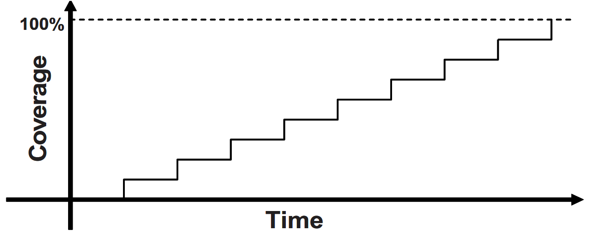
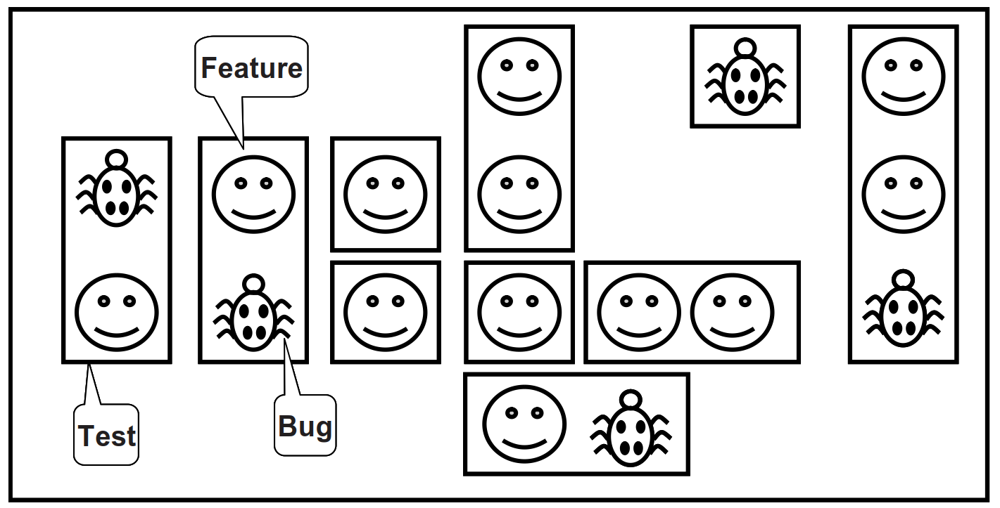
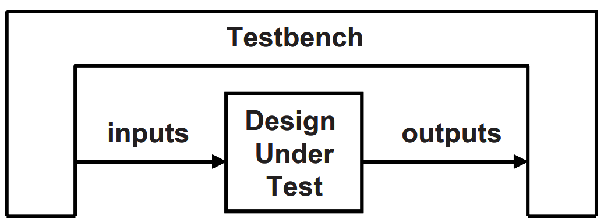
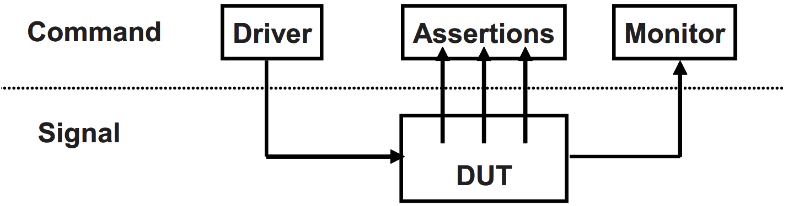
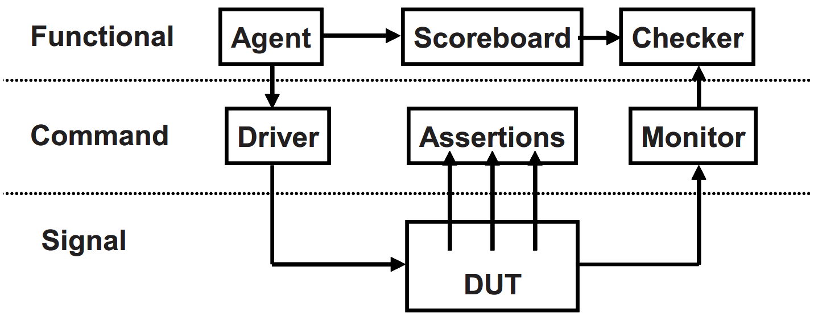
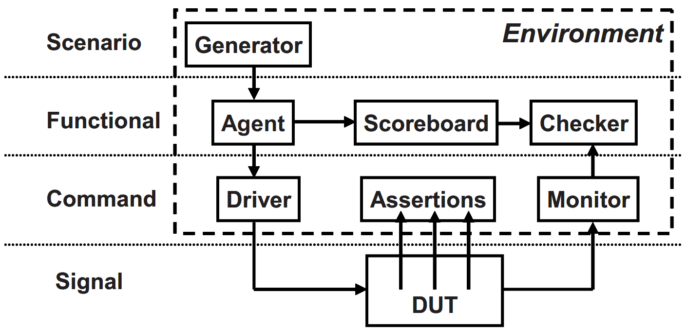
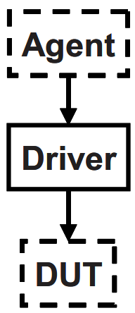

在开始学习有关 System Verilog 语言的细节之前，需要理解如何制订计划来验证手中的设计，以及整个验证计划对 testbench 结构的影响。就像所有房子都有厨房、卧室和浴室一样，所有 testbench 也都需要共享一些用于产生激励、检验响应的结构。本文对 testbench 的构建和设计给出一些引导性的建议和编码风格方面的参考，以满足不同的需要。

验证工程师能学到的最重要的原则是“Bugs are good”，不要因为害怕 bug 而不敢 debug，每次找到 bug 都应该及时告警并记录下来。任何一个项目中都不可能没有 bug，所以在流片之前每发现一个 bug 都意味着用户手中的产品少一个 bug。我们应该尽可能细致深入地去检验设计，找出所有可能存在的 bug，尽管有时候这些 bug 可能很容易修复。

本文需要 Verilog 语言基础，面向对 SystemVerilog HVL (Hard­ware Verification Language, 硬件验证语言) 感兴趣的读者。与 HDL (Hardware Desription Language, 硬件描述语言) 相比，HVL 具有一些特别的性质：

  1. **约束下的随机激励生成** (*Constrained-random stimulus generation*)。
  2. **功能覆盖率** (*Functional coverage*)。
  3. **更高层次的结构**，尤其是面向对象的编程 (*Higher-level structures*, especially object-oriented programming)。
  4. **多线程**及线程间的通信 (*Multithreading* and interprocess communication)。
  5. **支持 HDL 数据类型** (*Support for HDL types* such as Verilog’s 4-state values)。
  6. **集成了事件仿真器**，便于对设计施加控制 (*Tight integration with event-simulator* for control of the design)。

上述特性使得 HVL 可以创建高度抽象的 testbench，其抽象层次比使用 HDL 或计算机编程语言如 C 所能达到的还要高。

<!-- more -->

# 1. 验证流程

验证的目的是什么？如果说是为了“寻找 bug”，那也只答对了一部分。硬件设计的目的是设计一个**基于设计规范并能完成特定任务的设计**，例如 DVD 播放器、路由器或者雷达信号处理器。验证工程师需要**确保这些设计能够成功地完成预定的任务**——也就是说，确保**设计能够准别表达这些规范**；而设计在超出预定目标之外的行为可以不用关心。

验证和设计是并行的流程。对于每个设计模块，设计者需要首先了解硬件设计规范/设计输入，理解其中设计需求，然后使用 RTL 代码之类的机器语言创建相应的逻辑。为了完成这个过程，设计者需要知道输入格式、传输函数以及输出格式。在理解设计需求的过程中总是会有模糊的地方，可能因为是设计输入文档本身的表述不清楚，遗漏了细节或者前后不一致。验证工程师必须阅读硬件规范并拟定验证计划，然后按照计划，创建测试来检查 RTL 代码是否准确地实现了满足了所有的规范。

如果有多人按照同一规范进行解读，那么设计流程可能会出现冗余。验证工程师的工作是阅读同样的硬件设计规范并对其含义做出独立的判断，然后利用测试来检查对应的 RTL 代码是否与理解相一致。

## 1.1. 不同层次上的测试

设计中会潜藏着哪些类型的 bug 呢？最容易检测的是在**代码块 (*block*) 层次**上，代码块由每个设计者在模块 (module) 内创建。ALU (Arithmetic-Logic Unit, 运算逻辑单元) 是否正确地执行了两个数的加法？是否每个总线传输都能够成功完成？是否所有的数据包都经过了网络交换机？为了找出这些 bug 而去编写定向测试是一件十分繁琐的事情，原因是这些 bug 都被包含在设计的代码块里。

除了代码块以外，代码块的**输入输出接口**也是 bug 丛生的地方，通常是因为多个设计者对同一规范产生了不同理解。对于一个给定的协议，什么信号发生了变化？在什么时候变化？第一个设计者按照自己对规范的理解建立了一个总线驱动器，第二个设计者也按照自己的理解建立了一个总线接收器，但两者对规范的理解略有不同。我们的工作就是找到两者在硬件逻辑上有冲突的地方，然后将两者进行统一。

为了对一个代码块进行仿真，我们需要创建测试集来模拟周围代码块产生激励，这是一件困难而繁琐的事情。好消息是低层次的仿真运行起来会很快。但是，随着代码块数量的增加，可能会在设计和 testbench 中同时找到 bug，因为 testbench 为了提供足够的激励，代码也会很长。当开始对所有的代码块进行合并测试时，它们也会相互激励，测试负担就会相对减少。多个代码块同时仿真可能会发现更多的 bug，但是运行起来也会慢一些。

在 DUT (Design under Test,  DUT) 的最高层次中，整个系统都会被测试，但是仿真过程会简单很多。我们的测试应该尽可能让所有的代码块并发活动。所有的输入输出端口都被激活，处理器正在处理数据，而高速缓存也正在载入数据。有了这些行为以后，数据分配和时序上的 bug 肯定会出现。

在这个层次上，能够运行更加精细的测试，可以**让 DUT 并发执行多种操作以激活尽可能多的代码块**。如果一个 MP3 播放器正在播放音乐时，用户希望从计算机上下载新的音乐会发生什么？在下载的过程中，用户在播放器上按键又会发生什么？显然，一个实际的设备在被使用时，有些用户会去做这些事情，那为什么不在设备制造之初去做同样的测试呢？这种测试可以把易于使用的产品和经常发生故障的产品区分开来。

一旦验证了 DUT 能够执行所有预期的功能以后，还需要看一下当出现错误时 DUT 会怎样操作。设计是否能应对只进行了一半的事件，已经受损的数据或控制字段？想要列举出所有可能的问题就很困难，更不用说去判断设计会如何从这些错误中恢复了。所以**错误注入和处理 (Error Injection and Handling) 是验证中最具挑战性的部分**。

随着设计抽象层次的提高，验证的挑战性也会加大。我们可以确定单个信元是否正确通过 ATM (Asynchronous Transfer Mode, 异步传输模式) 路由器，但如果是一系列有着不同优先权的数据流呢？在最高的抽象层次中，下一个操作应该选择哪个信元并不是显而易见的，可能不得不统计成千上万的信元，以便确定这种集总的操作是否正确。

最后，**我们永远也无法证明没有任何遗留的 bug**，所以需要不停地尝试新的验证策略。

## 1.2. 验证计划

验证计划和硬件规范是紧密联系在一起的，它描述了需要验证什么样的特性，以及采用哪些技术。这些步骤可能包含有定向测试 (directed test) 或随机测试 (random test) 、断言 (assertion)、软硬件协同验证 (HW/SW co-verification)、硬件仿真 (emulation)、形式验证 (formal proof)，以及对验证 IP 的使用等等。有关验证更全面的讨论，可参见 Bergeron 的 *Verification Methodology Manual for
SystemVerilog* (2006)。

# 2. Testbench 的基本功能

Testbench 的用途在于**确定 DUT 的正确性**。包含下列步骤：

  1. 产生激励。
  2. 把激励施加到 DUT 上。
  3. 捕捉响应。
  4. 检验正确性。
  5. 对照整个验证目标测算进展情况。

有些步骤是 testbench 自动完成的，有些则需要手动操作，所选择的验证方法学决定了上述步骤如何展开。

# 3. 定向测试

当需要验证一个设计的正确性时，传统的做法可能是使用定向测试。使用这种方式，首先需要阅读硬件规范，然后写下验证计划，计划上列有各种测试，每个测试针对一系列相关的特性。按照这个计划，接着**编写针对 DUT 具体特性的激励向量，然后使用这些向量对 DUT 进行仿真**。仿真结束后，手动查看一下结果文件和波形，确保设计的行为与预期的一致。一旦测试结果正确，就可以开始下一个测试。

这种渐进的方法比较容易取得稳步的进展，因而很受那些喜欢看到项目持续向前推进管理者的欢迎。由于创建每个激励向量时并不需要什么基础，所以定向测试的结果也会很快得到。只要给予足够的时间和人力，定向测试对于大部分设计验证来讲都是可以胜任的。

[图 1.1](#图1.1) 显示了定向测试如何逐步覆盖验证计划中的每个特性。每个测试都针对一个特别的设计元素集合。**如果有足够的时间**，可以写出 100% 覆盖整个验证计划所需要的全部测试。

<span id="图1.1"></span>
<div align="center">
  
</div>

如果没有足够的时间和资源来完成定向测试该怎么办？如[图 1.1](#图1.1)，当在时间往前推进时，覆盖率 (coverage) 可能维持不变。如果设计复杂度翻倍，那么测试就需要增加一倍的时间或者人力，而这种情况是我们所不愿意看到的。因此为了达到 100% 覆盖率的目标，需要一种可以更快找出 bug 的方法。

[图 1.2](#图1.2) 所示为整个设计空间和各种特性被定向测试案例覆盖的情形。在设计空间里有很多特性 (feature)，其中有些存在 bug，需要编写各种测试 (test) 去覆盖所有的特性并找出 bug。

<span id="图1.2"></span>
<div align="center">
  
</div>

# 4. 方法学基础

本文使用如下原则：

  1. 约束下的随机激励。
  2. 功能覆盖率。
  3. 使用事件处理器的分层 testbench。
  4. 对所有测试通用的 testbench。
  5. 独立于 testbench 之外的个性化测试代码。

这些原则是相关联的。随机激励对于测试复杂设计十分关键。**定向测试可以找出设计中预期的 bug，而随机测试则能够找出预料不到的 bug**。当使用随机激励时，需要用功能覆盖率来评估验证的进展情况。一旦开始使用自动生成的激励，就需要一种能够**自动预测结果**的方式——通常是记分板或者参考模型。建立包括自预测在内的 testbench 基础设施，是一件工作量很大的事情。分层 testbench (layered testbench) 能够把问题分解为容易处理的小块，这样有助于控制复杂度。事件处理器 (transactors) 能够为构建这些小块提供有用的模式。在适当的规划下，可以建立一个 testbench 所需的基础设施，它们能在所有测试中通用并且不需要经常修改，只需要在某些地方放置“hook”，以便测试能够在这些地方执行调整激励或注入错误等特定操作。相反，针对单一测试的个性化代码必须与 testbench 分开，这样可以避免增加基础设施的复杂度。

建立这种风格的 testbench 所需的时间要比传统的定向 testbench 多得多——尤其是自检的部分。其结果是，可能需要很长的准备时间才能进行第一次可运行的测试。这会给项目管理带来阵痛，所以需要在测试时间表上把这部分考虑进去。从[图 1.3](#图1.3) 中可以看到，第一个随机测试运行前有比较长的初始延迟。

<span id="图1.3"></span>
<div align="center">
  
</div>

随机测试的前期准备工作看起来似乎令人不满意，但是其回报却很高。每个随机测试都可以共享这个通用的 testbench，不像每个定向测试都要从零开始编写。每个随机测试都会包含一部分代码，将激励约束到特定的方向上并触发期望的异常，比如创建一个协议违例。其结果是，约束下的随机 testbench 找起 bug 来会比很多定向测试快很多。随着 bug 出现率的下降，应该创建新的随机约束去探索新的区域。最后的几个 bug 可能只能通过定向测试来发现，但是绝大部分的 bug 都应该会在随机测试中出现。

# 5. 约束下的随机激励<a name="05"></a>

虽然我们希望仿真器能产生随机激励，但同时又**不希望这些激励数值完全随机**。使用 SystemVerilog 语言可以描述激励的格式 (例如，地址是 32 位；操作码是 ADD 、 SUB 或 STORE；长度 < 32 字节)，然后让仿真器产生满足约束的数值。这些数值会被发送到设计中去，同时也会被发送到一个负责预测仿真结果的高层模块中去。设计的实际输出最终需要和预测输出做对比。

[图 1.4](#图1.4) 所示为约束下的随机测试在整个设计空间中的覆盖率。

- 值得注意的是，**一个随机测试的覆盖范围往往比一个定向测试大**。多出来的覆盖部分可能会与其他测试发生交叠，或者探测到事先没有预料到的新区域 (new area)。
- 在这些新区域中发现 bug 是一件幸运的事情。如果这些对新区域的测试不合法，则需要编写更多的约束去阻止随机测试产生非法的功能。
- 对于那些约束下的随机测试覆盖不到的地方，可能还需要编写一些定向测试。

<span id="图1.4"></span>
<div align="center">
  
</div>

[图 1.5](#图1.5) 所示为达到完全覆盖的技术路线：

1. 从左上角的基本的约束下的随机测试 (constrained random test) 开始，使用不同的种子 (seed) 运行。
2. 当我们查看功能覆盖率 (functional covrage) 报告时，注意找出覆盖率中的间隙 (hole)，即覆盖盲区。
3. 针对这些盲区进行最小程度代码修改 (mininal code midification)，可能是使用新的约束 (constraint)，也可能是把错误或延迟加入到 DUT 中。这个外部循环会花掉我们大部分的时间，只有对少数使用随机测试达不到的特性才编写定向测试。

<span id="图1.5"></span>
<div align="center">
  
</div>

# 6. 我们的随机化对象是什么<a name="06"></a>

当考虑对一个设计的激励进行随机化时，首先想到的可能是数据字段。这种激励最容易创建——只需调用 `$random()` 即可。问题是这种随机数据在找 bug 方面的回报很小。能够使用随机数据找到的 bug 类型基本上都是在数据路径上的，很可能还都是比特级的错误，还需要找出**控制逻辑上的 bug**。

此外，需要广泛地考虑所有的设计输入，如下所列：

  1. 设备配置。
  2. 环境配置。
  3. 输入数据。
  4. 协议异常。
  5. 错误和违例。
  6. 时延。

## 6.1. 设备和环境配置

在对 RTL 设计进行测试的过程中，察觉不到 bug 的最常见的原因是什么？是因为**没有尝试足够多的不同配置**。很多测试只使用了仅仅经过复位的设计，或者施加固定的初始化向量集把设计引向一个已知的状态。这就好比是在个人电脑上刚刚安装完操作系统，还没有安装任何应用程序的时候，就对操作系统进行测试。测试结果当然会很好，但是并没有挖掘出实际的问题。

在一个实际的应用环境中，随着 DUT 使用时间的增加，其配置会变得越来越随机。例如，验证一个分时复用的多路开关，它有 2000 个输入通道和 12 个输出通道。这些通道在另外一边可以映射成各种不同的配置。每个输入可能作为单个通道使用，也可能会被进一步分割成多个通道。棘手的是，虽然大部分时间里使用的是几种标准的通道分割方式，但由于其他分割方式的组合也是合法的，所以存在着大量可能的用户配置。

为了测试这个设备，对于每个通道的配置，工程师都必须写出好几十行的定向测试代码。显然，验证工程师无力应对如此多的通道配置。后来编写了一个 testbench，对每个通道的参数都采用随机化策略，然后把这部分代码放到一个循环里去完成所有开关通道的配置。现在，找出与配置相关的 bug 变得更加容易，而这些 bug 在以前常常不被察觉。

在实际的应用中，我们的设计所在的环境里会包含其他的部件。当对 DUT 进行验证时，实际上就是把 testbench 连接起来模仿这个环境，应该对整个环境的配置进行随机化，包括仿真的时长、设备的数量，以及它们的配置方式。当然，需要创建约束以确保配置的合法性。

在另外一个 Synopsys 公司的客户案例中，一家公司设计了一个 I/O 交换芯片，用于把多套 PCI 总线连接到一套内部总线上。在仿真一开始，他们就随机地选择了 PCI 总线的数目 (1~4) 以及总线上设备的数目 (1~8)，而且对每个设备上的参数也进行了随机化（如主从模式、 CSR 地址等等）。他们使用功能覆盖率对测试过的组合进行跟踪，以确保所有可能的组合都被覆盖。

其他环境参数还包括测试长度、错误注入比率，以及时延模式等。Bergeron (2006) 在这方面有更多的例子。

## 6.2. 输入数据

当看到随机激励时，我们可能会想到**选取一个总线写入的事件或 ATM 信元，然后把随机数值填充到其中的数据字段里**。实际上，这种方式相当直接，需要事先估计好所有的分层协议和错误注入，以及记分板的内容和功能覆盖率。

## 6.3. 协议异常、错误和违例

最令人沮丧的事情莫过于个人电脑或移动电话之类的设备死机。大多数情况下，唯一的办法就是关机然后重新启动。死机最有可能的原因是，产品内部的一部分逻辑遇到了错误以后无法恢复过来，因此使得设备不能正常工作。

如何才能阻止这些问题出现在我们创建的硬件上呢？应该尽量尝试去仿真在实际的硬件中可能出现的错误，而且应该针对所有可能出现的错误。如果一个总线事件没有完成会怎么样？如果遇到一个非法的操作呢？设计规范中有没有指出哪两个信号互斥？要对这些情况一一尝试，然后确保设备还能继续正常运作。

**在尝试使用不当的命令去激励硬件的同时，也应该注意捕捉出现的问题**。例如，重新调用那些互斥的信号。可以增加用于检验的代码来帮忙找出问题所在。这些代码应该至少能够在出错的地方打印一个警告信息，如果能够报告出错误并且使测试停下来则更好。花费大最时间在代码中追溯故障的根源，是一件令人非常不愉快的事情，尤其是在本来如果使用一个简单的断言就可以定位这个错误的情况下。(关于如何在 testbench 和设计代码中编写断言，可以参考 Vijayaraghavan 和 Ramanathan 在 2005 出版的著作。) 只要确保能够使代码在出错的地方停止仿真，那么就很容易应对测试中的错误。

## 6.4. 时延和同步

Testbench 应该以多快的速度发送激励呢？使用**约束下的随机时延**有助于捕捉协议上的 bug。时延最短的测试运行速度最快，但它产生不了所有可能的激励。可以创建一个 testbench 以最快的速度与另一个代码块通信，但那些隐蔽的 bug 往往是在引入间歇性时延之后才被发现的。

一个代码块对于来自同一接口的所有可能激励也许都能正常工作，但如果同时面对多个输入，隐蔽的 bug 可能就会出现。尝试协调各个驱动器使它们能够在不同的速率下进行通信。如果输入以可能的最快速率到达，而输出却被卡在一个较低的速率上，该怎么办？如何处理来自多个输人的激励同时到达的情况？如果这此激励带有不同的时延又该怎么办？使用功能覆盖率，可以测量随机生成的各种组合。

## 6.5. 并行的随机测试

如何运行测试？每个定向测试都带有一个 testbench，能够产生一组特定的激励和响应向量。如果想改变激励，就需要改变测试。随机测试则包含了 testbench 代码和随机种子。如果对同一个测试运行 50 次，每次都采用不同的种子，那么将会得到 50 个不同的激励集合。使用多个种子运行同一个测试可以加大覆盖率，同时也能减少工作量。

我们需要**为每次仿真选定一个独特的种子**。有些人使用自然时间作为种子，但这依然会引起重复。如果半夜里在一个计算机集群系统上开始 10 项任务会怎么样？多项任务可能会于同一时间在不同的计算机上启动，这样还是会得到相同的随机种子并运行相同的激励。因此，应该把处理器的名称加入到种子里去。如果集群系统里面有多核计算机，那还是可能会出现两个相同的种子，所以在这种情况下应该把处理器核的编号也加到种子里去，这样就能得到独一无二的种子了。

> 我们还需要对并行仿真的文件组织进行规划。每次仿真都会有一系列的输出文件，例如日志文件和功能覆盖率文件，可以让每个仿真在不同的目录里运行，或者也可以尝试给每个文件取不同的名字。最简单的办法是在目录名后面加上随机种子的值。

# 7. 功能覆盖率

本文[第 5 节](#05)和[第 6 节](#06)讲述了如何创建激励并使这些激励遍历整个可能的输入空间。使用这种方法，Testbench 会频繁访问部分区域，但需要花费很长的时间来达到所有可能的状态。即使对仿真时间不加限制，无法达到的状态还是永远也不会被访问到，因此需要知道哪些部分已经被验证过，这样才能对验证计划中的项目进行核对。

对功能覆盖率的测量和使用包含了几个步骤。首先，需要在 testbench 中加入代码，用于监控进入设备中的激励，以及设备对激励的反应，并据此确定哪些功能已经被验证过。运行几次仿真，每次使用不同的种子。接下来，把这些仿真的结果合并到一个报告中。然后需要对结果进行分析，最后决定如何采用新的激励来达到那些尚未被测试到的条件和逻辑。

## 7.1. 从功能覆盖率到激励的反馈

随机测试需要使用反馈 (feedback)。最初的测试会被运行很多次，使用不同的种子，创建很多互异的输入序列。但是到了最后，即使使用新的种子，所产生的激励也很可能无法在设计空间中探测到新区域。**随着功能覆盖率逐渐接近极限，需要改变测试，以期能找出新的方法去达到那些尚未被覆盖的区域**。这被称为“覆盖率驱动的验证”，如[图 1.6](#图1.6) 所示。

<span id="图1.6"></span>
<div align="center">
  
</div>

Testbench 有没有可能为我们做到这一点呢？假设现在需要使用 testbench 在每个周期为处理器产生一个总线事件，并为总线事件做出终止判断（成功、校验错误、重试）。在没有使用 HVL 的时候，通常会编写一个很长的定向测试集，然后花费了很多天的工夫编排终止判断代码，并让它们在合适的周期里给出判断。经过了大量的手动分析以后才得出成功的结论达到 100 ％的覆盖率。但之后可能由于处理器的时序有了一点微小的改变，不得不重新分析测试并改变激励。

更加有效的测试策略是**使用随机总线事件和终止判断**。运行的时间越长，覆盖率就会越高。另外的一个好处是，这种测试在创建激励时灵活性很高，足以应对设计时序有改变的情形。为了做到这一点，可以在测试代码中加入一个反馈循环，用于监测己生成的激励 (是否已经产生所有写周期？) 并根据情况调整约束的权重 (把写的权重降到零)。这种改进能大大缩减达到完全覆盖的时间，而且只需要很少量的人工干预。

其实，这并不是一种典型的情况，因为从功能覆盖率到激励的反馈往往是微不足道的。在实际的设计中，应该如何改变激励以使它达到一个期望的设计状态呢？这不仅要求对设计有深入的了解，而且还需要高超的形式验证技术。总之答案并不简单，所以**在约束下的随机激励中很少采用动态反馈**。相反地，**需要手动分析覆盖率报告，然后调整随机约束**。

有些形式分析工具如 Magellan (Synopsys, 2003) 用到了反馈。它首先对设计进行分析并找出所有可以达到的互异状态。然后运行一小段仿真看有多少状态被访问到。最后，在状态机和设计输入之间进行搜索并计算出达到所有遗留状态所需要的激励，然后 Ma­gellan 再把这些激励施加到 DUT 上。

# 8. Testbench 的构建

在仿真时，**testbench 会把整个 DUT 包围起来**，就像一个硬件测试器连接到一个物理芯片上一样，如[图 1.7](#图1.7) 所示。testbench 和测试仪器都会产生激励并捕捉响应。不同的是，testbench 需要工作在一个很宽的抽象层次范围内，同时创建事件和激励序列并最终转换成比特向量。而测试仪器则只工作在比特级上。

<span id="图1.7"></span>
<div align="center">
  
</div>

Testbench 模块里都包含了什么呢？有很多的 BFM (Bus Functional Models, 总线功能模型)，可以把它们看成是 testbench 构件 (components) ——从 DUT 的角度看，它们和真实的构件没什么两样，但它们其实只是 testbench 的组成部分，并非 RTL 设计。如果实际应用中设备被连接到 AMBA、USB、PCI 和 SPI 总线上，那么就必须**在 testbench 中建立能够产生激励并校验响应的等效构件**，如[图 1.8](#图1.8) 所示。这些构件并不是带有细节的可综合模型，而是遵循协议并且执行速度更快的高层次事件处理器。如果把设计原型在 FPGA 上实现或者是进行硬件仿真，那么这些 BFM 就需要是可综合的。

<span id="图1.8"></span>
<div align="center">
  
</div>

# 9. 分层 testbench

对于任何一种新型的验证方法学来讲，分层的 testbench 是一个关键的概念。虽然分层似乎会使 testbench 变得更复杂，但它能够把代码分而治之，**有助于减轻工作负担**。不要试图去编写一个包含所有功能 (随机产生所有合法和非法的激励，并使用多层协议进行错误注入) 的子程序，因为这样的子程序很快就会变得很复杂，并且难以维护。

## 9.1. 不分层的 testbench

在刚开始学习 Verilog 并尝试写测试程序的时候，这些程序看起来可能会和[例 1.1](#例1.1) 所示的用于执行一个简单 APB (AMBA Peripheral Bus, AMBA 外设总线）写入的低层次代码很相似。

<span id="例1.1"></span>

``` verilog 例 1.1 驱动 APB 引脚
module test(PAddr,PWrite,PSel,PWData,PEnable,Rst,clk);
// 此处省略端口声明

    initial begin
        // 驱动复位
        Rst <= 0;
        # 100 Rst <= 1;

        // 驱动控制总线
        @(posedge clk)
        PAddr  <= 16'h50;
        PWData <= 32'h50;
        PWrite <= 1'b1;
        PSel   <= 1'b1;

        // 使 PEnable 翻转
        @(posedge clk)
            PEnable <= 1'b1;
        @(posedge clk)
            PEnable< = 1'b0;

        // 校验结果
        if (top.mem.memory[16'h50] == 32'h50)
            $display("Success");
        else
            $display("Error, wrong value in memory");
        $finish;
    end
endmodule
```

经过几天连续编写这种代码以后，我们可能会意识到这是一种重复性的劳动，所以会尝试创建可用于总线写入这种普通操作的任务，如[例 1.2](#例1.2) 所示。

<span id="例1.2"></span>

``` verilog 例 1.2 一个用于驱动 APB 引脚的任务
task write(reg [15:0] addr, reg [31:0] data);
    // 驱动控制总线
    @(posedge clk)
    PAddr  <= addr;
    PWData <= data;
    PWrite <= 1'b1;
    PSel   <= 1'b1;

    // 使 PEnable 翻转
    @(posedge clk)
        PEnable <= 1'b1;
    @(posedge clk)
        PEnable <= 1'b0;
endtask
```

这样，testbench 就会变得简单一些，如[例 1.3](#例1.3)。

<span id="例1.3"></span>

``` verilog 例 1.3 低层次的 Verilog 测试
module test(PAddr,PWrite,PSel,PWData,PEnable,Rst,clk);
    // 此处省略端口声明
    // 此处省略如例 1.2 给出的任务函数

    initial begin
        reset();                  // 设备复位
        write(16'h50, 32'h50);    // 把数据写入到存储器中

        // 校验结果
        if (top.mem.memory[16'h50] == 32'h50)
            $display("Success");
        else
            $display("Error, wrong value in memory");
        $finish;
    end
endmodule
```

通过把一些通用的操作 (如复位、总线读出和总线写入) 放到一个子程序中，可以提高工作效率并减少错误。这里，物理和命令层的建立只是通往分层 testbench 的第一步。

## 9.2. 信号和命令层

[图 1.9](#图1.9) 所示为一个 testbench 中最低的几个层次。

<span id="图1.9"></span>
<div align="center">
  
</div>

在底部的**信号层** (*signal*)，包含 DUT 和把 DUT 连接到 testbench 的信号。

再往上一层是**命令层** (*command*)。执行总线读写命令的驱动器驱动 DUT 的输入。DUT 的输出与监视器 (monitor) 相连，监视器负责检测信号的变化，并把这些变化按照命令分组。断言 (assertion) 也穿过命令层和信号层，它们负责监视独立的信号以寻找穿越整个命令的信号变化。

## 9.3. 功能层

[图 1.10](#图1.10) 给出了为加上**功能层** (*functional*) 的 testbench，功能层向下面对的是命令层。代理 (agent, 在 VMM 中称为事件处理器) 接收到来自上层的事件，例如，DMA 读或写，把它们分解成独立的命令。这些命令也被送往用于预测事件结果的记分板 (scoreboard)。检验器 (checker) 则负责比较来自监视器和记分板的命令。

<span id="图1.10"></span>
<div align="center">
  
</div>

## 9.4. 场景层

[图 1.11](#图1.11) 所示，功能层被位于**场景层** (*scenario*) 中的发生器 (generator) 所驱动。什么是场景呢？记住一点，验证工程师的工作是确保 DUT 能够完成预期的任务。比如 MP3 播放器，它能一边播放事先存储好的音乐，一边从一台主机上下载新的音乐，并且同时对用户输入如音量调整或音轨控制等操作保持响应。这中间的每一个操作都能称为一个场景。下载一个音乐文件需要若于步骤，例如前期准备时的控制寄存器的读写操作，歌曲传送过程中多次 DMA 写操作，以及之后的很多读写操作。场景层就是负责组织协调这些步骤的，操作的参数如音轨大小和寄存器位置等都采用约束下的随机值。

<span id="图1.11"></span>
<div align="center">
  
</div>

在 testbench **环境** (*environment*) 中的这些块 ([图 1.11](#图1.11) 虚线框内) 是在刚开始开发的时候画出来的。随着项目的进展，它们可能会有一些变化，也可能会加入一些功能，但是这些块对于每个独立的测试都是不应改变的。可以通过在代码中留下“hook”来做到这一点，这样即使这些块的行为需要在测试时改变，也不必重新编写代码。“hook”可以使用工厂模式 (factory patterns) 和回调函数 (callbacks) 来创建。

## 9.5. 测试的层次和功能覆盖率

现在到了 testbench 的最顶层——测试层，如[图 1.12](#图1.12)。DUT 模块间的 bug 是比较难以发现的，因为这些模块可能是不同的人按照不同的规范设计出来的。

<span id="图1.12"></span>
<div align="center">
  
</div>

这个顶层的测试 (test) 就像一个指挥官：他不演奏任何乐器，但引领着其他人的表演。测试包含了用于创建激励的约束。

功能覆盖率 (fonctional coverage) 可以衡量所有测试在满足验证计划要求方面的进展。随着各项测量标准的完成，功能覆盖率代码在整个项目过程中会经常变化。由于代码经常被修改，所以它不作为测试环境的组成部分。

我们可以在约束下的随机环境中创建“定向测试”。只需在随机序列中间插入定向测试的代码，或者把两部分代码并列。定向代码执行期望的任务，而随机的“背景噪声”可能会使 bug 暴露出来，而且 bug 还有可能来自从未被关注过的模块。

Testbench 中是否需要所有的层次呢？答案要视 DUT 而定。设计越复杂，所需的 testbench 就要越完备。测试层则是必须的。对于一个简单的设计来说，场景层可能过于简单以至于可以把它合并到代理中。

当然，可能还需要更多的层次。如果 DUT 有多个协议层，那么每个层都应该在 testbench 环境中有对应的层。例如使用 IP 封装了 TCP 流量，然后通过以太网数据包的形式发送，对这种情况的测试应该考虑使用三个独立的层来产生和校验数据，如
果能够使用已有的验证构件则更好。

[图 1.12](#图1.12) 中需要注意的最后一点是，它只给出了各块之间一些可能的连接方式，testbench 模块间的连接可能会与之不同。比如测试层可能需要连接到驱动器层以迫使物理 bug 出现。这里给出的只是一些引导——实际当中应该是，需要什么就创建什么。

# 10. 建立一个分层的 testbench

现在是学习如何把前面图示的那些构件映射成 SystemVerilog 结构时候了。

## 10.1. 创建一个简单的驱动器

首先，来仔细看看其中的一个模块——驱动器。[图 1.13](#图1.13) 所示的驱动器接收来自代理的命令。驱动器可能会注入错误或者增加时延，然后再把命令分解成一些信号的变化，例如总线请求或握手。这样一个 testbench 模块通常被称为“事件处理器 (transactor)”，它的核心部分是一个循环：有关事件处理器的示范代码如[例 1.4](#例1.4) 所示。

<span id="图1.13"></span>
<div align="center">
  
</div>

<span id="例1.4"></span>

``` verilog 例 1.4 基本的事件处理器代码
task run();
    done = 0;
    while (!done) begin
        // 获取下一个事件
        // 进行变换
        // 发送事件
    end
endtask
```

后序的文章给出了：

- 基本的 OOP 以及如何创建一个对象并使对象里面包含事件处理器所需要的子程序和数据，事件处理器的另一个例子是代理，它可能会把一个复杂的事件如 DMA 读分解成多个总线命令；
- 如何创建一个对象并使对象里面包含构成一个命令所需要的数据和子程序。使用 SystemVerilog 信箱可以实现这些对象在不同的事件处理器之间传递；
- 还将介绍很多方法，用于在不同层之间交换数据并使事件处理器实现同步。

# 11. 仿真环境的阶段

到目前为止，已经学习了环境的构成部分。这些部分在什么时候执行呢？我们希望把各个阶段清楚地定义好，以便协调 testbench，使项目中的所有代码能在一起工作。三个基本的阶段是建立 (build)、运行 (run) 和收尾 (wrap-up)。每个阶段都可以再细分为更小的步骤。

**建立阶段**可以分为如下步骤。

  1. **生成配置** (*Generate configuration*)：把 DUT 的配置和周围的环境随机化。
  2. **建立环境** (*Build environment*)：基于配置来分配和连接 testbench 构件。Testbench 构件指的是存在于 testbench 中的部分，注意与设计中的物理构件区分开，后者是采用 RTL 代码描述的。例如，如果配置选择了三个总线驱动器，那么 testbench 应该在这个阶段对它们进行分配和初始化。
  3. **对 DUT 进行复位** (*Reset the DUT.*)。
  4. **配置 DUT** (*Configure the DUT*)：基于第一步中生成的配置，载入 DUT 的命令寄存器。

**运行阶段**是指测试实际运行的阶段，可分为以下步骤。

  1. **启动环境** (*Start environment*)：运行 testbench 构件，例如各种 BFM 和激励发生器。
  2. **运行测试** (*Run the test*)：启动测试然后等待测试完成。定向测试的完成很容易判断，但随机测试却比较困难。可以使用 testbench 的层作为引导。从顶层启动，等待一个层接收完来自上一层 (如果有的话) 的所有输入，接着等待当前层空闲下来，然后再等待下一层。应该同时使用超时检测以确保 DUT 或 testbench 不出现死锁 (lock up)。

收尾阶段包含如下两个步骤。

  1. **清空** (*Sweep*)：在最下层完成以后，需要等待 DUT 清空最后的事务。
  2. **报告** (*Report*)：一旦 DUT 空闲下来，就可以清空遗留在 testbench 中的数据了。有时候保存在记分板里面的数据从来就没有送出来过，这些数据可能是被 DUT 丢弃掉的。可以根据这些信息创建最终报告，说明测试通过或者失败。如果测试失败，务必把相应的功能覆盖率结果删除，因为它们可能是不正确的。

如[图 1.12](#图1.12) 所示，测试启动环境以后，环境就会按上述步骤运行。

# 12. 最大限度的代码重用

为了验证一个带有数百个特性的复杂设备，必须编写数百个定向测试。如果使用约束下的随机激励，需要编写的测试就会少很多。与定向测试相比，随机测试的主要工作是构建 testbench，使它包含所有较低的层：场景、功能、命令以及信号。这个 testbench 代码要能够被所有的测试使用，所以它需要有很好的**通用性**。

这些建议似乎是在推荐一个极度复杂的 testbench，但需要记住的是，在 testbench 中每输入一行，就等于给每个单独的测试都减少了一行，相当于在同时创建很多个测试，而这也正是建立一个复杂 testbench 所能获得的巨额回报。

# 13. Testbench 的性能

如果你是第一次接触这种方法学的话，可能还是会怀疑它工作起来是否会优于定向测试？一个普遍的质疑便是 testbench 的性能。一个定向测试通常可以在一秒之内运行完，但**约束下的随机测试却要花费数分钟甚至数小时去搜索整个状态空间**。这种论点的问题在于，它忽略了一个在验证上真实存在的瓶颈：创建一个测试所需要的时间。你可以在一天之内手动编写完一个定向测试，然后再花一两天的时间调试并手动验证结果。测试的实际运行时间比起你在其他方面花费的时间其实要少得多。

创建约束下的随机测试需要几个步骤。

1. 最重要的一步是建立分层的 testbench，包括自检的部分。这项工作能给所有的测试带来好处，所以是非常值得的。
2. 按照验证计划中列举的目标创建激励。可以使用随机约束，也可以采用注入错误或协议违例等迂回的方式。以这其中的任何一种方式创建激励所花费的时间可能可以用于创建好儿个定向测试，但是它的回报也要高很多。一个约束下的随机测试能够尝试成千上万种不同的协议违例，而在同样的时间里创建的几个定向测试却只能尝试几种情形，显然前者要比后者好得多。
3. 功能覆盖率 (约束下的随机测试)。这项任务的开始是创建一个强有力的验证计划，这个计划必须带有清晰而且便于测植的目标。接下来你需要创建 System­Verilog 代码，在环境中添加工具用于收集数据。最后很重要的一点，你需要
4. 对结果进行分析，并据此判断是否满足目标要求，如果不满足，应如何修改测试。

# 14. 结束语

电子设计复杂度的持续增长要求以一种新颖的、系统的且自动化的方法来创建 testbench。从硬件规范到 RTL 编码、门级综合、芯片制造，以及最后到用户手里，项目每向前推进一步，修复单个 bug 所需要的代价就会增加数倍甚至数十倍。定向测试每次只能测试一个特性，而无法模拟设备在实际应用环境中所面对的复杂的激励和配置。为了得到稳健的设计，**必须使用约束下的随机激励加上功能覆盖率**，才能在可能的限度内创建出最广泛的激励。

# 参考文献

1. 克里斯·斯皮尔, 斯皮尔, 张春,等. SystemVerilog验证:测试平台编写指南[M]. 科学出版社, 2009.
2. Spear C. SystemVerilog for verification: a guide to learning the testbench language features[M]. Springer Science & Business Media, 2008.
