# 1. 基本运算单元的结构图表示

| 基本运算单元 | 方框图 | 流图 |
| :--: | :----: | :----: |
单位延时 | 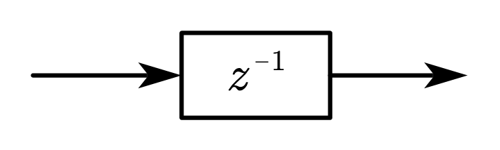{width=150px}  | 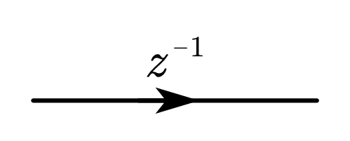{width=150px}
常数乘法器 | {width=150px} | {width=150px}
加法器 | 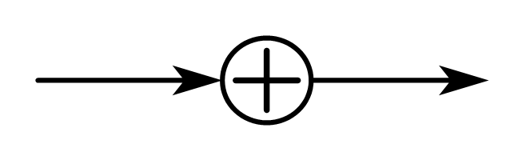{width=150px} | 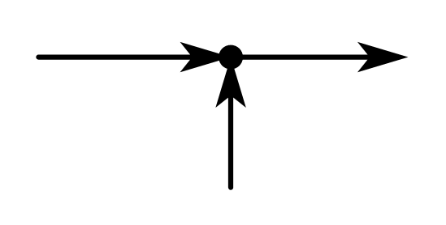{width=150px}

<!-- more -->

# 2. IIR（Infinite Impulse Response）数字滤波器的基本结构

&emsp;&emsp;IIR 数字滤波器的结构特点

$$\begin{align}
&系统函数：H\left(z\right)=\frac{Y\left(z\right)}{X\left(z\right)}=\frac{\displaystyle\sum_{k=0}^{M}{b_kz^{-k}}}{1-\displaystyle\sum_{k=1}^{N}{a_kz^{-k}}}\\
&差分方程：y\left(n\right)=\sum_{k=1}^{N}{a_ky\left(n-k\right)}+\sum_{k=0}^{M}{b_kx\left(n-k\right)}
\end{align}$$

- 系统的单位脉冲响应 $h\left(n\right)$ 无限长；

- 系统函数 $H\left(z\right)$ 在有限 $z$ 平面（$0<\left|z\right|<\infty$）上有极点存在；

- 存在输出到输入的反馈，递归型结构：直接Ⅰ、Ⅱ型，级、并联型。

## 2.1. 直接Ⅰ型

&emsp;&emsp;将系统函数写为

$$\begin{equation}
H\left( z \right) =\frac{Y\left( z \right)}{X\left( z \right)}=\frac{\displaystyle\sum_{k=0}^M{b_kz^{-k}}}{1-\displaystyle\sum_{k=1}^N{a_kz^{-k}}}=\underset{H_1\left( z \right)}{\underbrace{\sum_{k=0}^M{b_kz^{-k}}}}\times \underset{H_2\left( z \right)}{\underbrace{\left( 1-\displaystyle\sum_{k=1}^N{a_kz^{-k}} \right) ^{-1}}}
\end{equation}$$

则系统框图可表示为

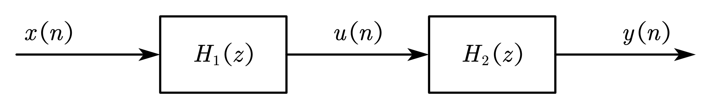{width=500px}

由此可得系统的两级输入输出的微分方程

$$\begin{equation}
H_1\left(z\right)=\sum_{k=0}^{M}{b_kz^{-k}}=\frac{U\left(z\right)}{X\left(z\right)}\Longrightarrow u\left(n\right)=\sum_{k=0}^{M}{b_kx\left(n-k\right)}
\end{equation}$$

$$\begin{equation}
H_2\left(z\right)=\left(1-\sum_{k=1}^{N}{a_kz^{-k}}\right)^{-1}=\frac{Y\left(z\right)}{U\left(z\right)}\Longrightarrow y\left(n\right)=u\left(n\right)+\sum_{k=1}^{M}{a_ky\left(n-k\right)}
\end{equation}$$

由微分方程可得直接Ⅰ型 IIR 滤波器的流图

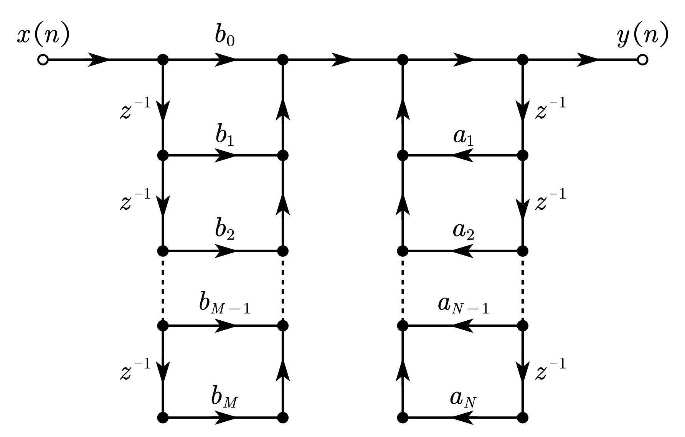{width=500px}

## 2.2. 直接Ⅱ型（典范型）

&emsp;&emsp;系统函数仍为

$$\begin{equation}
H\left( z \right) =\frac{Y\left( z \right)}{X\left( z \right)}=\frac{\displaystyle\sum_{k=0}^M{b_kz^{-k}}}{1-\displaystyle\sum_{k=1}^N{a_kz^{-k}}}=\underset{H_1\left( z \right)}{\underbrace{\sum_{k=0}^M{b_kz^{-k}}}}\times \underset{H_2\left( z \right)}{\underbrace{\left( 1-\displaystyle\sum_{k=1}^N{a_kz^{-k}} \right) ^{-1}}}
\end{equation}$$

将系统框图变为

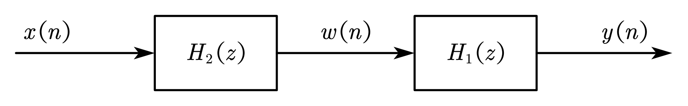{width=500px}

由此可得系统的两级输入输出的微分方程

$$\begin{equation}
H_2\left(z\right)=\left(1-\sum_{k=1}^{N}{a_kz^{-k}}\right)^{-1}=\frac{W\left(z\right)}{X\left(z\right)}\Longrightarrow w\left(n\right)=x\left(n\right)+\sum_{k=1}^{M}{a_kx\left(n-k\right)}
\end{equation}$$

$$\begin{equation}
H_1\left(z\right)=\sum_{k=0}^{M}{b_kz^{-k}}=\frac{Y\left(z\right)}{W\left(z\right)}\Longrightarrow y\left(n\right)=\sum_{k=0}^{M}{b_kw\left(n-k\right)}
\end{equation}$$

由微分方程可得直接Ⅱ型 IIR 滤波器的流图

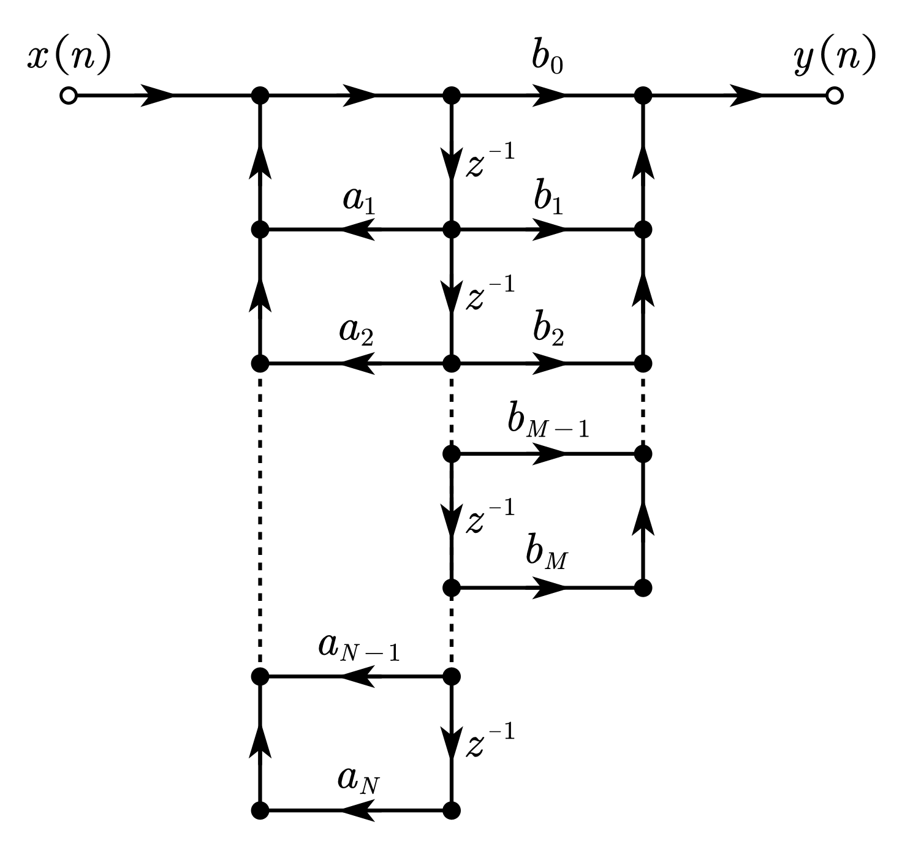{width=400px}

- 直接型 IIR 滤波器的结构特点

  <table>
    <tr>
      <td></td>
      <th>直接Ⅰ型</th>
      <th>直接Ⅱ型</th>
    </tr>
      <tr>
          <th rowspan="2">不同点</th>
          <td>两个网络级联：第一个横向结构 <i>M</i> 节延时网络实现零点，第二个有反馈的 <i>N</i> 节延时网络实现极点。</td>
          <td>两个网络级联：第一个有反馈的 <i>N</i> 节延时网络实现极点，第二个横向结构 <i>M</i> 节延时网络实现零点。</td>
      </tr>
      <tr>
          <td>延时单元数：<i>N</i> + <i>M</i> 乘法器数：<i>N</i> + <i>M</i> + 1 加法器数：1
  </td>
          <td>延时单元数：max{<i>N</i> , <i>M</i>} 乘法器数：<i>N</i> + <i>M</i> + 1 加法器数：2
  </td>
      </tr>
      <tr>
          <th rowspan="3">相同点</th>
          <td colspan="2">系数 <i>ak , bk</i> 不能直接决定单个零极点，因而不能很好地进行滤波器性能控制。</td>
      </tr>
      <tr>
          <td colspan="2">极点对系数（零极点的位置）变化过于灵敏，从而使系统频率响应对系数变化过于灵敏，也就是对有限精度（有限字长）运算过于灵敏，容易出现不稳定或产生较大误差。</td>
      </tr>
      <tr>
          <td colspan="2">计算的累积误差较大</td>
      </tr>
  </table>

## 2.3. 级联型

&emsp;&emsp;将系统函数按零极点因式分解，可表示为

$$\begin{equation}
H\left(z\right)=\frac{\displaystyle\sum_{k=0}^{M}{b_kz^{-k}}}{1-\displaystyle\sum_{k=1}^{N}{a_kz^{-k}}}=A\frac{\displaystyle\prod_{k=1}^{M_1}\left(1-p_kz^{-1}\right)\displaystyle\prod_{k=1}^{M_2}\left(1-q_kz^{-1}\right)\left(1-q_k^\ast z^{-1}\right)}{\displaystyle\prod_{k=1}^{N_1}\left(1-c_kz^{-1}\right)\displaystyle\prod_{k=1}^{N_2}\left(1-d_kz^{-1}\right)\left(1-d_k^\ast z^{-1}\right)}
\end{equation}$$

其中 $A$ 为常数，$M=M_1+2M_2$，$N=N_1+2N_2$，$p_k,c_k$分别为实数零、极点，$q_k,q_k^\ast$ 和 $d_k,d_k^\ast$ 分别为复共轭零、极点。将共轭成对的复数零、极点合并为为实系数二阶多项式，得

$$\begin{equation}
H\left(z\right)=A\prod_{k=1}^{L}\left[\frac{1+\beta_{1k}z^{-1}+\beta_{2k}z^{-2}}{1-\alpha_{1k}z^{-1}-\alpha_{2k}z^{-2}}\right]=A\prod_{k=1}^{L}{H_k\left(z\right)},\ \ L=\left\lfloor\frac{N+1}{2}\right\rfloor
\end{equation}$$

则系统框图可表示为

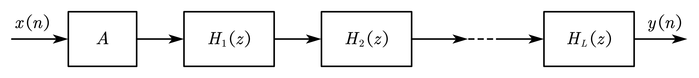{width=700px}

进一步可得级联型 IIR 滤波器的流图

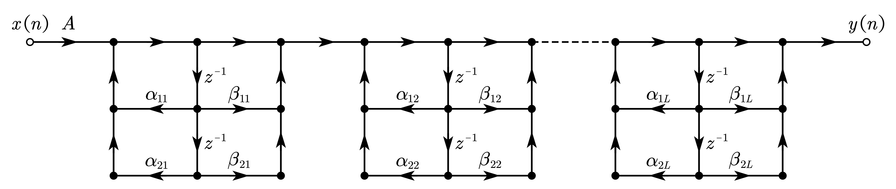{width=700px}

- 级联型 IIR 滤波器的结构特点

  - 分别调整系数 $\beta_{1k},\beta_{2k}$、$\alpha_{1k},\alpha_{2k}$，能单独调整滤波器的第k对零、极点，而不影响其它零、极点，由此，可以方便的调整滤波器的频响性能。

  - 运算的累积误差较小、所需存储单元少，可实现时分复用、组合方式多等。

## 2.4. 并联型

&emsp;&emsp;将系统函数展开成部分分式的形式，可表示为

$$\begin{equation}
H\left(z\right)=\sum_{k=0}^{M-N}{G_kz^{-k}}+\sum_{k=1}^{N_1}\frac{A_k}{1-g_kz^{-1}}+\sum_{k=1}^{N_2}\frac{\beta_{0k}+\beta_{1k}z^{-1}}{1-\alpha_{1k}z^{-1}-\alpha_{2k}z^{-2}}
\end{equation}$$

其中 $G_k,A_k,g_k,\beta_{0k},\beta_{1k},\alpha_{1k},\alpha_{2k}$ 均为实数。且当 $M<N$ 时，上式不包含 $\displaystyle\sum_{k=0}^{M-N}{G_kz^{-k}}$ 项；当 $M=N$ 时，上式变为

$$\begin{equation}
H\left(z\right)=G_0+\sum_{k=1}^{N_1}\frac{A_k}{1-g_kz^{-1}}+\sum_{k=1}^{N_2}\frac{\beta_{0k}+\beta_{1k}z^{-1}}{1-\alpha_{1k}z^{-1}-\alpha_{2k}z^{-2}}\ (M=N)
\end{equation}$$

可得 $M=N$ 时并联型 IIR 滤波器的系统框图和流图

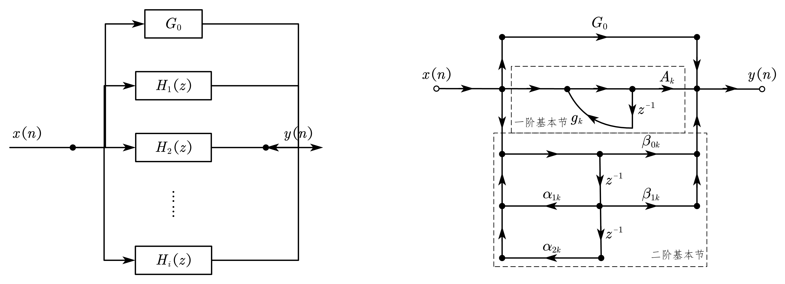{width=1000px}

- 并联型IIR滤波器的结构特点

  - 通过调整系数 $\alpha_{1k},\alpha_{2k}$，可单独调整一对极点位置，但不能单独调整零点位置。

  - 各并联基本节的误差互相不影响，故运算累积误差小。

  - 可进行并行运算，运算速度高。

## 2.5. 转置定理

&emsp;&emsp;对于单输入单输出系统，将原网络中所有支路方向倒转，并将输入 $x\left(n\right)$ 和输出 $y\left(n\right)$ 相互交换，则倒转后的结构与原结构的系统函数 $H(z)$ 向相同。

# 3. FIR（Finite Impulse Response）数字滤波器的基本结构

&emsp;&emsp;FIR 数字滤波器的结构特点

$$\begin{align}
&系统函数：H\left(z\right)=\frac{Y\left(z\right)}{X\left(z\right)}=\sum_{n=0}^{N-1}{h\left(n\right)z^{-n}}\\
&差分方程：y\left(n\right)=\sum_{k=0}^{N-1}h\left(k\right)x\left(n-k\right)=h\left(n\right)\ast x\left(n\right)
\end{align}$$

- 系统的单位脉冲响应 $h(n)$ 有限长（$N$ 点）；

- 系统函数 $H\left(z\right)$ 在 $\left|z\right|>0$ 处收敛，有限 $z$ 平面只有零点，全部极点在 $z=0$ 处（因果系统）；

- 没有输出到输入的反馈，一般为非递归型结构。

## 3.1. 直接型（卷积型、横截型）

&emsp;&emsp;由 FIR 数字滤波器的差分方程

$$\begin{equation}
y\left(n\right)=\sum_{k=0}^{N=1}h\left(k\right)x\left(n-k\right)=h\left(n\right)\ast x\left(n\right)
\end{equation}$$

可得直接型 FIR 滤波器的流图

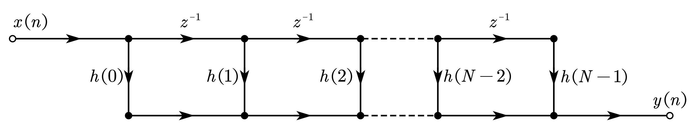{width=600px}

## 3.2. 级联型

&emsp;&emsp;当需要灵活方便地控制滤波器的传输零点时，可将 $H\left(z\right)$ 分解成实系数二阶因式的乘积形式，表示为

$$\begin{equation}
H\left(z\right)=\sum_{n=0}^{N-1}{h\left(n\right)z^{-n}}=\sum_{k=1}^{\left\lfloor\frac{N}{2}\right\rfloor}\left(\beta_{0k}+\beta_{1k}z^{-1}+\beta_{2k}z^{-2}\right)
\end{equation}$$

可得级联型 FIR 滤波器的流图

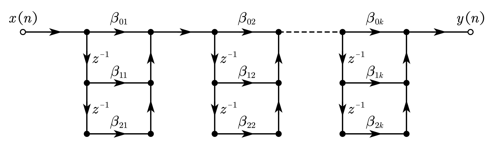{width=600px}

- 级联型FIR滤波器的结构特点：

  - 由于这种结构所需的系数比直接型多，所需乘法运算也比直接型多，很少用。

  - 由于这种结构的每一节控制一对零点，因而通常仅在需要控制传输零点时用。

## 3.3. 频率取样型

&emsp;&emsp;系统函数 $H\left(z\right)$ 在单位圆上作 $N$ 等分取样的取样值就是 $h\left(n\right)$ 的 DFT $H\left(k\right)$。由[内插公式](https://josh-gao.blog.csdn.net/article/details/106087154#5__319)，用 $H\left(k\right)$ 恢复 $H\left(z\right)$ 的内插公式为

$$\begin{equation}
H\left( z \right) =\underset{H_c\left( z \right)}{\underbrace{\left( 1-z^{-N} \right) }}\frac{1}{N}\sum_{k=0}^{N-1}{\underset{H_k\left( z \right)}{\underbrace{\frac{H\left( k \right)}{1-W_{N}^{-k}z^{-1}}}}}
\end{equation}$$

可见频率取样型 FIR 系统可用子 FIR 系统 $H_c\left(z\right)=1-z^{-N}$ 和子 IIR 系统 $\displaystyle\sum_{k=0}^{N-1}{H_k\left(z\right)}$ 表示。

### 3.3.1. 梳状滤波器 $H_c\left(z\right)$

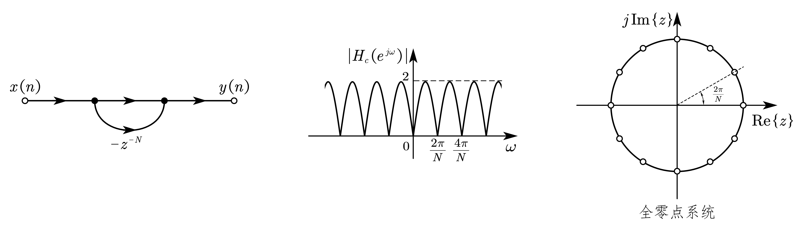{width=800px}

&emsp;&emsp;子 FIR 系统 $H_c\left(z\right)=1-z^{-N}$ 是一个由 $N$ 节延迟单元组成的梳状滤波器，在单位圆上有 $N$ 个等分零点。可将梳状滤波器的频率响应写为

$$\begin{equation}
\begin{aligned}
H_c\left(e^{j\omega}\right)&=\left.H_c\left(z\right)\right|_{z=e^{j\omega}}=1-e^{-j\omega N}\\
&=e^{-j\frac{\omega N}{2}}\left(e^{j\frac{\omega N}{2}}-e^{-j\frac{\omega N}{2}}\right)=2je^{-j\frac{\omega N}{2}}\sin{\frac{\omega N}{2}}
\end{aligned}
\end{equation}$$

其幅频特性

$$\begin{equation}
\left|H_c\left(e^{j\omega}\right)\right|=2\left|\sin{\frac{\omega N}{2}}\right|
\end{equation}$$

### 3.3.2. 谐振柜 $\displaystyle\sum_{k=0}^{N-1}{H_k\left(z\right)}$

&emsp;&emsp;子 IIR 系统 $\displaystyle\sum_{k=0}^{N-1}{H_k\left(z\right)}$ 是由 $N$ 个谐振器组成的谐振“柜”。每一个谐振器 $H_k\left(z\right)=\dfrac{H\left(k\right)}{1-W_N^{-k}z^{-1}}$ 都是一个一阶网络，在单位圆上有一极点 $z_k=W_N^{-k}=e^{j\frac{2\pi}{N}k}$，因此谐振器对频率为 $\omega=\dfrac{2\pi}{N}k$ 的响应是 $\infty$，是一个谐振频率为 $\dfrac{2\pi}{N}k$ 的无耗谐振器。并联谐振柜的极点正好各自抵消一个梳状滤波器的零点，从而使系统在频率点 $\omega=\dfrac{2\pi}{N}k$ 的响应就是 $H\left(k\right)$。

&emsp;&emsp;将梳状滤波器和谐振柜级联可得到频率取样型 FIR 滤波器的结构

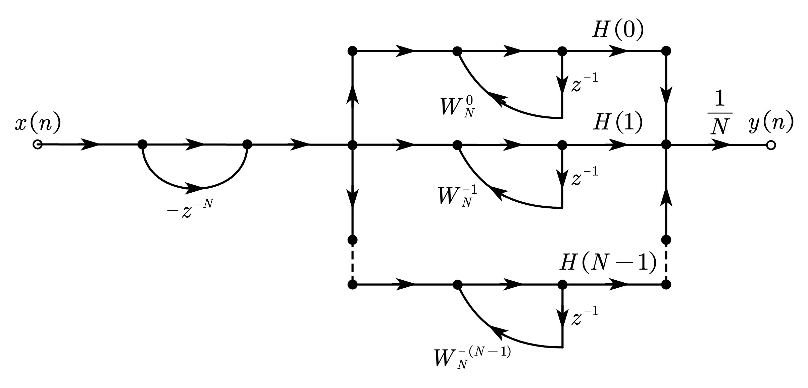{width=600px}

- 频率取样型 FIR 滤波器的结构特点：

  - （优点）调整 $H\left(k\right)$ 就可以有效地调整频响特性（在频率 $\omega_k=\dfrac{2\pi}{N}k$ 处的响应即为 $H\left(k\right)$）。

  - （优点）若 $h\left(n\right)$ 长度相同，则除了各支路增益 $H\left(k\right)$ 外网络结构完全相同，便于标准化、模块化。

  - （缺点）有限字长效应可能导致零极点不能完全对消(梳状滤波器的零点由延时器形成，并不受量化误差影响)，导致系统不稳定。

  - （缺点）系数多为复数，增加了复数乘法和存储量。

### 3.3.3. 修正频率取样型

&emsp;&emsp;由于谐振器的所有极点均在单位圆上，当系数量化时，这些极点会移动，因此系统的稳定裕度为零，实际上是不能使用的。因此将所有谐振器的极点设置在半径 $r$ 小于 $1$ 又接近于 $1$ 的圆周上，为了使得子 FIR 系统的零点需要和这些极点重合以相互抵消，故梳状滤波器的零点也移到半径r的圆周上。修正后的系统函数为

$$\begin{equation}
H\left(z\right)=\frac{1-r^Nz^{-N}}{N}\sum_{k=0}^{N-1}\frac{H_r\left(k\right)}{1-rW_N^{-k}z^{-1}}
\end{equation}$$

此时谐振柜的第 $k$ 个谐振器的极点变为 $rW_N^{-k}$，其中 $H_r\left(k\right)$ 是修正点的取样值，因为 $r\approx1$，则

$$\begin{equation}
H_r\left(k\right)=\left.H\left(z\right)\right|_{z=rW_N^{-k}}=H\left(rW_N^{-k}\right)\approx H\left(W_N^{-k}\right)=H\left(k\right)
\end{equation}$$

则修正后的系统函数可近似为

$$\begin{equation}
H\left(z\right)=\frac{1-r^Nz^{-N}}{N}\sum_{k=0}^{N-1}\frac{H\left(k\right)}{1-rW_N^{-k}z^{-1}}
\end{equation}$$

为了使系数是实数，将共轭根合并，这些共轭根在半径为r的圆周上以实轴对称分布。由对称性 $z_{N-k}=z_k^\ast,W_N^{-\left(N-k\right)}=W_N^k=\left(W_N^{-k}\right)^\ast$，将第 $k$ 个和第 $N-k$ 个谐振器合并成一个实系数的二阶网络

$$\begin{equation}
\begin{aligned}
H_k\left(z\right)&\approx\frac{H\left(k\right)}{1-rW_N^{-k}z^{-1}}+\frac{H\left(N-k\right)}{1-rW_N^{-\left(N-k\right)}z^{-1}}=\frac{H\left(k\right)}{1-rW_N^{-k}z^{-1}}+\frac{H^\ast\left(k\right)}{1-r\left(W_N^{-k}\right)^\ast z^{-1}}\\
&=\frac{H\left(k\right)+H^\ast\left(k\right)-H\left(k\right)rW_N^kz^{-1}-H^\ast\left(k\right)rW_N^{-k}z^{-1}}{1-z^{-1}\left(W_N^{-k}+W_N^k\right)+r^2z^{-2}}\\
&=\frac{\beta_{0k}+\beta_{1k}z^{-1}}{1-z^{-1}2r\cos{\left(\frac{2\pi}{N}k\right)+r^2z^{-2}}}
\end{aligned}
\end{equation}$$

其中

$$\begin{equation}
\begin{cases}
\beta_{0k}=2\Re{\left[H\left(k\right)\right]}\\
\beta_{1k}=-2r\Re{\left[H\left(k\right)W_N^k\right]}
\end{cases},\ \
\begin{cases}
\begin{aligned}
k&=1,2,\cdots,\frac{N-1}{2},\ \ &k为奇数\\
k&=1,2,\cdots,\frac{N}{2},&k为偶数
\end{aligned}
\end{cases}
\end{equation}$$

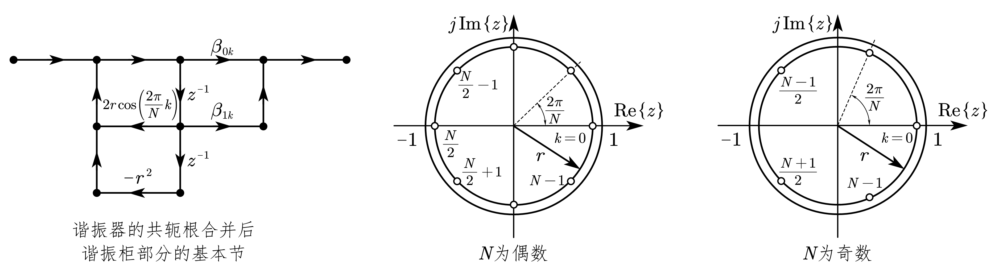{width=800px}

&emsp;&emsp;当 $N$ 为偶数时，除了共轭根，还有一对实数根，分别位于 $k=0,\dfrac{N}{2}$ 两点，则此时系统函数为

$$\begin{equation}
H\left(z\right)=\left(1-r^Nz^{-N}\right)\cdot\frac{1}{N}\cdot\left[H_0\left(z\right)+H_\frac{N}{2}\left(z\right)+\sum_{k=1}^{\frac{N}{2}-1}{H_k\left(z\right)}\right]
\end{equation}$$

&emsp;&emsp;当 $N$ 为奇数时，除了共轭根，只有一个实数根，位于 $k=0$ 处，则此时系统函数为

$$\begin{equation}
H\left(z\right)=\left(1-r^Nz^{-N}\right)\cdot\frac{1}{N}\cdot\left[H_0\left(z\right)+\sum_{k=1}^{\frac{N-1}{2}}{H_k\left(z\right)}\right]
\end{equation}$$

在上两式中

$$\begin{equation}
H_0\left(z\right)=\frac{H\left(0\right)}{1-rz^{-1}},\ \ H_\frac{N}{2}\left(z\right)=\frac{H\left(\dfrac{N}{2}\right)}{1+rz^{-1}}
\end{equation}$$

则修正频率取样型 FIR 滤波器的结构为

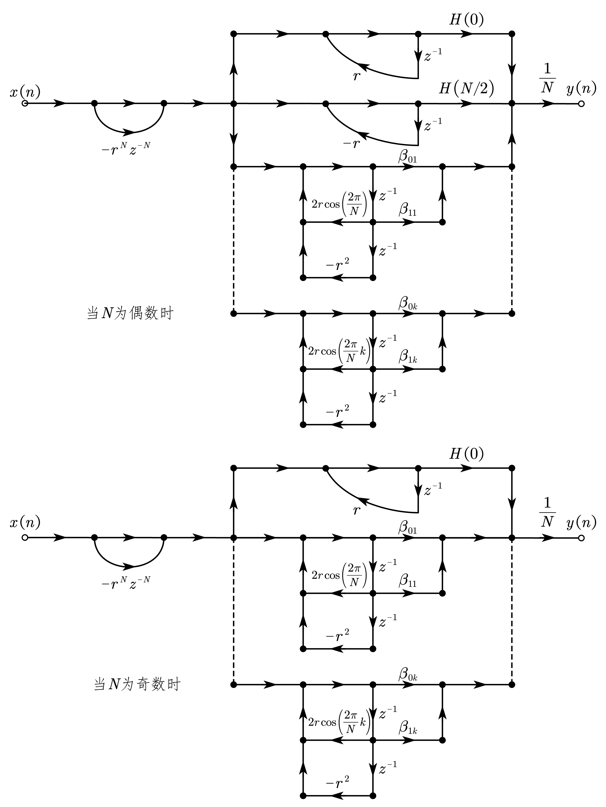{width=600px}

- 修正频率取样型 FIR 滤波器的结构特点：

  - 结构有递归部分——谐振柜；又有非递归部分——梳状滤波器。

  - 它的零、极点数目只取决于单位脉冲响应的长度，因而单位脉冲响应长度相同。利用同一梳状滤波器、同一结构而只有加权系数 $\beta_{0k},\beta_{1k},H\left(0\right),H\left(\dfrac{N}{2}\right)$ 不同的谐振器，就能得到不同的滤波器。

  - 其结构可以高度模块化，可时分复用。

## 3.4. 线性相位型

&emsp;&emsp;线性相位的因果FIR系统的单位取样响应满足

$$\begin{equation}
h\left(n\right)=\pm h\left(N-1-n\right)
\end{equation}$$

即序列要么是奇对称的，要么是偶对称的。

&emsp;&emsp;当 $N$ 为奇数时，系统函数可表示为

$$\begin{equation}
\begin{aligned}
H\left(z\right)&=\sum_{n=0}^{N-1}{h\left(n\right)z^{-n}}=\sum_{n=0}^{\frac{N-1}{2}-1}{h\left(n\right)z^{-n}}+h\left(\frac{N-1}{2}\right)z^\frac{N-1}{2}+\sum_{n=\frac{N-1}{2}+1}^{N-1}{h\left(n\right)z^{-n}}\\
&=\sum_{n=0}^{\frac{N-1}{2}-1}h\left(n\right)\left[z^{-n}\pm z^{-\left(N-1-n\right)}\right]+h\left(\frac{N-1}{2}\right)z^\frac{N-1}{2}
\end{aligned}
\end{equation}$$

&emsp;&emsp;当 $N$ 为偶数时，系统函数可表示为

$$\begin{equation}
H\left(z\right)=\sum_{n=0}^{N-1}{h\left(n\right)z^{-n}}=\sum_{n=0}^{\frac{N}{2}-1}{h\left(n\right)z^{-n}}+\sum_{n=\frac{N}{2}}^{N-1}{h\left(n\right)z^{-n}}=\sum_{n=0}^{\frac{N}{2}-1}h\left(n\right)\left[z^{-n}\pm z^{-\left(N-1-n\right)}\right]
\end{equation}$$

**当序列 $h\left(n\right)$ 偶对称时，取“$+$”号；当序列奇对称时，取“$-$”号**。则线性相位型 FIR 滤波器的结构为

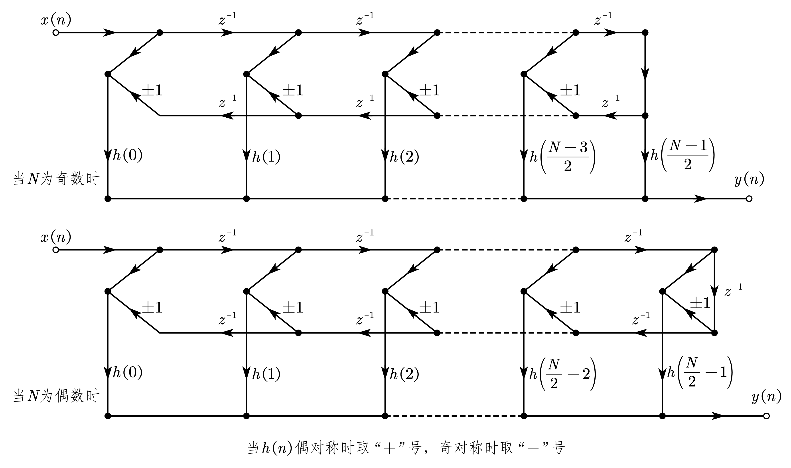{width=900px}

## 3.5. 快速卷积型（略）

# 参考文献

王世一. *数字信号处理, 修订版.* 北京理工大学出版社, 1997.
