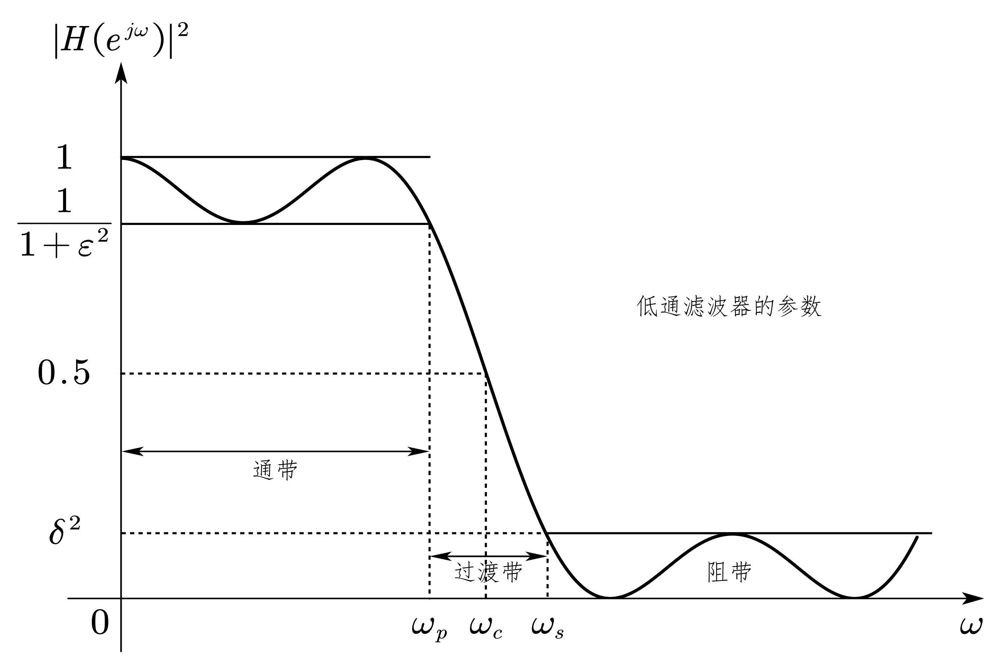
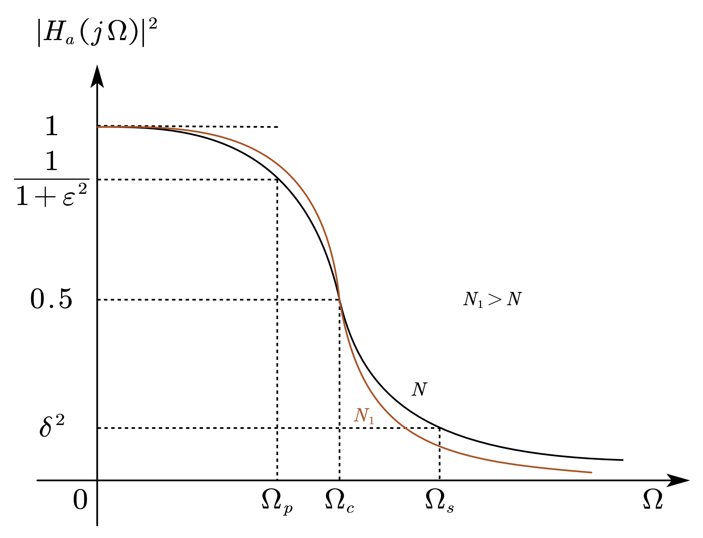
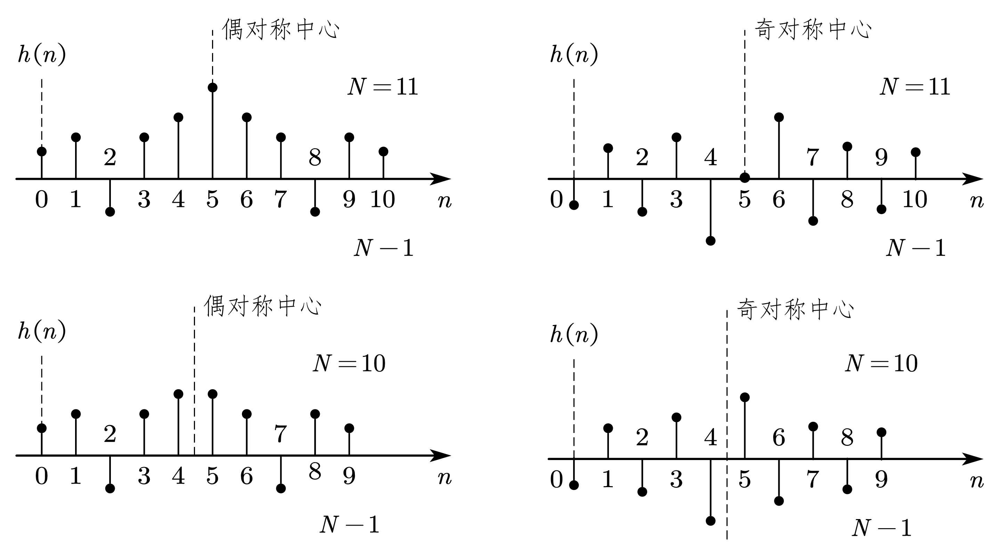
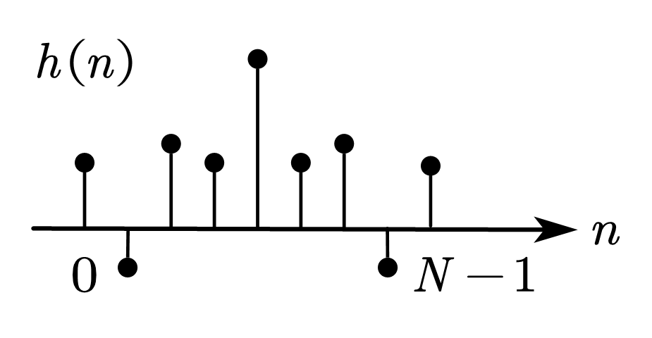
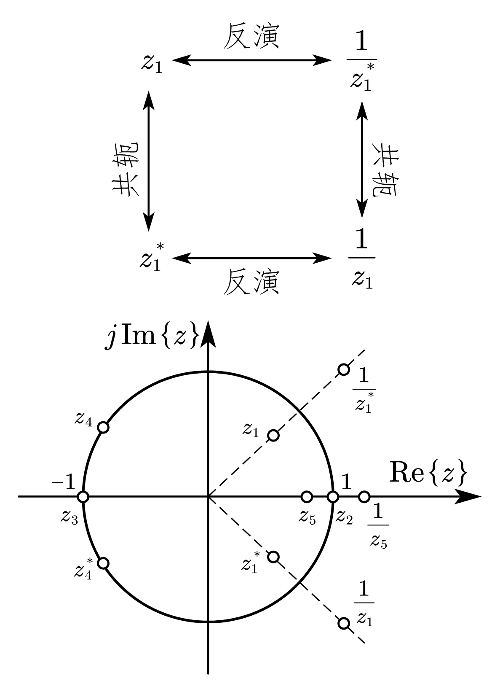
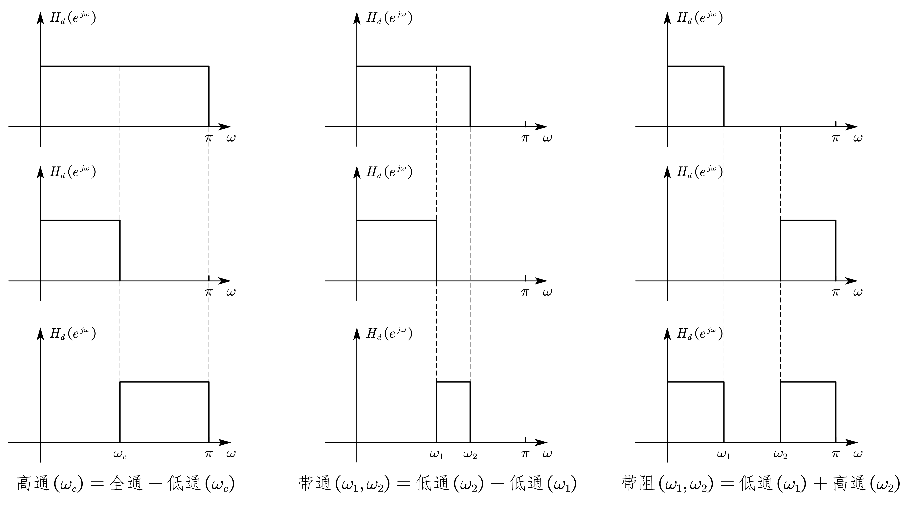

# 1. 幅度平方响应与数字滤波器的技术指标

## 1.1. 幅度平方响应

&emsp;&emsp;常采用滤波器的幅度平方响应 $\left|H\left(e^{j\omega}\right)\right|^2$ 来描述滤波器的选频特性。

## 1.2. 数字滤波器的技术指标

{width=600px}

1. 通带截止频率（passband edge frequency）：$\omega_p$。

2. 阻带截止频率（stopband edge frequency）：$\omega_s$。

3. 通带波动（passband ripple in dB）：$R_p=-10\lg{\dfrac{1}{1+\varepsilon^2}}$，其中 $\varepsilon$ 为通带波动系数。

4. 阻带衰减（stopband attenuation in dB）：$A_s=20\lg{\delta}$。

<!-- more -->

# 2. 低通 IIR 数字滤波器设计

## 2.1. 巴特沃斯（Butterworth）模拟原型滤波器

{width=500px}

### 2.1.1. 幅度平方频率响应

&emsp;&emsp;$N$ 阶 Butterworth 模拟滤波器的幅度平方频率响应为

$$\begin{equation}
A^2\left(\Omega\right)=\left|H_a\left(j\Omega\right)\right|^2=\frac{1}{1+\left(\dfrac{\Omega}{\Omega_c}\right)^{2N}}
\end{equation}$$

其中 $A^2\left(\Omega\right)$ 为幅度平方函数，整数 $N$ 为滤波器阶数，$\Omega_c$ 为 3 dB 截止频率，$\Omega_p$ 为通带截止频率，$\left(1+\varepsilon^2\right)^{-1}$ 为通带截止频率处的幅度平方频响值，$\Omega_s$ 为阻带截止频率，$\delta^2$ 为阻带截止频率处的幅度平方频响值。

&emsp;&emsp;Butterworth 滤波器在通带中拥有最大平坦的振幅特性，即 $N$ 阶低通 Butterworth 滤波器在 $\Omega=0$ 处的幅度平方函数的前 $(2N-1)$ 阶导数等于零，在止带内接近于单调变化。

### 2.1.2. 极点分布及系统函数的确定

&emsp;&emsp;$N$ 阶 Butterworth 模拟滤波器的幅度平方频率响应可表示为

$$\begin{equation}
\begin{aligned}
A^2\left(\Omega\right)&=\left|H_a\left(j\Omega\right)\right|^2=H_a\left(j\Omega\right)H_a^\ast\left(j\Omega\right)=H_a\left(j\Omega\right)H_a\left(-j\Omega\right)\\
&=\left.H_a\left(s\right)H_a\left(-s\right)\right|_{s=j\Omega}=\frac{1}{1+\left(\dfrac{s}{j\Omega_c}\right)^{2N}}
\end{aligned}
\end{equation}$$

令 $A^2\left(\Omega\right)=0$，可解得极点

$$\begin{equation}
s_k=\left(-1\right)^\frac{1}{2N}\left(j\Omega_c\right)=\Omega_ce^{j\left(\frac{1}{2}+\frac{2k+1}{2N}\right)\pi},\ \ k=0,1,\cdots,2N-1
\end{equation}$$

由此可得常用低阶次Butterworth滤波器的系统函数

| 阶次 | 系统函数 $H_a\left(s\right)=\dfrac{\left(-1\right)^Ns_0s_1\cdots s_{N-1}}{\left(s-s_0\right)\left(s-s_1\right)\cdots(s-s_{N-1})}$ |
| :--: | :--------------: |
| 1 | $\displaystyle\frac{\Omega_c}{\left(s+\Omega_c\right)}$ |
| 2 | $\displaystyle\frac{\Omega_c^2}{\left(s^2+\sqrt2\Omega_cs+\Omega_c^2\right)}$ |
| 3 | $\displaystyle\frac{\Omega_c^3}{(s^3+2\Omega_cs^2+2\Omega_c^2s+\Omega_c^3)}$ |

### 2.1.3. 参数 $N$ 和 $\Omega_c$ 的确定

#### 2.1.3.1. 参数选取原则

1. 在通带范围内允许的最大衰减为 $\left(1+\varepsilon^2\right)^{-1}$ 或 $\alpha_p\text{dB}$，截止频率为$\Omega_p$。

   $$\begin{equation}
   10\lg{\frac{1}{1+\varepsilon^2}}=-\alpha_p\Longrightarrow\lg{\left(1+\varepsilon^2\right)}=\frac{\alpha_p}{10}\Longrightarrow\varepsilon=\sqrt{10^{\frac{\alpha_p}{10}-1}}
   \end{equation}$$

2. 在阻带范围内允许的最小衰减为 $\delta^2$ 或 $\alpha_s\text{dB}$，临界频率为 $\Omega_s$。

   $$\begin{equation}
   10\lg{\delta^2}=-\alpha_s\Longrightarrow\delta^{-2}={10}^\frac{\alpha_s}{10}
   \end{equation}$$

#### 2.1.3.2. 参数确定

&emsp;&emsp;由参数选取原则，有

$$\begin{equation}
\begin{aligned}
&\left|H_a\left(j\Omega_p\right)\right|^2=\frac{1}{1+\left(\frac{\Omega_p}{\Omega_c}\right)^{2N}}\geqslant\frac{1}{1+\varepsilon^2}\Longrightarrow\left(\frac{\Omega_p}{\Omega_c}\right)^{2N}\leqslant\varepsilon^2\\
\Longrightarrow&\left(\frac{\Omega_c}{\Omega_p}\right)^N\geqslant\varepsilon^{-1}\\
&\left|H_a\left(j\Omega_s\right)\right|^2=\frac{1}{1+\left(\dfrac{\Omega_s}{\Omega_c}\right)^{2N}}\leqslant\delta^2\Longrightarrow\left(\frac{\Omega_s}{\Omega_c}\right)^{2N}\geqslant\delta^{-2}-1\\
\Longrightarrow&\left(\frac{\Omega_s}{\Omega_c}\right)^N\geqslant\sqrt{\delta^{-2}-1}
\end{aligned}
\end{equation}$$

由上两式，有

$$\begin{equation}
N\geqslant\left\lceil\frac{\lg{\left(\dfrac{\sqrt{\delta^{-2}-1}}{\varepsilon}\right)}}{\lg{\left(\dfrac{\Omega_s}{\Omega_p}\right)}}\right\rceil=\left\lceil\frac{\lg{\dfrac{10^\frac{\alpha_s}{10}-1}{10^\frac{\alpha_p}{10}-1}}}{2\lg{\left(\dfrac{\Omega_s}{\Omega_p}\right)}}\right\rceil
\end{equation}$$

$$\begin{equation}
\Omega_c\in\left[\Omega_p\varepsilon^{-\frac{1}{N}},\Omega_s\left(\delta^2-1\right)^{-\frac{1}{2N}}\right]=\left[\Omega_p\left({10}^\frac{\alpha_p}{10}-1\right)^{-\frac{1}{2N}},\Omega_s\left({10}^\frac{\alpha_s}{10}-1\right)^{-\frac{1}{2N}}\right]
\end{equation}$$

对于 $\Omega_c$，通常取其下边带即可，即

$$\begin{equation}
\Omega_c=\Omega_p\varepsilon^{-\frac{1}{N}}=\Omega_p\left({10}^\frac{\alpha_p}{10}-1\right)^{-\frac{1}{2N}}
\end{equation}$$

## 2.2. 模拟原型低通滤波器数字化的时域方法——脉冲响应不变法（Impulse Invariance Method）

### 2.2.1. 变换原理

&emsp;&emsp;对模拟原型滤波器的系统函数 $H_a\left(s\right)$ 进行反拉氏变换，得到相应模拟滤波器的单位脉冲响应 $h_a\left(t\right)$，即

$$\begin{equation}
h_a\left(t\right)=\mathrm{ILT}\left[H_a\left(s\right)\right]=\mathrm{ILT}\left[\sum_{k=0}^{N-1}\frac{c_k}{s-s_k}\right]=\sum_{k=0}^{N-1}{c_ke^{s_kt}u\left(t\right)}
\end{equation}$$

对模拟滤波器的单位脉冲响应进行采样后进行 $z$ 变换即可得到数字滤波器的系统函数 $H\left(z\right)$，即

$$\begin{equation}
H\left(z\right)=\mathrm{ZT}\left[h\left(n\right)\right]=\mathrm{ZT}\left[\left.h_a\left(t\right)\right|_{t=nT}\right]
\end{equation}$$

在实际设计时，为了避免数字滤波器在取样间隔T很小(采样频率很高)的情况下出现过高的增益，对取样进行如下修正

$$\begin{equation}
h\left(n\right)=Th_a\left(nT\right)
\end{equation}$$

由此可将导出 Butterworth 数字低通滤波器的系统函数

$$\begin{equation}
\begin{aligned}
H\left(z\right)&=\mathrm{ZT}\left[h\left(n\right)\right]=\mathrm{ZT}\left[Th_a\left(nT\right)\right]=\mathrm{ZT}\left[\sum_{k=0}^{N-1}{Tc_ke^{s_knT}u\left(t\right)}\right]\\
&=\sum_{n=-\infty}^{\infty}{\left[\sum_{k=0}^{N-1}{Tc_k\left(e^{s_kT}\right)^nu\left(t\right)}\right]z^{-n}}=\sum_{k=0}^{N-1}{Tc_k\left[\sum_{n=0}^{\infty}\left(e^{s_kT}z^{-1}\right)^n\right]}\\
&=\sum_{k=0}^{N-1}{Tc_k\left[ \lim_{N\rightarrow \infty} \!\:\frac{1-\left( e^{s_kT}z^{-1} \right) ^N}{1-e^{s_kT}z^{-1}} \right]}\\
&\xlongequal{\left|z\right|>\left|e^{s_kT}\right|}\sum_{k=1}^{N-1}\frac{Tc_k}{1-e^{s_kT}z^{-1}}
\end{aligned}
\end{equation}$$

对比模拟滤波器的单位脉冲响应 $h_a\left(t\right)$，可得脉冲响应不变法的系统函数转换关系

$$\begin{equation}
H_a\left(s\right)=\sum_{k=0}^{N-1}\frac{c_k}{s-s_k}\Longleftrightarrow H\left(z\right)=\sum_{k=1}^{N-1}\frac{Tc_k}{1-e^{s_kT}z^{-1}}
\end{equation}$$

### 2.2.2. 变换后数字滤波器的稳定性

&emsp;&emsp;模拟 Butterworth 滤波器的所有极点均在 $s$ 平面的左半平面内，其实部 $\sigma_k<0$，则在极点变化的过程中 $s_k\Rightarrow e^{s_kT}<1$，即变换后得到的数字滤波器的极点位于 $z$ 平面的单位圆内，因而脉冲响应不变法所设计的数字滤波器也是稳定的。

### 2.2.3. 优缺点

1. （优点）脉冲响应变换法的频率坐标变换是线性的，即 $\omega=\Omega T$。因此如果模拟滤波器的频响是带限的且在折叠频率以内的话，变换后的得到的数字滤波器的频响可以不失真地反映原响应与频率的关系

   $$\begin{equation}
   H\left(e^{j\Omega T}\right)=H\left(j\Omega\right),\ \ \left|\Omega\right|<\frac{\pi}{T}
   \end{equation}$$

2. （主要缺点）由于时域的取样，$h_a\left(t\right)$ 拉氏变换 $H_a\left(s\right)$ 在 $s$ 平面上沿虚轴周期延拓，然后再经过 $z=e^{sT}$ 的映射关系，将 $H_a\left(s\right)$ 映射到 $z$ 平面上，得到 $H\left(z\right)$。对于上述修正后的变换

   $$\begin{equation}
   H\left(e^{j\omega}\right)=\left.H\left(z\right)\right|_{z=e^{j\omega}}=\sum_{k=0}^{N-1}\frac{Tc_k}{1-s^{s_kTe^{-j\omega}}}=\sum_{m=-\infty}^{\infty}{H_a\left(j\frac{\omega-2\pi m}{T}\right)}\approx{\widetilde{H}}_a\left(j\frac{\omega}{T}\right)
   \end{equation}$$

   由于 $H_a\left(s\right)$ 的周期延拓，可能造成频谱混叠，导致滤波器的阻带性能降低。因此只能用于具有带限的频响特性的信号，**一般用于设计低通、带通滤波器，而不用于设计高通、带阻滤波器**。

### 2.2.4. 脉冲响应不变法的主要步骤

1. 确定滤波器的技术指标（通常在数字域给出）

   1. 通带、阻带的波动；

   2. 通带、过渡带、阻带的截止频率；

   3. 频率选择特性（低通）。

2. 对数字域的频率指标进行如下变换

   $$\begin{equation}
   \Omega=\frac{\omega}{T}
   \end{equation}$$

3. 选择模拟逼近方法（Butterworth），并确定其传递函数 $H_a\left(s\right)$。
4. 按照脉冲响应不变法的系统函数转换关系，将 $H_a\left(s\right)$ 转变为 $H\left(z\right)$，完成数字化。

   $$\begin{equation}
   H_a\left(s\right)=\sum_{k=0}^{N-1}\frac{c_k}{s-s_k}\Longleftrightarrow H\left(z\right)=\sum_{k=1}^{N-1}\frac{Tc_k}{1-e^{s_kT}z^{-1}}
   \end{equation}$$

## 2.3. 模拟原型低通滤波器数字化的频域方法——双线性变换法（Bilinear Transform Method）

### 2.3.1. 变换原理

&emsp;&emsp;由 $s$ 平面与 $z$ 平面的双线性变换关系（变化式中 $s$ 与 $z$ 的关系无论分子还是分母部分都是线性的）

$$\begin{equation}
s=\frac{2}{T}\cdot\frac{1-z^{-1}}{1+z^{-1}},\ \ z=\frac{2/T+s}{2/T-s}
\end{equation}$$

将 $s=\sigma+j\omega$ 代入可得

$$\begin{equation}
z=\frac{2/T+\sigma+j\Omega}{2/T-\sigma-j\Omega}\Longrightarrow\left|z\right|=\sqrt{\frac{\left( 2/T+\sigma\right)^2+\Omega^2}{\left(2/T-\sigma\right)^2+\Omega^2}}
\end{equation}$$

由上式，当 $\sigma<0$ 时，$\left|z\right|<1$；当 $\sigma=0$ 时，$\left|z\right|=1$；当 $\sigma>0$ 时，$\left|z\right|>1$。也即把 $s$ 左半开平面映射在单位圆 $\left|z\right|=1$ 的内部；把 $s$ 平面的整个 $j\Omega$ 轴映射成单位圆 $\left|z\right|=1$，把 $s$ 右半开平面映射到单位圆 $\left|z\right|=1$ 的外部。

由 $s$ 平面与 $z$ 平面的双线性变换关系（变化式中 $s$ 与 $z$ 的关系无论分子还是分母部考虑映射到单位圆上的情况，则由 $s$ 平面与 $z$ 平面的双线性变换关系可得模拟滤波器和数字滤波器的频率关系

$$\begin{equation}
\begin{aligned}
&z=e^{j\omega}=\frac{2/T+j\Omega}{2/T-j\Omega}\\
\Longrightarrow&\Omega=j\frac{2}{T}\cdot\frac{1-e^{j\omega}}{1+e^{j\omega}}=j\frac{2}{T}\cdot\frac{e^{j\frac{\omega}{2}}\left(e^{-j\frac{\omega}{2}}-e^{j\frac{\omega}{2}}\right)}{e^{j\frac{\omega}{2}}\left(e^{-j\frac{\omega}{2}}+e^{j\frac{\omega}{2}}\right)}=j\frac{2}{T}\cdot\frac{-2j\sin{\dfrac{\omega}{2}}}{2\cos{\dfrac{\omega}{2}}}=\dfrac{2}{T}\tan{\frac{\omega}{2}}
\end{aligned}
\end{equation}$$

### 2.3.2. 优缺点

1. （优点）消除了混频误差。

2. （优点）在零频附近，模拟频率 $\Omega$ 与数字频率 $\omega$ 的关系接近与线性。

3. （缺点）模拟滤波器的全部频响特性被压缩在等效的数字频率 $0<\omega<\pi$ 之间，可见**双线性变换消除混叠的特性是依托严重的非线性得到的**。

### 2.3.3. 双线性变换法的主要步骤

1. 确定滤波器的技术指标(通常在数字域给出)

   1. 通带、阻带的波动；

   2. 通带、过渡带、阻带的截止频率；

   3. 频率选择特性（低通）。

2. 对数字域的指标进行如下式的**预畸**处理

   $$\begin{equation}
   \Omega=\frac{2}{T}\tan{\frac{\omega}{2}}
   \end{equation}$$

3. 选择模拟逼近方法（Butterworth），并确定其传递函数 $H_a\left(s\right)$。

4. 按照双线性变换关系将 $H_a\left(s\right)$ 转变为 $H\left(z\right)$，完成数字化。

   $$\begin{equation}
   s=\frac{2}{T}\cdot\frac{1-z^{-1}}{1+z^{-1}}
   \end{equation}$$

5. 检查结果是否满足指标，如不满足，返回第 3 步，改变 $N$。

# 3. 线性相位 FIR 数字滤波器的特点

## 3.1. 线性相位条件

$$\begin{align}
&偶对称\qquad h\left(n\right)=h\left(N-1-n\right)\\
&奇对称\qquad h\left(n\right)=-h\left(N-1-n\right)
\end{align}$$

{width=700px}

## 3.2. 线性相位 FIR 系统的频域特点（$h\left(n\right)$ 中心偶对称，$N$ 为奇数时）

### 3.2.1. $h\left(n\right)$ 中心偶对称，$N$ 为奇数情况的推导

$$\begin{equation}
\begin{aligned}
H\left(e^{j\omega}\right)&=\sum_{n=0}^{N-1}{h\left(n\right)e^{-j\omega n}}=\sum_{n=0}^{\frac{N-1}{2}-1}{h\left(n\right)e^{-j\omega n}}+h\left(\frac{N-1}{2}\right)e^{-j\omega\left(\frac{N-1}{2}\right)}+\sum_{n=\frac{N+1}{2}}^{N-1}{h\left(n\right)e^{-j\omega n}}\\
&=\sum_{n=0}^{\frac{N-1}{2}-1}{h\left(n\right)e^{-j\omega n}}+h\left(\frac{N-1}{2}\right)e^{-j\omega\left(\frac{N-1}{2}\right)}+\sum_{n=0}^{\frac{N-1}{2}-1}{h\left(N-1-n\right)e^{-j\omega\left(N-1-n\right)}}\\
&=\sum_{n=0}^{\frac{N-1}{2}-1}h\left(n\right)\left[e^{-j\omega n}+e^{-j\omega\left(N-1-n\right)}\right]+h\left(\frac{N-1}{2}\right)e^{-j\omega\left(\frac{N-1}{2}\right)}\\
&=e^{-j\omega\left(\frac{N-1}{2}\right)}\left\{h\left(\frac{N-1}{2}\right)+\sum_{n=0}^{\frac{N-1}{2}-1}h\left(n\right)\left[e^{j\omega\left(\frac{N-1}{2}-n\right)}+e^{-j\omega\left(\frac{N-1}{2}-n\right)}\right]\right\}\\
&=e^{-j\omega\left(\frac{N-1}{2}\right)}\left\{h\left(\frac{N-1}{2}\right)+\sum_{n=0}^{\frac{N-1}{2}-1}{2h\left(n\right)\cos{\left[\omega\left(\frac{N-1}{2}-n\right)\right]}}\right\}
\end{aligned}
\end{equation}$$

定义一个 $\dfrac{N+1}{2}$ 点序列 $a\left(n\right)$

$$\begin{equation}
\begin{cases}
a\left(0\right)=h\left(\dfrac{N-1}{2}\right)\\
a\left(n\right)=2h\left(\dfrac{N-1}{2}-n\right),\qquad n=1,2,\cdots,\dfrac{N-1}{2}
\end{cases}
\end{equation}$$

即**取序列 $h\left(n\right)$ 的后半部，中间值不变，其余翻倍**。则 $H\left(e^{j\omega}\right)$ 可以进一步化为

$$\begin{equation}
H\left(e^{j\omega}\right)=e^{-j\omega\left(\frac{N-1}{2}\right)}\sum_{n=0}^{\frac{N-1}{2}}{a\left(n\right)\cos{\left(\omega n\right)}}=A\left(\omega\right)e^{j\varphi\left(\omega\right)}
\end{equation}$$

其中 $A\left(\omega\right)=\displaystyle\sum_{n=0}^{\frac{N-1}{2}}{a\left(n\right)\cos{\left(\omega n\right)}}$ 称为符幅频率响应，其值可正可负，其与幅度频率响应的关系为 $\left|A\left(\omega\right)\right|=\left|H\left(e^{j\omega}\right)\right|$。

### 3.2.2. 四种线性相位FIR滤波器的特性

|  | $h\left(n\right)$ | $N$ | 单位脉冲响应 |符幅频率响应 | 相位特性 | 特点 |
| :--: | :--: | :--: | :--: | :--: | :--: | :--: |
| 情况 1 | 中 心 偶 对 称 | 奇数 | {width=150px} {width=150px} | $\displaystyle A\left(\omega\right)=\sum_{n=0}^{\frac{N-1}{2}}{a\left(n\right)\cos{\left(\omega n\right)}}$ {width=200px} | $\displaystyle\varphi\left(\omega\right)=-\frac{N-1}{2}\omega$ {width=1200px} | 可实现 低通 高通 带通 带阻 |
| 情况 2 | 中 心 偶 对 称 | 偶数 | {width=200px} {width=150px} | $\displaystyle B\left(\omega\right)=\sum_{n=0}^{\frac{N}{2}}{b\left(n\right)\cos{\left[\omega\left(n-\frac{1}{2}\right)\right]}}$ {width=200px} | 同上 | 可实现 低通 带通 |
| 情况 3 | 中心奇对称 | 奇数 | {width=200px} {width=150px} | $\displaystyle C\left(\omega\right)=\sum_{n=0}^{\frac{N-1}{2}}{c\left(n\right)\sin{\left(\omega n\right)}}$ {width=200px} | $\displaystyle\varphi\left(\omega\right)=\frac{\pi}{2}-\frac{N-1}{2}\omega$ {width=120px} | 可实现 带通 |
| 情况 4 | 中心奇对称 | 偶数 | {width=200px} {width=150px} | $\displaystyle D\left(\omega\right)=\sum_{n=0}^{\frac{N}{2}}{d\left(n\right)\sin{\left[\omega\left(n-\frac{1}{2}\right)\right]}}$ {width=200px} | 同上 | 可实现 高通 带阻 |

## 3.3. 线性相位 FIR 滤波器的零点位置

&emsp;&emsp;由 $h\left(n\right)$ 的中心对称性，有

$$\begin{equation}
\begin{aligned}
H\left(z\right)&=\sum_{n=0}^{N-1}{h\left(n\right)z^{-n}}=\sum_{n=0}^{N-1}{\pm h\left(N-1-n\right)z^{-n}}=\sum_{m=0}^{N-1}{\pm h\left(m\right)z^{-\left(N-1-m\right)}}\\
&=\pm z^{-\left(N-1\right)}\sum_{m=0}^{N-1}{h\left(m\right)\left(z^{-1}\right)^{-m}}=\pm z^{-\left(N-1\right)}H\left(z^{-1}\right)
\end{aligned}
\end{equation}$$

由 $h\left(n\right)$ 的实值性，有

$$\begin{equation}
H^\ast\left(z\right)=\left[\sum_{n=0}^{N-1}{h\left(n\right)z^{-n}}\right]^\ast=\sum_{n=0}^{N-1}{h\left(n\right)\left(z^\ast\right)^{-n}}=H\left(z^\ast\right)
\end{equation}$$

由上两式可知，若 $z=z_i$ 是 $H\left(z\right)$ 的零点，则 $z_i$ 的倒数 $z=z_i^{-1}、z_i$ 的共轭 $z=z_i^\ast$、$z_i$ 共轭的倒数 $z=\left(z_i^\ast\right)^{-1}$ 也一定是 $H\left(z\right)$ 的零点。因此线性相位FIR滤波器的零点位置有四种可能，如下表。

| $z_i$ 的位置 | 对应所有零点的位置 | 在下图中的对应点 |
| :--: | :--: | :--: |
即不在实轴上又不在单位圆上 | 互为倒数的两组共轭对 |$z_1$
即在实轴上又在单位圆上 | $z=+1$ 或 $z=-1$ | $z_2,z_3$
不在实轴上但在单位圆上 | 一组共轭对 | $z_4$
在实轴上但不在单位圆上 | 一组互为倒数的实数对 | $z_5$
{width=300px}  | |

# 4. FIR 数字滤波器的设计

- 需要掌握低通、带通、带阻、高通四种选频特性 FIR 滤波器的设计。

- 若要求 FIR 数字滤波器具有线性相位响应，只考虑第一种情形，即 $h\left(n\right)$ 为奇点数中心偶对称。

- 需要掌握窗函数法和频率取样法。

## 4.1. FIR 数字滤波器设计的时域方法——窗函数法（Windowing Method）

### 4.1.1. 窗函数法设计 FIR 数字低通滤波器的步骤

&emsp;&emsp;窗函数设计法的基本思想为，首先选择一个适当的理想的滤波器 $H_d\left(e^{j\omega}\right)$，然后用窗函数截取它的单位脉冲响应 $h_d\left(n\right)$，平移后得到线性相位和因果的FIR滤波器。这种方法的重点是选择一个合适的窗函数和理想滤波器，使设计的滤波器的单位脉冲响应逼近理想滤波器的单位脉冲响应。

1. 根据给定指标确定理想低通数字滤波器的截止频率，以及相应的理想频率响应 $H_d\left(e^{j\omega}\right)$，其相位响应为零（或将相位响应设为 $-\dfrac{\left(N-1\right)\omega}{2}$，而非零相位响应，这样即无需步骤 3 中的平移操作，直接加窗即可）。

2. 利用 IDTFT 计算理想低通系统的单位脉冲响应序列 $h_d\left(n\right)$

   $$\begin{equation}
   h_d\left(n\right)=\frac{1}{2\pi}\int_{2\pi}{H_d\left(e^{j\omega}\right)e^{j\omega n}\mathrm{d}\omega}
   \end{equation}$$

3. 确定滤波器阶数 $N$，将 $h_d\left(n\right)$ 向右平移 $\tau=\dfrac{\left(N-1\right)}{2}$，加窗得到 $h\left(n\right)$

   $$\begin{equation}
   h\left(n\right)=w\left(n\right)h_d\left[n-\tau\right]
   \end{equation}$$

   由此，实际频率响应为平移后的脉冲响应序列与窗函数频域卷积，即

   $$\begin{equation}
   H\left(e^{j\omega}\right)=H_d^\prime\left(e^{j\omega}\right)\ast W\left(e^{j\omega}\right)=\frac{1}{2\pi}\int_{2\pi}{H_d\left(e^{j\omega}\right)e^{-j\frac{\left(N-1\right)\theta}{2}}W\left[e^{j\left(\omega-\theta\right)}\right]\mathrm{d}\theta}
   \end{equation}$$

4. 检验结果，如果不满足指标要求，则返回步骤 3，重新选择窗长或窗形进行设计，直到满足要求。

### 4.1.2. 窗函数法设计高通、带通、带阻滤波器

{width=900px}

| 滤波器类型 | 理想滤波器的 频率响应 | 理想滤波器的 单位抽样响应 |
| :--: | :--------: | :--------------: |
| 高通 | $H_d\left(e^{j\omega}\right)=\begin{aligned}\begin{cases}e^{-j\omega\tau},&\omega_c\leqslant\begin{vmatrix}\omega\end{vmatrix}\leqslant\pi\\0,&\text{otherwise}\end{cases}\end{aligned}$ | $\begin{aligned}h_d\left(n\right)&=\frac{1}{2\pi}\left[\int_{-\pi}^{-\omega_c}e^{j\omega\left(n-\tau\right)d\omega}+\int_{\omega_c}^{\pi}e^{j\omega\left(n-\tau\right)d\omega}\right]\\&=\begin{aligned}\begin{cases}\dfrac{1}{\pi\left(n-\tau\right)}\left\{\sin{\pi\left(n-\tau\right)}-\sin{\left[\omega_c\left(n-\tau\right)\right]}\right\},&n\neq\tau\\ \dfrac{\pi-\omega_c}{\pi},&n=\tau\end{cases}\end{aligned}\end{aligned}$ |
| 带通 | $H_d\left(e^{j\omega}\right)=\begin{aligned}\begin{cases}e^{-j\omega\tau},&0<\omega_1\leqslant\begin{vmatrix}\omega\end{vmatrix}\leqslant\omega_2<\pi\ \\ 0,&\text{otherwise} \end{cases}\end{aligned}$$ | $\begin{aligned}h_d\left(n\right)&=\frac{1}{2\pi}\left[\int_{-\omega_2}^{-\omega_1}e^{j\omega\left(n-\tau\right)d\omega}+\int_{\omega_1}^{\omega_2}e^{j\omega\left(n-\tau\right)d\omega}\right] \\ &=\begin{aligned}\begin{cases}\dfrac{1}{\pi\left(n-\tau\right)}\left\{\sin{\omega_2\left(n-\tau\right)}-\sin{\left[\omega_1\left(n-\tau\right)\right]}\right\},&n\neq\tau \\ \dfrac{\omega_2-\omega_1}{\pi},&n=\tau\end{cases}\end{aligned}\end{aligned}$ |
| 带阻 | $H_d\left(e^{j\omega}\right)=\begin{aligned}\begin{cases}e^{-j\omega\tau},&0\leqslant\begin{vmatrix}\omega\end{vmatrix}\leqslant\omega_1,\omega_2\leqslant\begin{vmatrix}\omega\end{vmatrix}\leqslant\pi\ \\ 0,&\text{otherwise}\end{cases}\end{aligned}$ | $\begin{aligned}h_d\left(n\right)&=\frac{1}{2\pi}\left[\int_{-\pi}^{-\omega_2}e^{j\omega\left(n-\tau\right)d\omega}+\int_{-\omega_1}^{\omega_1}e^{j\omega\left(n-\tau\right)d\omega}+\int_{\omega_2}^{\pi}e^{j\omega\left(n-\tau\right)d\omega}\right]\\ &= \begin{aligned}\begin{cases}\dfrac{1}{\pi\left(n-\tau\right)}\left\{\sin{\pi\left(n-\tau\right)}+\sin{\left[\omega_1\left(n-\tau\right)\right]}-\sin{\left[\omega_2\left(n-\tau\right)\right]}\right\},&n\neq\tau \\ \dfrac{\pi+\omega_1-\omega_2}{\pi},&n=\tau\end{cases}\end{aligned}\end{aligned}$ |

> 说明：
>
> 1. 表中理想频率 $H_d\left(e^{j\omega}\right)$ 具有线性相位，理想低通系统的单位抽样响应 $h_d\left(n\right)$ 无需平移即可加窗。
>
> 2. 数字滤波器的单位抽样响应 $h\left(n\right)=w\left(n\right)\cdot h_d\left(n\right)$。
>
> 3. $\tau=\dfrac{\left(N-1\right)}{2}$。

## 4.2. FIR 数字滤波器设计的频域方法——频率取样法（Frequency Sampling Method）

### 4.2.1. 取样原则

1. 预期频率特性的取样点数应等于滤波器阶数 $N$，并在单位圆上等间隔分布；

2. 为保证滤波器系数为实数，单位抽样序列应为实序列，取样频率特性应具有圆周共轭对称性；

3. 为使预期频率特性具有线性相位，其幅度特性和傅氏反变换得到的序列应为中心对称或中心反对称结构。

### 4.2.2. 取样值的确定（$h\left(n\right)$ 为中心偶对称，阶数 $N$ 为奇数时）

&emsp;&emsp;由 [3.2.1](#3.2.1) $h\left(n\right)$ 中心偶对称，$N$ 为奇数情况的推导，有

$$\begin{equation}
H_d\left(e^{j\omega}\right)=e^{-j\omega\left(\frac{N-1}{2}\right)}H\left(\omega\right)
\end{equation}$$

其中符幅频率响应函数 $H\left(\omega\right)$ 是偶对称的，即

$$\begin{equation}
H\left(\omega\right)=H\left(2\pi-\omega\right)
\end{equation}$$

对 $H\left(e^{j\omega}\right)$ 在 $0\sim2\pi$ 之间等间隔取样 $N$ 点，得到 $H\left(k\right)$，即

$$\begin{equation}
H\left(k\right)=\left.H_d\left(e^{j\omega}\right)\right|_{\omega=\frac{2\pi}{N}k}=H_ke^{j\theta_k},\ \ k=0,1,\cdots,N-1
\end{equation}$$

其中频率采样符幅满足

$$\begin{equation}
H_k=H_{\frac{2\pi}{N}k}=H_{\frac{2\pi}{N}\left(N-k\right)}=H_{N-k};\left|H_k\right|=\left|H\left(k\right)\right|
\end{equation}$$

频率采样相位

$$\begin{equation}
\theta_k=-\frac{N-1}{2}\cdot\frac{2\pi}{N}k=-k\pi\left(1-\frac{1}{N}\right);e^{j\theta_{\left(N-k\right)}}=-e^{j\theta_k}
\end{equation}$$

### 4.2.3. 系统单位脉冲响应、传递函数和频率响应（$h\left(n\right)$ 为中心偶对称，阶数 $N$ 为奇数时）

&emsp;&emsp;由于 $H\left(k\right)$ 是 $h\left(n\right)$ 的 DFT

$$\begin{equation}
\begin{aligned}
h\left(n\right)&=\mathrm{IDFT}\left[H\left(k\right)\right]=\frac{1}{N}\sum_{k=0}^{N-1}{H\left(k\right)e^{j\frac{2\pi}{N}kn}}=\frac{1}{N}\sum_{k=0}^{N-1}{H_ke^{j\theta_k}e^{j\frac{2\pi}{N}nk}}\\
&=\frac{H_0e^{j\theta_0}}{N}+\frac{1}{N}\sum_{k=1}^{\frac{N-1}{2}}{H_k\left[e^{j\theta_k}e^{j\frac{2\pi}{N}nk}+e^{j\theta_{\left(N-k\right)}}e^{j\frac{2\pi}{N}n\left(N-k\right)}\right]}\\
&=\frac{H_0}{N}+\frac{1}{N}\sum_{k=1}^{\frac{N-1}{2}}{H_k\left[e^{j\theta_k}e^{j\frac{2\pi}{N}nk}+e^{-j\theta_k}e^{-j\frac{2\pi}{N}nk}\right]}\\
&=\frac{H_0}{N}+\frac{2}{N}\sum_{k=1}^{\frac{N-1}{2}}{H_k\cos{\left(\theta_k+\frac{2\pi}{N}nk\right)}}
\\
&=\frac{H_0}{N}+\frac{2}{N}\sum_{k=1}^{\frac{N-1}{2}}{H_k\cos{\left[-\left(1-\frac{1}{N}\right)k\pi+\frac{2\pi}{N}nk\right]}}
\end{aligned}
\end{equation}$$

&emsp;&emsp;由内插公式从 $H\left(k\right)$ 计算 $H\left(z\right)$

$$\begin{equation}
\begin{aligned}
H\left(z\right)&=\frac{1-z^{-N}}{N}\sum_{k=0}^{N-1}\frac{H\left(k\right)}{1-W_N^{-k}z^{-1}}\\
&=\frac{1-z^{-N}}{N}\left\{\frac{H_0}{1-z^{-1}}+\sum_{k=1}^{\frac{N-1}{2}}{H_k\left[\frac{e^{j\theta_k}}{1-W_N^{-k}z^{-1}}+\frac{e^{j\theta_{\left(N-k\right)}}}{1-W_N^{-\left(N-k\right)}z^{-1}}\right]}\right\}\\
&=\frac{1-z^{-N}}{N}\left[\frac{H_0}{1-z^{-1}}+\sum_{k=1}^{\frac{N-1}{2}}{H_k\left(\frac{e^{j\theta_k}}{1-W_N^{-k}z^{-1}}+\frac{e^{-j\theta_k}}{1-W_N^kz^{-1}}\right)}\right]\\
&=\frac{1-z^{-N}}{N}\left\{\frac{H_0}{1-z^{-1}}+\sum_{k=1}^{\frac{N-1}{2}}{H_k\frac{e^{j\theta_k}+\left(e^{j\theta_k}\right)^\ast-\left[e^{j\theta_k}W_N^k+\left(e^{j\theta_k}W_N^k\right)^\ast\right]z^{-1}}{1-z^{-1}\left(W_N^{-k}+W_N^k\right)+z^{-2}}}\right\}\\
&=\frac{1-z^{-N}}{N}\left[\frac{H_0}{1-z^{-1}}+\sum_{k=1}^{\frac{N-1}{2}}{H_k\frac{2\cos{\theta_k}-2z^{-1}\Re{\left[e^{j\theta_k}W_N^k\right]}}{1-z^{-1}\left(W_N^{-k}+W_N^k\right)+z^{-2}}}\right]\\
&\xlongequal{\theta_k=-k\pi\left(1-\frac{1}{N}\right)}\frac{1-z^{-N}}{N}\left[\frac{H_0}{1-z^{-1}}+\sum_{k=1}^{\frac{N-1}{2}}{H_k\frac{2\left(-1\right)^k\cos{\left(\dfrac{\pi}{N}k\right)}\left(1-z^{-1}\right)}{1-2\cos{\left(\dfrac{2\pi}{N}k\right)}z^{-1}+z^{-2}}}\right]
\end{aligned}
\end{equation}$$

由 $H\left(z\right)$ 和 $H\left(e^{j\omega}\right)$ 的关系

$$\begin{equation}
\begin{aligned}
H\left(e^{j\omega}\right)&=\left.H\left(z\right)\right|_{z=e^{j\omega}}=\frac{1-e^{-j\omega N}}{N}\sum_{k=0}^{N-1}\frac{H\left(k\right)}{1-W_N^{-k}e^{-j\omega}}=\frac{1-e^{-j\omega N}}{N}\sum_{k=0}^{N-1}\frac{H\left(k\right)}{1-e^{-j\left(\omega-\frac{2\pi}{N}k\right)}}\\
&=e^{-j\frac{\left(N-1\right)}{2}\omega}\frac{\left(e^{j\frac{N\omega}{2}}-e^{-j\frac{N\omega}{2}}\right)e^{-j\frac{\omega}{2}}}{N}\sum_{k=0}^{N-1}\frac{H\left(k\right)}{e^{-j\left(\frac{\omega}{2}-\frac{\pi}{N}k\right)}\left[e^{j\left(\frac{\omega}{2}-\frac{\pi}{N}k\right)}-e^{-j\left(\frac{\omega}{2}-\frac{\pi}{N}k\right)}\right]}\\
&=e^{-j\frac{\left(N-1\right)}{2}\omega}\frac{2j\sin{\left(\dfrac{N\omega}{2}\right)}e^{-j\frac{\omega}{2}}}{N}\sum_{k=0}^{N-1}\frac{H\left(k\right)}{e^{-j\left(\frac{\omega}{2}-\frac{\pi}{N}k\right)}2j\sin{\left(\frac{\omega}{2}-\frac{\pi}{N}k\right)}}\\
&\xlongequal{约分}e^{-j\frac{\left(N-1\right)}{2}\omega}\frac{\sin{\left(\dfrac{N\omega}{2}\right)}}{N}\sum_{k=0}^{N-1}\frac{H\left(k\right)e^{-j\frac{\pi}{N}k}}{\sin{\left(\dfrac{\omega}{2}-\dfrac{\pi}{N}k\right)}}\\
&\xlongequal[将第1项分开]{H\left(k\right)=H_ke^{j\theta_k}}e^{-j\frac{\left(N-1\right)}{2}\omega}\left\{\frac{H_0}{N}\cdot\frac{\sin{\left(\dfrac{N\omega}{2}\right)}}{\sin{\left(\dfrac{\omega}{2}\right)}}+\sum_{k=1}^{N-1}{\frac{H_ke^{j\theta_k}}{N}\cdot\frac{e^{-j\frac{\pi}{N}k}\sin{\left(\dfrac{N\omega}{2}\right)}}{\sin{\left(\dfrac{\omega}{2}-\dfrac{\pi}{N}k\right)}}}\right\}\\
&\xlongequal{合并}e^{-j\frac{\left(N-1\right)}{2}\omega}\left\{\frac{H_0}{N}\cdot\frac{\sin{\left(\dfrac{N\omega}{2}\right)}}{\sin{\left(\dfrac{\omega}{2}\right)}}+\sum_{k=1}^{\frac{N-1}{2}}{\frac{H_k}{N}\cdot\left[\frac{e^{j\theta_k}e^{-j\frac{\pi}{N}k}\sin{\left(\dfrac{N\omega}{2}\right)}}{\sin{\left(\dfrac{\omega}{2}-\dfrac{\pi}{N}k\right)}}+\frac{e^{j\theta_{\left(N-k\right)}}e^{-j\frac{\pi}{N}\left(N-k\right)}\sin{\left(\dfrac{N\omega}{2}\right)}}{\sin{\left[\dfrac{\omega}{2}-\dfrac{\pi}{N}\left(N-k\right)\right]}}\right]}\right\}\\
&\xlongequal{\theta_k=-k\pi\left(1-\frac{1}{N}\right)}e^{-j\frac{\left(N-1\right)}{2}\omega}\left\{\frac{H_0}{N}\cdot\frac{\sin{\left(\dfrac{N\omega}{2}\right)}}{\sin{\left(\dfrac{\omega}{2}\right)}}+\sum_{k=1}^{\frac{N-1}{2}}{\frac{H_k}{N}\cdot\left[\frac{e^{-jk\pi}\sin{\left(\dfrac{N\omega}{2}\right)}}{\sin{\left(\dfrac{\omega}{2}-\dfrac{\pi}{N}k\right)}}+\frac{e^{jk\pi}\sin{\left(\dfrac{N\omega}{2}\right)}}{\sin{\left(\dfrac{\omega}{2}+\dfrac{\pi}{N}k\right)}}\right]}\right\}\\
&=e^{-j\frac{\left(N-1\right)}{2}\omega}\left\{\frac{H_0}{N}\cdot\frac{\sin{\left(\dfrac{N\omega}{2}\right)}}{\sin{\left(\dfrac{\omega}{2}\right)}}+\sum_{k=1}^{\frac{N-1}{2}}{\frac{H_k}{N}\cdot\left[\frac{\sin{\left[N\left(\dfrac{\omega}{2}-\dfrac{\pi}{N}k\right)\right]}}{\sin{\left(\dfrac{\omega}{2}-\dfrac{\pi}{N}k\right)}}+\frac{\left[\sin{N\left(\dfrac{\omega}{2}+\dfrac{\pi}{N}k\right)}\right]}{\sin{\left(\dfrac{\omega}{2}+\dfrac{\pi}{N}k\right)}}\right]}\right\}
\end{aligned}
\end{equation}$$

其中最后一步化简

$$\begin{equation}
\begin{aligned}
\sin{\left[N\left(\frac{\omega}{2}+\frac{\pi}{N}k\right)\right]}&=\frac{1}{2j}\left[e^{jN\left(\frac{\omega}{2}+\frac{\pi}{N}k\right)}-e^{-jN\left(\frac{\omega}{2}+\frac{\pi}{N}k\right)}\right]=\frac{e^{-jk\pi}}{2j}\left[e^{j\left(N\frac{\omega}{2}+2\pi k\right)}-e^{-j\left(\frac{N\omega}{2}+\pi k\right)}\right]\\
&\xlongequal{e^{j2\pi k}=1}\frac{e^{-jk\pi}}{2j}\left[e^{j\left(N\frac{\omega}{2}\right)}-e^{-j\left(\frac{N\omega}{2}\right)}\right]=e^{-jk\pi}\sin{\left(\frac{N\omega}{2}\right)}
\end{aligned}
\end{equation}$$

### 4.2.4. 频率取样法设计滤波器的步骤

1. 确定滤波器的技术指标，及预期频率响应（简单起见，可从理想选频特性开始）。

2. 选择频率采样类型（Ⅰ型），确定采样频点

   $$\begin{equation}
   \omega_k=k\frac{f_s}{N}
   \end{equation}$$

3. 计算所需频率采样点数 $N$ 及对应的频域采样值 $H\left(k\right)$，确定过渡带中频率采样点数 $M$ 以及对应的幅度。

4. 利用 [4.2.3](#4.2.3) 中推导的公式计算滤波器的参数

   $$\begin{equation}
   h\left(n\right)=\frac{H_0}{N}+\frac{2}{N}\sum_{k=1}^{\frac{N-1}{2}}{H_k\cos{\left[-\left(1-\frac{1}{N}\right)k\pi+\frac{2\pi}{N}nk\right]}}
   \end{equation}$$

   $$\begin{equation}
   H\left(z\right)=\frac{1-z^{-N}}{N}\left[\frac{H_0}{1-z^{-1}}+\sum_{k=1}^{\frac{N-1}{2}}{H_k\frac{2\left(-1\right)^k\cos{\left(\frac{\pi}{N}k\right)}\left(1-z^{-1}\right)}{1-2\cos{\left(\frac{2\pi}{N}k\right)}z^{-1}+z^{-2}}}\right]
   \end{equation}$$

   $$\begin{equation}
   H\left(e^{j\omega}\right)=e^{-j\frac{\left(N-1\right)}{2}\omega}\left\{\frac{H_0}{N}\cdot\frac{\sin{\left(\dfrac{N\omega}{2}\right)}}{\sin{\left(\dfrac{\omega}{2}\right)}}+\sum_{k=1}^{\frac{N-1}{2}}{\frac{H_k}{N}\cdot\left[\frac{\sin{\left[N\left(\dfrac{\omega}{2}-\dfrac{\pi}{N}k\right)\right]}}{\sin{\left(\dfrac{\omega}{2}-\dfrac{\pi}{N}k\right)}}+\frac{\left[\sin{N\left(\dfrac{\omega}{2}+\dfrac{\pi}{N}k\right)}\right]}{\sin{\left(\dfrac{\omega}{2}+\dfrac{\pi}{N}k\right)}}\right]}\right\}
   \end{equation}$$

5. 检验结果，如果不满足指标要求，则返回步骤 3 重新设计。

# 参考文献

王世一. *数字信号处理, 修订版.* 北京理工大学出版社, 1997.
