# 1. 概述

## 1.1. 仿真和验证

验证是要保证设计在功能上正确的一个过程。通常，设计和验证都有一个起点和一个终点。

设计的过程实际上是从一种形式到另一种形式的转换，比如从设计规格（通常讲的 Specification 或 SPEC）到 RTL 代码；从 RTL 代码到门级网表；从网表到版图（Layout）等。验证则是要保证每一步的设计转换过程准确无误。设计和验证的关 系如[图 7-1](#fig.7-1) 所示。

<a id="fig.7-1"></a>

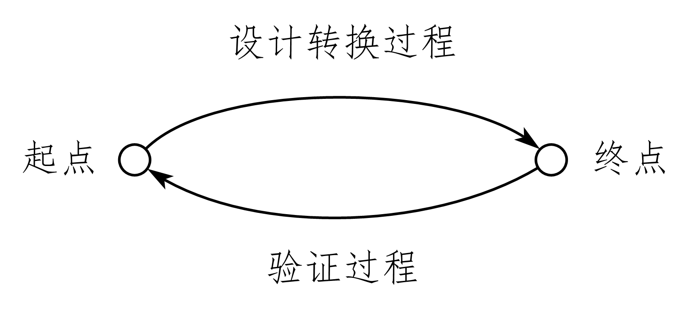{width=300px}

<!-- more -->

设计与验证过程如[图 7-2](#fig.7-2) 所示。图中说明了一个设计从设计规格到门级网表的转换和验证过程。

<a id="fig.7-2"></a>

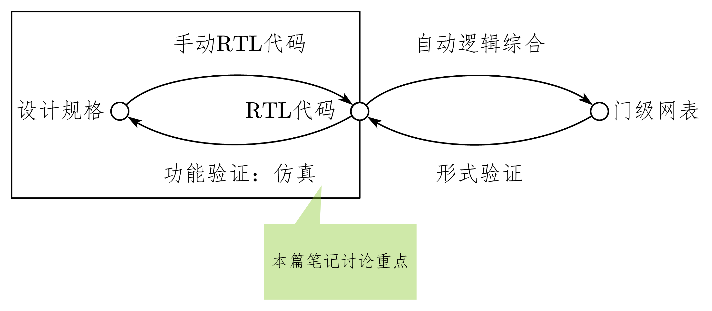{width=550}

其中，从设计规格到 RTL 的代码是由设计工程师手动完成的，而从 RTL 代码到门级网表则**由逻辑综合工具自动完成**。

相对应的是，要验证从设计规格到 RTL 代码的过程，就需要进行**功能验证**。功能验证一般是指验证 RTL 代码是否符合原始的设计需求和规格。这也是本篇笔记讨论的重点。

仿真的一般性含义是：使用 EDA 工具，通过对设计实际工作情况的模拟，验证设计的正确性。由此可见，仿真的重点在于使用 EDA 软件工具模拟设计的实际工作情况。在 FPGA/CPLD 设计领域最通用的仿真工具是 ModelSim。

目前，业界主流的功能验证方法是对 RTL 级代码的仿真。给设计加一定的激励，观察响应结果。当然，这些仿真激励必须完整的体现设计规格，验证的覆盖率要尽可能高。

在传统 ASIC 设计领域，验证是最费时、耗力的一个环节。而对于 FPGA/CPLD 等可编程逻辑器件，验证的问题就相对简单一些。可以使用如 ModelSim 或 ActiveHDL 等 HDL 仿真工具对设计进行功能上的仿真；也可以将一些仿真硬件与仿真工具相结合，通过软硬件联合仿真，加速仿真速度；还可以在硬件上直接使用逻辑分析仪、示波器等测量手段直接观察设计的工作情况。

[《Josh 的学习笔记之 Verilog》][] 系列文章的重点将放在 Verilog 语言本身的仿真上，至于门级网表和布线结果的功能（时序）仿真以及硬件加速、逻辑分析仪等验证手段，请参考其他文献。

## 1.2. 什么是 testbench

testbench，顾名思义就是测试平台的意思。简单地讲，在仿真的时候 testbench 用来产生测试激励给待验证设计（Design Under Verification, DUV）或者称为待测设计（Design Under Test, DUT），同时检查 DUV 的输出是否与预期的一致，达到验证设计功能的目的。testbench 的概念如[图 7-3](#fig.7-3) 所示。

<a id="fig.7-3"></a>

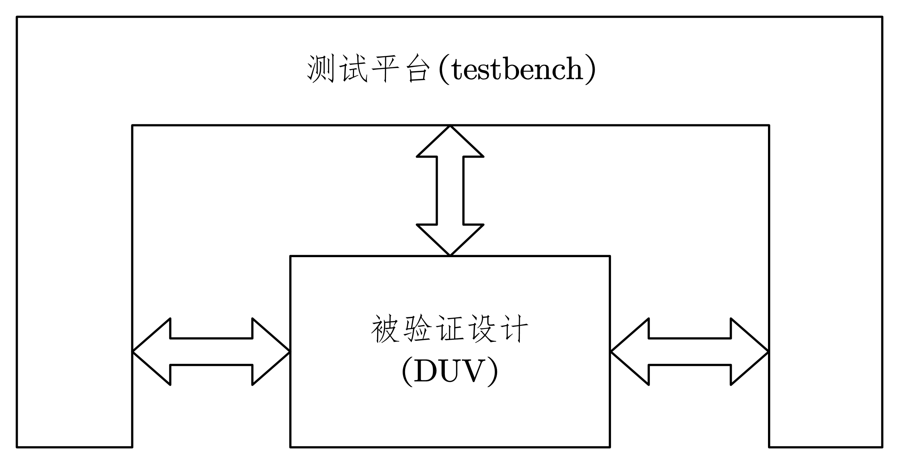{width=500px}

testbench 概念提供了一个很好的验证芯片的平台。

仿真因 EDA 工具和设计复杂度略有不同，对于简单的设计，特别是一些小规模的 CPLD 设计，可以直接使用开发工具内嵌的仿真波形工具绘制激励，然后进行功能仿真；更普遍的情况是，**使用 HDL（硬件描述语言）编制 testbench（仿真文件），通过波形或自动比较工具，分析设计正确性，并分析 testbench 自身的覆盖率与正确性**。

基于 testbench 的仿真流程如[图 7-4](#fig.7-4) 所示。

<a id="fig.7-4"></a>

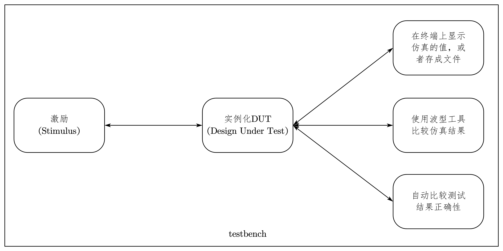{width=800px}

从图中可以清晰地看出 testbench 的主要功能：

- 为 DUT 提供激励信号；
- 正确实例化 DUT；
- 将仿真结果的数据显示在终端，或者存为文件，或者显示在波形窗口以供分析检查；
- 复杂设计可以使用 EDA 工具，或者通过用户接口自动比较仿真结果与理想值，实现结果的自动检查。

前两点功能主要和 testbench 的编写方法或 Coding Style 相关，后两点功能主要和仿真工具的功能特性与支持的用户接口相关。**如何编写规范、高效、合理的测试激励，正是本篇笔记重点论述的问题**。

另外，一个 testbench 设计好以后，可以为芯片设计的各个阶段所服务。比如在对 RTL 代码、综合网表、布线之后的网表进行仿真的时候，都可以采用同一个 testbench 。

# 2. 建立 testbench，仿真设计

在前面已经叙述过，要仿真设计的功能，必须为其建立一个 testbench，也叫仿真平台。

为了验证设计模块功能的正确性，通常需要在 testbench 中编写一些激励给设计模块。同时观察这些激励在设计模块（DUV）中的响应是否与期望值一致。

要充分验证一个设计，需要模拟各种外部的可能情况，特别是一些边界情况（corner cases），因为这些边界情况最容易出问题。

如[图 7-5](#fig.7-5) 中显示了一个用户验证 MPI 接口功能的仿真平台。不仅需要产生时钟信号和复位信号，还需要编写一系列的仿真向最．还要观察 DUV 的响应，确认仿真结果。

<a id="fig.7-5"></a>

{width=700px}

关于这个设计的验证，在后续笔记将重点介绍。

## 2.1. 编写仿真激励<a id=toc.2.1></a>

对于初学者来说，迅速掌握一些常用测试激励的写法非常重要。这样可以有效提高代码的质量，减少错误的产生。

下面，将说说如何产生一些基本的仿真激励。

### 2.1.1. 仿真激励与被测对象的连接

在 [Part 3——描述方式和设计层次的 5.1 系统级和行为级]中介绍了结构化描述方法的模块实例端口连接关系。

同样，在 testbench 中，需要实例化被测试模块（DUV），DUV 的端口和 test­bench 中的信号互连也遵循同样的规则。请参考模块实例端口连接规则，如[图 7-6](#fig.7-6) 所示。

<a id="fig.7-6"></a>

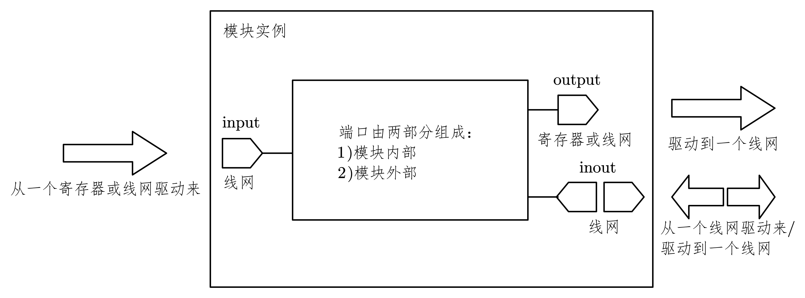{width=800}

这里，需要提醒初学者注意的是，**对于双向信号，驱动它的也一定是一个三态的线网**。不能是寄存器类型，否则就会发生冲突。

### 2.1.2. 使用 `initial` 语句和 `always` 语句

`initial` 和 `always` 是 2 个基本的过程结构语句，**在仿真的一开始即开始相互并行执行**。通常来说，被动的检测响应使用 `always` 语句，而主动的产生激励使用 `initial` 语句。

`initial` 和 `always` 的区别是： `initial` 语句只执行一次，而 `always` 语句不断地重复执行。但是，如果希望在 `initial` 里多次运行一个语句块，可以在 `initial` 里嵌人循环语句（`while`、`repeat`、`for` 和 `forever` 等），比如：

``` verilog
initial begin
    forever /* 永远执行 */
    begin
        ...
    end
end
```

而 `always` 语句通常只在一些条件发生时完成操作，比如：

``` verilog
always @ (posedge Clock) begin
    SigA = Sig B;
    ...
end
```

当发生 `Clock` 上升沿时，执行 `always` 操作，`begin... end` 中的语句顺序执行。

### 2.1.3. 时钟、复位的写法

#### 2.1.3.1. 普通时钟信号

用 `initial` 语句产生时钟的方法如下：

``` verilog
// 用 initial 产生一个周期为 10 的时钟
parameter FAST_PERIOD = 10;
reg Clock;

initial begin
    Clock= 0;
    forever
        # (FAST_PERIOD/2) Clock = ~Clock;
end
```

用 `always` 语句产生时钟的方法如下：

``` verilog
// 用 always 产生一个周期为 10 的时钟
parameter FAST_PERIOD = 10;
reg Clock;

initial
  Clock= 0; // 将 Clock 初始化为 0
always
  # (FAST_PERIOD/2) Clock = ~Clock;
```

以上的写法产生的波形如[图 7-7](#fig.7-7) 所示。

<a id="fig.7-7"></a>

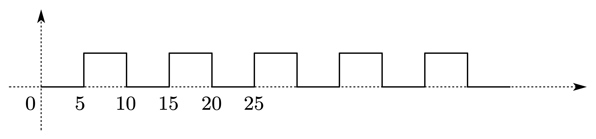{width=450}

#### 2.1.3.2. 非 `50%` 占空比时钟信号

有时候在设计中会用到占空比不是 `50%` 的时钟。比如可以用 `always` 语句实现占空比为 `40%` 的时钟，代码如下：

``` verilog
// 占空比为 40% 的时钟
parameter   Hi_Time = 4,
    Lo_Tirne = 6;

reg Clock;

always begin
    # Hi_Tiroe Clock = 0;
    # Lo_Tiroe Clock = 1;
end
```

以上代码产生的占空比不是 50% 的时钟波形，如[图 7-8](#fig.7-8) 所示。

<a id="fig.7-8"></a>

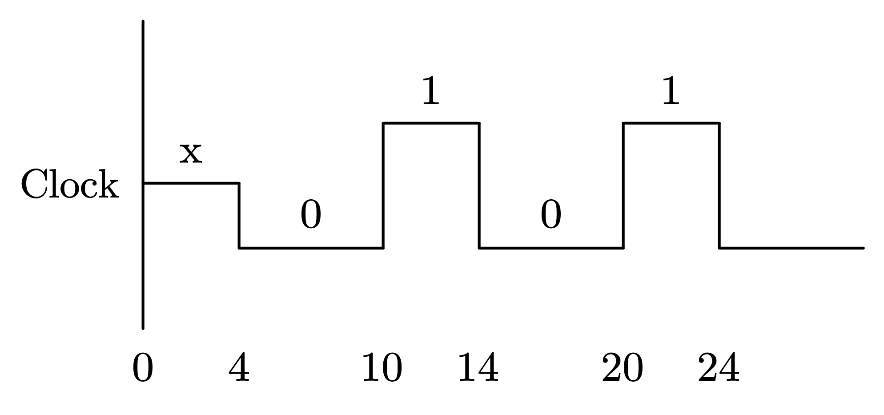{width=350}

由于 `Clock` 在 `0` 时刻没有被初始化，而且 `Clock` 是寄存器类型变量， 因此在该信号的前 `5 ns`, 在仿真器中的值为 `x`。

当然，也可以在 `initial` 语句中使用 `forever` 语句来描述同样的波形。

#### 2.1.3.3. 固定数目时钟信号

如果需要产生固定数目的时钟脉冲，可以在 `initial` 语句中使用 `repeat` 语句来实 现，代码如下：

``` verilog
// 2 个高脉冲的时钟
parameter   PulseCount = 4,
    FAST_PERIOD = 10;

reg Clock;

initial begin
    Clock= 0;
    repeat (PulseCount)
        # (FAST_PERIOD/2) Clock =~ Clock;
end
```

以上代码产生了有 `2` 个高脉冲的时钟。

#### 2.1.3.4. 相移时钟信号

另外一种应用较广的时钟是相移时钟。先看一看如下的代码：

``` verilog
// 相移时钟产生
parameter   HI_TIME = 5 ,
    LO_TIME = 10 ,
    PHASE_SHIFr = 2;

reg Absolute_clock;     // 寄存器变量
wire Derived_clock;     // 线网变量

always begin
  # HI_TIME Absolute_clock = 0;
  # LO_TIME Absolute_clock = 1;
end

assign # PHASE_SHIFT Derived_clock = Absolute_clock;
```

这里，首先用 `always` 产生一个 `Absolute_clock` 时钟，然后用 `assign` 语句将该时钟延时，产生一个相移 `2` 的 `Derived_clock` 时钟。

实现波形请参考[图 7-9](#fig.7-9)。

<a id="fig.7-9"></a>

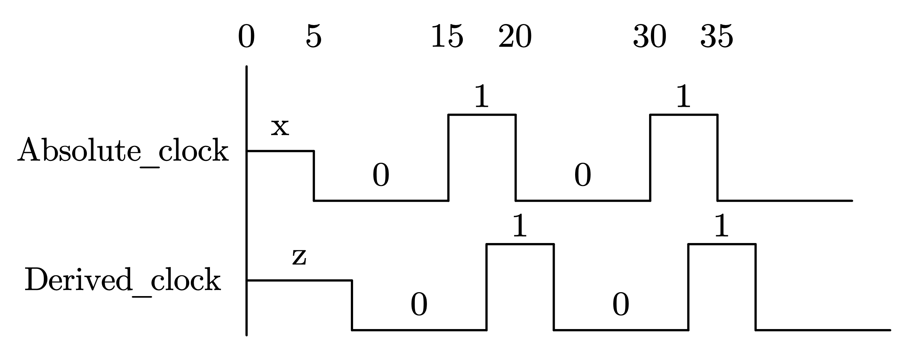{width=400px}

值得注意的是，图中的 `Absolute_Clock` 为 `register`（寄存器）型变量，初始值为 `x`；而 `Derived_clock` 为 `net`（线网）型变量，初始值为 `z`。

#### 2.1.3.5. 异步复位信号

由于复位信号不是周期信号，可以用 `initial` 来产生一个值序列。

``` verilog
// 异步复位信号
parameter PERIOD = 10 ;

reg Rst_n;

initial begin
  Rst_n=l;
  # PERIOD Rst_n = 0;
  # (5 * PERIOD) Rst_n= 1;
end
```

`Rst_n` 是低有效，以上代码在 `10 ns` 时开始复位，复位持续时间是 `50 ns`。

#### 2.1.3.6. 同步复位信号

同步复位信号产生的代码如下：

``` verilog
// 同步复位信号
initial begin
    Rst_n = 1;
    @ (negedge Clock) ; // 等待时钟下降沿
    Rst_n=0;
    # 30;
    @ (negedge Clock) ; // 等待时钟下降沿
    Rst_n = l;
end
```

该代码首先将 `Rst_n` 初始化为 `1`，然后在第一个 `Clock` 的下降沿开始复位。再延时 `30 ns`，然后在下一个时钟下降沿时撤销复位。 这样，**复位的产生和撤销都避开了时钟的有效上升沿**。因此，这种复位可以认为是同步复位，如[图 7-10](#fig.7-10) 所示。

<a id="fig.7-10"></a>

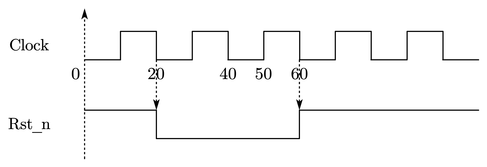{width=500px}

另一种同步复位信号产生的方法如下：

``` verilog
// 同步复位信号
initial begin
    Rst_n = 1;
    @ (negedge Clock) ;             // 等待时钟下降沿
    Rst_n = 0;                      // 复位开始
    repeat (3) @(negedge Clock);    // 经过 3 个时钟下降沿
    Rst_n = 1;                      // 复位撤销
end
```

首先将 `Rst_n` 初始化为 `1`，在第一个 `Clock` 的下降沿开始复位。然后经过 `3` 个时钟下降沿，在第 3 个时钟下降沿处撤销复位信号 `Rst_n`。另一种同步复位，如[图 7-11](#fig.7-11) 所示。

<a id="fig.7-11"></a>

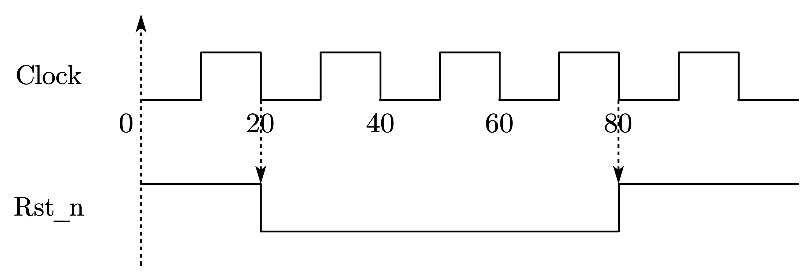{width=500px}

### 2.1.4. 产生值序列

<a id="fig.7-12"></a>

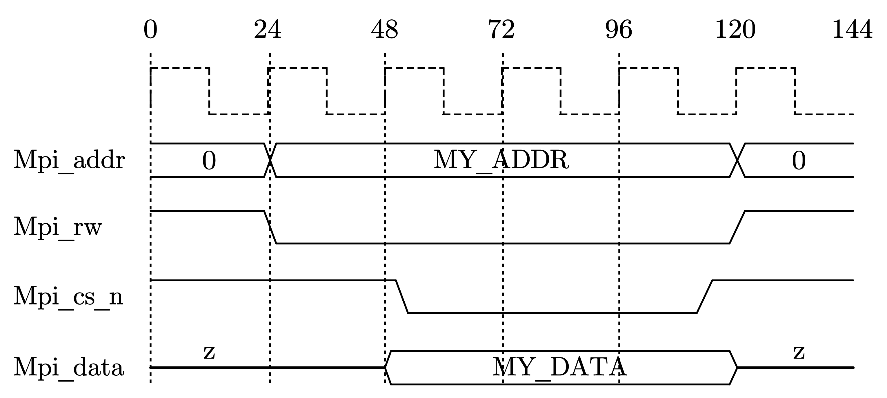{width=500px}

下面用 Verilog 来描述如[图 7-12](#fig.7-12) 中的一个波形。

在该时序图中，是以 `24 ns` 为刻度的。`MY_ADDR` 和 `MY_DATA` 都代表参数值。

用 `initial` 语句块来产生这样一组值序列，代码如下：

``` verilog
// 值序列模型
Parameter SLOW_PERIOD = 24;

reg     [5:0]   Mpi_addr;
reg             Mpi_cs_n;
reg             Mpi_rw;
reg             Mpi_oe;
tri     [7:0]   Mpi_data;
reg     [7:0]   Data_out;

assign Mpi_data = (Mpi_oe) ? Data_out : 8'bz;

initial begin           // 在 initial 语句块中产生值序列
    Mpi_addr = 0;
    Mpi_cs_n = 1;
    Mpi_rw = 1;
    Mpi_oe = 0;
    Data_out=O;
    # SLOW_PERIOD;
    Data_out = MY_DATA;
    Mpi_addr = MY_ADDR;
    Mpi_rw=0;
    # SLOW_PERIOD;
    Mpi_oe= 1;
    # (SLOW_PERIOD/4);
    Mpi_cs_n=O;
    # ((2 * SLOW_PERIOD) + (SLOW_PERIOD/2));
    Mpi_cs_n= 1;
    # (SLOW_PERIOD/4);
    Mpi_addr = O;
    Mpi_rw = 1;
    Mpi_oe = 0;
    # SLOW_PERIOD;
end
```

这里，采用**阻塞赋值**的方法产生一系列的值变化。

值得注意的是，在输出 `Mpi_data` 的时候，并没有采用在 `initial` 中赋值，直接输出的方式，而是采用了输出使能控制的方式，用一个三态门输出。这样，将 `Mpi_data` 定 义成一个 `tri` 类型变量（`Net` 中的一种）。这是**便于和被验证模块中三态双向总线互连**，将在后续笔记中详细介绍这种用法。

### 2.1.5. 利用系统函数和系统任务

在编写 testbench 时，一些系统函数和系统任务可以产生测试激励，显示调试信息，协助定位问题。

比如在使用 `display` 语句在仿真器中打印出地址和数据：

``` verilog
$display ("Addr: %b -> DataWrite: %d", Mpi_addr, Data_out);
```

同时，也可以用时序检查的系统任务来检查时序。例如：

``` verilog
$setup(Sig_D,posedge Clock,1);  // 如果在 Clock 上升沿到达之前的 1 ns 时间内，
                                // Sig_D 发生跳变，将给出建立时间违反告警
$setup(posedge Clock,Sig_D,0.1);// 如果在 Clock 上升沿到达之后的 0.1 ns 时间内
                                // Sig_D 发生跳变，将给出保持时间违反告警
```

另外，也可以用 `$random()`系统函数来产生测试激励数据。例如：

``` verilog
Data_out = {$random} % 256;     // 产生 0~255 的数据
```

`$time` 系统函数可以用来返回当前的仿真时间，协助仿真。 能够用于 testbench 中的系统任务和函数有很多，它们的使用方法大同小异，非常简单。感兴趣的读者可以参考其他 Verilog 的语法资料。

### 2.1.6. 从文本文件中读出和写入数据

在编写测试激励时，往往需要从已有的文件中读入数据，或者把数据写入文件中，做进一步分析。那么在 Verilog 语言中如何实现呢？

看看如下代码：

``` verilog
reg [7:0] DataSource [0:47];                   // 定义一个二维数组
$readmemh ("Read_In_File.txt", DataSource) ;
```

就是将 `Read_ln_File` 文件中数据读入到 `DataSource` 数组中，然后就可以直接使用。

往文件中写入内容的代码如下：

``` verilog
integer Write_Out_File;                     // 定义一个整数的文件指针
Write_Out_File = $fopen("Write_Out_File.txt");          // 打开文件
$fdisplay (Write_Out_File, "@ %h\n %h", Mpi_addr, Data_in);   // 往文件中写人内容
$fclose (Write Out File);                     // 关闭文件
```

这里，关于写入和写出文件的具体格式和用法，请参考本篇笔记实例部分的内容。

### 2.1.7. 写并行激励

如果希望在仿真的某一时刻同时启动多个任务可以采用 `fork ... join` 语法结构。 例如，在仿真开始的 `100 ns` 后，希望同时启动发送和接收任务，而不是发送完毕后再进行接收，可以采用如下代码：

``` verilog
// 并行激励
initial begin
  # 100;
  fork         // 并行操作
    Send_task;
    Receive_task;
  join
end
```

这是产生并行激励的一个好办法。

### 2.1.8. `for` 语句实现遍历测试

如果设计的工作模式很多，就需要做各种模式的遍历测试，而遍历测试则需要非常大的工作量。

在很多时候，各种模式之间仅仅是部分寄存器配置的内容不同，而各种模式之间的测试都是一样的。有什么方法可以减轻这种遍历测试的工作量呢？可以**采用 `for` 循环语句，用循环索引来传递各种模式的配置值，会帮助减少很多代码书写的工作量，而不会漏掉任何一种模式**。

如下代码所示：

``` verilog
initial begin
    for (i = 1; i < m; i = i + 1)        // 遍历模式 1 至 m-1
        for (j = 0; j < n; j = j + 1) begin    // 遍历子模式 1 至 n-1
            case(j)
                0: Conf_Value = a;
                1: Conf_Value = b;
                2; Conf_Value = c;
                ...
            endcase
            // 共用的测试向量
        end
end
```

在设计 Verilog 代码时灵活使用 `for` 语句，可以使得代码更简洁。

### 2.1.9. 高级语句：`force` 和 `release`

顾名思义，`force` 就是可以对变最强制性的赋予确定的值，而 `release` 就是解除 `force` 的作用，将变量恢复为驱动源的值。例如：

``` verilog
// force 和 release
wire a;

assign a = 1'b0;

initial begin
    # 10;
    force a = 1'b1;
    # 10
    release a;
end
```

在 `10 ns` 时，`a` 的值由 `0` 被强制为 `1`，在 `20 ns` 时，`a` 的值又恢复为 `0`。

`force` 和 `release` 并不常用。有时，可以利用它们和仿真工具做简单的交互操作。例如，VerilogXL 的图形界面可以很方便的将一个变量 `force` 为 `0` 或 `1`。而在 testbench 里，可以检测变量是否被 `force` 为固定的值，当被 `force` 为固定的值时就执行预定的操作，实现了简单交互操作。

### 2.1.10. 封装功能模块<a id=toc.2.1.10></a>

与 C 语言类似，在编写 testbench 的时候，可以将固定的一些操作封装成任务或者函数。

#### 2.1.10.1. 任务

任务的格式如下：

``` verilog
tast 任务名称;
    输入, 输出声明;
    语句;
endtask
```

例如，一个读 CPU 接口的任务：

``` verilog
task Read;
    output  [7:0]  Rtask_Data;    // data read out
    input  [7:0]  Rtask_Addr;

    begin
        uP_rw = 0;
        # SLOW_PERIOD;
        uP_addr = Rtask_Addr;
        uP_rw = 1;
        # SLOW_PERIOD;
        ...
    end
endtask
```

其中，`input` 是任务的输入，可以用 `output` 来向任务外部传递计算结果。当然，也可以在任务中直接修改仿真中的全局变量，来传递数值。调用 `task` 的格式如下：

``` verilog
Read (Data,Addr);        // Addr 是需要读的地址, 而 Data 是读出的数据
```

#### 2.1.10.2. 函数

函数的格式如下：

``` verilog
function [BITWIDTH - 1:0] 函数名称
  输入声明;
  语句;
endfunction
```

与任务不同的是，函数将返回一个值。以上代码会**返回一个 `BITWIDTH` 宽度的值**。

例如：

``` verilog
function    [7:0]   Product;
  input   [3:0]   Sig_A;
  input   [3:0]   Sig_B;
  begin
    Product = Sig_A * Sig_B;
  end
endfunction
```

调用的格式如下：

``` verilog
ProductResult = Product(A,B);    // 将 A 和 B 的乘积赋给 ProductResult 变量
```

### 2.1.11. 波形编辑器

在一些工具中，可以使用波形编译器来产生仿真激励。例如，在 Quartus II 开发软件中，就可以使用波形编辑器来产生仿真激励。

波形编辑器不在系列笔记的重点讨论范畴内，因此这里不再过多累述。

## 2.2. 搭建仿真环境

通常，为一个设计建立仿真平台，将这个设计在该平台中实例化，然后将在平台中产生各种各样的测试激励输入给设计模块，然后再观察 DUV 的响应是否与期望值相同。

那么，如何将待测设计和仿真激励连接起来，是对设计进行仿真的重要一步。

在[Part 3——描述方式和设计层次的 5.1 系统级和行为级][]小节和本文的 [2.1 小节](#toc.2.1)中，都提到了如何在模块中实例化其他模块的方法。大家可以参考这些内容，掌握如何在 testbench 中实例化 DUV 或其他模块。

将以[图 7-13](#fig.7-13) 中的 testbench 为实例，介绍端口的连接关系。

<a id="fig.7-13"></a>

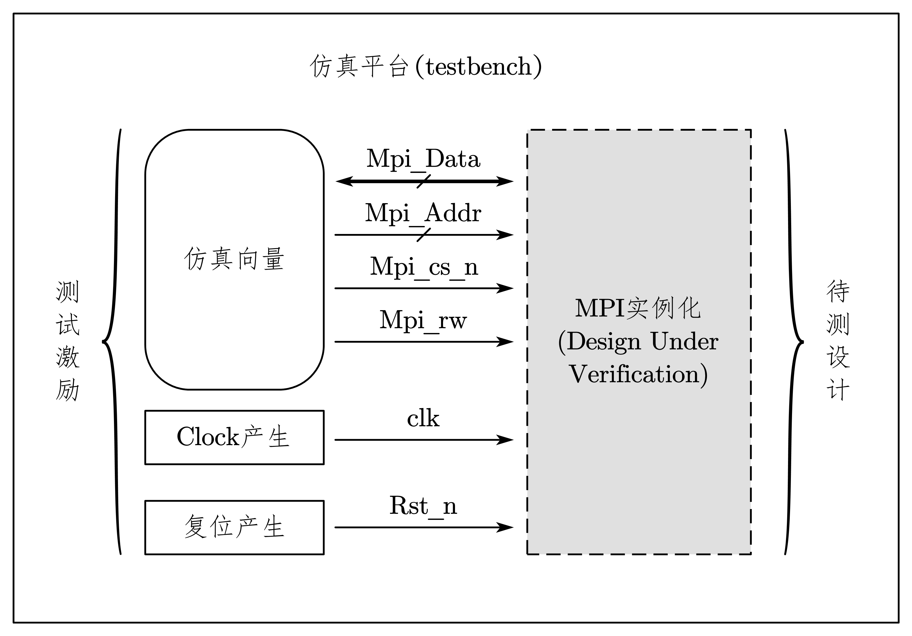{width=700px}

图中的仿真平台是**单顶层**的 testbench，在后面还将介绍多顶层的 testbench 。

下面的部分代码是介绍如何搭建 testbench 的：

``` verilog
module Testbench;           // 测试平台顶层
// 时钟激励产生
initial begin
    ...
end

// 复位激励产生
initial begin
    ...
end

// 各种测试用例
initial begin
    ...
end

// 设计模块实例
MPI u_MPI(
    .Clock      (Clock      ),
    .Rst_n      (Rst_n      ),
    .Mpi_data   (Mpi_data   ),
    .Mpi_addr   (Mpi_addr   ),
    .Mpi_cs_n   (Mpi_cs_n   ),
    .Mpi_rw     (Mpi_rw     )
    );

endmodule
```

另外，在Verilog 语言中，也支持多顶层结构。关于多顶层的 testbench，请参考 [4.5.2 小节](#toc.4.5.2)的叙述。

将仿真平台建好以后，就可以开始仿真了。

在下面小节中将叙述如何进行仿真结果确认。

## 2.3. 确认仿真结果

### 2.3.1. 直接观察波形

最简单确认仿真结果的方法就是用眼睛观察输出波形。

### 2.3.2. 观察文本输出

用户也可以依靠一些系统任务打印的信息，来协助查看仿真结果。例如：

- `$display`，直接输出到标准输出设备
- `$monitor`，监控参数的变化
- `$display`，输出到文件

在后面的实例部分将重点介绍前面两种确认仿真结果的方法：

- 直接观察波形；
- 观察仿真器输出。

### 2.3.3. 自动检查仿真结果

对于一些大型设计，测试向量成千上万，每条都用手动方式比较已经不现实，这时就必须**借助仿真软件接口进行自动比较**。常用的自动比较方法有如下 3 种：

- 数据库比较法。首先需要生成一个标准向量数据库（Golden Vector Database），它存储的是期望得到的仿真结果，是比较的基础。然后**自动将每条仿真输出的响应向量与标准向量进行比较**，记录不一致向量的位置和内容。这种方法的优点是简单易行；主要缺点在于，**根据输出的响应向量回溯并定位输入激励不是十分方便，也不够直观**。

- 波形比较法。与数据库比较法的思路基本一致，只是**比较的对象是仿真输出波形**，首先存储标准波形文件（Golden Wave File），然后通过仿真软件手动或者自动进行将仿真的输出波形与标准波形文件进行比较，用图标（marker）定位比较结果相异的地方。这种方法的优点是直观明了。ModelSim 等仿真工具通常都支持波形比较（Wave Compare）功能。

- 动态自检测法。前面两种自动比较方法的本质都是将仿真结果与事先存储好的标准向量（Golden Vector）进行比较，对于复杂设计，仿真系统的输出不仅和当前输入相关，还和历史输入甚至反馈值相关，对于前两种方法，即使发现了输出的响应向量和标准向量不一致，要定位造成不一致的原因，特别是追溯哪些输入造成的输出不一致是比较困难。前两种方法统称为**静态分析方法**。与之相反，动态分析方法就能实时地定位哪些激励造成响应不一致。其基本思路如[图 7-14](#fig.7-14) 所示。首先可以在不同的抽象层次（如行为级或者混合层次）描述出与 DUT 功能一致的仿真模型，然后读入测试激励向量（Test Vectors），将测试激励向量同时送到实例化的 DUT 和前面提到的仿真模型中，实时地观察、判断、存储两者的输出响应，比较输出结果。这样一旦发现了输出响应不一致，即可暂停仿真过程，观察 DUT 和仿真模型的每个中间状态的值，记录输入的激励向量，定位设计错误。

<a id="fig.7-14"></a>

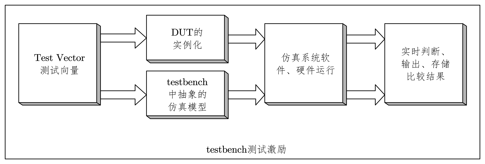{width=800px}

由于自动比较法通常用在非常庞大的设计验证中，在系列笔记中不重点介绍这种方式。

### 2.3.4. 使用 VCD 文件

VCD 文件是一种标准格式的波形记录文件。该文件只记录发生变化的波形。

设计在仿真器中的仿真结果，可以输出成一个 VCD 文件。然后将该 VCD 文件输入给其他第三方的分析工具进行分析。[图 7-15](#fig.7-15) 是 VCD 文件调试和分析仿真过程。

<a id="fig.7-15"></a>

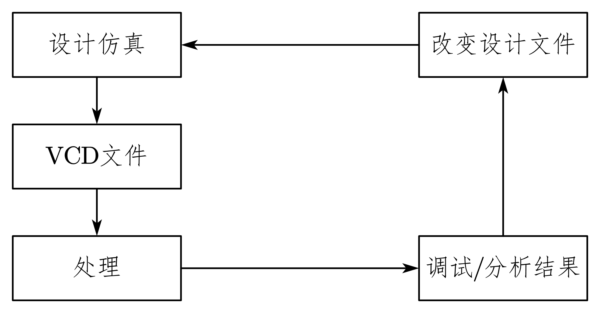{width=400px}

在系列笔记中，不对 VCD 文件进行过多的介绍。

## 2.4. 写 testbench 要注意什么

### 2.4.1. testbench 不是硬件

在前述其他笔记中提到过，设计硬件的时候，要尽量使用硬件的思维方式，时刻记住是在设计硬件，每一句语句都有明确的硬件定义，可以被综合工具理解。

要注意的是，在写 testbench 的时候，情况就大不相同了。

通常，testbench 不会被实现成具体的电路，不需要有可综合性。只要它能在仿真器中模拟出相应的功能即可。

因此，在写 testbench 的时候，需要**尽量使用抽象层次较高的语句**，这样编写 testbench 的效率比较高，同样仿真的效率也较高。

### 2.4.2. 使用行为级描述方式描述 testbench

必须明确，可综合的硬件电路一般要求用 RTL（寄存器传输级）方法描述，而 testbench 则需要用行为级甚至更高层次的 HDL 语言描述。在讲述行为级描述 testbench 的好处之前，首先引入 HDL 语言的层次概念， HDL 语言的适用层次如[图 7-16](#fig.7-16) 所示。

<a id="fig.7-16"></a>

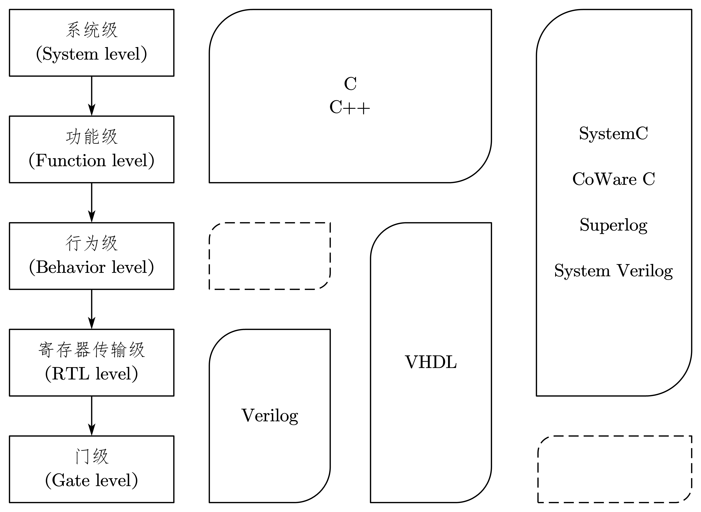{width=600px}

上图说明了不同的 HDL 语言种类对应的 HDL 描述层次的关系，图中实线框表示适用程度较高，虚线框表示适用程度较低。常用的 HDL 描述层次有门级、寄存器传输级和行为级等。

使用行为级或者更高层次的描述方法好处主要有：

- 编写 testbench 时**仅需要关注电路的功能**，而不需要理解电路结构与实现方式，从而降低了设计 testbench 的难度，节约了设计时间。

- **可以使用高级数据结构和运算**。在行为级描述中，比较容易将某种运算封装起来，便于调用。另外如果使用可编程用户接口（PLI, Programmable Language Interface) ，还可以在 testbench 中嵌入 C 和 C++ 语言。另外越来越多的仿真工具支持诸如 SystemVerilog、Superlog、SystemC、CoWare C 等高级语言。C、C++ 、SystemVerilog、Superlog、SystemC、CoWare C 等高级语言的引入，强有力地支持了用户自定义的数据结构，**通过对象的封装，支持进程与事件之间通讯**，有效的提高了 testbench 设计效率，并加强了 testbench 的安全性。

- **行为级描述便于根据需要从不同层次抽象设计**。与第二点相似，使用行为级或者更高层次的描述方式，可以将设计抽象到不同层次，在高层次描述设计更加简便高效，只有需要解析某个部分的详细结构时，才使用低层次的详细描述，这样可以有效地节约设计时间，提高仿真效率。

- **行为级仿真速度更快**。行为级仿真速度更快有两个原因，一方面仿真工具对于某些高级算法支持更有效，编译和运行速度快，更主要的是，**行为级描述的抽象层次高，本身就是对运算处理的一种简化**。例如，在 RTL 级描述一个 `32 bit` 乘法器，需要反复地选择、移位、与或非等运算，而在行为级描述这个 `32 bit` 乘法器，直接写 `A × B` 即可，仿真工具在仿真时也可以直接得到乘法的结果，大大地提高了效率，节约了时间。

### 2.4.3. 设计高效的 testbench

在上一小节中，使用行为级描述方法是从宏观上论述的。具体到代码编写层次，希望大家能够注意积累一些标准、规范、高效的 testbench 描述方法。这里，总结如下：

- **避免使用无限循环**。一般来说，testbench 里面每个事件都应该是可控制和有限的，否则会增加仿真器的 CPU 和 Memory 资源消耗，降低仿真速度。这条原则的一个特例是时钟产生电路，例如使用 `forever` 或无条件的 `always` 语句产生周期性时钟信号。

- **使用逻辑模块划分激励**。在 testbench 中，所有 `initial`、`always`、`assign` 等语法块是并行执行的，其中描述的每个事件都是基于时间 “0” 点安排的，这样通过这些语法结构将不同的激励划分开，有利于设计维护测试激励。

- **避免不必要的输出显示**。常用仿真工具都支持将信息显示在终端上或者存储在文件中，这种功能对分析仿真结构十分有用。但是对于复杂设计，一定要避免不必要的输出显示，因为这类进程非常耗费 CPU 和 Memory 资源，极大地降低仿真速度。

- **掌握程式化的仿真结构描述方法**。诸如产生时钟信号、仿真双向总线、仿真 CPU 读/写寄存器、定义事件的延时与顺序、RAM 等常用模块的初始化、读/写过程等，都是常用的仿真结构，大家已经形成了比较程式化的标准写法，初学者多读一些好的仿真代码，积累这些程式化的描述方法，将有效地提高自己 testbench 的质量。

上述仅仅是一些基本的仿真原则，限于篇幅，不能展开论述，希望大家带着问题，在后续学习笔记中作为重点去理解。

# 3. CPU 接口仿真实例<a id=toc.3></a>

前面介绍了许多编写 testbench 的方法和技巧，现在轮到如何利用这些技巧了。所谓实践出真知，下面就一个常用的实例，帮助大家继续深入体会如何编写 testbench, 如何验证设计。

## 3.1. 设计简介

[图 7-17](#fig.7-17) 是一个 PowerPC 和 FPGA 的接口模型。FPGA 被当成处理器的一个简单的异步外设处理。

<a id="fig.7-17"></a>

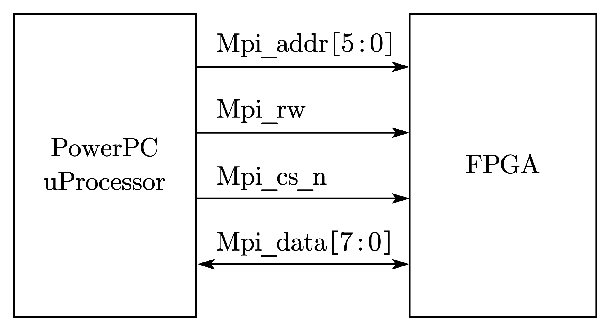{width=400px}

所有的总线操作都由 PowerPC 发起。共分为两种总线操作方式：读操作和写操作。

读操作的时序如[图 7-18](#fig.7-18) 所示。写操作的时序如[图 7-19](#fig.7-19) 所示。

<a id="fig.7-18"></a>

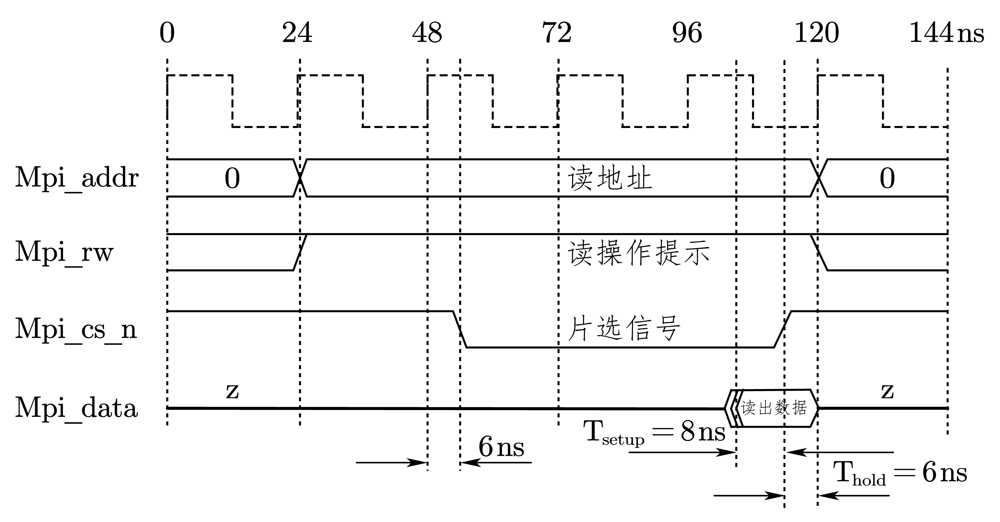{width=600px}

<a id="fig.7-19"></a>

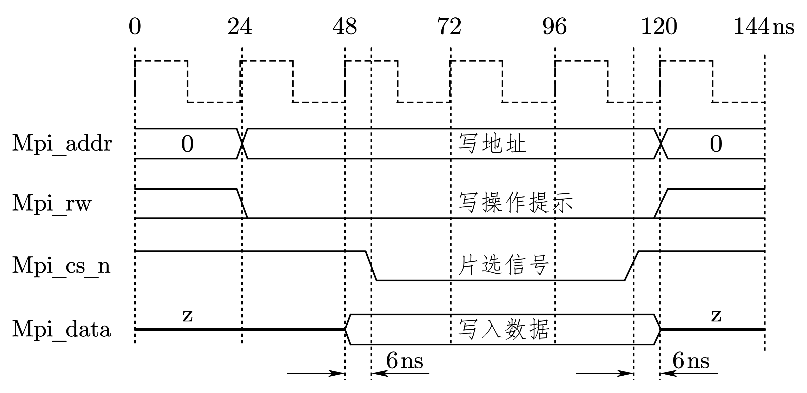{width=600px}

要注意的是，PowerPC 的读/写时序与许多配置参数有关，而且处理器使用不同的主频，时序也不太一样。这里为了简单明了，采用了特定的设置和主频。在实际系统中，如果采用不同的设置，需要参考 PowerPC 的数据手册。但是，这里的设计思想是可以借鉴的。

假设，已有了一个设计模块名叫 `MPI`，对应[图 7-17](#fig.7-17) 中的 FPGA，它的接口定义如下。详细的设计代码请参考本文[附带资源][]中的 `Example-7-1`。

``` verilog
// MPI.v
`timescale 1ns/100ps
module MPI(
    Clock ,
    Rst_n ,
    // uP interface
    Mpi_data ,
    Mpi_addr ,
    Mpi_cs_n ,  // Chip Select
    Mpi_rw      // 1:read; 0:write
    // to/from Storage Part
    ) ;

// clock and reset
input            Clock ;
input            Rst_n ;
inout  [7:0]     Mpi_data ;
input  [5:0]     Mpi_addr ;
input            Mpi_cs_n ;     // Chip Select
input            Mpi_rw ;       // 1:read; 0:write

...

endmodule
```

该设计中，采用了一个全局时钟 `Clock` 来处理与 PowerPC 之间的接口，**将异步接口同步化**。这是一种非常可靠的设计方法，这里不再过多叙述设计的细节，希望大家能够领会其中的奥妙。

该设计中，输入地址采用 `6` 位，地址 `0~31` 为设计中的块状 RAM（`8` 位宽，`32` 字节深度），地址 `32~47` 为设计中的 D 触发器实现的 `8` 位寄存器，地址 `48~63` 保留未使用。

## 3.2. 一种 testbench<a id=toc.3.2></a>

以下介绍一种 testbench，供大家学习使用。使用 `$random` 产生激励，用 `$display` 输出仿真结果。

要验证上一小节介绍的 MPI 模块的功能，首先需要为其产生激励，将数据写入到指定的地址。然后将该地址的数据读出后，与写入的数据比较，如果一致，说明设计正确，如果不一致，说明设计有缺陷。

<a id="fig.7-20"></a>

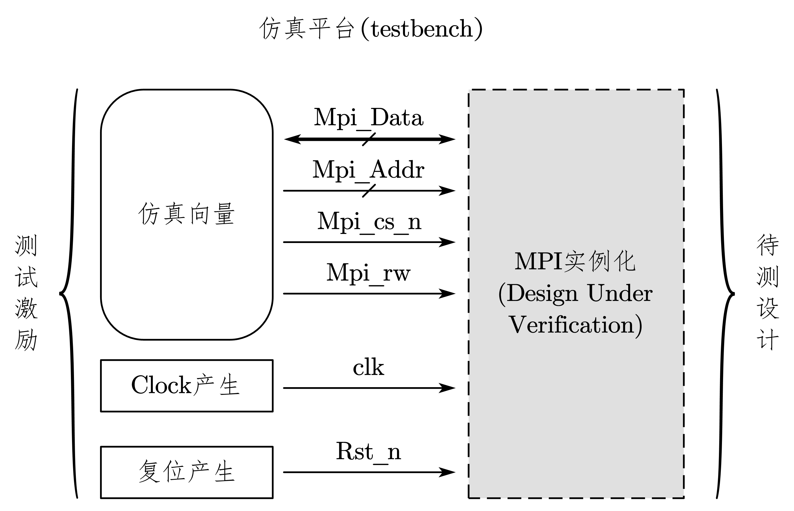{width=600px}

根据[图 7-20](#fig.7-20) 中的 testbench 结构，设计 testbench 顶层如下：

``` verilog
// NorTestBench.v
module NorTestBench;      // testbench 顶层模块
...
// 始终激励产生
initial begin
    Clock = 0;
    forever begin
         # (FAST_PERIOD/2) Clock = ~Clock ;
    end
end
...
// 复位激励产生
initial begin
    Rst_n = 1;
    # FAST_PERIOD Rst_n = 0;
    # (5 * FAST_PERIOD) Rst_n = 1;
end
...
// 输出三态 Buffer, 用于和 MPI 接口的数据总线相连
assign Mpi_data = ( Mpi_oe )? Data_out : 8'bz ;

// 仿真向量产生
initial begin : ACCESS
    ...
    // 根据前面介绍的方法, 生读/写的序列
    for ( i=6'b101111; i>= 0; i=i-1 ) begin  // 遍历 47~0 地址
        ...
        // 用 $random 系统函数产生写入的数据
        Data_out = {$random} % 256;     // data between 0~255
        // 用 $display 系统函数打印出写入的地址数据信息
        $display ("Addr: %b -> DataWrite: %d", Mpi_addr, Data_out);
        ...
        // 用 $display 系统函数打印出读出的地址数据信息
        $display ("Addr: %b -> DataRead: %d", Mpi_addr, Data_in);
        ...
    end
    ...
    $stop;  // 仿真停止
end

// 设计模块实例
MPI u_MPI (
    .Clock      (Clock      ),      // Clock 是寄存器型变量
    .Rst_n      (Rst_n      ),      // Rst_n 是寄存器型变量
    .Mpi_data   (Mpi_data   ),      // Mpi_data 是 tri 型变量
    .Mpi_addr   (Mpi_addr   ),      // Mpi_addr 是寄存器型变量
    .Mpi_cs_n   (Mpi_cs_n   ),      // Mpi_cs_n 是寄存器型变量
    .Mpi_rw     (Mpi_rw     )       // Mpi_rw 是寄存器型变量
    ) ;

endmodule
```

以上是 testbench 顶层的结构示意，关于完全的代码，请参考本文[附带资源][]中的 `Example-7-1`。

在该 testbench 中，用系统函数 `$random` 产生 `0~255` 之间的随机数，然后从地址 `47~0` 写入，并在同一地址读出。

将写入的地址和数据，以及读出的地址和数据用系统函数 `$display` 输出到仿真标准输出设备，进行手动比较。

有了以上的 testbench 和设计模块，就可以对设计进行仿真验证了。

> 使用 testbench 仿真，参考示例详见本文[附带资源][]中的 `Example-7-1`。

### 3.2.1. 进入工程目录

把[附带资源][]中的 `Example-7-1` 目录复制到本地硬盘。例如，复制到 `D:` 盘的根目录下。运行 ModelSim 仿真器。在 ModelSim 仿真器的菜单中选择 `File -> Change Directory` 菜单项，然后选择目录`D:\Example-7-1\Proj` 或者直接在 ModelSim `>` 提示符后输入 `cd D:/Example-7-1/Proj` 回车。这样，就将目录切换到工程目录下。这里采用的是 ModelSim SE 10.5版本，其他版本一样适用。

### 3.2.2. 运行仿真

在 ModelSim `>` 提示符后输入 `do sim.do`，然后回车。仿真就开始了。`do` 是 ModelSim 中的命令，而 `sim. do` 文件是事先编写好的 ModelSim 自动运行脚本。其中包含了编译库文件、编译设计文件、载入仿真、开始运行仿真等命令，使得整个仿真过程自动完成。ModelSim 窗口如[图 7-21](#fig.7-21) 所示。

<a id="fig.7-21"></a>

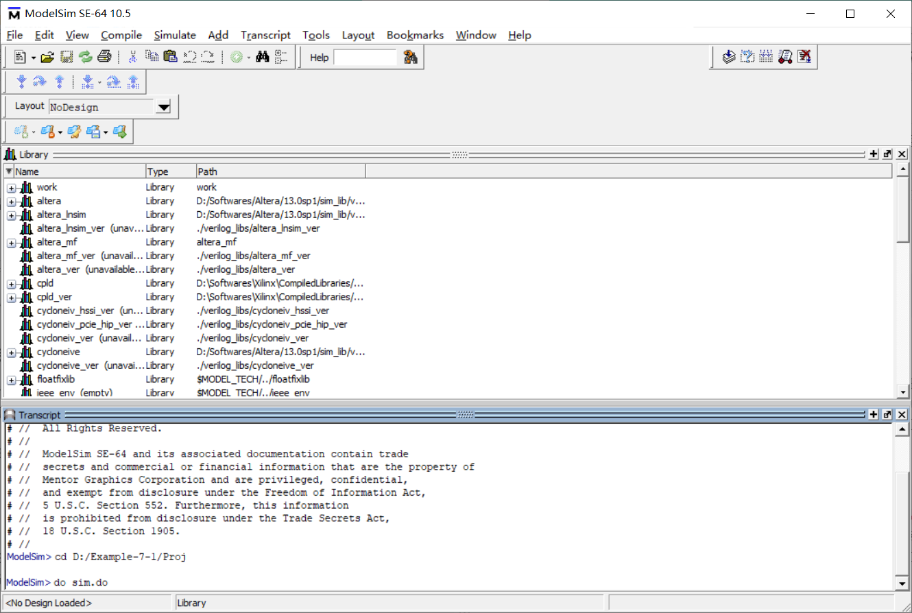{width=900px}

### 3.2.3. 查看仿真结果

由于在这个 testbench 中，采用随机数作为写入数据，将写入和读出的数据都打印到标准的输出设备。因此，读者可以在 Mode!Sim 窗口中手动查看仿真结果。仿真器将 testbench 中的 `$display` 显示函数显示如[图 7-22](#fig.7-22) 所示。

<a id="fig.7-22"></a>

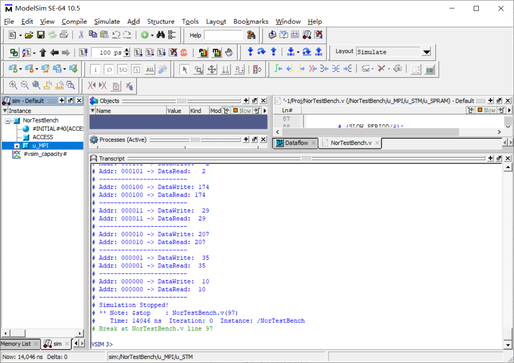{width=900px}

为了检查读/写数据是否一致，只需要查看以上的显示内容即可。另外，还可以通过查看具体的波形来调试。

## 3.3. 另一种 testbench<a id=toc.3.3></a>

在本小节中，采用另一种 testbench 。与 [3.2 小节](#toc.3.2)中的 testbench 对比，这里有两点不同：

- 写数据源是从文件 `Read_In_File.txt` 中读入的，不再是由 `$random` 系统函数产生的随机数；

- 读出数据被写人到另一个文件 `Write_Out_File` 中，不仅向标准输出设备输出。

这种新的测试平台顶层结构如下：

``` verilog
// NorTestBench.v
module NorTestBench;                // testbench 顶层模块
...
reg     [7:0]   DataSource [0:47];  // 定义一个数组
integer Write_Out_File;             // 定义文件指针

// 仿真向量产生
initial begin : ACCESS
    ...
    // 将 Read_In_File.txt 文件中的数据读出, 并写人到 DataSource 数组中
    $readmemh ( "Read_In_File.txt", DataSource );

    // 将 Write_Out_File.txt 文件打开, 并将文件指针赋给 write_Out_file
    Write_Out_File = $fopen("Write_Out_File.txt");
    ...
    for ( i=6'b101111; i>= 0; i=i-1 ) begin  // 遍历 47~0 地址
        ...
        // 从 DataSource 数组中读取数据源
        Data_out = DataSource[i] ;
        ...
        // 将读出的地址和数据信息写入到 Write_Out_File 指定的文件中
        $fdisplay (Write_Out_File, "@%h\n%h", Mpi_addr, Data_in);
        ...
    end
    ...
    $fclose (Write_Out_File);               // 关闭 Write_OUt_File 文件, 释放指针
    $stop;                                  // 仿真停止
end
...
endmodule
```

在 `Read_In_File.txt` 文件中，根据 Verilog 的语法，存储的数据如下：

``` verilog
@2f
24
@2e
81
@2d
09
// ...
```

地址由 `2f` 到 `0` 递减。

读出的地址和数据用系统函数 `$display` 输出到仿真标准输出设备。同时，也将输出数据和地址按照与 `Read_In_File.txt` 文件中一样格式写入到文件 `Write_Out_File. txt` 中，以便于比较。运行仿真以后，在仿真目录下，会生成一个 `Write_Out_File.txt` 文件，用来存储读出的地址和数据。因此只要将这两个文件打开，手动比
较，或者利用一些自动比较工具比较，就可以知道仿真结果正确与否。

关于具体的仿真步骤请参考 [3.2 小节](#toc.3.2)中的操作步骤。工程文件在本文[附带资源][]中的 `Example-7-2` 中。

大家将发现，运行完仿真后，在工程目录下会生成一个文件： `Write_Out _File.txt`。可以拿它与文 `Read_In_File.txt` 比较，如果两者一致说明仿真结果正确，否则结果错误。此外，还可以手动查看仿真波形调试问题。

# 4. 结构化 testbench 思想

在[第 3 节](#toc.3)中，介绍了两种验证 MPI 模块的 testbench。

在这些平台中，在 testbench 的顶层直接描述接口的时序，将测试数据加上去。

实际上，在 testbench 中，对 MPI 接口主要只有两种操作：写操作和读操作。

如果，把产生这两种操作的时序功能模块作为一种标准功能模块，而将要操作的地址和数据等作为参数去调用这种总线功能模块，那有什么好处呢？

这样的话，无论对 MPI 进行什么样的读/写操作，只需要调用这种通用的总线模块（就是后面要介绍的总线功能模型 BFM（Bus Functional Model））， 同时将读/写的地址和数据代入即可，操作简单，代码容易维护，同时读与写的功能模块得到了重用，这就是结构化 testbench 出现的原因。

结构化 testbench 不仅使得 BFM 和测试用例分离，而且将测试套具和测试用例也分离开了，不同的测试用例之间也是相互独立的。结构化 testbench 如 [图 7-23](#fig.7-23) 所示。

<a id="fig.7-23"></a>

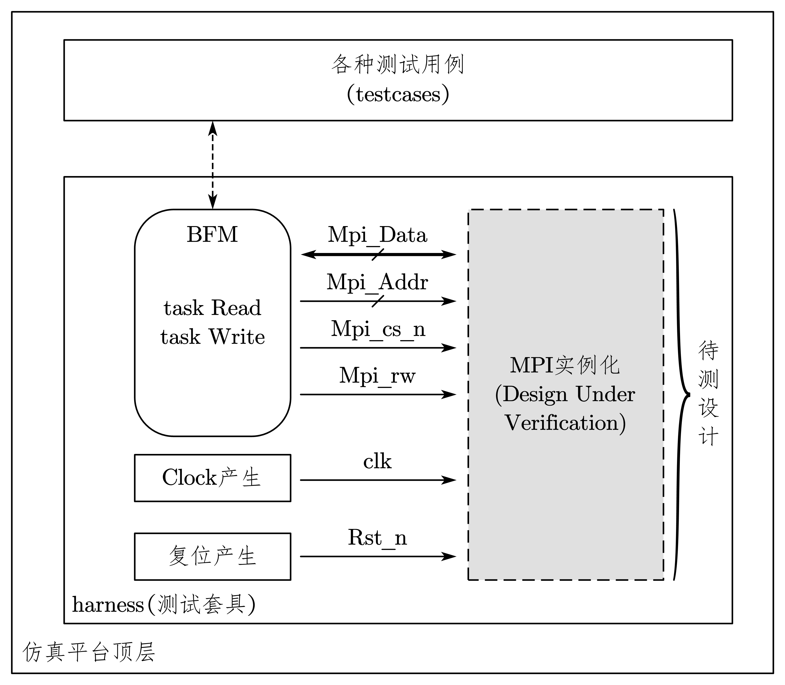{width=600px}

结构化test bench 的好处是：

- 总线功能模块（BFM）重用；
- 结构清晰，易于设计，减小testbench 设计工作量；
- 将 testcase 的抽象程度提高，无须关心底层细节；
- 适用于复杂的设计模块。

为了进一步说明结构化 testbench，来看看几个基本的概念。

## 4.1. 任务和函数

在 [2.1.10 小节](#toc.2.1.10)中，介绍了在 Verilog 中的两种功能封装方法：

- 任务：`task`;
- 函数：`function`。

在下一小节中的 BFM 设计部分，正是利用了这种功能封装的概念。

## 4.2. 总线模型重用

BFM 是一种将物理的接口时序操作转化成更高抽象层次接口的总线模型。

以[第 3 节](#toc.3)中的设计为例，BFM 结构如[图 7-17](#fig.7-17) 所示。

为了验证 FPGA 中 MPI 接口的功能，需要给 MPI 接口加各种各样的激励，仿真激励的种类越多，仿真越完备。

这里，需要在 testbench 中模拟 PowerPC 接口的时序和功能。

<a id="fig.7-24"></a>

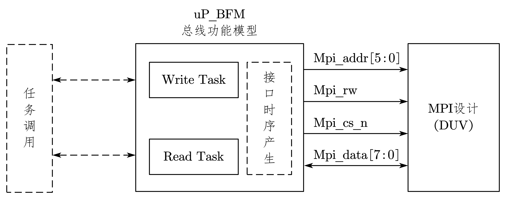{width=800}

在[图 7-24](#fig.7-24) 中，`uP_BFM` 是作为一个 Verilog HDL 中的 `module` 出现的。其中，在 BFM 面对 DUV 的一边将模拟 PowerPC 的访问时序，这是一个延时非常精确的总线模型。在该模型内部有两个用户定义的任务： `write` 和 `read`，供其他模块（如测试激励）调用。

这样测试激励（testcases）就不需要关心接口时序，它们需要能调用 `write` 和 `read` 两个任务即可，实现底层时序的功能就交给了 `uP_BFM`。

## 4.3. 测试套具

测试套具就是 harness。从系统测试角度说，也就是将被测模块固定，以方便测试。而从验证 Verilog 代码来说，就是**将被测试模块封装起来，留出简单易用的访问接口**，以利于各种测试用例来调用、测试设计模块。

如[图 7-25](#fig.7-25)，harness 中实例化了 `uP _BFM` 和 DUV，以及一些基本的激励，如 `Clock` 和复位的产生。另外，测试激励可以通过 harness 中 `uP _BFM` 的任务，来对 DUV 施加各种激励。

<a id="fig.7-25"></a>

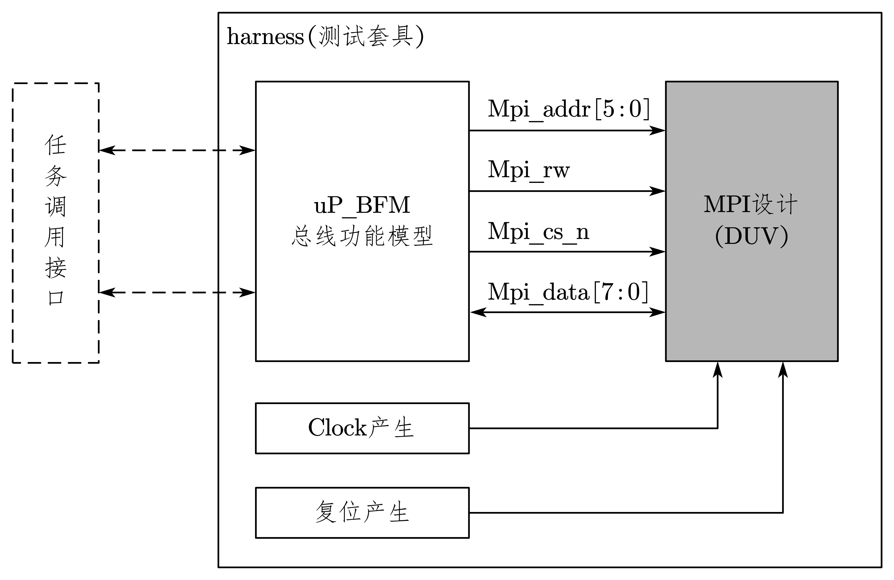{width=600px}

## 4.4. 测试用例

在上一小节中，介绍了测试套具，即 harness。当把被测模块固定好以后，就需要各种各样的测试用例来进行测试，尽量考虑多一些边界条件，保证测试的覆盖率。

测试激励被称为 testcase，如[图 7-26](#fig.7-26) 所示。

<a id="fig.7-26"></a>

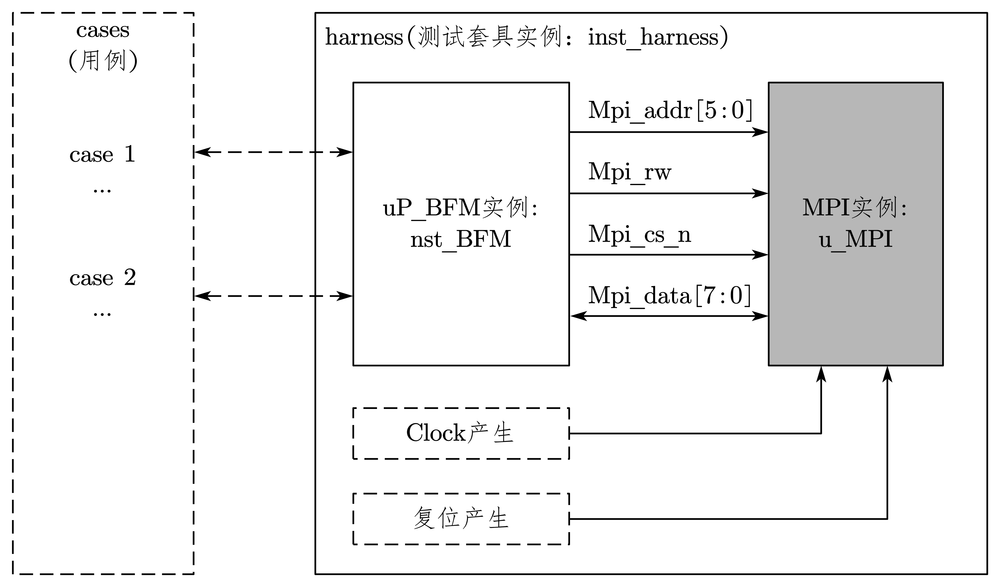{width=700px}

testcase 中的各种用例可以通过图中的虚线箭头来调用 harness 中的任务。关于测试用例和 harness 之间的层次关系，请参考下一小节的内容。

另外，设计测试用例时需要考虑测试用例的可扩展性和独立性。

## 4.5. 结构化 testbench

在这一小节中，将讨论测试用例、harness 的层次关系。

### 4.5.1. 单顶层 testbench

在单顶层的 testbench 中，只有一个顶层。harness 的实例，以及各种测试用例都在顶层中。单顶层的testbench 结构如[图 7-27](#fig.7-27) 所示。

<a id="fig.7-27"></a>

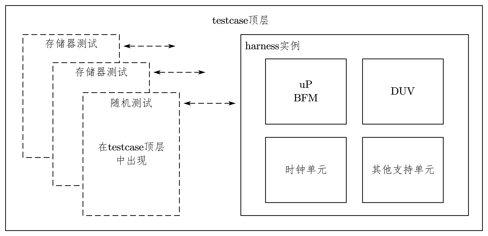{width=650px}

假设 harness 在 testbench 顶层中的实例名叫 `inst_harness`，harness 实例化进来的模块 `uP_BFM` 里面有一个任务 `SEND_DATA`，该任务可以产生激励输入到 DUV，在 testcase 里调用该任务就可写为：

``` verilog
initial begin
    ...
    inst_harness.uP_BFM.SEND_DATA(...);
end
```

### 4.5.2. 多顶层 testbench<a id=toc.4.5.2></a>

Verilog 语言支持多顶层结构。

在多顶层的 testbench 中，通常有一个 harness 顶层，用来实例化设计模块，实例化 BFM，以及提供一些基本的激励，如 `clock` 和复位等。而多个测试用例都可以作为顶层，不同的测试用例用来测试不同的特性或者边界条件。这样的话，如果要增加或减少用例，只需要增加文件或减少文件即可，对现有文件的修改非常少，防止引入人为的错误。多顶层的 testbench 结构如[图 7-28](#fig.7-28) 所示。

<a id="fig.7-28"></a>

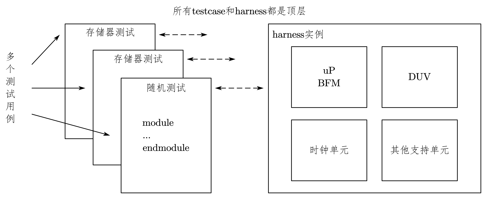{width=750px}

harness 顶层由 DUV 和一些接口模型（BFM）构成一个狭义上的测试平台，其他测试用例模块可以调用 BFM 里面的 `task`、`function` 等，向 DUV 施加激励。

注意这些顶层之间是没有端口映射的，它们之间的互相调用和访问是通过层次路径名的方式来访问，**上图的虚线表示层次路径名的访问**。

下面举例说明层次路径是如何访问的。

由于大部分人对 C 都有所认识，在这里做个比较，便于了解。Verilog HDL 的顶层类似于 C 的结构体，而实例化的模块、任务、函数、变量等就是结构体里的成员，可以通过点 `.` 隔开的方式访问结构体里面的每一个成员。

顶层 harness 实例化进来的模块 `uP_BFM` 里面有一个任务 `SEND_DATA`，该任务可以产生激励输入到 DUV，在每个 testcase 的 module 文件中调用该任务就可写为：

``` verilog
initial begin
    ...
    Harness.uP_BFM.SEND_DATA(...);
end
```

**多顶层结构的可扩展和重用性比单顶层结构强得多**。层次路径的访问方式非常有用，希望大家都能掌握它的用法。

### 4.5.3. testbench 设计思想

验证的完备性对于 testbench 的设计意义非常重大。因此，设计 testbench 时需要清楚究竟要验证什么特性，怎么才能将各种设计的特性转化为设计的激励。

以下是设计一个 testbench 的基本思想和步骤，仅供参考：

- 从需求（SPEC）规格到特性（features）：从设计的规格提取设计的特性；
- 从特性到用例（testcase）：根据设计特性，编写出相应的测试用例来验证该特性；
- 从用例到 testbench：用例测试用例，就可以搭建测试平台（testbench）。

testbench 不是凭空设计的，它的根本起点还是一个设计的需求规格。验证工程师的基本工作，正是要验证逻辑设计工程师的设计是否满足需求规格。

# 5. 实例：结构化 testbench 的编写

以上重点介绍了结构化 testbench 的思想、基本组成部分和优点。在这里，通过两个实例，从理论到实战过渡。

## 5.1. 单顶层 testbench<a id=toc.5.1></a>

单顶层 testbench 结构如[图 7-29](#fig.7-29) 所示。

<a id="fig.7-29"></a>

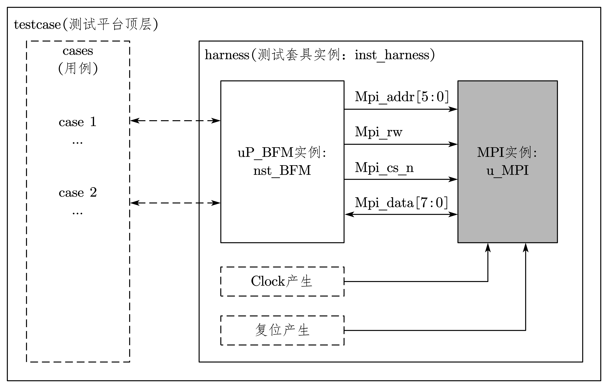{width=600px}

在单顶层 testbench 中，实例化 harness，同时写了两个测试用例来调用 `uP_BFM` 实例中的读/写任务。

其中 harness 中包括 `uP_BFM` 和 `MPI` 设计的实例化模块，以及一些基本的激励。

testcase 顶层代码如下：

``` verilog testcase.v
// testcase.v
// - - - - - - - - - - - - - - - - - - - - - - - - - - - -
//            Verilog Design & Verification
//            EDA Pioneer
// - - - - - - - - - - - - - - - - - - - - - - - - - - - -
`timescale 1ns/100ps
module testcase ;

harness inst_harness ();

reg    [7:0] Data_out;
reg    [7:0] Data_in;

reg    [7:0] DataSource [0:47];
integer      Write_Out_File;

initial begin: MYCASE
    integer i;
    # 222 ;
    // testcase 1:
    for ( i=6'b101111; i>= 0; i=i-1 ) begin
        Data_out = {$random} % 256; //data between 0~255
        inst_harness.inst_BFM.Write(Data_out, i);
        $display ("case1, Addr: %h -> DataWrite: %h", i, Data_out);
        inst_harness.inst_BFM.Read(Data_in, i);
        $display ("case1, Addr: %h -> DataRead: %h", i, Data_in);
        $display ("------------------------");
    end

    $readmemh ( "Read_In_File.txt", DataSource );
    Write_Out_File = $fopen("Write_Out_File.txt");
    // testcase 2
    for ( i=6'b101111; i>= 0; i=i-1 ) begin
        Data_out = DataSource[i] ;
        inst_harness.inst_BFM.Write(Data_out, i);
        $display ("case2, Addr: %h -> DataWrite: %h", i, Data_out);
        inst_harness.inst_BFM.Read(Data_in, i);
        $display ("case2, Addr: %h -> DataRead: %h", i, Data_in);
        $display ("------------------------");
        $fdisplay (Write_Out_File, "@%h\n%h", i, Data_in);
    end
    $fclose ( Write_Out_File );
    $display ("Simulation Finished!");
    $stop;
end

endmodule
```

harness 的模块结构如下：

``` verilog harness.v
// harness.v
// - - - - - - - - - - - - - - - - - - - - - - - - - - - -
//            Verilog HDL Design & Verification
//            EDA Pioneer
// - - - - - - - - - - - - - - - - - - - - - - - - - - - -
`timescale 1ns/100ps
module harness ;

// Clock Stimulus generation
...
// Reset Stimulus generation
...
tri  [7:0] Mpi_data;
wire [5:0] Mpi_addr ;
wire       Mpi_cs_n;
wire       Mpi_rw;

// BFM模块实例
uP_BFM inst_BFM (
    .uP_data    (Mpi_data   ),
    .uP_addr    (Mpi_addr   ),
    .uP_cs_n    (Mpi_cs_n   ),
    .uP_rw      (Mpi_rw     )
    );

// MPI设计模块实例
MPI u_MPI (
    .Clock      (Clock      ),
    .Rst_n      (Rst_n      ),
    .Mpi_data   (Mpi_data   ),
    .Mpi_addr   (Mpi_addr   ),
    .Mpi_cs_n   (Mpi_cs_n   ),
    .Mpi_rw     (Mpi_rw )
    ) ;

endmodule
```

注意到，在 testcase 顶层中，harness 的实例名为 `inst_harness`，而在 harness 中，`uP_BFM` 的实例名为 `inst_BFM`。因此，测试用例中调用 `uP_BFM` 中的 `Write` 和 `Read` 任务时，采用如下方法：

``` verilog
inst_harness.inst_BFM.Write(Data_out, i);   // Data_out 为写数据, i 为写地址
inst_harness.inst_BFM.Read(Data_in, i);   // Data_in 为读数据, i 为读地址
```

关于具体的仿真步骤请参考 [3.2 小节](#toc.3.2)中的操作步骤。工程文件在本文[附带资源][]中的 `Example-7-3` 目录中。仿真运行结果打印如下：

``` log
# case1, Addr: 0000002f -> DataWrite: 24
# case1, Addr: 0000002f -> DataRead: 24
# ------------------------
# case1, Addr: 0000002e -> DataWrite: 81
# case1, Addr: 0000002e -> DataRead: 81
# ------------------------
...
# case2, Addr: 0000002f -> DataWrite: 24
# case2, Addr: 0000002f -> DataRead: 24
# ------------------------
# case2, Addr: 0000002e -> DataWrite: 81
# case2, Addr: 0000002e -> DataRead: 81
# ------------------------
...
```

这里的 `case1` 就是延用 [3.2 小节](#toc.3.2)中的测试激励，数据源为随机数。而 `case2` 就是 [3.3 小节](#toc.3.3)中的测试激励，数据源是从文件 `Read_In_File.txt` 中读出的。这里将两种数据的测试用例合并到一个文件的不同用例下，检查仿真结果的方法也相同。

## 5.2. 多顶层 testbench

多顶层 testbench 结构如[图 7-30](#fig.7-30) 所示，多个 testcase 文件都可以调用 harness 中的读/写任务。

<a id="fig.7-30"></a>

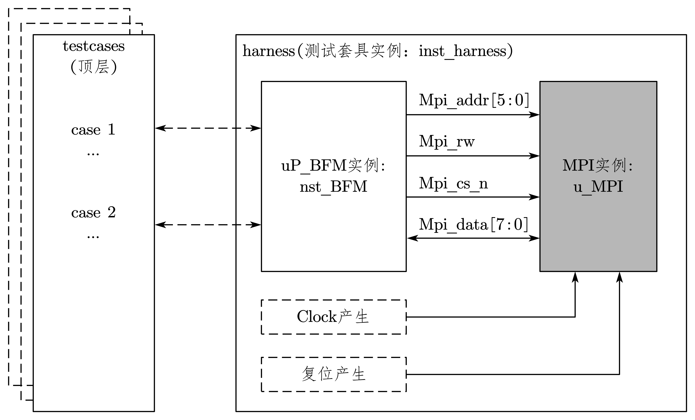{width=600px}

在 testcase 代码中，如果需要调用 harness 下 `uP_BFM` 实例中的读/写任务，则需要在 testcase 中写类似如下代码：

``` verilog
harness.inst_BFM.Write(Data_out, i);   // Data_out 为写数据. i 为写地址
harness.inst_BFM.Read(Data_in, i);     // Data_in 为读数据. i 为读地址
```

> ModelSim 中调用多个顶层仿真的命令： `vsim-L altera_mf testcase harness`。

在多顶层的结构中，harness 代码是不变的，只有 testcase 需要做相应的修改。代码修改如下：

``` verilog testcase.v
// testcase.v
// - - - - - - - - - - - - - - - - - - - - - - - - - - - -
//            Verilog Design & Verification
//            EDA Pioneer
// - - - - - - - - - - - - - - - - - - - - - - - - - - - -
`timescale 1ns/100ps
module testcase ;

//harness inst_harness ();

reg    [7:0] Data_out;
reg    [7:0] Data_in;

reg    [7:0] DataSource [0:47];
integer      Write_Out_File;

initial
begin: MYCASE
    integer i;
    # 222 ;
    // testcase 1:
    for ( i=6'b101111; i>= 0; i=i-1 ) begin
        Data_out = {$random} % 256; //data between 0~255
        harness.inst_BFM.Write(Data_out, i);
        $display ("case1, Addr: %h -> DataWrite: %h", i, Data_out);
        harness.inst_BFM.Read(Data_in, i);
        $display ("case1, Addr: %h -> DataRead: %h", i, Data_in);
        $display ("------------------------");
    end

    $readmemh ( "Read_In_File.txt", DataSource );
    Write_Out_File = $fopen("Write_Out_File.txt");
    // testcase 2
    for ( i=6'b101111; i>= 0; i=i-1 ) begin
        Data_out = DataSource[i] ;
        harness.inst_BFM.Write(Data_out, i);
        $display ("case2, Addr: %h -> DataWrite: %h", i, Data_out);
        harness.inst_BFM.Read(Data_in, i);
        $display ("case2, Addr: %h -> DataRead: %h", i, Data_in);
        $display ("------------------------");
        $fdisplay (Write_Out_File, "@%h\n%h", i, Data_in);
    end
    $fclose ( Write_Out_File );
    $display ("Simulation Finished!");
    $stop;
end

endmodule
```

容易发现，在本例中，testcase 调用 harness 中的任务格式如下：

``` verilog
harness.inst_BFM.Write(Data_out, i);    // 直接引用 harness 模块名
```

而在 [5.1 小节](#toc.5.1)的单顶层 testbench 中格式如下：

``` verilog
inst_harness.inst_BFM.Write(Data_out, i);  // 引用 harness 在 testcase 中的实例名: inst_harness
```

具体的仿真步骤请参考 [3.2 小节](#toc.3.2)中的操作步骤。工程文件在本文[附带资源][]中的 `Example-7-4` 目录中。

# 6. 扩展 Verilog 的高层建模能力

一些 Verilog 的高级用户在使用 Verilog 编写 testbench 时常常感到它的文件输入/输出操作，以及高级抽象的数学功能比 C 语言要弱，毕竟 Verilog 是硬件描述语言。

不过，Verilog 还是开放了一个接口叫 **PLI**（编程语言接口），专门用来和 C 语言的程序通信。这样，借助 PLI，Verilog 的高层次建模的不足就得到了弥补。

目前，业界绝大部分的仿真器都支持PLI。

这里简单说明一下PLI 如何工作。例如，在 PC 上运行了一个 Verilog 的仿真器，同时还运行了一个 C 语言编写的应用程序。该 C 应用程序可以通过 PC 的一个内存空间与 Verilog 仿真器交换数据。比如应用程序产生的激励可以放在内存中，等待仿真器取走数据后，将结果写回。应用程序再将写回的结果取走。这样完成了一个由 C 应用程序扩展Verilog 语言能力的过程。

关于PLI，这里不再详述，感兴趣可以参考其他文献。

# 7. 小结

在本篇笔记中，介绍了验证和仿真的基本概念。重点叙述了如何建立 testbench 、如何搭建仿真环境以及如何确认仿真结果。

通过一个 CPU 接口的设计，介绍了 testbench 的设计方法、结构化的 testbench 。希望大家能通过实例熟练掌握 testbench 的设计方法。

另外补充一点，testbench 是**可以继承的**。虽然在本篇笔记中，重点放在 RTL 级的代码仿真上，但同样的 testbench 在门级仿真或者后仿真阶段，也可以使用。

# 参考文献

EDA 先锋工作室. *轻松成为设计高手——Verilog HDL 实用精解.* 北京航空航天大学出版社, 2012.

[Part 3——描述方式和设计层次的 5.1 系统级和行为级]: https://josh-gao.top/posts/fd117896.html#toc.5.1
[《Josh 的学习笔记之 Verilog》]: https://josh-gao.top/categories/Josh-%E7%9A%84%E5%AD%A6%E4%B9%A0%E7%AC%94%E8%AE%B0/Verilog/
[附带资源]: https://download.csdn.net/download/weixin_43870101/12451000
