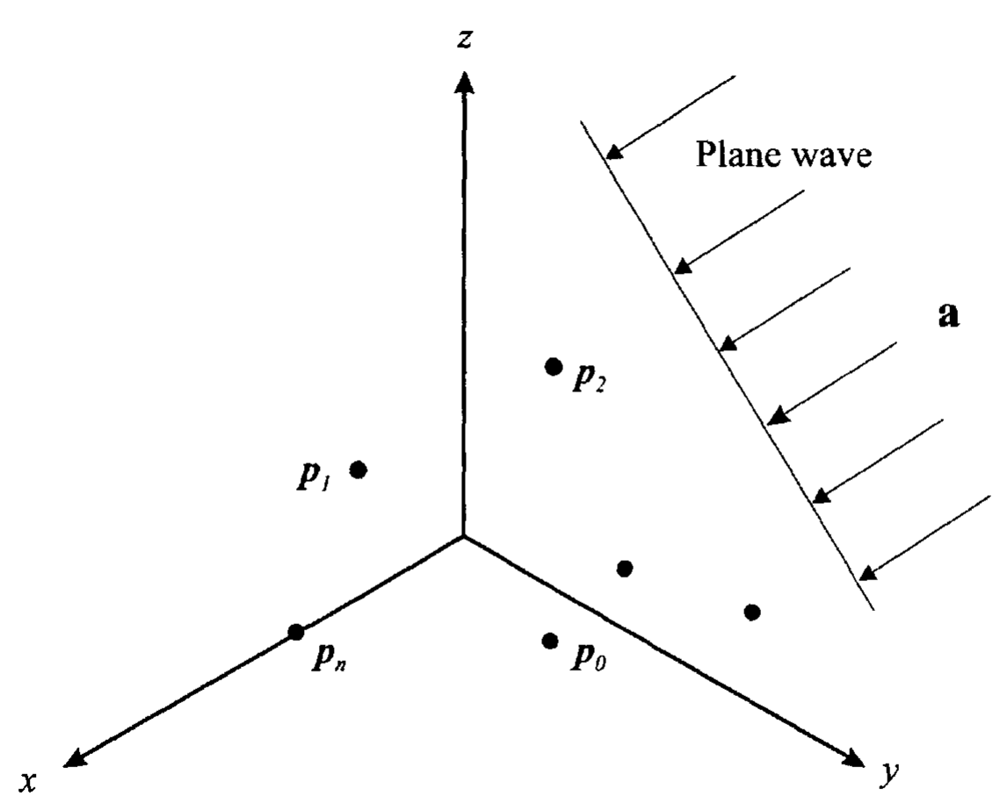
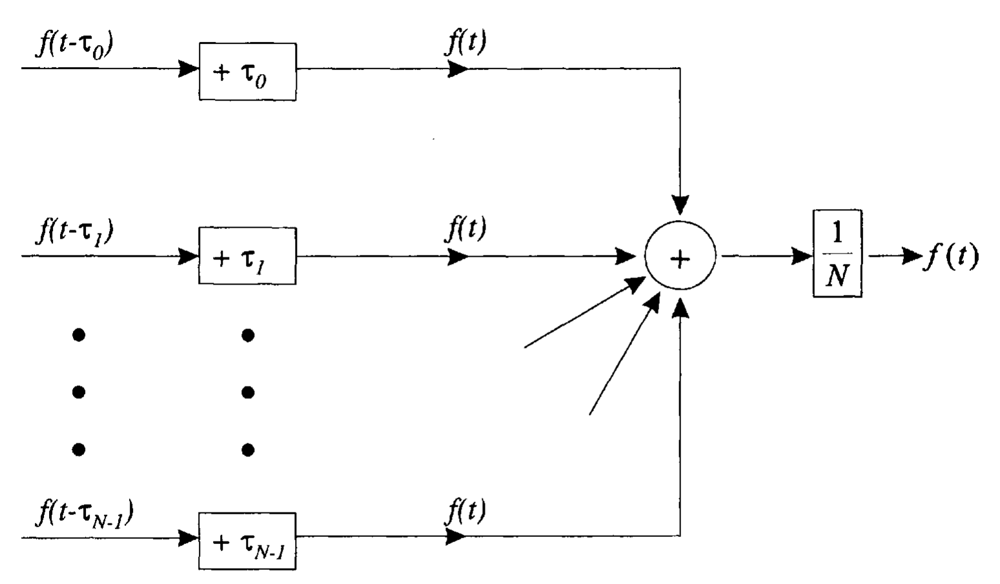
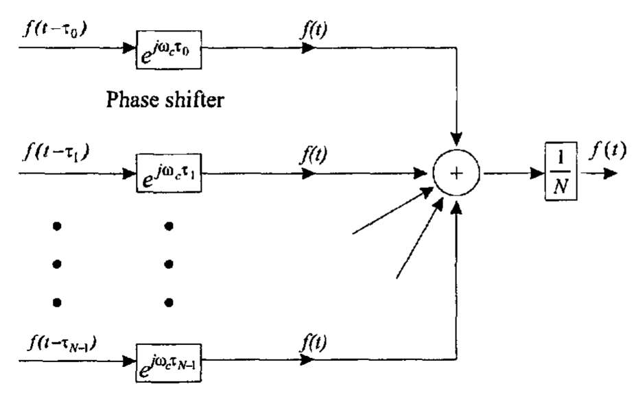
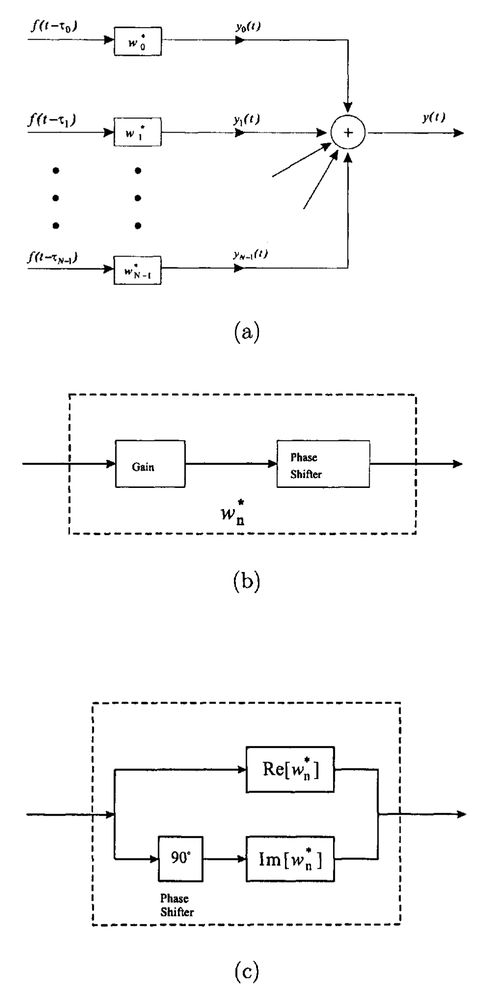

&emsp;&emsp;假设空时场（space-time field）同时存在信号（signal）、噪声（noise）和/或干扰（interference），这些信号/干扰空时场中可能是重叠的。阵列（Array）可以利用信号的空域特征，对空时场域内的信号进行滤波，过滤的过程可以用角度或波数的函数来表示（in terms of a dependence upon angle or wavenumber）。从频域看，这种滤波通过使用复增益（complex gain）对阵列输出进行加权，可以根据信号的空域相关性对信号进行增强或抑制。对空时场进行空域滤波的目的是：使从一个或一组特定角度到来的信号通过有效的组合得到增强，抑制从其他角度到来的噪声或干扰。

{width=600px}

&emsp;&emsp;在分析之前首先需要明确采用的坐标系，如[图 1-1-1](#fig.1-1-1) 所示，直角坐标系和球坐标系的关系也在其中标明：

$$\begin{equation}
\begin{aligned}
x &= r \sin\theta\cos\varphi \\
y &= r \sin\theta\sin\varphi \\
z &= r \cos\theta
\end{aligned}
\end{equation}$$

<!-- more -->

# 阵列的基本模型

{width=600px}

&emsp;&emsp;下面分析一个阵列对外部信号场的响应。阵列由一组全向阵元组成，阵元的位置为 $\left\{ \boldsymbol{p}_n \right\}_{n=0}^{N-1}$，如[图 1-1-2](#fig.1-1-2) 所示。阵列在各阵元处对信号场进行采样，产生一组信号，记为矢量 $\boldsymbol{f}\left(t, \boldsymbol{p}\right)$

$$\begin{equation}
\boldsymbol{f}(t, \boldsymbol{p}) = \left[
  \begin{array}{c}
    f\left(t, \boldsymbol{p}_0\right) \\
    f\left(t, \boldsymbol{p}_1\right) \\
    \vdots \\
    f\left(t, \boldsymbol{p}_{N-1}\right) \\
  \end{array}
\right]
\end{equation}$$



注意，这里并没有规定阵列的几何排布，因此下面的分析适用于所有阵列结构。



{width=600px}

&emsp;&emsp;将每个阵元的输出（即采样结果）通过冲激响应为 $h_n(t)$ 的线性时不变滤波器，求和可得阵列的输出 $y(t)$，如[图 1-1-3](#fig.1-1-3) 所示。假设观察间隔足够长（可以考虑为无限长），则阵列输出 $y(t)$ 可以写成卷积积分的形式：

$$\begin{equation}
y(t) = \sum_{n=0}^{N-1} \int_{-\infty}^{\infty} h_n (t-\tau)f\left(\tau,\boldsymbol{p}_n\right) \mathrm{d} \tau
\end{equation}$$

用矢量符号表示为（即将标量结果向矢量模型进行直接扩展，a straightforward extension of scalar results to the vector model）

$$\begin{equation} \label{VectorFormOfLinearArrayOutputInTimeDomain}
y(t) = \int_{-\infty}^{\infty} \boldsymbol{h}^\mathrm{T} (t-\tau) \boldsymbol{f}\left(\tau,\boldsymbol{p}\right) \mathrm{d} \tau
\end{equation}$$

其中

$$\begin{equation} \label{ImpulseResponse}
\boldsymbol{h}(t) = \left[ \begin{array}{c}
  h_0(t) \\
  h_1(t) \\
  \vdots \\
  h_{N-1}(t)
\end{array}
\right]
\end{equation}$$

也可以把式 $\eqref{VectorFormOfLinearArrayOutputInTimeDomain}$ 给出的阵列输出在变换域表示为

$$\begin{equation}
  Y(\omega) = \boldsymbol{H}^\mathrm{T}(\omega) \boldsymbol{F}(\omega)
\end{equation}$$

其中

$$\begin{equation}
\boldsymbol{H} (\omega) = \int_{-\infty}^{\infty} \boldsymbol{h}(t)  e^{-j\omega t} \mathrm{d} t
\end{equation}$$

$$\begin{equation} \label{SampleVectorInFreqDomain}
\boldsymbol{F} \left(\omega,\boldsymbol{p}\right) = \int_{-\infty}^{\infty} \boldsymbol{f}\left(t,\boldsymbol{p}\right)  e^{-j\omega t} \mathrm{d} t
\end{equation}$$

在大多数情况下，可以去掉式 $\eqref{SampleVectorInFreqDomain}$ 中左边的 $\boldsymbol{p}$，直接使用 $\boldsymbol{F}(\omega)$ 。

# 信号到达不同阵元的时延

&emsp;&emsp;下面考虑如[图 1-1-4](#fig.1-1-4) 所示的简单的波束形成操作。假设外部信号是方向为 $\boldsymbol{a}$、时域频率（弧度）为 $\omega$ 的平面波，则在时域上每个阵元的输入信号可以用两种等效的方式进行表示。

{width=600px}

&emsp;&emsp;由于信号到达不同阵元的时间不同，设 $f(t)$ 是**在坐标系原点接收到的信号**，其在变换域表示为 $F (\omega)$，则

$$\begin{equation} \label{DelayedSignal}
  \boldsymbol{f}(t, \boldsymbol{p}) = \left[
    \begin{array}{c}
      f\left(t - \tau_0\right) \\
      f\left(t - \tau_1\right) \\
      \vdots \\
      f\left(t - \tau_{N-1}\right) \\
    \end{array}
  \right]
\end{equation}$$

其中时延（距离除以速度得到时间）

$$\begin{equation} \label{ExpressionOfDelayByDirection}
  \tau_n = \frac{\boldsymbol{a}^\mathrm{T}\boldsymbol{p}_n}{c}
\end{equation}$$

其中 $c$ 是信号在介质中的传播速度，$\boldsymbol{a}$ 是一个单位矢量，表示为

$$\begin{equation}
  \boldsymbol{a} = \left[ \begin{array}{c}
    -\sin\theta\cos\varphi \\
    -\sin\theta\sin\varphi \\
    -\cos\theta
  \end{array} \right]
\end{equation}$$

上式中的负号是考虑了 $\boldsymbol{a}$ 的方向。则 $\tau_n$ 可以进一步表示为：

$$\begin{equation} \label{RelativeDelay}
  \tau_n = -\frac{1}{c}\left(\sin\theta\cos\varphi \cdot p_{x_n} + \sin\theta\sin\varphi \cdot p_{y_n} + \cos\theta \cdot p_{z_n} \right)
\end{equation}$$

如果定义对于每个轴的方向余弦（direction cosine）为

$$\begin{align}
  u_x &= \sin\theta\cos\varphi \\
  u_y &= \sin\theta\sin\varphi \\
  u_z &= \cos\theta
\end{align}$$

则有

$$\begin{equation}
  \boldsymbol{u} = -\boldsymbol{a}
\end{equation}$$

则式 $\eqref{RelativeDelay}$ 给出的相对时延可以写成

$$\begin{equation} \label{RelativeDelayWithDirectionCosine}
   \tau_n = -\frac{1}{c}\left(u_x p_{x_n} + u_y p_{y_n} + u_z p_{z_n} \right) = -\frac{\boldsymbol{u}^\mathrm{T}\boldsymbol{p}_n}{c}
\end{equation}$$

根据式 $\eqref{DelayedSignal}$，$\boldsymbol{F}(\omega)$ 的第 $n$ 个分量为（利用 Fourier 变换的时移性质）

$$\begin{equation}
  F_n(\omega) = \int_{-\infty}^{\infty} e^{j \omega t} f_n(t - \tau_n) \mathrm{d} t = e^{j \omega \tau_n} F (\omega)
\end{equation}$$

其中

$$\begin{equation}
  \omega \tau_n = \frac{\omega}{c} \boldsymbol{a}^\mathrm{T}\boldsymbol{p}_n = -\frac{\omega}{c} \boldsymbol{u}^\mathrm{T}\boldsymbol{p}_n
\end{equation}$$

对于在局部均匀的介质（locally homogeneous medium）里传播的平面波，定义波数 $\boldsymbol{k}$ （在波传播的方向上单位长度内的周期数目）为

$$\begin{equation} \label{DefinitionOfWavenumber}
  \boldsymbol{k} = \frac{\omega}{c} \boldsymbol{a} = \frac{2\pi}{\lambda} \boldsymbol{a} = -\frac{2\pi}{\lambda} \left[
    \begin{array}{c}
    \sin\theta\cos\varphi \\
    \sin\theta\sin\varphi \\
    \cos\theta
    \end{array}
  \right]
  = -\frac{2\pi}{\lambda} \boldsymbol{u}
\end{equation}$$

其中，$\lambda$ 是对应于频率 $\omega$ 的波长，且波数的幅度由波动方程限定

$$\begin{equation} \label{WaveEquation}
  \left| \boldsymbol{k} \right| = \frac{\omega}{c} = \frac{2\pi}{\lambda}
\end{equation}$$

所以，仅 $\boldsymbol{k}$ 的方向是变化的。比较式 $\eqref{ExpressionOfDelayByDirection}$ 和式 $\eqref{DefinitionOfWavenumber}$，有

$$\begin{equation}
  \omega \tau_n = \boldsymbol{k}^\mathrm{T}\boldsymbol{p}_n
\end{equation}$$

定义

$$\begin{equation} \label{DefinitionOfArrayManifoldVector}
  \boldsymbol{v}_{\boldsymbol{k}}\left(\boldsymbol{k}\right) = \left[ \begin{array}{c}
    e^{-j \boldsymbol{k}^\mathrm{T}\boldsymbol{p}_0} \\
    e^{-j \boldsymbol{k}^\mathrm{T}\boldsymbol{p}_1} \\
    \vdots \\
    e^{-j \boldsymbol{k}^\mathrm{T}\boldsymbol{p}_{N-1}} \\
  \end{array} \right]
\end{equation}$$

则 $\boldsymbol{F}(\omega)$ 可写为

$$\begin{equation}
  \boldsymbol{F}(\omega) = F(\omega) \boldsymbol{v}_{\boldsymbol{k}}\left(\boldsymbol{k}\right)
\end{equation}$$

矢量 $\boldsymbol{v}_{\boldsymbol{k}}\left(\boldsymbol{k}\right)$ 包含了阵列的所有空间特征，称为****，在阵列信号处理理论中具有非常核心的作用。下标 $\boldsymbol{k}$ 表示参数属于 $\boldsymbol{k}$ 空间。这个下标的作用是把它和以后将在阵列流形矢量中使用的其他变量相区分。

{width=600px}

&emsp;&emsp;如[图 1-1-5](#fig.1-1-5) 所示，把每个阵元的输入信号进行时移、相加、归一化，使得输出为 $f(t)$，其中

$$\begin{equation} \label{DelayAndSumBeamformer}
  h_n(\tau) = \frac{1}{N} \delta(\tau + \tau_n)
\end{equation}$$

且

$$\begin{equation}
  y(t) = f(t)
\end{equation}$$

上述处理器称为****或****。在实际中会在每个通道中加上一个共同的延时，使得[图 1-1-5](#fig.1-1-5) 中的操作是物理可实现的。

&emsp;&emsp;此外，还可以把式 $\eqref{DelayAndSumBeamformer}$ 在频域内写成简洁的矩阵形式。如果 $\boldsymbol{k}_\mathrm{s}$ 是我们所感兴趣的平面波信号的波数，则

$$\begin{equation}
  \boldsymbol{H}^\mathrm{T} (\omega) = \frac{1}{N} \boldsymbol{v}_{\boldsymbol{k}}^\mathrm{H} \left( \boldsymbol{k}_\mathrm{s} \right)
\end{equation}$$

# 单位平面波模型

&emsp;&emsp;更一般的，要确定阵列对一个输入信号场 $\boldsymbol{f}(t, \boldsymbol{p})$ 的响应，可以通过之前给出的卷积求和操作来实现，但更有用的方法是确定阵列对单位平面波（unit plane wave）的响应，将响应表示为时域（弧度）频率 $\omega$ 和波数 $\boldsymbol{k}$ 的函数，然后将线性时不变系统中复指数基函数叠加分析的系统理论方法扩展到空时信号的情况。

&emsp;&emsp;取基函数

$$\begin{equation}
  f_n\left( t, \boldsymbol{p}_n \right) = \exp \left[ j \left( \omega t - \boldsymbol{k}^\mathrm{T} \boldsymbol{p}_n\right) \right], \, n = 0, 1, \cdots, N-1
\end{equation}$$

或

$$\begin{equation}
  \boldsymbol{f} \left( t, \boldsymbol{p} \right) = e^{j\omega t} \boldsymbol{v}_{\boldsymbol{k}}\left(\boldsymbol{k}\right)
\end{equation}$$

&emsp;&emsp;式 $\eqref{VectorFormOfLinearArrayOutputInTimeDomain}$ 中的阵列处理器对于一个平面波的响应为

$$\begin{equation} \label{ArrayResponseToUnitPlaneWaveInTimeDomain}
  y \left( t, \boldsymbol{k} \right) = \boldsymbol{H}^\mathrm{T} (\omega) \boldsymbol{v}_{\boldsymbol{k}}\left(\boldsymbol{k}\right) e^{j\omega t}
 \end{equation}$$

其中 $\boldsymbol{H} (\omega)$ 是式 $\eqref{ImpulseResponse}$ 中 $\boldsymbol{h}(t)$ 的傅里叶变换。

&emsp;&emsp;这里使用 $y \left( t, \boldsymbol{k} \right)$ 来强调输出和输入波数 $\boldsymbol{k}$ 的关系。时域上的相关性体现在输出是一个复指数，和输入平面波具有相同的频率。在频域内，$\eqref{ArrayResponseToUnitPlaneWaveInTimeDomain}$ 可以写成下面的形式：

$$\begin{equation} \label{ArrayResponseToUnitPlaneWaveInFreqDomain}
  Y \left( \omega, \boldsymbol{k} \right) = \boldsymbol{H}^\mathrm{T} (\omega) \boldsymbol{v}_{\boldsymbol{k}}\left(\boldsymbol{k}\right)
 \end{equation}$$

&emsp;&emsp;注意，$\omega$ 是对应输入频率的单一频率。阵列的空时处理完全可以由式 $\eqref{ArrayResponseToUnitPlaneWaveInFreqDomain}$ 的右端描述。把这一项定义为

$$\begin{equation} \label{FrequencyWavenumberResponse}
  \boxed{\boldsymbol{\varUpsilon} \left( \omega, \boldsymbol{k} \right) \triangleq \boldsymbol{H}^\mathrm{T} (\omega) \boldsymbol{v}_{\boldsymbol{k}}\left(\boldsymbol{k}\right)}
\end{equation}$$

称之为阵列的****。它描述了一个阵列对于波数为 $\boldsymbol{k}$、时域频率为 $\omega$ 的输入平面波的复增益，具有与线性、时不变系统的传递函数相同的解释（这里我们用了 $\boldsymbol{\varUpsilon} \left( \omega, \boldsymbol{k} \right)$, 是因为 $Y \left( \omega, \boldsymbol{k} \right)$ 在后面将要用于描述对任意输入的输出）。 $\boldsymbol{\varUpsilon} \left( \omega, \boldsymbol{k} \right)$ 是定义在整个 $\boldsymbol{k}$ 空间上的。$\eqref{FrequencyWavenumberResponse}$ 中的第二项 $\boldsymbol{v}_{\boldsymbol{k}}\left(\boldsymbol{k}\right)$ 是在式 $\eqref{DefinitionOfArrayManifoldVector}$ 中定义的阵列流形矢量。

&emsp;&emsp;频率-波数响应函数描述了阵列对任意一个平面波的响应。在大多数的实际物理应用中，时域频率 $\omega$ 和空域波数 $\boldsymbol{k}$ 通过平面波传播的波动方程形成了耦合关系。有时这是一个非常简单的关系，例如当一个平而波在均匀（且无限）的空间中传播时。在其他的情况下，可能是非常复杂的耦合关系，例如在水下声学和地震学中的分层介质模型中的情况。

&emsp;&emsp;一个阵列的****定义的背景是平面波在局部均匀的介质中传播，约束的波动方程见式 $\eqref{WaveEquation}$。如式 $\eqref{WaveEquation}$ 所示，这约束了波数 $\boldsymbol{k}$ 的幅度。波束方向图是用入射方向表示的频率-波数响应函数，或者可以写成

$$\begin{equation}
  B(\omega:\theta,\varphi) = \left. \boldsymbol{\varUpsilon} \left( \omega, \boldsymbol{k} \right) \right|_{\boldsymbol{k}=\frac{2\pi}{\lambda}\boldsymbol{a}(\theta,\varphi)}
\end{equation}$$

其中 $\boldsymbol{a}(\theta,\varphi)$ 是一个单位矢量，在球坐标系中对应的角度为 $\theta$ 和 $\varphi$。可以看到，**波束方向图是频率-波数响应在一个半径为 $2\pi /\lambda$ 的球上的值**。

&emsp;&emsp;阵列的波束方向图是确定阵列性能的关键要素。后续将会研究均匀加权线阵（uniformly weighted linear array）的波束方向图。

# 窄带假设

&emsp;&emsp;下面讨论 $f\left( t,\boldsymbol{p}_n \right)$ 是带通信号的情况，即

$$\begin{equation} \label{BandpassConstraint}
  f\left( t,\boldsymbol{p}_n \right) = \sqrt{2} \Re\left\{ \tilde{f} \left( t,\boldsymbol{p}_n \right)  e^{j \omega_c t}\right\}, \, n = 0, \cdots, N-1
\end{equation}$$

其中，$\omega_c$ 是载波频率，$\tilde{f} \left( t,\boldsymbol{p}_n \right)$ 是复包络。假设复包络的带限区域为

$$\begin{equation}
  \left| \omega_L \right| \leqslant 2\pi B_s /2
\end{equation}$$

其中

$$\begin{equation}
  \omega_L \triangleq \omega - \omega_c
\end{equation}$$

且 $\pi B_s$ 是一个常数，确定了复包络的最大带宽。

&emsp;&emsp;对于式 $\eqref{DelayedSignal}$ 中的平面波，式 $\eqref{BandpassConstraint}$ 成为

$$\begin{equation} \label{BandpassConstraintApproximation}
  f\left( t,\boldsymbol{p}_n \right) = \sqrt{2} \Re\left\{ \tilde{f} \left( t - \tau_n \right)  e^{j \omega_c \left( t - \tau_n \right)}\right\}, \, n = 0, \cdots, N-1
\end{equation}$$

其中，$\tau_n$ 由式 $\eqref{RelativeDelayWithDirectionCosine}$ 给出。

&emsp;&emsp;现在考虑信号跨越阵列传播的时间（the travel time across the array）。定义 $\Delta T_{nm} \left( \boldsymbol{u} \right)$ 为一个方向余弦为 $\boldsymbol{u}$ 的平面波在第 $n$ 个阵元和第 $m$ 个阵元之间的传播时间。则，

$$\begin{equation}
  \Delta T_{\max} \triangleq \max_{n,m=0,\cdots,N-1;\boldsymbol{u}} \{\Delta T_{nm} \left( \boldsymbol{u} \right)\}
\end{equation}$$

是阵列的任意两个阵元之间的最大传播时间。对于一个线阵，这个最大值是当一个信号沿着阵列的轴线传播时（endfire），阵列两端阵元之间的传播时间。

&emsp;&emsp;假设原点位于阵列的重心，即

$$\begin{equation}
  \sum_{n=0}^{N-1} \boldsymbol{p}_n = 0
\end{equation}$$

则式 $\eqref{RelativeDelayWithDirectionCosine}$ 给出的所有 $\tau_n$ 均满足

$$\begin{equation}
  \tau_n \leqslant \Delta T_{\max},\, n = 0, \cdots, N-1
\end{equation}$$

&emsp;&emsp;在我们感兴趣的大多数情况下，复包络的带宽非常小，满足

$$\begin{equation}
  \tilde{f}(t - \tau_n) \simeq \tilde{f}(t),\, n = 0, \cdots, N-1
\end{equation}$$

为了使上述近似有效，需要有

$$\begin{equation} \label{NarrowBandConstraint}
  B_\mathrm{s}\cdot \Delta T_{\max} \ll 1
\end{equation}$$

定义复包络满足式 $\eqref{NarrowBandConstraint}$ 的带通信号为****。后面我们会在有关最优处理器的内容中重新研究这个定义，并给出一个更好的量化的讨论。现在，直接采用式 $\eqref{NarrowBandConstraint}$ 。则式 $\eqref{BandpassConstraintApproximation}$ 简化为

$$\begin{equation}
  f\left( t,\boldsymbol{p}_n \right) = \sqrt{2} \Re\left\{ \tilde{f} \left( t \right)  e^{-j \omega_c \tau_n} e^{j \omega_c t } \right\}
\end{equation}$$

可以看到，在窄带的情况下，信号的延时可以用一个相移来近似。所以延时-求和波束形成器可以用一组移相器来代替延时线。结果得到的波束形成器在[图 1-1-6](#fig.1-1-6) 中给出。这种实现方式通常称为****，并在实际中得到了广泛的应用。

{width=600px}

&emsp;&emsp;可以发现，在很多的应用中，我们都想要调整每个传感器输出的增益和相位，以得到一个理想的波束方向图。这就产生了在[图 1-1-6(a)](#fig.1-1-6) 中给出的窄带模型。$w_n^\ast$ 是复权值，可以用一个增益和移相器的级联来实现，如[图 1-1-6(b)](#fig.1-1-6) 所示。

{width=600px}

&emsp;&emsp;另外一种实现的结构见[图 1-1-6(c)](#fig.1-1-6)。在一些情况下，我们利用正交解调，并在对基带信号进行复加权来实现波束形成器，实际是在一个正交分量上使用 $\Re[w_n^\ast]$ 进行加权，在另外一个正交分量上使用 $\Im[w_n^\ast]$ 进行加权，结果是相等的。

&emsp;&emsp;定义一个复数权矢量为

$$\begin{equation} \label{ComplexWeightVector}
  \boldsymbol{w}^\mathrm{H} = [w_0^\ast, w_1^\ast, \cdots, w_{N-1}^\ast]
\end{equation}$$

则式 $\eqref{ArrayResponseToUnitPlaneWaveInTimeDomain}$ 成为

$$\begin{equation}
  y\left( t,\boldsymbol{k} \right) = \boldsymbol{w}^\mathrm{H} \boldsymbol{v}_{\boldsymbol{k}}\left( \boldsymbol{k} \right) e^{j\omega t}
\end{equation}$$

且

$$\begin{equation}
  \varUpsilon \left(\omega, \boldsymbol{k} \right) = \boldsymbol{w}^\mathrm{H} \boldsymbol{v}_{\boldsymbol{k}}\left( \boldsymbol{k} \right)
\end{equation}$$

式 $\eqref{ComplexWeightVector}$ 中的定义等价于

$$\begin{equation}
  \boldsymbol{w}^\mathrm{H} = \boldsymbol{H}^\mathrm{T}(\omega_c)
\end{equation}$$

这里主要关注的是窄带模型，对于宽带信号，一种处理方法是利用离散傅里叶变换（DFT）把信号分解到更窄的频率柜 （frequency bin），每个频率柜内的信号是满足窄带条件的，因此所有的窄带结果可以直接得到应用。

# 参考文献

1. Van Trees, Harry L. *Optimum array processing: Part IV of detection, estimation, and modulation theory.* John Wiley & Sons, 2002.
2. Van Trees, Harry L, 汤俊. *最优阵列处理技术.* 清华大学出版社. 2008.
