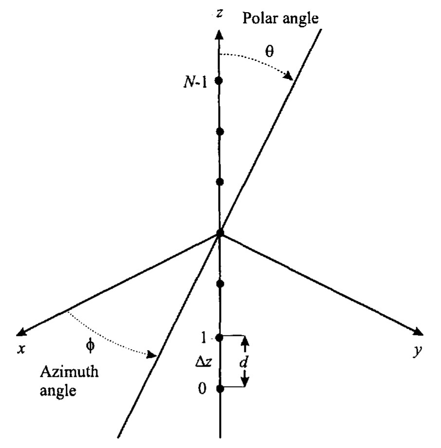

# 均匀线阵的基本模型

&emsp;&emsp;****如[图 1-2-1](#fig.1-2-1) 所示，其中有 $N$ 个位于 $z$ 轴上的阵元，阵元间距均匀，记为 $d$；这里将阵列的中心放在了坐标系的原点上，这种放置方法可以简化计算量。

{width=600px}

<!-- more -->

&emsp;&emsp;如[图 1-2-1](#fig.1-2-1)，阵元的位置为

$$\begin{equation} \label{ElementLocation}
\begin{cases}
  p_{x_n} = 0 \\
  p_{y_n} = 0 \\
  p_{z_n} = \left( n - \frac{N-1}{2} \right) d
\end{cases}
  , \, n = 0,1,\cdots,N-1
\end{equation}$$

为了确定阵列流形矢量 $\boldsymbol{v}_{\boldsymbol{k}}\left(\boldsymbol{k}\right)$，把式 $\eqref{ElementLocation}$ 代入到[阵列流形矢量的定义][]中，得到

$$\begin{equation} \label{ManifoldVectorOfULA}
  \boldsymbol{v}_{\boldsymbol{k}}\left(k_z\right) = \left[\begin{array}{c}
    e^{j \left( \frac{N-1}{2} \right) k_z d} \\
    e^{j \left( \frac{N-1}{2} - 1\right) k_z d} \\
    \vdots \\
    e^{-j \left( \frac{N-1}{2} \right) k_z d} \\
  \end{array}\right]
\end{equation}$$

这里

$$\begin{equation}
  k_z = -\frac{2\pi}{\lambda}\cos\theta = -k_0 \cos\theta
\end{equation}$$

其中波数的幅度

$$\begin{equation}
  k_0 \triangleq \left| \boldsymbol{k} \right| = \frac{2\pi}{\lambda}
\end{equation}$$

注意，线阵在 $\varphi$ 方向是没有分辨能力的。将[复权矢量][]和式 $\eqref{ManifoldVectorOfULA}$ 代入[用复权矢量表示的波数-频率响应函数][]，得到 ULA 在角度域的频率-波数响应函数

$$\begin{equation} \label{FWRFOfULAInAngleDomain}
  \begin{aligned}
    \boldsymbol{\varUpsilon}(\omega,k_z) &= \boldsymbol{w}^\mathrm{H}\boldsymbol{v}_{\boldsymbol{k}}\left(k_z\right) \\
    &= \sum_{n=0}^{N-1} w_n^\ast e^{-j\left( n - \frac{N-1}{2} \right) k_z d}
  \end{aligned}
\end{equation}$$

定义下面的变量也是很有用的（波数在 $z$ 轴上的投影，乘以阵元间距，也即扫过一个阵元间距时，波数的变化量在 $z$ 轴上的体现）：

$$\begin{equation} \label{DefinitionOfWavenumberDiffOfTwoElements}
  \psi = -k_z d = \frac{2\pi}{\lambda}\cos\theta\cdot d = \frac{2\pi}{\lambda}u_z d
\end{equation}$$

其中 $u_z$ 是方向余弦的 $z$ 方向分量，

$$\begin{equation}
  u_z = \cos\theta
\end{equation}$$

将式 $\eqref{DefinitionOfWavenumberDiffOfTwoElements}$ 代入式 $\eqref{FWRFOfULAInAngleDomain}$，得到**在 $\psi$ 空间的频率-波数函数（frequency-wavenumber function in $\psi$-space）**

$$\begin{equation}  \label{FWRFOfULAInWavenumberDomain}
  \boldsymbol{\varUpsilon}_\psi(\psi) = e^{-j \frac{N-1}{2} \psi } \sum_{n=0}^{N-1} w_n^\ast e^{j n\psi}
\end{equation}$$

$\boldsymbol{\varUpsilon}(\omega,k_z)$ 和 $\boldsymbol{\varUpsilon}_\psi(\psi)$ 的定义域均为 $-\infty$ 到 $\infty$，但仅在区域 $0 \leqslant \theta \leqslant \pi$（或 $-1 \leqslant u_z \leqslant 1$ ） 内代表传播的信号，即有 $-\displaystyle\frac{2\pi d}{\lambda} \leqslant \psi \leqslant \frac{2\pi d}{\lambda}$，这个区域称为****。

&emsp;&emsp;可以观察到，若定义

$$\begin{equation}
  z = e^{j \psi}
\end{equation}$$

$$\begin{equation} \label{FWRFOfULAInZDomain}
  \boldsymbol{\varUpsilon}_z(z) = z^{- \frac{N-1}{2}} \sum_{n=0}^{N-1} w_n^\ast z^{n}
\end{equation}$$

则式 $\eqref{FWRFOfULAInZDomain}$ 可以写成

$$\begin{equation}
  \boldsymbol{\varUpsilon}_z(z) = z^{- \frac{N-1}{2}} \left(\sum_{n=0}^{N-1} w_n z^{-n}\right)^\ast
\end{equation}$$

其中

$$\begin{equation}
  W(z) = \sum_{n=0}^{N-1} w_n z^{-n}
\end{equation}$$

和 $z$ 变换的形式相似，且

$$\begin{equation} \label{FWRFOfULAInZDomainToWavenumberDomain}
  \boldsymbol{\varUpsilon}_\psi(\psi) = \left. \boldsymbol{\varUpsilon}_z(z) \right|_{z=e^{j\psi}} = \left.\left(z^{- \frac{N-1}{2}} W^\ast(z)\right)\right|_{z=e^{j\psi}}
\end{equation}$$

是在 $\psi$ 空间的频率-波数响应。我们在后面将利用这个关系。

&emsp;&emsp;在式 $\eqref{FWRFOfULAInAngleDomain}$ 、式 $\eqref{FWRFOfULAInWavenumberDomain}$ 和式 $\eqref{FWRFOfULAInZDomainToWavenumberDomain}$ 中用三种不同的方式写出了频率-波数函数，尽管这可能显得引入了过多的符号，但我们将发现在不同的情况下，这些不同的形式都是有用的。

&emsp;&emsp;在 $\theta$ 和 $u$ 空间定义出阵列流形也是有用的

$$\begin{equation}
  \left[ \boldsymbol{v}_\theta(\theta) \right] = e^{j\left( n - \frac{N-1}{2} \right) \frac{2\pi d}{\lambda} \cos \theta}, \, n = 0,\cdots, N-1
\end{equation}$$

$$\begin{equation}
  \left[ \boldsymbol{v}_u(u) \right] = e^{j\left( n - \frac{N-1}{2} \right) \frac{2\pi d}{\lambda} u}, \, n = 0,\cdots, N-1
\end{equation}$$

也可以用三种形式写出波束方向图。频率-波数函数和波束方向图的关键区别是波束方向图的参量受限于实际的物理角度 $\theta$，所以，

$$\begin{equation}
  B_\theta(\theta) = \boldsymbol{w}^\mathrm{H} \boldsymbol{v}_\theta(\theta) = e^{-j\left(\frac{N-1}{2} \right) \frac{2\pi d}{\lambda} \cos \theta} \sum_{n=0}^{N-1} w_n^\ast e^{j n \frac{2\pi d}{\lambda} \cos \theta}, \, 0 \leqslant \theta \leqslant \pi
\end{equation}$$

$$\begin{equation}
  B_u(u) = \boldsymbol{w}^\mathrm{H} \boldsymbol{v}_u(u) = e^{-j\left(\frac{N-1}{2} \right) \frac{2\pi d}{\lambda} u} \sum_{n=0}^{N-1} w_n^\ast e^{j n \frac{2\pi d}{\lambda} u}, \, -1 \leqslant u \leqslant 1
\end{equation}$$

$$\begin{equation} \label{BeamPatternInWavenumberDomain}
  B_\psi(\psi) = \boldsymbol{w}^\mathrm{H} \boldsymbol{v}_\psi(\psi) = e^{-j\left(\frac{N-1}{2} \right) \psi} \sum_{n=0}^{N-1} w_n^\ast e^{j n \psi}, \, -\frac{2\pi d}{\lambda} \leqslant \psi \leqslant \frac{2\pi d}{\lambda}
\end{equation}$$

当函数的变量很清楚时，我们将省略掉 $B(\,\cdot\,)$ 中的下标。

# 均匀线阵的阵列流形

&emsp;&emsp;对于均匀线阵，通常用 $\psi$ 表示阵列流形

$$\begin{equation}
  \left[ \boldsymbol{v}_\psi(\psi) \right]_n = e^{j\left( n - \frac{N-1}{2} \right)\psi}, \, n = 0, 1, \cdots, N-1
\end{equation}$$

$$\begin{equation} \label{ManifoldVecOfULAWithConjugateSymmetry}
  \boxed{\boldsymbol{v}_\psi(\psi) = \left[ \begin{array}{c}
    e^{-j\left(\frac{N-1}{2} \right)\psi} &
    e^{-j\left(\frac{N-3}{2} \right)\psi} &
    \cdots &
    e^{j\left(\frac{N-3}{2} \right)\psi} &
    e^{j\left(\frac{N-1}{2} \right)\psi} &
  \end{array} \right]^\mathrm{T}}
\end{equation}$$

可以看到 ULA 的阵列流形矢量具有****。


<!-- tab $N$ 为偶数-->

当 $N$ 为偶数时，如果定义一个 $N/2$ 维的矢量 $\boldsymbol{v}_{\psi_1}(\psi)$，对应 $\boldsymbol{v}_\psi(\psi)$ 的前 $N/2$ 个元素，则有

$$\begin{equation}
  \boldsymbol{v}_\psi(\psi) = \left[ \begin{array}{c}
    \boldsymbol{v}_{\psi_1}(\psi) \\
    \boldsymbol{J}\boldsymbol{v}_{\psi_1}^\ast(\psi)
  \end{array} \right]
\end{equation}$$

<!-- endtab -->

<!-- tab $N$ 为奇数-->

当 $N$ 为奇数时，如果定义一个 $(N-1)/2$ 维的矢量 $\boldsymbol{v}_{\psi_1}(\psi)$，对应 $\boldsymbol{v}_\psi(\psi)$ 的前 $(N-1)/2$ 个元素，则有

$$\begin{equation}
  \boldsymbol{v}_\psi(\psi) = \left[ \begin{array}{c}
    \boldsymbol{v}_{\psi_1}(\psi) \\
    1 \\
    \boldsymbol{J}\boldsymbol{v}_{\psi_1}^\ast(\psi)
  \end{array} \right]
\end{equation}$$

<!-- endtab -->



其中交换矩阵（exchange matrix） $\boldsymbol{J}$

$$\begin{equation}
  \boldsymbol{J} = \left[ \begin{array}{c}
    0 & 0 & \cdots & 1 \\
    \vdots & \vdots & & \vdots \\
    0 & 1 & \cdots & 0 \\
    1 & 0 & \cdots & 0 \\
  \end{array} \right]
\end{equation}$$

在很多应用中，这种共轭对称性可以用于节省运算量和改进性能。例如，如果 $\boldsymbol{w}$ 也是共枙对称的，则当 $N$ 为偶数时，可以写成

$$\begin{equation} \label{ConjugateSymmetry}
  \boldsymbol{w} = \left[ \begin{array}{c}
    \boldsymbol{w}_1 \\
    \boldsymbol{J}\boldsymbol{w}_1
  \end{array} \right]
\end{equation}$$

在 $\psi$ 空间的波束方向图为

$$\begin{equation}
  \begin{aligned}
    B_\psi(\psi) &= \boldsymbol{w}^\mathrm{H}\boldsymbol{v}_\psi(\psi) \\
    &= \left[\begin{array}{c}\boldsymbol{w_1}^\mathrm{H} & \boldsymbol{w_1}^\mathrm{T}\boldsymbol{J}\end{array}\right] \left[\begin{array}{c}\boldsymbol{v}_{\psi_1}(\psi) \\ \boldsymbol{J}\boldsymbol{v}_{\psi_1}^\ast(\psi)\end{array}\right] \\
    &= \boldsymbol{w}_1^\mathrm{H} \boldsymbol{v}_{\psi_1}(\psi) + \boldsymbol{w_1}^\mathrm{T}\boldsymbol{v}_{\psi_1}^\ast(\psi) \\
    &= 2 \Re\left[ \boldsymbol{w}_1^\mathrm{H} \boldsymbol{v}_{\psi_1}(\psi) \right]
  \end{aligned}
\end{equation}$$

所以波束方向图是一个实函数。注意到，实对称的权矢量同样能够满足式 $\eqref{ConjugateSymmetry}$；当 $N$ 为奇数时，也有类似的结果。我们将发现很多其他的阵列结构也具有共枙对称性质。

&emsp;&emsp;式 $\eqref{ManifoldVecOfULAWithConjugateSymmetry}$ 强调了 $\boldsymbol{v}_\psi(\psi)$ 的共枙对称性质。也可以把 $\boldsymbol{v}_\psi(\psi)$ 写成

$$\begin{equation}
  \boldsymbol{v}_\psi(\psi) = e^{-j\left(\frac{N-1}{2} \right)\psi} \left[ \begin{array}{c}
    1 &
    e^{j\psi} &
    \cdots &
    e^{j(N-1)\psi} &
  \end{array} \right]^\mathrm{T}
\end{equation}$$

这个形式强调了 $\boldsymbol{v}_\psi(\psi)$ 的 Vandermonde 结构。

# 从波束方向图获得权矢量

&emsp;&emsp;下面讨论如何从特定的方向图 $B_\psi(\psi)$ 中获得权矢量 $\boldsymbol{w}$，我们从式 $\eqref{BeamPatternInWavenumberDomain}$ 中的关系开始

$$\begin{equation} \label{ShortBeamPatternInWavenumberDomain}
  B_\psi(\psi) = \boldsymbol{w}^\mathrm{H} \boldsymbol{v}_\psi(\psi)
\end{equation}$$

假设 $B_\psi(\psi)$ 是已知的，我们想确定产生这个 $B_\psi(\psi)$ 的 $\boldsymbol{w}$。由于 $\boldsymbol{w}^\mathrm{H}$ 是一个 $1 \times N$ 维的矢量，因此如果知道 $B_\psi(\psi)$ 在 $N$ 个 $\psi$ 值上的值，就可以确定 $\boldsymbol{w}$。

&emsp;&emsp;对波束方向图在 $N$ 个 $\psi_i$ 上进行采样，这里要求 $\psi_i$ 必须是不同的，但不一定是等距的，记采样点处的波束方向图的值为 $B(\psi_i)$。根据式 $\eqref{ShortBeamPatternInWavenumberDomain}$，有

$$\begin{equation} \label{ElementOfShortBeamPatternInWavenumberDomain}
  \boldsymbol{w}^\mathrm{H} \boldsymbol{v}(\psi_i) = B(\psi_i), \, i = 1, \cdots, N
\end{equation}$$

定义一个 $N \times N$ 维的阵列流形矩阵

$$\begin{equation}
  \boldsymbol{V}(\psi) \triangleq \left[ \begin{array}{c}\boldsymbol{v}(\psi_1) & \cdots & \boldsymbol{v}(\psi_N)\end{array}\right]
\end{equation}$$

和一个 $1 \times N$ 维的波束方向图矩阵

$$\begin{equation}
  \boldsymbol{B} \triangleq \left[ \begin{array}{c}B(\psi_1) & \cdots & B(\psi_N)\end{array}\right]
\end{equation}$$

则式 $\eqref{ElementOfShortBeamPatternInWavenumberDomain}$ 可以写成

$$\begin{matrix}
  \boldsymbol{w}^\mathrm{H} \boldsymbol{V}(\psi) = \boldsymbol{B}
\end{matrix}$$

或

$$\begin{matrix}
  \boldsymbol{V}^\mathrm{H}(\psi) \boldsymbol{w} = \boldsymbol{B}^\mathrm{H}
\end{matrix}$$

由于 $\boldsymbol{V}^\mathrm{H}(\psi)$ 是满秩的，所以

$$\begin{equation} \label{WeightVecCalculation}
  \boxed{\boldsymbol{w} = \left[ \boldsymbol{V}^\mathrm{H}(\psi) \right]^{-1}\boldsymbol{B}^\mathrm{H}}
\end{equation}$$

尽管 $\psi_i$ 可以任意选择，但如果它们相距太近，那么阵列流形矢量将接近于线性相关，在式 $\eqref{WeightVecCalculation}$ 中的求逆可能会有数值计算的问题。如果采用均匀间距 $2\pi/N$，那么后续将会推导一个高效的权值计算算法。

&emsp;&emsp;我们特别感兴趣的一种情况是已经定义了波束方向图的 $N — 1$ 个零点。如果假设阵列的指向为正侧向（broadside，即阵列排布方向和信号来向垂直），令

$$\begin{equation}
  \psi_1 = 0
\end{equation}$$

且 $\psi_2, \psi_3, \cdots, \psi_N$ 对应于零点的位置。假设期望方向的信号无失真通过，其他方向的信号全部抑制，则预期的归一化波束方向图为：

$$\begin{matrix}
  \boldsymbol{B} = \left[ \begin{array}{c} 1 & 0 & \cdots & 0 \end{array} \right] = \boldsymbol{e}_1^\mathrm{T}
\end{matrix}$$

则式 $\eqref{WeightVecCalculation}$ 简化为

$$\begin{equation} \label{WeightVecCalculationWithAllZeroExceptMainAxis}
  \boxed{\boldsymbol{w} = \left[ \boldsymbol{V}^\mathrm{H}(\psi) \right]^{-1}\boldsymbol{e}_1}
\end{equation}$$

后续将发现这些算法是非常有用的。

在式 $\eqref{WeightVecCalculation}$ 和式 $\eqref{WeightVecCalculationWithAllZeroExceptMainAxis}$ 中有两点需要强调：

1. 上述讨论已经假设 $B_\psi(\psi)$ 在式 $\eqref{ShortBeamPatternInWavenumberDomain}$ 中进行了定义，是由一个 $N \times 1$ 维复矢量 $\boldsymbol{w}$ 产生的。如果 $B_\psi(\psi)$ 是任意函数，且使用式 $\eqref{WeightVecCalculation}$，那么将产生一个方向图，和 $B(\psi_i), i = 1,\cdots,N$ 相匹配，但不一定和函数 $B_\psi(\psi)$ 相匹配。

2. 我们是在一个均匀线阵的背景下介绍这个结果的。但是，这个推导过程适用于任意结构的 $N$ 阵元阵列。

我们已经推导了阵列流形矢量、权值矢量和波束方向图之间的基本关系。下一节将考虑均匀加权的特殊情况。

# 参考文献

1. Harry L. Van Trees. *Optimum array processing: Part IV of detection, estimation, and modulation theory.* New York, NY, USA: John Wiley & Sons, 2002.
2. Harry L. Van Trees, 汤俊. *最优阵列处理技术.* 北京：清华大学出版社. 2008.

[阵列流形矢量的定义]: https://josh-gao.top/posts/8b61f5a7.html#DefinitionOfArrayManifoldVector
[复权矢量]: https://josh-gao.top/posts/8b61f5a7.html#ComplexWeightVector
[用复权矢量表示的波数-频率响应函数]: https://josh-gao.top/posts/8b61f5a7.html#FrequencyWavenumberResponseWithComplexWeigh
