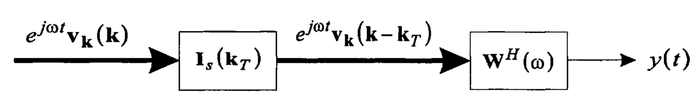
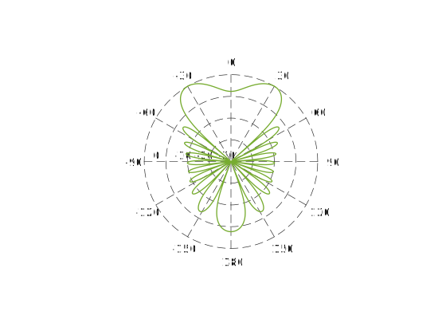
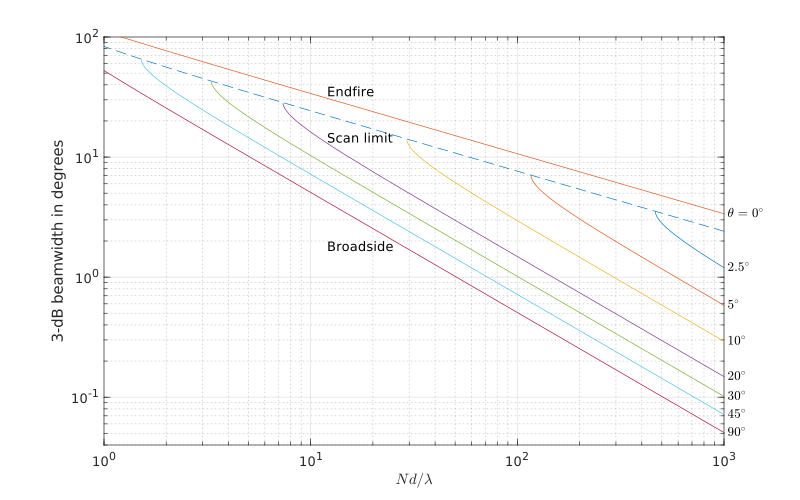
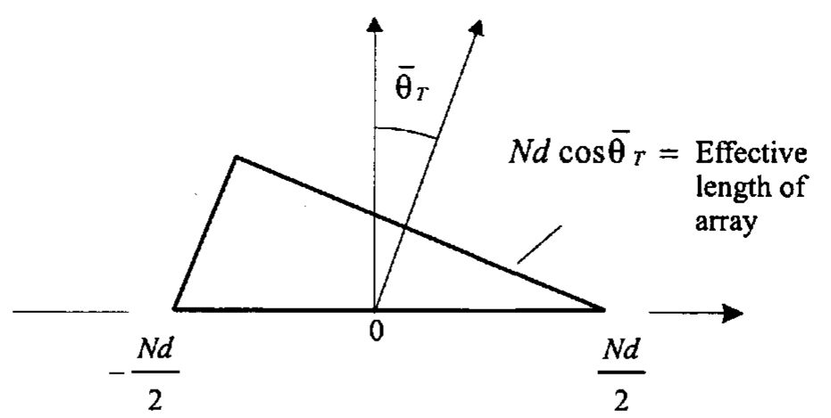
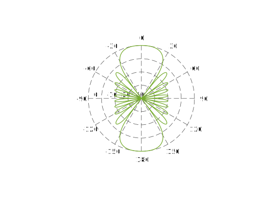

&emsp;&emsp;[1.1 节][]、[1.2 节][]和 [1.3 节][]已经考虑了最大响应在正侧向（broadside），即 $k_z=0$ 的阵列。在大多数应用中，我们希望能够把最大响应放置到，或者说调向（steer）到任意一个波数位置或方向上。有两种方法可以实现这个目标。直接的方法是改变传感器的位置，使得阵列的轴线和目标方向之间是垂直的，称为机械调向（mechanical steering）。当一个天线在物理上是可旋转的时候，我们可以采取这种方法，如雷达系统中抛物面孔径。通常机械调向的实现有很大的困难，原因可能是当处理长波长信号时所需阵列的物理维度较大，也可能是当传感器被移动时需要进行重新校准。

&emsp;&emsp;另外一个方法是引入时间延时（或在窄带的情况下，引入相移）来实现对一个阵列的****进行调向。随着高速信号处理器的发展，电子调向（electronic steering）技术正在被更广泛地应用在阵列处理中，其不仅仅突破了机械调向的限制，还具有迅速改变响应函数的灵活能力。此外，在有些阵列中，在一个方向上采用机械调向，在其他的方向上采用电子调向。

&emsp;&emsp;本文首先考虑任意结构阵列，然后讨论均匀加权阵列的结果。

<!-- more -->

# 任意结构阵列的调向

<a id="fig.1-4-1"></a>

{width=700px}

&emsp;&emsp;[1.2 节][]开头的简单例子说明了把阵列调向某个特定方向的主要思想，调向在波数空间的影响是很直接的。考虑[图 1-4-1](#fig.1-4-1) 中的处理器，输入到调向环节的基函数为

$$\begin{equation}
  f\left( t, \boldsymbol{p}\right) = e^{j\omega t} \boldsymbol{v}_{\boldsymbol{k}}\left(\boldsymbol{k}\right)
\end{equation}$$

我们希望当波数等于“目标”的波数时，即

$$\begin{equation}
  \boldsymbol{k} = \boldsymbol{k}_\mathrm{T}
\end{equation}$$

输出是对齐的。我们把 $\boldsymbol{k}_\mathrm{T}$ 称为****或在 $k$ 空间的****。可以使用一个 $N \times N$ 的对角调向矩阵（diagonal steering matrix）来完成这个操作

<a id="DiagonalSteeringMatrix"></a>

$$\begin{equation}
  \boldsymbol{I}_\mathrm{s}\left(\boldsymbol{k}_\mathrm{T}\right) = \left[ \begin{matrix}
    e^{j \boldsymbol{k}^\mathrm{T}_\mathrm{T}\boldsymbol{p}_1} & 0 & \cdots & 0 \\
    0 & e^{j \boldsymbol{k}^\mathrm{T}_\mathrm{T}\boldsymbol{p}_2} & \cdots & 0 \\
    \vdots & \vdots &  & \vdots \\
    0 & 0 & \cdots & e^{j \boldsymbol{k}^\mathrm{T}_\mathrm{T}\boldsymbol{p}_N}
  \end{matrix} \right]
\end{equation}$$

得到的输出为

$$\begin{equation}
  f_\mathrm{s}\left( t, \boldsymbol{p}\right) = e^{j\omega t} \boldsymbol{v}_{\boldsymbol{k}}\left(\boldsymbol{k} - \boldsymbol{k}_\mathrm{T}\right)
\end{equation}$$

总的频率-波数响应为

$$\begin{equation}
  \boldsymbol{\varUpsilon} \left(\left. \omega, \boldsymbol{k} \right| \boldsymbol{k}_\mathrm{T} \right) = \boldsymbol{\varUpsilon} \left( \omega, \boldsymbol{k} - \boldsymbol{k}_\mathrm{T} \right)
\end{equation}$$



阵列的响应函数仅是简单地平移到 $\boldsymbol{k}_\mathrm{T}$ 的位置，这是利用波数空间来解释阵列响应函数的好处之一。如果在波数空间考虑波束方向图，也会得到一个简单的平移关系。



# 均匀幅度加权的情况

&emsp;&emsp;当采用均匀幅度加权时，在[图 1-4-1](#fig.1-4-1) 中的两步的过程是不必要的。令

$$\begin{equation}
  \boldsymbol{w} = \frac{1}{N} \boldsymbol{v}_{\boldsymbol{k}}\left(\boldsymbol{k}_\mathrm{T}\right)
\end{equation}$$

则有

$$\begin{equation}
  B_\mathrm{c} \left( \boldsymbol{k}, \boldsymbol{k}_\mathrm{T} \right) = \frac{1}{N} \boldsymbol{v}_{\boldsymbol{k}}^\mathrm{H}  \left(\boldsymbol{k}_\mathrm{T}\right) \boldsymbol{v}_{\boldsymbol{k}}\left(\boldsymbol{k}\right)
\end{equation}$$

称 $B_c \left( \boldsymbol{k}, \boldsymbol{k}_\mathrm{T} \right)$ 为****。我们将发现常规波束方向图是后面要讨论的很多最优处理内容的基础。

# 均匀线性阵列的调向

&emsp;&emsp;线性阵列的常规波束方向图为

$$\begin{equation}
  B_{\psi\mathrm{c}}\left( \psi : \psi_\mathrm{T} \right) = \frac{1}{N} \boldsymbol{v}_\psi^\mathrm{H}  \left(\psi_\mathrm{T}\right) \boldsymbol{v}_\psi\left(\psi\right)
\end{equation}$$

$$\begin{equation}
  B_{u\mathrm{c}}\left( u : u_\mathrm{T} \right) = \frac{1}{N} \boldsymbol{v}_u^\mathrm{H}  \left(u_\mathrm{T}\right) \boldsymbol{v}_u\left(u\right)
\end{equation}$$

对于均匀线性阵列（阵元间距相同），有

$$\begin{equation}
  B_{\psi\mathrm{c}}\left( \psi : \psi_\mathrm{T} \right) = \frac{1}{N} \frac{\sin\left( N \frac{\psi-\psi_\mathrm{T}}{2} \right)}{\sin\left(\frac{\psi-\psi_\mathrm{T}}{2} \right)} \label{SteeredBeamPatternInWavenumberDomain}
\end{equation}$$

$$\begin{equation}
  B_{u\mathrm{c}}\left( u : u_\mathrm{T} \right) = \frac{1}{N} \frac{\sin\left[ \frac{\pi Nd}{\lambda} (u - u_\mathrm{T}) \right]}{\sin\left[ \frac{\pi d}{\lambda} (u - u_\mathrm{T}) \right]} \label{SteeredBeamPatternInDirectionCosineDomain}
\end{equation}$$

式 $\eqref{SteeredBeamPatternInWavenumberDomain}$ 或式 $\eqref{SteeredBeamPatternInDirectionCosineDomain}$ 均对应方向图的平移，其形状并没有改变。这种没有畸变的平移性质是在 $\psi$ 空间或 $u$ 空间处理的众多优点之一。

&emsp;&emsp;当我们对阵列调向，并使得主响应轴对准 $\bar{\theta}_0$ 时（其中 $\bar{\theta}_0$ 是从正侧向（broadside）测得的角度），波束方向图将发生平移，使得中心峰值位于 $u_0 = \sin\bar{\theta}_0$。同时，这个平移也**使栅瓣发生移动**。

&emsp;&emsp;[图 1-4-2](#fig.1-4-2) 说明了调向对波束方向图的影响。[图 1-4-2(a)](#fig.1-4-2) 给出了 $d=2\lambda/3$ 和 $\bar\theta = 30^\circ$ 时的波束方向图。我们看到，在这种调向的情况下，栅瓣位于可视区域的边缘。[图 1-4-2(b)](#fig.1-4-2) 给出了 $d=\lambda/2$ 和 $\bar\theta = 90^\circ$ 时的波束方向图，栅瓣同样位于可视区域的边缘。

<a id="fig.1-4-2"></a>

{width=1000px}



``` matlab fig2_22.m
%%%%%%%%%%%%%%%%%%%%%%%%%%%%%%%%
% Figure 2.22
% Effect of element spacing on beam pattern
% Lillian Xu
% Last updated by K. Bell 7/22/01, 10/4/01
%%%%%%%%%%%%%%%%%%%%%%%%%%%%%%%%

clear all
close all

N=10;
n=(-(N-1)/2:(N-1)/2)';
w=ones(N,1)/N;
u=-3:0.01:3;

d=[2/3 1/2];
theta=[30 90];
figure
s = ['(a)';'(b)'];
for m=1:2
  beam=(w.*exp(1i*2*pi*n*d(m)*sin(theta(m)/180*pi)))' ...
    *exp(1i*2*pi*n*d(m)*u);
  subplot(2,1,m);
  plot(u,20*log10(abs(beam)));
  hold on
  axis([-3 3 -25 5])
  ylabel('Beam pattern (dB)')
  xlabel('$u$','Interpreter','latex')
  text(0,-32,s(m,:),'HorizontalAlignment','center')
  % title(['N=',num2str(N),', d=',num2str(d(m),2),' lambda, theta-Bar=', ...
  %   num2str(theta(m)),' degrees'])
  grid on
end

set(gcf,'Position',[0 0 800 600])
```



&emsp;&emsp;通常，为了避免栅瓣进入可视区域，需要有

$$\begin{equation}
  \frac{d}{\lambda} \leqslant \frac{1}{1 + \left| \sin\bar\theta_{\max} \right|}
\end{equation}$$

其中， $\bar\theta_{\max}$ 是阵列将要调向的最大角度。这个结果可以令 $\bar\theta_\mathrm{T} = \bar\theta_{\max}$，计算第一个栅瓣的位置和 $\frac{d}{\lambda}$ 的关系而得到。所以，如果阵列需要的所调方向为 $-90^\circ \leqslant \bar\theta \leqslant 90^\circ$，则有

$$\begin{equation}
  d \leqslant \frac{\lambda}{2}
\end{equation}$$



虽然研究在 $\psi$ 空间或 $u$ 空间的特性是很有用的，但必须要注意信号实际是从 $(\theta, \varphi)$ 空间产生的，我们需要理解在这个空间的特性，这一点很重要。



&emsp;&emsp;在 $\theta$ 空间（即角度空间），有

$$\begin{equation}
  B_{\theta\mathrm{c}}\left( \theta : \theta_\mathrm{T} \right) = \frac{1}{N} \frac{\sin\left[ \frac{\pi Nd}{\lambda} (\cos\theta - \cos\theta_\mathrm{T}) \right]}{\sin\left[ \frac{\pi d}{\lambda} (\cos\theta - \cos\theta_\mathrm{T}) \right]} \label{SteeredBeamPatternInAngleDomain}
\end{equation}$$

我们在 $\theta$ 空间画出 $B_{\theta\mathrm{c}}$，由于和 $\theta$ 的关系，方向图的形状将随之发生改变。[图 1-4-3](#fig.1-4-3) 给出了 $\theta_\mathrm{T} = 30^\circ$ 和 $d=\lambda/2$ 的波束方向图。把这个方向图和[图 1-3-3][] 中的方向图进行比较，
可以看到主波束的波束宽度有所增加。

<a id="fig.1-4-3"></a>

{width=800px}



``` matlab fig2_23.m
%%%%%%%%%%%%%%%%%%%%%%%%%%%%%%%%
% Figure 2.23
% Beam pattern for 10-element uniform array (d=lambda/2)
% scanned to 30 degrees (60 degrees from broadside)
% Xin Zhang 1/20/99
% Last updated by K. Bell 6/25/01
% Functions called: polardb
%%%%%%%%%%%%%%%%%%%%%%%%%%%%%%%%

clear all
close all

N = 10;
n = (-(N-1)/2:(N-1)/2).';
theta = pi*(-1:0.001:1);
u = cos(theta);
d = 1/2;
vv = exp(1i*2*pi*d*n*u);
theta_T = 30/180*pi;
w = 1/N*ones(N,1).*exp(1i*n*pi*cos(theta_T));
B = w'*vv;
B = 10*log10(abs(B).^2);
figure
h=polardb(theta,B,-40);
hold off
```



&emsp;&emsp;为了研究在 $\theta$ 空间的半功率带宽情况，我们利用式 $\eqref{SteeredBeamPatternInAngleDomain}$ 和 [$N \geqslant 10$ 时半功率带宽的估算式][]，可以得到在 $u$ 空间的左右半功率点分别为

$$\begin{equation}
  u_\mathrm{L} = u_\mathrm{T} - 0.450 \frac{\lambda}{Nd}
\end{equation}$$

$$\begin{equation}
  u_\mathrm{R} = u_\mathrm{T} + 0.450 \frac{\lambda}{Nd}
\end{equation}$$

或在 $\theta$ 空间（$\theta_\mathrm{L}$ 对应 $u_\mathrm{R}$，$\theta_\mathrm{R}$ 对应 $u_\mathrm{L}$）有

$$\begin{equation}
  \cos\theta_\mathrm{R} = \cos\theta_\mathrm{T} - 0.450 \frac{\lambda}{Nd}
\end{equation}$$

$$\begin{equation} \label{LeftHalfPowerPointInAngleDomain}
  \cos\theta_\mathrm{L} = \cos\theta_\mathrm{T} + 0.450 \frac{\lambda}{Nd}
\end{equation}$$

所以，对于 $0 \leqslant \theta \leqslant \pi$，$\theta_\mathrm{L}, \theta_\mathrm{R} \geqslant 0$，在 $\theta$ 空间的半功率波束宽度为

$$\begin{equation} \label{HPBWOfUWLA}
  \theta_\mathrm{H} = \theta_\mathrm{R} - \theta_\mathrm{L} = \cos^{-1} \left[ \cos\theta_\mathrm{T} - 0.450 \frac{\lambda}{Nd} \right] - \cos^{-1} \left[ \cos\theta_\mathrm{T} + 0.450 \frac{\lambda}{Nd} \right]
\end{equation}$$

&emsp;&emsp;除了当 $\theta_\mathrm{T} = 0$ 或 $\pi$（端射，endfire，信号入射方向与阵元排布方向平行）的情况，定义 $\theta_\mathrm{L}$ 为最接近 $\theta = 0$ 的半功率点。当波束从正侧向（$\theta_\mathrm{T} = \pi/2$）调向 $z$ 轴的正半轴（端射，$\theta_\mathrm{T} = 0$）时，波束变宽。在某点上，如式 $\eqref{LeftHalfPowerPointInAngleDomain}$
中所示，$\theta_\mathrm{L}$ 等于 0。在该点以外，在波束的那一边再也没有半功率点。 Elliott[^1] 把这个点称为扫描极限（scan limit）。

&emsp;&emsp;Elliot [^1] 画出了式 $\eqref{HPBWOfUWLA}$ 和式 $\eqref{HPBWOfEndfireUWLA}$ 中给出的波束宽度，并在[图 1-4-4](#fig.1-4-4) 中给出。

<a id="fig.1-4-4"></a>

{width=1000px}



``` matlab fig2_24.m
%%%%%%%%%%%%%%%%%%%%%%%%%%%%%%%%
% Figure 2.24
% HPBW versus steering angle
% Lillian Xu
% Modified by Xin Zhang
% Last updated by L. Xu 11/30/00, K. Bell 7/22/01, 10/4/01, 10/17/01
%%%%%%%%%%%%%%%%%%%%%%%%%%%%%%%%

clear all;
close all;

Nd_set=[1000:-5:700 700:-0.5:200 200:-0.05:20 15:-0.005:1];
theta_deg=[2.5 5 10 20 30 45 90];
%theta_deg=[2.5 5 10 20 30 45 60 90];
theta_set=theta_deg*pi/180;
figure
for num=1:size(theta_set,2)
  theta=theta_set(num);
  bw=0;
  for num1=1:size(Nd_set,2)
    Nd=Nd_set(num1);
    r=cos(theta)+0.443/Nd;
    if abs(r)<=1
        bw(num1)=acos(r)-acos(cos(theta)-0.443/Nd);
    end
  end
  loglog(Nd_set(1:size(bw,2)),abs(bw*180/pi));
  hold on
  rightpoint=abs(bw(1)*180/pi);
  text(1040,rightpoint,[num2str(theta_deg(num)),'$^\circ$'],Interpreter='latex'); % used to be 7
end
axis([1 1000 0.04 100])
xlabel('$Nd/\lambda$','Interpreter','latex')
ylabel('3-dB beamwidth in degrees')

scanlimit=-acos(1-2*0.443./Nd_set);
loglog(Nd_set,abs(scanlimit*180/pi),'--')

Endfire = 2*acos(1-0.433./Nd_set);
loglog(Nd_set,abs(Endfire*180/pi))
rightpoint=abs(Endfire(1)*180/pi);
text(1040,rightpoint,'$\theta=0^\circ$',Interpreter='latex'); % used to be 7
%title('HPBW versus steering angle: standard linear array with uniform weighting')
text(12,35,'Endfire')
text(12,14.4,'Scan limit')
text(12,1.8,'Broadside')
grid on;
set(gcf,'Position',[0 0 800 500])
```



&emsp;&emsp;当波束调向到正侧向的附近（$\bar{\theta}_\mathrm{T}$ 的值很小）且 $Nd \gg \lambda$ 时，$\theta_\mathrm{H}$ 很小，利用小角度展开形式得到

$$\begin{equation} \label{HPBWWithSmallAngle}
  \theta_\mathrm{H} \approx 0.891 \frac{\lambda}{Nd} \sec \bar\theta_\mathrm{T}
\end{equation}$$

式 $\eqref{HPBWWithSmallAngle}$ 的意义在[图 1-4-5](#fig.1-4-5) 中比较明显。有效的阵列长度缩减了 $\cos\bar\theta_\mathrm{T}$ 倍。

<a id="fig.1-4-5"></a>

{width=600px}

&emsp;&emsp;对于 $Nd \geqslant 5\lambda$，在正侧向附近，式 $\eqref{HPBWWithSmallAngle}$ 的误差在 0.2% 以内，在扫描极限附近，误差在 4% 以内。

&emsp;&emsp;当 $\theta_\mathrm{T} = 0$ 或 $\pi$ 时，最大响应轴的指向沿着阵列的轴线，此时称为一个端射阵列（endfire array）。一个标准 10 阵元端射阵列的波束方向图在[图 1-4-6](#fig.1-4-6) 中给出。在这种情况下，有

$$\begin{equation} \label{HPBWOfEndfireUWLA}
  \theta_\mathrm{H} = 2 \cos^{-1} \left[ 1 - 0.450 \frac{\lambda}{Nd} \right], \quad \theta_\mathrm{T} = 0 \text{或} \pi
\end{equation}$$

<a id="fig.1-4-6"></a>

{width=800px}



``` matlab fig2_26.m
%%%%%%%%%%%%%%%%%%%%%%%%%%%%%%%%
% Figure 2.26
% Beam pattern of a standard 10-element linear array
% with uniform amplitude weighting at end-fire
% Xin Zhang 1/20/99
% Last updated by K. Bell 6/25/01
% Functions called: polardb
%%%%%%%%%%%%%%%%%%%%%%%%%%%%%%%%

clear all
close all

N = 10;
n = (-(N-1)/2:(N-1)/2).';
theta = pi*(-1:0.001:1);
u = cos(theta);
d = 1/2;
vv = exp(1i*2*pi*d*n*u);
theta_T = 0/180*pi;
w = 1/N*ones(N,1).*exp(1i*n*pi*cos(theta_T));
B = w'*vv;
B = 10*log10(abs(B).^2);
figure
h=polardb(theta,B,-40);
hold off
```



可以把式 $\eqref{HPBWOfEndfireUWLA}$ 写成

$$\begin{equation}
  1 - \cos \left( \frac{\theta_\mathrm{H}}{2} \right) = 0.450 \frac{\lambda}{Nd}
\end{equation}$$

或

$$\begin{equation} \label{SineOfHPBWOfEndfireUWLA}
  \sin \left( \frac{\theta_\mathrm{H}}{4} \right) = \sqrt{\frac{0.450}{2}\cdot \frac{\lambda}{Nd}}
\end{equation}$$

对于 $Nd \gg \lambda$，$\theta_\mathrm{H}$ 很小，则式 $\eqref{SineOfHPBWOfEndfireUWLA}$ 成为

$$\begin{equation} \label{ApproximationOfHPBWOfEndfireUWLA}
  \theta_\mathrm{H} = 2 \sqrt{0.890 \frac{\lambda}{Nd}}
\end{equation}$$

对于 $Nd \gg 5\lambda$，式 $\eqref{ApproximationOfHPBWOfEndfireUWLA}$ 的误差小于 1%。

&emsp;&emsp;类似的，方向图的第一零点的位置为

$$\begin{equation}
  \theta_\mathrm{null} = \sqrt{2 \frac{\lambda}{Nd}}
\end{equation}$$

&emsp;&emsp;所以，一个线阵在端射位置的分辨率随 $Nd/\lambda$ 的平方根的倒数变化，而在正侧向的时候是线性的关系。

# 参考文献

1. Van Trees, Harry L. *Optimum array processing: Part IV of detection, estimation, and modulation theory.* John Wiley & Sons, 2002.
2. Van Trees, Harry L, 汤俊. *最优阵列处理技术.* 清华大学出版社. 2008.

[1.1 节]: https://josh-gao.top/posts/8b61f5a7.html
[1.2 节]: https://josh-gao.top/posts/de20fd09.html
[1.3 节]: https://josh-gao.top/posts/aa32ec76.html
[图 1-3-3]: https://josh-gao.top/posts/aa32ec76.html#fig.1-3-3
[$N \geqslant 10$ 时半功率带宽的估算式]: https://josh-gao.top/posts/aa32ec76.html#ApproximationOfHPBW

[^1]: R. S. Elliott. *Antenna Theory and Design.* Prentice-Hall, Englewood Cliffs, New Jersey, 1981.
