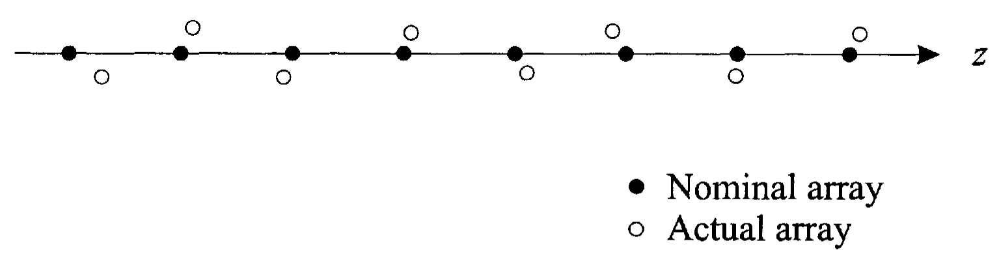

&emsp;评估阵列性能的方法有很多，不同方法会量化阵列的不同重要特性，比如阵列对信号的响应，或是阵列的敏感度。在之前的讨论中，第一零点间距是波束宽度，也即频率-波数响应分辨率的度量指标；主旁瓣高度是均匀加权线阵的一种度量指标。本文讨论三个常用的阵列性能度量指标：

1. 方向性（Directivity）
2. 对空域自噪声的阵列增益 (Array gain versus spatially white noise，$A_w$)
3. 敏感度（Sensitivity）和容错因子（Tolerance Factor）

<!-- more -->

# 方向性

&emsp;&emsp;方向性是阵列和孔径常用性能度量指标。下面首先在给出一般情况下的定义，然后讨论线性阵列的特殊情况。

## 方向性的定义

&emsp;&emsp;定义**** $P(\theta,\varphi)$ 为波束方向图 $B(\omega : \theta, \varphi)$ 幅度的平方，即

$$\begin{equation}
  P(\theta,\varphi) = \left| B(\omega : \theta, \varphi) \right|^2
\end{equation}$$

其中省略了 $P(\theta,\varphi)$ 和频率的关系，则方向性 $D$ 定义为

$$\begin{equation}
  D = \frac{P(\theta_\mathrm{T},\varphi_\mathrm{T})}{ \displaystyle\frac{1}{4\pi} \int_0^\pi \int_0^{2\pi} \sin \theta \cdot P(\theta,\varphi) \,\mathrm{d} \varphi \,\mathrm{d} \theta}
\end{equation}$$

其中 $(\theta_\mathrm{T},\varphi_\mathrm{T})$ 是主响应轴（main response axis，MRA）的指向。

- 对于发射天线，$D$ 代表最大发射密度（单位立体角发射功率）和平均发射密度（球面平均发射功率）的比值。

- 对于接收天线，分母代表阵列/孔径对全向噪声（在球内均匀分布的噪声）的输出噪声功率，分子代表从 $(\theta_\mathrm{T},\varphi_\mathrm{T})$ 方向入射的信号的功率，所以 $D$ 可以理解为对全向噪声的阵列增益。

&emsp;&emsp;假设权值做了归一化，使得 $P_n(\theta_\mathrm{T},\varphi_\mathrm{T}) = 1$，则方向性可以进一步写成

$$\begin{equation}
  D = \left\{ \frac{1}{4\pi} \int_0^\pi \int_0^{2\pi} \sin \theta \cdot P(\theta,\varphi) \,\mathrm{d} \varphi \,\mathrm{d} \theta  \right\}^{-1}
\end{equation}$$

## 线阵的情况

&emsp;&emsp;对于线性阵列，有

$$
B(\theta,\varphi) = B(\theta)
$$

则线阵的方向性

$$\begin{align}
  D &= \left\{ \frac{1}{2} \int_0^\pi \left| B(\theta) \right|^2 \sin \theta \,\mathrm{d} \theta  \right\}^{-1} \\
  &= \left\{ \frac{1}{2} \int_{-1}^1 \left| B(u) \right|^2 \,\mathrm{d} u  \right\}^{-1}
\end{align}$$

&emsp;&emsp;利用 [$u$ 空间的波束方向图的表达式][]，$u$ 空间线阵的方向性可以用阵列权值表示为

$$
D = \left\{ \frac{1}{2} \int_{-1}^1 \sum_{n=0}^{N-1}w_n^\ast e^{jn\left( \frac{2\pi d}{\lambda} \right) \left( u - u_\mathrm{T} \right)} \sum_{m=0}^{N-1} w_m e^{-jm\left( \frac{2\pi d}{\lambda} \right) \left( u - u_\mathrm{T} \right)} \,\mathrm{d} u  \right\}^{-1}
$$

其中 $u_\mathrm{T}$ 是 $u$ 空间内的阵列的所调方向。交换积分和求和的顺序，积分得到

$$\begin{equation} \label{DirectivityOfLA}
  D = \left\{ \sum_{n=0}^{N-1} \sum_{m=0}^{N-1} w_m w_n^\ast e^{j \left( \frac{2\pi d}{\lambda} \right) (m-n) u_\mathrm{T} } \mathrm{sinc} \left( \frac{2\pi d}{\lambda} (n-m)\right)  \right\}^{-1}
\end{equation}$$

&emsp;&emsp;为了使表达式更加简洁，定义几个矩阵。定义 $\mathbf{sinc}$ 矩阵的第 $n,m$ 个元素为

$$
\left[ \mathbf{sinc} \right]_{nm} \triangleq \mathrm{sinc} \left( \frac{2\pi d}{\lambda} (n-m)\right)
$$

[对角调向矩阵][] 在 $u$ 空间的表示形式为

$$
\boldsymbol{I}_{\mathrm{s}u} = \mathrm{diag}\left( 1, e^{j \frac{2\pi d}{\lambda}u_\mathrm{T}} , e^{j \frac{2\pi d}{\lambda} 2u_\mathrm{T}}, \cdots, , e^{j \frac{2\pi d}{\lambda}(N-1)u_\mathrm{T}} \right)
$$

则

$$\begin{equation}
  D = \boldsymbol{I}_{\mathrm{s}u} \boldsymbol{w}^\mathrm{H} \left[ \mathbf{sinc} \right] \boldsymbol{w} \boldsymbol{I}_{\mathrm{s}u}^\mathrm{H}
\end{equation}$$

由于调向运算通常在权值矢量中包含[^1]

$$\begin{equation}
  \boldsymbol{w}_\mathrm{s} = \boldsymbol{w}\boldsymbol{I}_{\mathrm{s}u}^\mathrm{H}
\end{equation}$$

则

$$\begin{equation}
  D = \boldsymbol{w}_\mathrm{s}^\mathrm{H} \left[ \mathbf{sinc} \right] \boldsymbol{w}_\mathrm{s}
\end{equation}$$

## 标准线阵的情况

&emsp;&emsp;标准线阵（standard linear array）是我们所感兴趣的一个特殊情况。如果 $d = \lambda/2$，则方向性

$$
  D = \left\{ \sum_{n=0}^{N-1} \sum_{m=0}^{N-1} w_m w_n^\ast e^{j \pi (m-n) u_\mathrm{T} } \mathrm{sinc} \left( \pi (n-m)\right)  \right\}^{-1}
$$

当 $m = n$ 时，$\mathrm{sinc}$ 函数等于 1，当 $m \ne n$ 时，$\mathrm{sinc}$ 函数等于 0，所以方向性可以进一步简化为

$$\begin{equation}
  D = \left\{ \sum_{n=0}^{N-1} \left| w_n \right|^2 \right\} = \left( \boldsymbol{w}^\mathrm{H}\boldsymbol{w} \right)^{-2} = \left\{ \left\| \boldsymbol{w} \right \|^2 \right\}^{-1}
\end{equation}$$

其中

$$\begin{equation}
  \left\| \boldsymbol{w} \right \| = \left( \boldsymbol{w}^\mathrm{H}\boldsymbol{w} \right)^{\frac{1}{2}}
\end{equation}$$

是矢量 $\boldsymbol{w}$ 的 2-模。因此**标准线阵的方向性是权值矢量幅度平方的倒数**。且**标准线的方向性不依赖于阵列的指向**，当阵列指向从阵列的正侧向（broadside）移开时。波束变宽，但是 $\varphi$ 的积分范围减小。

&emsp;&emsp;对于 $d \ne \lambda/2$，利用式 $\eqref{DirectivityOfLA}$ 给出的线阵方向性的定义，方向性将和阵列的指向有关。

&emsp;&emsp;对于均匀加权的标准线阵（UWLA），$w_n = 1/N$，所以

$$
\sum_{n=0}^{N-1} \left| w_n \right|^2 = \frac{1}{N}
$$

所以

$$\begin{equation}
  D = N
\end{equation}$$

&emsp;&emsp;均匀加权使得标准线阵的方向性最大，下面给出简单证明。

> &emsp;&emsp;采用 Lagrange 乘子法进行证明。待求解的问题可以表述为
>
> $$
> \min_{w_n} \sum_{n=0}^{N-1} \left| w_n \right|^2, \quad \mathrm{s.t.} \sum_{n=0}^{N-1} w_n = 1
> $$
>
> 约束条件保证了波束方向图在 $u_\mathrm{T}$ 方向的值为 1。令
>
> $$
> F = \sum_{n=0}^{N-1} \left| w_n \right|^2 + \lambda \left( \sum_{n=0}^{N-1} w_m - 1 \right)
> $$
>
> 其中 $\lambda$ 是 Lagrange 乘子。对 $w_n$ 求导，并令结果等于零，得到
>
> $$
> w_n^\ast = -\lambda
> $$
>
> 也即
>
> $$
> w_n = -\lambda^\ast
> $$
>
> 把所得结果代入约束条件，得到 $\lambda = -\displaystyle\frac{1}{N}$，则有
>
> $$
> w_n = \frac{1}{N}
> $$
>
> 此即为我们想要得到的结果。



对于非均匀加权的情况，阵列的方向性总是减小的。它是以半波长度量的阵列长度的函数，加上一个由于非均匀加权而产生的部分。



&emsp;&emsp;一个**标准均匀加权线阵**的方向性可以和半功率带宽 HPBW，或者第一零点波束宽度$BW_{NN}$ 相联系起来。根据[各个空间的第一零点波束宽度表][], 有

$$\begin{equation}
  D = \frac{4}{BW_{NN}}
\end{equation}$$

其中，$BW_{NN}$ 是在 $u$ 空间的值。

&emsp;&emsp;方向性经常用 dB 来表示，并称之为****：

$$\begin{equation}
  DI = 10 \lg D
\end{equation}$$

可以把 $DI$ 写成

$$\begin{equation}
  DI = 10 \lg N + 10 \lg(g(\boldsymbol{w}))
\end{equation}$$

其中第二项是权值的函数。对于非均匀加权（$w_n \ne N^{-1}$），$DI$ 将会减小。

# 对空域白噪声的阵列增益（$A_w$）

&emsp;&emsp;阵列处理的一个目标是通过相干地累加信号和不相干地累加噪声来改善****，阵列增益可以度量信噪比的改善程度。这是阵列性能的一个重要度量指标，后面我们会深入地讨论这个问题。阵列增益的一般定义要到介绍了谱协方差矩阵（用于描述噪声过程的空域统计特性）后给出。这里仅给出阵列增益的一个应用范围受限的定义。

&emsp;&emsp;假设每个阵元的输入由一个从主响应轴入射的平面波和一个噪声过程组成，各阵元的噪声过程是不相关的（空域白噪声），则各阵元的输入信号

$$\begin{equation}
  x_n (t) = f(t - \tau_n) + n_n(t), \quad n = 0,\cdots,N-1
\end{equation}$$

每个阵元上信号谱和噪声谱的比值，也即输入信噪比为

$$\begin{equation}
  \mathrm{SNR}_\mathrm{in} (\omega) = \frac{S_f(\omega)}{S_n (\omega)}
\end{equation}$$

其中下标 “$\mathrm{in}$” 表示输入，假设每个阵元的噪声谱相同。

&emsp;&emsp;下面推导使用权值和输入谱矩阵来描述输出谱的表达式。根据[阵列输出的向量形式][], 有

$$
y(t) = \int_{-\infty}^{\infty} \boldsymbol{h}^\mathrm{T} (\tau) \boldsymbol{x}\left(t - \tau\right) \mathrm{d} \tau
$$

假设 $x(t)$ 是零均值宽平稳的，输出 $y(t)$ 的自相关函数

$$
R_{y}(\tau) = E[y(t)y^\ast(t-\tau)]
$$

$y(t)$ 的谱为

$$\begin{aligned}
  S_y (\omega) &= \int_{-\infty}^{\infty} e^{-j\omega \tau} R_{y}(\tau) \, \mathrm{d} \tau  \\
  &= \int_{-\infty}^{\infty} e^{-j\omega\tau} \, \mathrm{d} \tau \int_{-\infty}^{\infty} \boldsymbol{h}^\mathrm{T} (\alpha) \, \mathrm{d} \alpha \int_{-\infty}^{\infty} E \left[  \boldsymbol{x} (t-\alpha) \boldsymbol{x}^\mathrm{H} (t-\tau-\beta)\right] \boldsymbol{h}^\ast(\beta) \, \mathrm{d} \beta \\
  &= \int_{-\infty}^{\infty} \boldsymbol{h}^\mathrm{T} (\alpha) e^{-j\omega\alpha}  \, \mathrm{d} \alpha \int_{-\infty}^{\infty} \boldsymbol{R}_x (z) e^{-j\omega z} \, \mathrm{d} z \int_{-\infty}^{\infty} \boldsymbol{h}^\ast(\beta) e^{-j\omega \beta} \, \mathrm{d} \beta
\end{aligned}$$

也即

$$\begin{equation}
  S_y (\omega) = \boldsymbol{H}^\mathrm{T} (\omega) \boldsymbol{S}_x(\omega) \boldsymbol{H} ^\ast (\omega)
\end{equation}$$

对于窄带波束形成器，利用[窄带假设下的复加权的表达式][]，可得

$$\begin{equation}
  S_y (\omega) = \boldsymbol{w}^\mathrm{H} \boldsymbol{S}_x(\omega) \boldsymbol{w}
\end{equation}$$

为了计算由于信号而产生的输出，对 $\boldsymbol{w}$ 施加****

$$\begin{equation}
  \boldsymbol{w}^\mathrm{H} \boldsymbol{v}_{\boldsymbol{k}} \left( \boldsymbol{k}_\mathrm{s} \right) = 1
\end{equation}$$

表示从 $\boldsymbol{k}_\mathrm{s}$ 方向入射的任意信号将无畸变地通过波束形成器。在后续的讨论中这个条件经常使用。

&emsp;&emsp;输入信号谱

$$\begin{equation}
  \boldsymbol{S}_{\boldsymbol{f}}(\omega) = \boldsymbol{v}_{\boldsymbol{k}} \left( \boldsymbol{k}_\mathrm{s} \right) S_f(\omega) \boldsymbol{v}_{\boldsymbol{k}}^\mathrm{H} \left( \boldsymbol{k}_\mathrm{s} \right)
\end{equation}$$

则输出信号谱为

$$\begin{equation}
\begin{aligned}
  S_{y_\mathrm{s}} &= \boldsymbol{w}^\mathrm{H} \boldsymbol{v}_{\boldsymbol{k}} \left( \boldsymbol{k}_\mathrm{s} \right) S_f (\omega) \boldsymbol{v}_{\boldsymbol{k}}^\mathrm{H} \left( \boldsymbol{k}_\mathrm{s} \right) \boldsymbol{w} \\
  &= S_f(\omega)
\end{aligned}
\end{equation}$$

&emsp;&emsp;输出噪声谱为

$$\begin{equation}
  S_{y_\mathrm{n}} = \boldsymbol{w}^\mathrm{H} \boldsymbol{S_{\boldsymbol{n}}} (\omega) \boldsymbol{w}
\end{equation}$$

其中 $\boldsymbol{S_{\boldsymbol{n}}} (\omega)$ 是输入噪声过程的谱矩阵。对于空域白噪声，若各阵元的噪声谱相同，有

$$\begin{equation}
  S_{\boldsymbol{n}} = S_n (\omega) \boldsymbol{I}
\end{equation}$$

则输出噪声谱

$$\begin{equation}
  S_{y_n} = \left\| \boldsymbol{w} \right\|^2 S_n(w) = \sum_{n=0}^{N-1} \left| w_n \right|^2 S_n(\omega)
\end{equation}$$

所以

$$\begin{equation}
  \mathrm{SNR_o}(\omega) = \frac{1}{\displaystyle\sum_{n=0}^{N-1} \left| w_n \right|^2} \frac{S_f(\omega)}{S_n(\omega)}
\end{equation}$$

其中，下标“$\mathrm{o}$”代表输出。

&emsp;&emsp;阵列增益 $A_w$ 反映了阵列带来的 SNR 改善程度，定义为阵列输出 SNR 和一个阵元上输入 SNR 的比值。

$$\begin{equation}
  A_w = \frac{\mathrm{SNR_o}(\omega)}{\mathrm{SNR_{in}}(\omega)} = \frac{1}{\displaystyle \sum_{n=0}^{N-1} \left| w \right|^2} = \left( \sum_{n=0}^{N-1} \frac{1}{\left| w_n \right|^2}  \right) ^{-1} = \left\| \boldsymbol{w} \right\| ^{-2}
\end{equation}$$

下标“$w$”表示空域不相关的噪声输入，**噪声的时域频谱不一定是平坦的**。

&emsp;&emsp;观察阵列增益的定义式可以得到以下三个有用的结果：

1. 只要满足

   $$
   \left| \boldsymbol{w}^\mathrm{H}\boldsymbol{v}_{\boldsymbol{k}} \left( \boldsymbol{k}_\mathrm{s} \right) \right|^2 = 1
   $$

   这个结果就适用于任意的阵列结构。

2. 对于标准线阵（阵元间距为 $d=\lambda/2$），白噪声阵列增益 $A_w$ 等于阵列方向性 $D$。

3. 对于非均匀线阵 $d \ne \lambda/2$，$D$ 是对全向噪声的阵列增益 $A_\mathrm{iso}$，而非白噪声增益 $A_w$。

&emsp;&emsp;对于均匀加权阵列，有

$$
w_n = \frac{1}{N}, \quad n = 0,\cdots,N-1
$$

且 $A_w = N$（或单位为 $\mathrm{dB}$ 时，为 $10 \log N$）。直接利用 Schwarz 不等式，可以得到 $A_w \leqslant N$。所以，如果要在空域不相关噪声下使阵列增益最大，均匀加权阵列是最优的。

# 敏感度和容错因子

{width=700px}

&emsp;&emsp;后面会分析最优处理器对于增益和相位误差、传感器定位不准确等因素的敏感度。这里总结一下[图 1-5-1](#fig.1-5-1) 中阵列的典型结果，设计的目标是使得在没有阵列扰动的情况下，从正侧向入射到阵列的信号无畸变地通过，即有

$$
\boldsymbol{w}^\mathrm{H} \cdot \boldsymbol{1} F(\omega) = F(\omega)
$$

现在考虑滤波器扰动和阵列位置扰动的影响。

## 滤波器扰动（Filter Perturbations）

&emsp;&emsp;假设理想的矩阵滤波器为 $\boldsymbol{w}^n$，把 $\boldsymbol{w}^n$ 的第 $i$ 个元素表示为 $w_i^n$，则理想的权值可表示为

$$\begin{equation}
  (w_i^n)^\ast = g_i^n e^{-j \varphi_i^n}
\end{equation}$$

实际的权值可表示为

$$\begin{align}
  w_i^\ast &= g_i e^{-j \varphi_i} \notag \\
  &= g_i^n (1 + \Delta g_i) e^{-j (\varphi_i^n + \Delta \varphi_i)}
\end{align}$$

其中 $\Delta g_i$ 和 $\Delta \varphi_i$ 是随机变量。

## 阵列位置扰动（Array Location Perturbations）

&emsp;&emsp;假设理想的阵元位置为 $\boldsymbol{p}_i^n$，实际阵元位置为

$$\begin{equation}
  \boldsymbol{p_i} = \boldsymbol{p}_i^n + \Delta \boldsymbol{p}_i
\end{equation}$$

所以理想的模型可能会产生三种变化

$$
  g_i = g_i^n (1 + \Delta g_i)
$$

$$
  \varphi_i = \varphi_i^n + \Delta \varphi_i
$$

$$
  \boldsymbol{p_i} = \boldsymbol{p}_i^n + \Delta \boldsymbol{p}_i
$$

前两种变化可能是由于阵元的增益和相位改变，或者是由于阵元增益和相位不准确造成的。最后一种变化是由于对阵元的位置缺乏精确了解造成的。假设 $\{ \Delta g_i \}_{i=0}^{N-1}$、$\{ \varphi_i \}_{i=0}^{N-1}$ 和 $\{ \boldsymbol{p_i} \}_{i=0}^{N-1}$ 是统计独立、零均值的高斯随机变量，下面在阵列存在这些变化的情况下分析波束方向图的变化情况。

&emsp;&emsp;理想波束方向图为

$$\begin{align}
  B^{(n)}(\boldsymbol{k}) &= (\boldsymbol{w}^n)^\mathrm{H}\boldsymbol{v}(\boldsymbol{k}) \notag \\
  &= \sum_{i=0}^{N-1} g_i^n \exp (j\varphi_i^n - j \boldsymbol{k}^\mathrm{T} \boldsymbol{p}_i^n)
\end{align}$$

实际波束方向图是一个随机函数，其幅度平方的期望值可以写成

$$\begin{aligned}
  \overline{\left| B (\boldsymbol{k}) \right| ^2} & \triangleq && E \left\{ \left| B (\boldsymbol{k}) \right| ^2 \right\} \notag \\
  &=&& E \left\{ \sum_{i=0}^{N-1} \sum_{l=0}^{N-1} g_i \exp(j\varphi_i^n - j \boldsymbol{k}^\mathrm{T} \boldsymbol{p}_i^n) \cdot g_l (-j\varphi_l^n + j \boldsymbol{k}^\mathrm{T} \boldsymbol{p}_l^n) \right\} \\
  &=&& \sum_{i=0}^{N-1} \sum_{l=0}^{N-1} E \left\{ g_i^n (1 + \Delta g_i) g_l^n (1 + \Delta g_l) \right. \notag \\
  & && \cdot \exp\left[ j (\varphi_i^n + \Delta \varphi_i - \varphi_l^n - \Delta \varphi_l) \right]\left. \right. \notag \\
  & && \left. \cdot \exp \left[ -j \boldsymbol{k}^\mathrm{T} \left( \boldsymbol{p}_i^n + \Delta \boldsymbol{p}_i - \boldsymbol{p}_l^n - \Delta \boldsymbol{p}_l \right) \right] \right\}
\end{aligned}$$

&emsp;&emsp;定义

$$\begin{cases}
  \alpha_{il} = E \left\{ (1 + \Delta g_i)(1 + \Delta g_l) \exp[j(\Delta \varphi_i - \Delta \varphi_l)] \right\} \\
  \beta_{il}(\boldsymbol{k}) = E \left\{ \exp[-j\boldsymbol{k}^\mathrm{T}(\Delta \boldsymbol{p}_i - \Delta \boldsymbol{p}_l)] \right\}
\end{cases}$$

利用独立高斯随机变栨的假设，有

$$
\alpha_{il} = \begin{cases}
  \exp (-\sigma_{\varphi}^2), & i \ne l \\
  1 + \sigma_g^2, & i = l
\end{cases}
$$

$$
\beta_{il}(\boldsymbol{k}) = \begin{cases}
  \exp (-\sigma_p^2 |\boldsymbol{k}|^2) = \exp \left( - \left[ \displaystyle\frac{2\pi\sigma_p}{\lambda}^2 \right] \right) \triangleq \exp (-\sigma_\lambda^2), & i \ne l \\
  1 , & i = l
\end{cases}
$$

在 $\beta_{il}(\boldsymbol{k})$ 的表达式中，假设每个分量 $\Delta \boldsymbol{p}_i$ 的方差等于 $\sigma_p^2$，$\sigma_\lambda^2$ 是以波长进行归一化的方差。则

$$\begin{align}
  \overline{\left| B (\boldsymbol{k}) \right| ^2} &=&&  \sum_{i=0,i\ne l}^{N-1}\sum_{l=0}^{N-1} \left\{ g_i^n g_l^n \exp (j\varphi_i^n- j\varphi_l^n) \exp \left[ -j \boldsymbol{k}^\mathrm{T} \left( \boldsymbol{p}_i - \boldsymbol{p}_l \right)\right] \right. \notag \\
  & && \cdot \left. \exp [-(\sigma_\varphi^2+\sigma_\lambda^2)] \right\}+ \sum_{i=0}^{N-1} (1+\sigma_g^2)(g_i^n)^2 \notag \\
  &=&& \left| B^{(n)}(\boldsymbol{k}) \right| ^2 \exp [-(\sigma_\varphi^2+\sigma_\lambda^2)] \notag \\
  & && + \sum_{i=0}^{N-1} (g_i^n)^2 \{(1+\sigma_g^2) - \exp [-(\sigma_\varphi^2+\sigma_\lambda^2)] \}
\end{align}$$

其中 $\sigma_\varphi^2$、$\sigma_\lambda^2$ 和 $\sigma_g^2$ 表示对应的随机变量的方差。

&emsp;&emsp;从实际波束方向图的表达式可以看出，随机变化引入了两种影响。第一项使波束方向图在 $\boldsymbol{k}$ 空间均匀衰减，这种均匀性是随机变量独立于 $\boldsymbol{k}$ 的假设造成的，意味着波束方向图具有统计偏差，使得主响应轴方向的波束方向图的期望值小于 $1$。第二项更为关键，定义****为

$$\begin{equation}
  T_\mathrm{se} = \sum_{i=0}^{N-1} \left| w_i^n \right| ^2 = \sum_{i=0}^{N-1} (g_i^n)^2
\end{equation}$$

则第二项成为

$$
\overline{\left| B_2 (\boldsymbol{k}) \right| ^2} = T_\mathrm{se} \{(1+\sigma_g^2) - \exp [-(\sigma_\varphi^2+\sigma_\lambda^2)] \}
$$

若方差较小，则

$$
\overline{\left| B_2 (\boldsymbol{k}) \right| ^2} = T_\mathrm{se} \{\sigma_g^2 + \sigma_\varphi^2 + \sigma_\lambda^2 \}
$$

注意到 $T_\mathrm{se}$ 是白噪声增益的逆，也即

$$\begin{equation}
  T_\mathrm{se} = [A_w] ^{-1} = \left\| \boldsymbol{w} \right\|^2
\end{equation}$$

所以当白噪声增益增加时，敏感度减小。对于 $N$ 元阵列，白噪声增益最大为 $N$, 对应均匀加权的情况。所以，任意一个具有非均匀加权的阵列对参数的变化将比均匀加权阵列更敏感。第二项均匀地提高了旁瓣区域的期望值，在整个 $\boldsymbol{k}$ 空间产生了主要的影响。在很多阵列设计的问题中，我们希望能在一个干扰信号的方向放置一个完全零点（perfect null），使得 $|B(\boldsymbol{k})|^2 = 0$，如果 $(\sigma_\varphi^2, \sigma_\lambda^2, \sigma_g^2)$ 中的任何一个变量不为零，则不可能得到一个完全零点。

&emsp;&emsp;方向图期望值的下限依赖于敏感度函数 $T_\mathrm{se}$ 和扰动的方差，限制了方向图零点的深度[^2]。

> &emsp;&emsp;下面举例分析。假设
>
> $$
> \sigma_T^2 \triangleq \sigma_g^2 + \sigma_\varphi^2 + \sigma_\lambda^2 = 0.01
> $$
>
> 则 $A_w$ 必须大于或等于 $100$，才能在方向图上得到 $-40\text{dB}$ 的零陷。这需要均匀加权阵列至少具有 $100$ 个阵元，非均匀加权的阵列将需要更多阵元。

&emsp;&emsp;当设计最优阵列时，我们经常采用****

$$\begin{equation}
  T_\mathrm{se} = \left\| \boldsymbol{w} \right\|^2 \leqslant T_\mathrm{o}
\end{equation}$$

其中 $T_\mathrm{o}$ 是一个使得阵列的性能对扰动更加稳健的常数。上述约束也可以表述为****

$$\begin{equation}
  A_w = (\left\| \boldsymbol{w} \right\|^2) ^{-1} \geqslant T_\mathrm{o}^{-1}
\end{equation}$$

# 总结

&emsp;&emsp;本文给出了三个重要的阵列性能度量指标。我们看到权值矢量 $\boldsymbol{w}$ 的模在所有的三个度量指标中都出现了

1. 对于标准线阵，方向性 $D = \left\| \boldsymbol{w} \right\|^{-2} \leqslant N$；
2. 对于任意阵列结构，白噪声阵列增益 $A_w = \left\| \boldsymbol{w} \right\|^{-2}$；
3. 对于任意阵列结构，敏感度函数 $T_\mathrm{se} = A_w^{-1} = \left\| \boldsymbol{w} \right\|^2$。

可见 $\left\| \boldsymbol{w} \right\|^2$ 在很多讨论中都起着非常核心的作用。

# 参考文献

1. Van Trees, Harry L. _Optimum array processing: Part IV of detection, estimation, and modulation theory._ John Wiley & Sons, 2002.
2. Van Trees, Harry L, 汤俊. _最优阵列处理技术._ 清华大学出版社. 2008.

[$u$ 空间的波束方向图的表达式]: https://josh-gao.top/posts/de20fd09.html#BeamPatternInDirectionCosineDomain
[对角调向矩阵]: https://josh-gao.top/posts/c2604c43.html#DiagonalSteeringMatrix
[各个空间的第一零点波束宽度表]: https://josh-gao.top/posts/aa32ec76.html#table.1-3-2
[阵列输出的向量形式]: https://josh-gao.top/posts/8b61f5a7.html#VectorFormOfLinearArrayOutputInTimeDomain
[窄带假设下的复加权的表达式]: https://josh-gao.top/posts/8b61f5a7.html#NarrowBandComplexWeightVector

[^1]: 在大多数情况下，我们去掉下标 “$s$”，因为假设 $\boldsymbol{w}$ 是包含调向的。

[^2]: 在数学上，零点意味 $B(\boldsymbol{k}) = 0$，但是实际方向图具有非零的值，该值和 $B(\boldsymbol{k}_\mathrm{T})$ 的值的比值称为****。
