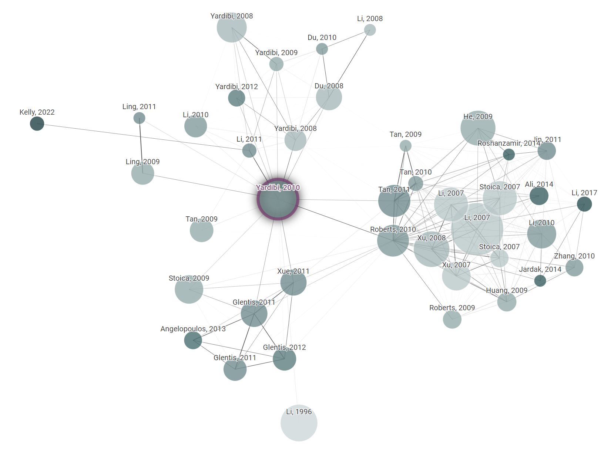
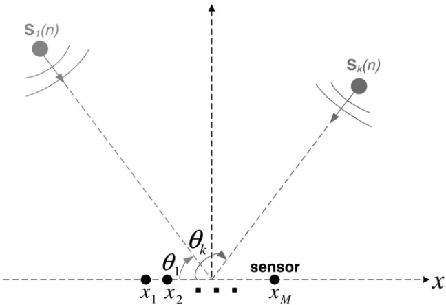
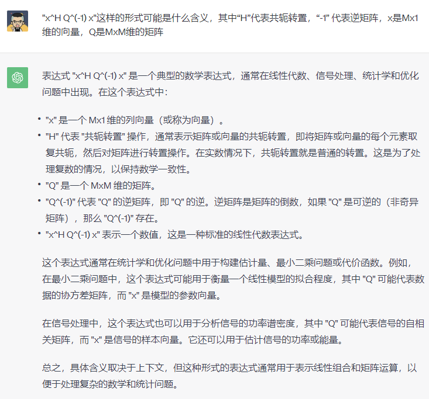
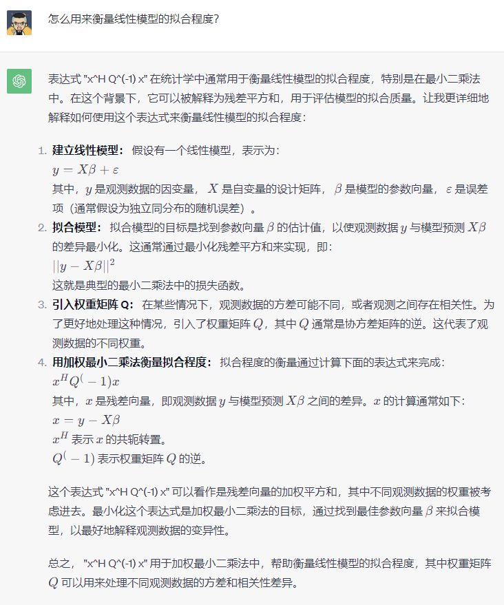
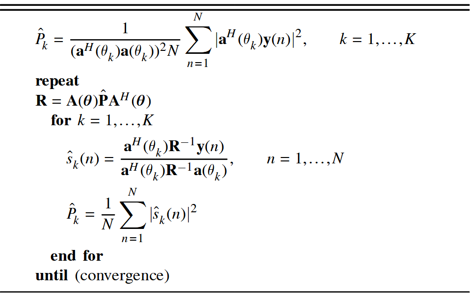
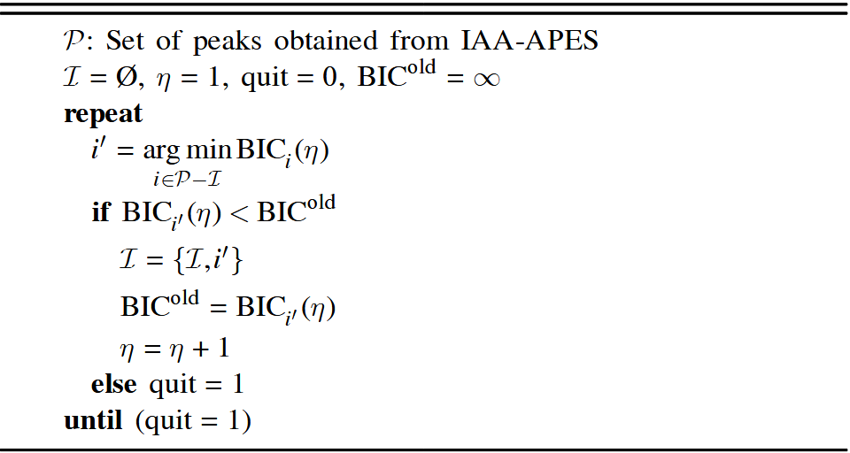
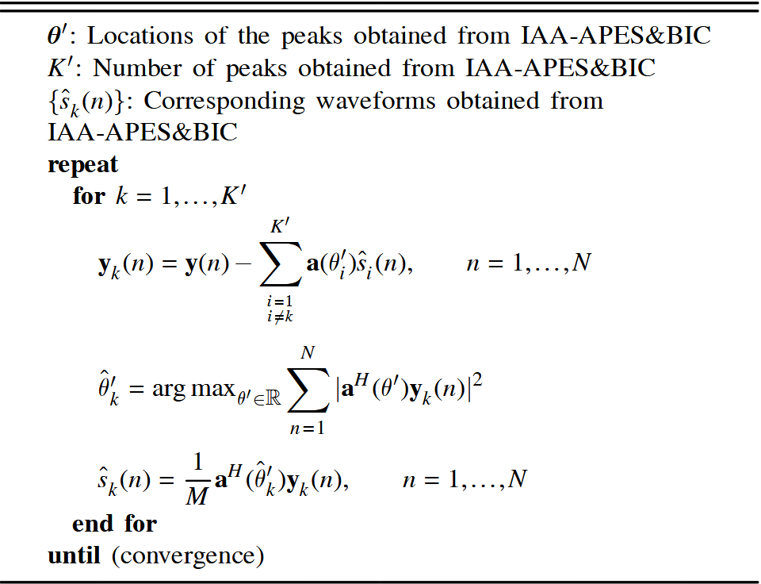

# Meta Data

* Title: Source Localization and Sensing: A Nonparametric Iterative Adaptive Approach Based on Weighted Least Squares

* Journal: IEEE Transactions on Aerospace and Electronic Systems

* Date: 2010

* Author:

  * Tarik Yardibi: Department of Electrical and Computer Engineering, University of California

  * Jian Li: Department of Electrical and Computer Engineering, University of California

* [Connected Papers:](https://www.connectedpapers.com/main/e2ca1a746f52d906458fb8ffc0d33e21b7877aa4/Source-Localization-and-Sensing%3A-A-Nonparametric-Iterative-Adaptive-Approach-Based-on-Weighted-Least-Squares/graph)

  {width=1200}

<!-- more -->

# Abs & Intro

* 背景：

  * 阵列处理面临的问题：快拍数不足、低 SNR、邻近源

  * 场景：水下阵列、SISO 雷达/声纳范围-多普勒成像、MISO 通信的信道估计

  * 基本阵列处理方法：

    * DAS：最基本的方法，分辨率低，旁瓣高

    * 标准 Capon 波束成形器 （SCB）、MUSIC：对不想干信源，在快拍数足够多时具有超分辨能力

    * 存在的问题：快拍数不足时、相干信源、低 SNR 时无法使用

  * 稀疏信号表出方法：

    * 原因：实际源的数量远小于可能的方向；

    * 优点：可以处理很少快拍的情况，即使只有一个快拍

    * 缺点：计算时间过长，需要调谐一个或数个超参数

* 问题：快拍数不足时难以估计信源参数

* 方法：

  * 基本算法：

    * **方法**：提出了一种***非参数化、无超参数、基于最小二乘的迭代自适应方法***，用于阵列处理中的幅度和相位估计（Iterative Adaptive Approach for Amplitude and Phase EStimation, IAA-APES）。

    * **效果**：IAA-APES 可以在少量快拍数据（甚至只有一个快拍）、不相干、部分相干和相干源以及任意阵列几何结构的情况下表现出良好的性能。

    * **扩展应用**：IAA-APES 还可应用于主动感知（Active Sensing）应用，包括 SISO 雷达/声纳范围-多普勒成像以及用于通信的 MISO 信道估计。

  * 扩展算法：

    * IAA-APES 可以通过模型阶数选择工具贝叶斯信息准则（Bayesian Information Criterion, BIC）扩展以获得稀疏结果，进而进行点源估计（point source estimation）。

    * 可以进一步通过应用基于参数松弛的循环方法（RELAX）来改进 IAA-APES\&BIC 估计的分辨率和准确性。

# Method

## Passive Sensing

### 基本模型

{width=500}

假设有 $K$ 个信源，位于 $\boldsymbol{\theta}\triangleq[\theta_1,\cdots,\theta_K]$，设快拍数为 $N$，则到达 $M$ 元阵列的接收快拍可表示为 $M$ 维矢量

$$
\boldsymbol{y}(n) = \boldsymbol{A}(\boldsymbol{\theta}) \boldsymbol{s}(n)+\boldsymbol{e}(n),\quad n=1,\cdots,N
$$

其中

* 阵列流形/导向矩阵：$\boldsymbol{A}(\boldsymbol{\theta})\triangleq[\boldsymbol{a}(\theta_1),\cdots,\boldsymbol{a}(\theta_K)]$，$\{\boldsymbol{a}(\theta_k)\in\mathbb{C}^{M\times 1}\}_{k=1}^K$，由阵列几何结构和信源的相对位置关系决定

* 信源：$\boldsymbol{s}(n)\triangleq[\boldsymbol{s}_1(n),\cdots,\boldsymbol{s}_K(n)]$

* 噪声：$\boldsymbol{e}(n)\triangleq[\boldsymbol{e}_1(n),\cdots,\boldsymbol{e}_M(n)]$

由于实际信号数量未知，因此 $K$ 可以看做是扫描格点的数量，这也是稀疏算法可以在 DOA 估计中应用的原因。

### IAA-APES

> IAA-APES 是一种基于加权最小二乘（Weighted Least Square, WLS）的数据相关非参数化算法。

将每个格点的功率记在对角阵的对角线元素中：$\boldsymbol{P}\in\mathbb{C}^{K\times K}$

$$
P_k = \frac{1}{N}\sum_{n=1}^N | s_k(n)|^2, \quad k = 1,\cdots,K
$$

则干扰（对于当前方向 $\theta_k$ 而言，其他方向的信号也算作干扰）和噪声协方差矩阵 $\boldsymbol{Q}(\theta_k)\in\mathbb{C}^{M\times M}$

$$
\begin{align*}
  \boldsymbol{Q}(\theta_k) &= \mathbb{E}[\boldsymbol{y}(n)\boldsymbol{y}^{\mathrm{H}}(n)] - \mathbb{E}\left[\left(\boldsymbol{a}\left(\theta_k\right)\boldsymbol{s}(n)\right)(\boldsymbol{a}(\theta_k)\boldsymbol{s}(n))^{\mathrm{H}}\right]\\
  &= \mathbb{E}\left[\boldsymbol{A}\left(\theta\right)\boldsymbol{s}(n)\boldsymbol{s}^{\mathrm{H}}(n)\boldsymbol{A}^\mathrm{H}(\theta)\right] - \mathbb{E}\left[\boldsymbol{a}\left(\theta_k\right)\boldsymbol{s}(n)\boldsymbol{s}^{\mathrm{H}}(n)\boldsymbol{a}^{\mathrm{H}}(\theta_k)\right]\\
  &=\boldsymbol{A}(\boldsymbol{\theta}) \boldsymbol{P} \boldsymbol{A}^{\mathrm{H}}(\boldsymbol{\theta}) - P_k \boldsymbol{a}\left(\theta_k\right) \boldsymbol{a}^{\mathrm{H}}\left(\theta_k\right) \\
  &\triangleq \boldsymbol{R} - P_k \boldsymbol{a}\left(\theta_k\right) \boldsymbol{a}^{\mathrm{H}}\left(\theta_k\right)
\end{align*}
$$

则 WLS 的代价函数为

$$
\sum_{n=1}^N \left\| \boldsymbol{y}(n) - s_k(n) \boldsymbol{a}(\theta_k) \right\|^2_{\boldsymbol{Q^{-1}(\theta_k)}}
$$

其中 $\left\| \boldsymbol{x} \right\|^2_{\boldsymbol{Q}^{-1}(\theta_k)}\triangleq\boldsymbol{x}^{\mathrm{H}}\boldsymbol{Q}^{-1}(\theta_k)\boldsymbol{x}$。

> {width=700px}
>
> {width=700px}

最小化 WLS 的代价函数可得

$$
\begin{align*}
\hat{s}_k(n) &= \frac{\boldsymbol{a}^{\mathrm{H}}(\theta_k) \boldsymbol{Q}^{-1}(\theta_k) \boldsymbol{y}(n)}{\boldsymbol{a}^{\mathrm{H}}(\theta_k) \boldsymbol{Q}^{-1}(\theta_k) \boldsymbol{a}(\theta_k)} \\
  &= \frac{\boldsymbol{a}^{\mathrm{H}}(\theta_k) \boldsymbol{R}^{-1} \boldsymbol{y}(n)}{\boldsymbol{a}^{\mathrm{H}}(\theta_k) \boldsymbol{R}^{-1} \boldsymbol{a}(\theta_k)} \\
\end{align*}, \quad n = 1,\cdots,N
$$

且对于每个扫描格点，$\{\hat{s}(n)\}_{k=1}^K$ 可以并行计算，因此可在并行硬件上实现。

{width=600px}

* IAA-APES 由上表给出，由于 IAA-APES 需要 $\boldsymbol{R}$，且 $\boldsymbol{R}$ 依赖于未知信号功率，因此必须用迭代来实现。

* $\boldsymbol{P}$ 和 $\boldsymbol{R}$ 由信号的估计得出，而非直接由快拍得出。

* 初始 $P_k$ 由 DAS 获得，并进行归一化

  $$
  \begin{align*}
    \hat{P}_k &= \displaystyle\frac{1}{(\boldsymbol{a}^{\mathrm{H}}(\theta_k)\boldsymbol{a}(\theta_k))^2 N} \sum_{n=1}^{N}\left| \boldsymbol{a}^{\mathrm{H}}(\theta_k) \boldsymbol{y}(n) \right|^2
    \\
    &=\displaystyle\frac{1}{(\boldsymbol{a}^{\mathrm{H}}(\theta_k)\boldsymbol{a}(\theta_k))^2 N} \sum_{n=1}^{N}\left| \boldsymbol{a}^{\mathrm{H}}(\theta_k) \boldsymbol{a}(\theta_k) \boldsymbol{s}(n) \right|^2 \\
  \end{align*}
  $$

* 经验结论：IAA-APES 的性能在 15 次迭代后就提升不大了。

* 由于 $\boldsymbol{P}$ 具有对角结构，所以对少量快拍和相干源都适用。

### IAA-APES\&BIC

引入模型阶数选择工具（model-order selection tool） BIC。

工作原理：令 $\mathcal{P}$ 为从 IAA-APES 空间功率谱估计中选择的峰值的索引集合；令 $\mathcal{I}$ 为到目前为止由 BIC 算法选择的峰值的索引集合。IAA-APES\&BIC 算法的工作原理如下：首先，从集合 $\mathcal{P}$ 中选择具有最小 BIC 值的峰值。然后，从集合 $\mathcal{P}-\mathcal{I}$ 中选择第二个峰值，它与第一个峰值一起使 BIC 值最小，依此类推，直到 BIC 值不再减小。

{width=600px}

其中

* $\text{BIC}_i(\eta) = 2MN \ln \left( \displaystyle\sum_{n=1}^N \left\| \boldsymbol{y}(n) - \sum_{j \in \{ \mathcal{I} \cup i \}} \boldsymbol{a}(\theta_j) \hat{\boldsymbol{s}}_j (n) \right\|_2^2 \right) + 3\eta \ln (2MN)$

  * 也即，将使得接收快拍 $\boldsymbol{y}(n)$ 和估计信号 $\displaystyle\sum_{j \in \{ \mathcal{I} \cup i \}} \boldsymbol{a}(\theta_j) \hat{\boldsymbol{s}}_j (n)$ 的距离最小的 index 作为峰值的 index

* $\eta = |\mathcal{I}| + 1$，$|\mathcal{I}|$ 表示集合 $\mathcal{I}$ 的大小

* $i$ 表示当前峰的 index

* $\{\hat{\boldsymbol{s}}_j (n)\}_{n=1}^N$ 是 IEE-APES 在 $\theta_j,j\in\{\mathcal{I}\cup i\}$ 方向的波形估计

* 第二项不影响峰值选择（选多少个峰），但是影响峰值数量的选择（留多少个峰）

### IAA-APES\&RELAX

RELAX 是一种参数循环算法，需要预先知道源数量。

工作原理：在 IAA-APEX 搜索结果的基础上，在每个峰的周围细化角度进行搜索，以功率为依据，修正信号来向和 DOA 估计波形。当两次估计的差小于一定门限（e.g. $5\times10^4$）时可认为收敛。

{width=600px}

## Active Sensing

# Simulation

## Passive Sensing

* 对比方法：

  * DAS

  * IAA-APES

  * IAA-APES\&RELAX

  * M-FOCUSS（Multiple-snapshot Focal Underdetermined System Solution）：稀疏参数 $p=0.8$，根据实际源的位置精调正则化参数 $\lambda$ 以获得最佳结果，因此 impractical

  * M-SBL（Sparse Bayesian Learning）

  * $\ell_1$-SVD（Singular Value Decomposition）：假定源数量已知，精调超参数，impractical

* 仿真条件：

  * 扫描格点：1°\~180°范围，1°步进

  * ULA，12个阵元，半波长间距

  * 噪声：均值为零、方差为 $\sigma^2$ 的圆周对称独立同分布复高斯随机过程

  * 信号：

    * 远场、窄带：

    * 功率归一化，使得 $\displaystyle\frac{1}{N}\sum_{n=1}^{N}|s_k(n)|^2=P_k,k=1,\cdots,K_0$，其中 $N$ 是快拍数，$K_0$ 是实际信源个数；

    * 信噪比定义为 $\text{SNR}_{\text{dB}}=10 \log_{10} \displaystyle\frac{P_k}{\sigma^2},k=1,\cdots,K_0$

* 仿真结果

  * Case 1：

    * 三个***不相干***的源，分别位于 60°、82° 和 90°，SNR 分别为 5dB、10dB 和 10dB，单次迭代所用快拍数 $N=3$，每种方法 10 次仿真

    * 各种方法 DOA 估计结果：

      * DAS：可能混叠

      * IAA-APES

      * IAA-APES\&RELAX：可以准确判断信源个数、方向和功率

      * M-FOCUSS、M-SBL、$\ell_1$-SVD：均不准确

    {width=800px}

  * Case 2：

    * 三个***相干***的源，分别位于 60°、80° 和 90°，SNR 分别为 10dB、10dB 和 10dB，单次迭代所用快拍数 $N=3$，每种方法 10 次仿真；

    * 各种方法 DOA 估计结果：

      * DAS：完全混叠

      * IAA-APES

      * IAA-APES\&RELAX：可以准确判断信源个数、方向和功率

      * M-FOCUSS、M-SBL、$\ell_1$-SVD：均不准确

    {width=800px}

  * Case 3:

    * 两个***不相干***的源，分别位于 77.51° 和 90.51°（避开 1° 的格点），单次迭代所用快拍数 $N=1$，每种方法 100 次仿真；

      * IAA-APES\&RELAX：原条件

      * FOCUSS、$\ell_1$-SVD：分辨率 0.01°，950 个格点，即 $K=950$，均具有两个超参数需要根据不同场景调节

      * SBL：复杂度过大，不展示

    * 结果：各算法在不同 SNR 下的 (a) 角度估计的总均方误差和 CRB；(b) 角度估计总偏差

      * IAA-APES\&RELAX：低 SNR 下表现更好

    {width=800px}

* 复杂度分析：假设 $K\gg M$，也即格点数远大于阵元数

  * IAA-APES：每次迭代 $\mathcal{O}(M^2K)$

  * IAA-APES\&BIC：每次迭代 $\mathcal{O}(M^2K)$，由 BIC 导致的复杂度增加相比原复杂度可以忽略不计

  * IAA-APES\&RELAX：取决于 IAA-APES\&BIC 得到的信源个数、终止条件和所选用的方法

  * M-FOCUSS、M-SBL：每次迭代 $\mathcal{O}(M^2K)$

  * $\ell_1$-SVD：每次迭代 $\mathcal{O}(M^2K_{\text{SVD}}^3)$，其中$K_{\text{SVD}}$ 是估计的信源个数

  在作者的实验过程中：

  * RELAX 通常比 IAA-APES 更快收敛

  * IAA-APES 总是比 M-FOCUSS、M-SBL 和 $\ell_1$-SVD 更快收敛，特别是当 SNR 较低时

## Active Sensing

### SISO Range-Doppler Imaging

{width=800px}

### MISO Communication Channel Estimation

{width=800px}

# Conclusion

> IAA-APES is believed to be a viable candidate for practical applications since it does not require any hyperparameters, has a simple formulation, provides superresolution, facilitates parallel processing, and shows good performance.

# Reference

1. T. Yardibi, J. Li, P. Stoica, M. Xue, and A. B. Baggeroer, “Source Localization and Sensing: A Nonparametric Iterative Adaptive Approach Based on Weighted Least Squares,” IEEE Transactions on Aerospace and Electronic Systems, vol. 46, no. 1, pp. 425–443, Jan. 2010, doi: 10.1109/TAES.2010.5417172.
