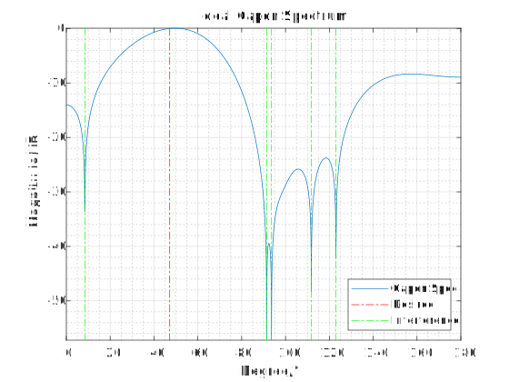
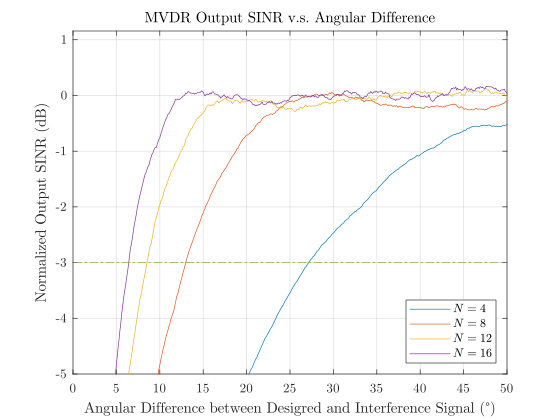

&emsp;&emsp;MVDR （Minimum Variance Distortionless Response，最小方差无失真响应）算法是 Capon 于 1969 年提出的经典波束形成算法，其解决的是无失真约束下输出噪声加干扰功率最小化问题。

# 阵列模型

&emsp;&emsp;首先对阵列接收信号进行建模。假设 $N$ 元阵列天线在 $t$ 时刻的阵列接收信号和阵列输出信号分别为 $\mathbf{x}(t)$ 和 $y(t)$，则对于 $K$ 个入射信号，有

$$\begin{equation}
  \begin{cases}
    \mathbf{x}(t) = \mathbf{A}(\boldsymbol{\theta})\mathbf{s}(t) + \mathbf{n}(t) \\
    y(t) = \mathbf{w}^\mathrm{H}\mathbf{x}(t)
  \end{cases},\quad t = 1,\cdots,T
\end{equation}$$

其中

- 阵列接收信号 $\mathbf{x}(t) = [x_1(t),\cdots,x_N(t)]^\mathrm{T}\in\mathbb{C}^{N\times 1}$

- 噪声 $\mathbf{n}(t) = [n_1(t),\cdots,n_N(t)]^\mathrm{T}\in\mathbb{C}^{N\times 1}$

- 入射信号 $\mathbf{s}(t) = [s_1(t),\cdots,s_K(t)]^\mathrm{T}\in\mathbb{C}^{K\times 1}$

- 阵列流形矩阵 $\mathbf{A}(\boldsymbol{\theta}) = [\mathbf{a}(\theta_1),\cdots,\mathbf{a}(\theta_K)]\in \mathbb{C}^{N\times K}$，导向矢量 $\mathbf{a}(\theta_i)\in\mathbb{C}^{N\times 1}$，$K$ 个信号来向集合 $\boldsymbol{\theta} = \{\theta_i\}_{i=1}^K$

- 波束形成复加权 $\mathbf{w} = [w_1,\cdots,w_N]^\mathrm{T}$

<!-- more -->

# MVDR 算法简述

&emsp;&emsp;假设第 1 个信号是期望信号（desired signal），令其导向矢量 $\mathbf{a}_\mathrm{d} = \mathbf{a}(\theta_1)$，则阵列接收信号可以进一步写为

$$\begin{equation}
  \mathbf{x}(t) = \underset{\mathbf{x}_\mathrm{d}(t)}{\underbrace{\mathbf{a}_\mathrm{d}s_1(t)}}
  +
  \underset{\mathbf{x}_\mathrm{i+n}(t)}{\underbrace{\sum_{k=2}^{K}\mathbf{a}(\theta_k)s_k(t) + \mathbf{n}(t)}}
\end{equation}$$

至此，可以给出 MVDR 问题的基本表述

$$\begin{equation}
  \begin{aligned}
    &\underset{\mathbf{w}}{\text{minimize}} &&\mathbf{w}^\mathrm{H}\mathbf{R}_{\mathrm{i+n}}\mathbf{w}
    \\
    &\text{subject to} && \mathbf{w}^\mathrm{H}\mathbf{a}_\mathrm{d} = 1
  \end{aligned}
\end{equation}$$

其闭式解可以由 Lagrange 乘子法得到

$$\begin{equation}
  \mathbf{w} = \alpha\mathbf{R}_{\mathrm{i+n}}^{-1}\mathbf{a}_\mathrm{d}
\end{equation}$$

其中

- 噪声加干扰协方差矩阵 $\mathbf{R}_{\mathrm{i+n}} = \displaystyle\frac{1}{T} \sum_{t=1}^{T}\mathbf{x}_\mathrm{i+n}(t)\mathbf{x}_\mathrm{i+n}^\mathrm{H}(t)$

- 归一化因子（使得复加权对于期望信号的增益为 1） $\alpha = \displaystyle\frac{1}{\mathbf{a}_\mathrm{d}^\mathrm{H}\mathbf{R}_{\mathrm{i+n}}^{-1}\mathbf{a}_\mathrm{d}}$

# MVDR 算法仿真

&emsp;&emsp;使用 ULA（Uniform Linear Array，均匀线阵）对 MVDR 算法进行仿真，阵元间距为半波长。

## 理想情况

&emsp;&emsp;在理想情况下，各阵元的位置与预期一致，各阵元的复加权器是没有误差的，目标信号来向与期望方向一致，且信号和干扰加噪声可以分离。

### 空域谱

&emsp;&emsp;Capon 空域谱表示 MVDR 复加权在整个空域范围内的响应。假设 1 个信号和 6 个干扰同时入射，信噪比 $\mathrm{SNR}=30\mathrm{dB}$，干噪比 $\mathrm{INR} = 70\mathrm{dB}$，信号和干扰来向在 $[0^\circ,180^\circ]$ 内服从均匀分布，使用 1000 个快拍进行仿真。

&emsp;&emsp;得到的空域谱如[图 1](#fig.1)，其中期望来向用红色点划线表示，干扰来向用绿色点划线表示。仿真同时还计算了输出 SINR，用于衡量残余干扰的大小。

<a id="fig.1"></a>

{width=700px}



``` matlab mvdr_spec.m
%% High-Resolution Frequency-Wavenumber Spectrum Analysis
% J. Capon, “High-Resolution Frequency-Wavenumber Spectrum Analysis,” _Proceedings
% of the IEEE_, vol. 57, no. 8, pp. 1408–1418, Aug. 1969, doi: <https://doi.org/10.1109/PROC.1969.7278
% 10.1109/PROC.1969.7278>.
%
% H. L. Van Trees, _Optimum Array Processing: Part IV of Detection, Estimation,
% and Modulation Theory_. New York, NY: Wiley, 2002.

clear
close all
%% Parameters

rng(253)
% Array Parameters

% elements in array
elemNum = 12;

% spacing wrt wavelength
elemSpac = 0.5;

% element locations
elemLoc = 0:elemSpac:(elemNum-1)*elemSpac;
% Signal Parameters

% signal number
sigNum = 6;

% direction of arrival
sigAng = rand(1,sigNum)*180;

% signal to noise ratio
snr = [30,70];

% sample number
sampleNum = 1000;

% parameter match check
if (length(snr) ~= sigNum) | (length(sigAng) ~= sigNum)
  disp('WARN: Signal number and parameter number NOT match.')
end
%% Impinging Waves/Signals
% Transmitted Signals

% wave generation, here are some sets of uncorrelated white noise
txWave = randn(sigNum,sampleNum);

% transmit power control based on given snr
if length(snr) == 1
  txWave = db2mag(snr)*txWave;
elseif length(snr) >= sigNum
  if length(snr) > sigNum
    disp('WARN: Extra SNRs are ignored.')
  end
  for i = 1:sigNum
    txWave(i,:) = db2mag(snr(i))*txWave(i,:);
  end
elseif length(snr) < sigNum
  disp('WARN: The last SNR is used for the rest of the signals.')
  for i = 1:sigNum
    if i <= length(snr)
      txWave(i,:) = db2mag(snr(i))*txWave(i,:);
    else
      txWave(i,:) = db2mag(snr(end))*txWave(i,:);
    end
  end
end
% Array Manifold Matrix
% For each signal, the array manifold vector is
%
% $$\mathbf{a}\left(\theta \right)=\exp \left(-j\frac{2\pi \mathbf{d}}{\lambda
% \;}\cos \theta \;\right)$$
%
% in which the element locations are
%
% $$\mathbf{d}={\left\lbrack 0,\frac{\lambda }{2},\cdots ,\left(N-1\right)\frac{\lambda
% }{2}\right\rbrack }^{\mathrm{T}}$$

if length(sigAng) > sigNum
  disp('WARN: Extra angles are ignored.')
elseif length(sigAng) < sigNum
  disp('ERROR: Angle number is less than signal number.')
  return
end

arrayMF = exp(-1i*pi*elemLoc'*cos(sigAng(1:sigNum)/180*pi));

if sigNum > 1
  % signal & interference manifold vector
  sigMF = arrayMF(:,1);
  intMF = arrayMF(:,2:end);

  % impinging signal & interference
  rxSig = sigMF*txWave(1,:);
  rxIpn = intMF*txWave(2:end,:) + randn(elemNum,sampleNum);
else
  % signal manifold vector
  sigMF = arrayMF;

  % impinging signal
  rxSig = sigMF*txWave;
  rxIpn = randn(elemNum,sampleNum);
end
% Received Wave

rxWave = rxSig + randn(elemNum,sampleNum);
%% Array Processing
% The MVDR problem is to minimize output interference-plus-noise power under
% distortionless contraint of target signal
%
% $$\begin{array}{l}\underset{\mathbf{w}}{\mathrm{minimize}\;\;} \;{\mathbf{w}}^{\mathrm{H}}
% {\mathbf{R}}_{\mathrm{i}+\mathrm{n}} \mathbf{w}\\\mathrm{subecto}\;\mathrm{to}\;\;{\mathbf{w}}^{\mathrm{H}}
% \mathbf{a}=1\end{array}$$
%
% The problem can be solve using the Lagrange multiplier method, and the solution
% is
%
% $$\mathbf{w}=\alpha {\mathbf{R}}_{\mathrm{i}+\mathrm{n}}^{-1} \mathbf{a}$$
%
% where $\alpha \;$is the normalization factor that ensures the power of array
% input and output desired signal remains unchanged
%
% $$\alpha =\frac{1}{{\mathbf{a}}^{\mathrm{H}} {\mathbf{R}}_{\mathrm{i}+\mathrm{n}}
% \mathbf{a}}$$

% interference-plus-noise covariance matrix
ipnCovar = rxIpn*rxIpn';

% MVDR weight vector
weight = ipnCovar\sigMF/(sigMF'*(ipnCovar\sigMF));
%      = inv(ipnCovar)*sigMF/(sigMF'*inv(ipnCovar)*sigMF);

% output SINR
sinrOut = pow2db(var(weight'*rxSig)/var(weight'*rxIpn));
%% Spectrum & Figure

% scan grid
scanGrid = 0:0.1:180;

% spectrum
spec = zeros(size(scanGrid));

for i = 1:length(scanGrid)
  % steering vector
  scanMF = exp(-1i*pi*elemLoc'*cos(scanGrid(i)/180*pi));

  % MVDR spectrum
  spec(i) = weight'*scanMF;
end

% normalized spectrum
specNorm = pow2db(abs(spec));

% spectrum & signal location indicator
plot(scanGrid,specNorm)
hold on
for i = 1:sigNum
  if i == 1
    plot([sigAng(i),sigAng(i)],[max(specNorm),min(specNorm)],'-.r');
  else
    plot([sigAng(i),sigAng(i)],[max(specNorm),min(specNorm)],'-.g');
  end
end
hold off

legend({'Capon Spec','Desired','Interference'},Location="southeast")

axis tight
title('Ideal Capon Spectrum')
xlabel('Degree/°')
ylabel('Magnitude/dB')
grid on
grid minor
```



### 分辨率

&emsp;&emsp;MVDR 算法的分辨率用来衡量 MVDR 算法对接近目标方向的干扰的抑制能力。假设 1 个信号和 1 个干扰同时入射，信噪比 $\mathrm{SNR}=0 \mathrm{dB}$，干噪比 $\mathrm{INR} = 70\mathrm{dB}$，假定目标来向为 90°，干扰和信号来向差在 0°~50° 范围内扫描，对阵元数 $N=4,8,12,16$ 四种情况进行仿真。

&emsp;&emsp;[图 2](#fig.2) 以 MVDR 算法的输出 SINR 作为指标,给出了随期望、干扰信号来向的角度差的变化曲线，其中输出 SINR 归一化到 0 dB，便于不同阵元数情况的对比。点划线给出了低于理想 SINR 3 dB 的值，将点划线和实线的交点作为 MVDR 算法的分辨率。

<a id="fig.2"></a>

{width=700px}



``` matlab mvdr_resolution.m
%% High-Resolution Frequency-Wavenumber Spectrum Analysis
% J. Capon, “High-Resolution Frequency-Wavenumber Spectrum Analysis,” _Proceedings
% of the IEEE_, vol. 57, no. 8, pp. 1408–1418, Aug. 1969, doi: <https://doi.org/10.1109/PROC.1969.7278
% 10.1109/PROC.1969.7278>.
%
% H. L. Van Trees, _Optimum Array Processing: Part IV of Detection, Estimation,
% and Modulation Theory_. New York, NY: Wiley, 2002.

clear
close all

rng(253)

%% Scan Configuration
elemNumArr = [4,8,12,16];
intAngArr = 0.1:0.1:50;

sinrOut = zeros(length(elemNumArr),length(intAngArr));

for elemNumIdx = 1:length(elemNumArr)
for intAngIdx = 1:length(intAngArr)

%% Array Parameters

% elements in array
elemNum = elemNumArr(elemNumIdx);

% spacing wrt wavelength
elemSpac = 0.5;

% element locations
elemLoc = 0:elemSpac:(elemNum-1)*elemSpac;

% Signal Parameters

% signal number
sigNum = 2;

% direction of arrival
desAng = 90;
sigAng = [desAng,desAng+intAngArr(intAngIdx)];

% signal to noise ratio
snr = [0,70];

% sample number
sampleNum = 1024;

%% Impinging Waves/Signal

% wave generation, here are some sets of uncorrelated white noise
txWave = randn(sigNum,sampleNum);

% transmit power control based on given snr
if length(snr) == 1
  txWave = db2mag(snr)*txWave;
elseif length(snr) >= sigNum
  if length(snr) > sigNum
    disp('WARN: Extra SNRs are ignored.')
  end
  for i = 1:sigNum
    txWave(i,:) = db2mag(snr(i))*txWave(i,:);
  end
elseif length(snr) < sigNum
  disp('WARN: The last SNR is used for the rest of the signals.')
  for i = 1:sigNum
    if i <= length(snr)
      txWave(i,:) = db2mag(snr(i))*txWave(i,:);
    else
      txWave(i,:) = db2mag(snr(end))*txWave(i,:);
    end
  end
end

%% Array Manifold Matrix
if length(sigAng) > sigNum
  disp('WARN: Extra angles are ignored.')
elseif length(sigAng) < sigNum
  disp('ERROR: Angle number is less than signal number.')
  return
end

arrayMF = exp(-1i*pi*elemLoc'*cos(sigAng(1:sigNum)/180*pi));

% signal & interference manifold vector
sigMF = arrayMF(:,1);
intMF = arrayMF(:,2:end);

% impinging signal & interference
rxSig = sigMF*txWave(1,:);
rxIpn = intMF*txWave(2:end,:) + randn(elemNum,sampleNum);

%% AWGN Channel & Received Wave
rxWave = rxSig + randn(elemNum,sampleNum);

%% Array Processing

% interference-plus-noise covariance matrix
ipnCovar = rxIpn*rxIpn';

% MVDR weight vector
weight = ipnCovar\sigMF/(sigMF'*(ipnCovar\sigMF));
%      = inv(ipnCovar)*sigMF/(sigMF'*inv(ipnCovar)*sigMF);

% nomarlized output SINR
sinrIdeal = snr(1)+pow2db(elemNum);
sinrOut(elemNumIdx,intAngIdx) = pow2db(var(weight'*rxSig)/ ...
  var(weight'*rxIpn)) - sinrIdeal;

end

plot(intAngArr,smoothdata(sinrOut(elemNumIdx,:)),DisplayName=['$N=', ...
  num2str(elemNumArr(elemNumIdx)),'$'])
hold on

end

%% figures
plot([min(intAngArr),max(intAngArr)],[-3,-3],HandleVisibility="off")
hold off

title('MVDR Output SINR v.s. Angular Difference')
xlabel('Angular Difference between Desigred and Interference Signal (°)')
ylabel('Normalized Output SINR (dB)')
ylim([-5 max(smoothdata(sinrOut,2),[],'all')+1])

legend(Interpreter="latex",Location="southeast");

grid on
```



### 理想误码率

## 失配情况

### 分辨率

### 误码率

# Reference

1. J. Capon, “High-Resolution Frequency-Wavenumber Spectrum Analysis,” _Proceedings of the IEEE_, vol. 57, no. 8, pp. 1408–1418, Aug. 1969, doi: [10.1109/PROC.1969.7278](https://doi.org/10.1109/PROC.1969.7278).

2. H. L. Van Trees, _Optimum Array Processing: Part IV of Detection, Estimation, and Modulation Theory_. New York, NY: Wiley, 2002.
