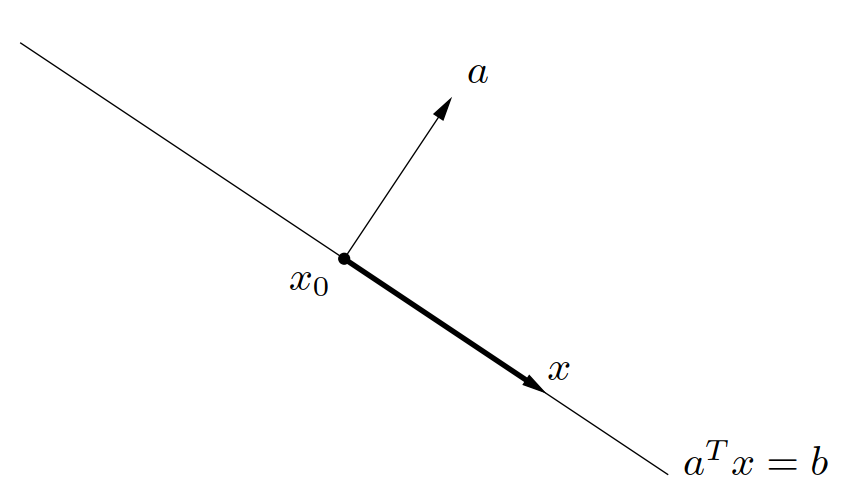
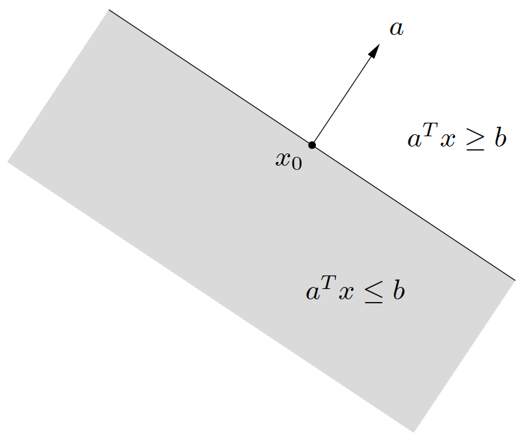
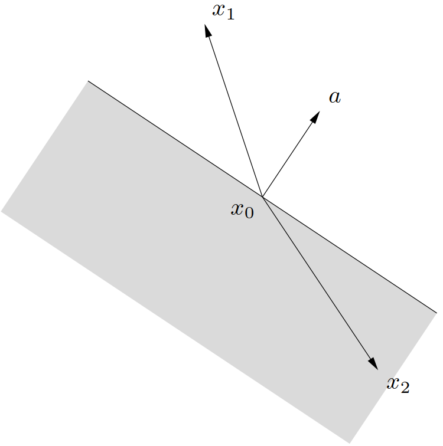
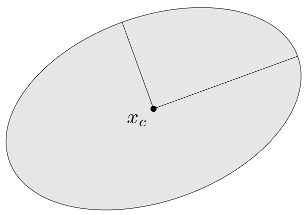
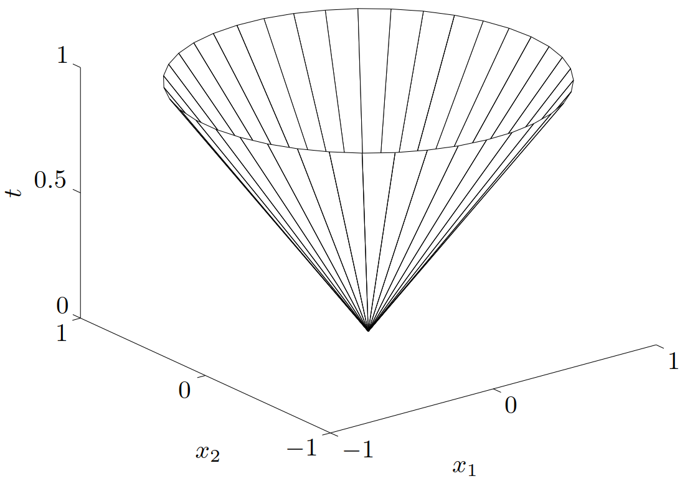
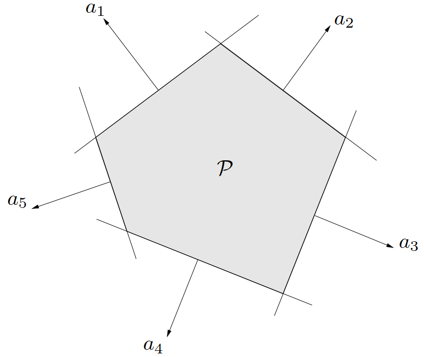
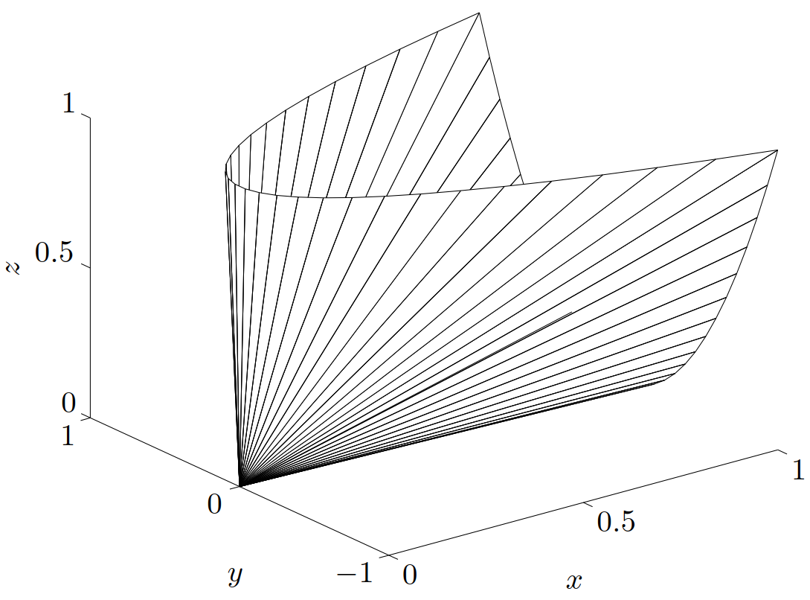

$\newcommand{\bfR}{\mathbf{R}}
\newcommand{\bfS}{\mathbf{S}}
\newcommand{\TT}{\mathrm{T}}
\newcommand{\E}{\mathcal{E}}
\newcommand{\P}{\mathcal{P}}
\def\conv{\mathop{\bf conv}}$&emsp;&emsp;本文将描述一些重要的凸集。首先介绍一些简单的例子。

- 空集 $\emptyset$、任意一个点（即单点集（singleton））$\{x_0\}$ 、全空间 $\bfR^n$ 都是 $\bfR^n$ 的仿射（自然也是凸的）子集。

- 任意直线是仿射的。如果直线通过零点，则是子空间，因此，也是凸锥。

- 一条线段是凸的，但不是仿射的（除非退化为一个点）。

- 一条**射线**（*ray*），即具有形式 $\left\{x_0 + \theta v\ \middle|\ \theta \geqslant 0 \right\}, v \ne 0$ 的集合，是凸的，但不是仿射的。如果射线的基点 $x_0$ 是 $0$，则它是凸锥。

- 任意子空间是仿射的、凸锥（自然是凸的）。

<!-- more -->

# 1. 超平面与半空间

&emsp;&emsp;**超平面**（*hyperplane*）是具有如下形式的集合

$$
\left\{ x\ \middle|\ a^\TT x = b \right\}
$$

其中 $a \in \bfR^n, a \ne 0$ 且 $b \in \bfR$。解析地来看，超平面是关于 $x$ 的非平凡线性方程的解空间（因此是一个仿射集合）。几何上，超平面 $\left\{ x\ \middle|\ a^\TT x = b \right\}$ 可以理解为与给定向量 $a$ 的内积为常数的点的集合；也可以看成法线方向为 $a$ 的超平面，而常数 $b \in \bfR$ 决定了这个平面从原点的偏移。为更好地理解几何含义，可以将超平面表示成

$$
\left\{ x\ \middle|\ a^\TT (x - x_0) = 0 \right\}
$$

其中 $x_0$ 是超平面上的任意一点（即任意满足 $a^\TT x_0 = b$ 的点）。进一步，可以表示为

$$
\left\{ x\ \middle|\ a^\TT (x - x_0) = 0 \right\} = x_0 + a^\perp
$$

其中 $a^\perp$ 表示 $a$ 的正交补，即与 $a$ 正交的向量的集合：

$$
a^\perp = \left\{ v\ \middle|\ a^\TT v = 0 \right\}
$$

从中可以看出，超平面由偏移 $x_0$ 加上所有正交于（法）向量 $a$ 的向量构成，具体可见[图 6](#图6) 。

{width=400px}

&emsp;&emsp;一个超平面将 $\bfR^n$ 划分为两个**半空间**（*halfspaces*）。（闭的）半空间是具有下列形式的集合，

$$\begin{equation}\label{HalfSpace}
  \left\{x\ \middle|\ a^\TT x \leqslant b \right\}
\end{equation}
$$

即（非平凡的）线性不等式的解空间，其中 $a\ne 0$。半空间是凸的，但不是仿射的，如[图 7](#图7) 所示。

{width=400px}

&emsp;&emsp;半空间 $\eqref{HalfSpace}$ 也可以表示为

$$
\left\{x\ \middle|\ a^\TT (x - x_0) \leqslant 0 \right\}
$$

其中 $x_0$ 是相应超平面上的任意一点，即 $x_0$ 满足 $a^\TT x_0 = b$。上式有一个简单的几何解释：半空间由 $x_0$ 加上任意与（向外的法）向量 $a$ 呈钝角（或直角）的向量组成，如[图 8](#图8) 所示。

{width=400px}

&emsp;&emsp;半空间 $\eqref{HalfSpace}$ 的边界是超平面 $\left\{x\ \middle|\ a^\TT x = b \right\}$。集合 $\left\{x\ \middle|\ a^\TT x < b \right\}$ 是半空间 $\left\{x\ \middle|\ a^\TT x \leqslant b \right\}$ 的内部，称为**开半空间**（*open halfspace*）。

# 2. Euclid球和椭球

&emsp;&emsp;$\bfR^n$ 中的空间 **Euclid 球**（*Euclidean ball*）（或简称为球）具有下面的形式：

$$
B(x_c,r) = \left\{x\ \middle|\ \left\| x - x_c \right\|_2 \leqslant r \right\} = \left\{ x\ \middle|\ (x-x_c)^\TT(x-x_c) \leqslant r^2 \right\}
$$

其中 $r > 0$，$\| \cdot \|_2$ 表示 Euclid 范数，即 $\|u\|_2 = (u^\TT u)^{1/2}$。向量 $x_r$ 是**球心**（*center*），标量 $r$ 为**半径**（*radius*）。$B (x_c, r)$ 由距离球心 $x_r$ 距离不超过 $r$ 的所有点组成。 Euclid 球的另一个常见的表达式为：

$$
B(x_c,r) = \left\{ x_c + ru\ \middle|\ \|u\|_2 \leqslant 1 \right\}
$$

&emsp;&emsp;Euclid 球是凸集，即如果 $\|x_1-x_2\|\leqslant r$，$\|x_2-x_c\|\leqslant r$，并且 $0 \leqslant \theta \leqslant 1$，那么

$$\begin{aligned}
  \left\| \theta x_1 + (1- \theta)x_2 - x_c\right\|_2 &= \left\| \theta(x_1 - x_c) + (1-\theta)(x_2 - x_c)\right\|_2
  \\
  &\leqslant \theta \left\|x_1 - x_c\right\|_2 + (1-\theta) \left\| x_2 - x_c \right\|_2
  \\
  & \leqslant r
\end{aligned}$$

（此处利用了 $\| \cdot \|_2$ 的齐次性和三角不等式。）

&emsp;&emsp;一类相关的凸集是**椭球**（*ellipsoid*），它们具有如下的形式：

$$\begin{equation}\label{ellipsoid-1}
  \E = \left\{ x\ \middle|\ (x-x_c)^\TT P^{-1}(x-x_c) \leqslant 1 \right\}
\end{equation}$$

其中 $P = P^\TT \succ 0$，即 $P$ 是对称正定矩阵。向量 $x_c \in \bfR^n$ 为椭球的中心。矩阵 $P$ 决定了椭球从 $x_c$ 向各个方向扩展的幅度。$\E$ 的半轴长度由 $\sqrt{\lambda_i}$ 给出，这里 $\lambda_i$ 为 $P$ 的特征值。球可以看成 $P = r^2I$ 的椭球。[图 9](#图9) 给出了 $\bfR^2$ 上的一个椭球。

{width=300px}

&emsp;&emsp;椭球另一个常用的表示形式是

$$\begin{equation}\label{ellipsoid-2}
  \E = \left\{ x_c + Au\ \middle|\ \|u\|_2 \leqslant 1 \right\}
\end{equation}$$

其中 $A$ 是非奇异的方阵。在此类表示形式中，可以不失一般性地假设 $A$ 对称正定。取 $A=P^{1/2}$，这个表达式给出了由式 $\eqref{ellipsoid-1}$ 定义的椭球。当式 $\eqref{ellipsoid-2}$ 中的矩阵 $A$ 为对称半正定矩阵，但奇异时，集合 $\eqref{ellipsoid-2}$ 称为**退化的椭球**（*degenerate ellipsoid*），其仿射维数等于 $A$ 的秩。退化的椭球也是凸的。

# 3. 范数球和范数锥

&emsp;&emsp;设 $\| \cdot \|$ 是 $\bfR^n$ 中的范数。由范数的一般性质可知，以 $r$ 为半径，$x_c$ 为球心的**范数球**（*norm ball*） $\left\{ x\ \middle|\ \|x-x_c\| \leqslant r \right\}$ 是凸的。关于范数 $\| \cdot \|$ 的**范数锥**（*norm cone*）是集合

$$
C = \left\{ (x,t)\ \middle|\ \|x\| \leqslant t \right\} \subseteq \bfR^{n+1}
$$

顾名思义，它是一个凸锥。

> **举例**&emsp;**二阶锥**（*second-order cone*）是由 Euclid 范数定义的范数锥，即
>
> $$\begin{aligned}
>   C &= \left\{ (x,t) \in \bfR^{n+1}\ \middle|\ \|x\|_2 \leqslant t\right\}
>   \\
>   &= \left\{ \left[\begin{array}{c}
>     x \\ t
>   \end{array} \right]\ \middle|\ \left[\begin{array}{c}
>     x \\ t
>   \end{array} \right]^\TT\left[\begin{array}{c}
>     I & 0 \\ 0 & -1
>   \end{array} \right] \left[\begin{array}{c}
>     x \\ t
>   \end{array} \right] \leqslant 0,\ t\geqslant 0 \right\}
> \end{aligned}$$
>
> 二阶锥的其他名字也常常被使用。它由二次不等式定义，因此也被称为**二次锥**（*quadratic cone*）。同时，也称其为 **Lorentz 锥**（*Lorentz cone*）或**冰激凌锥**（*ice-cream cone*）。[图 10](#图10) 显示了 $\bfR^3$ 上一个的二阶锥。
>
> 
>
> {width=500px}

# 4. 多面体

&emsp;&emsp;**多面体**（*polyhedron*）被定义为有限个线性等式和不等式的解集：

$$\begin{equation}\label{polyhedron-1}
  \P = \left\{ x\ \middle|\ a_j^\TT x \leqslant b_j,\ j = 1,\cdots,m,\ c_j^\TT x = d_j,\ j = 1,\cdots,p\right\}
\end{equation}$$

因此，多面体是有限个半空间和超平面的交集。仿射集合（例如子空间、超平面、直线）、射线、线段和半空间都是多面体。显而易见，多面体是凸集。有界的多面体有时也称为**多胞形**（*polytope*），但也有一些作者反过来使用这两个概念（即用多胞形表示具有 $\eqref{polyhedron-1}$ 形式的集合，而当其有界时称为多面体）。[图 11](#图11) 显示了一个由五个半空间的交集定义的多面体。

{width=400px}

&emsp;&emsp;可以方便地使用紧凑表达式

$$\begin{equation}\label{polyhedron-2}
  \P = \left\{ x\ \middle|\ Ax \preceq b,\ Cx = d \right\}
\end{equation}$$

来表示 $\eqref{polyhedron-1}$，其中

$$
A = \left[\begin{array}{c}
  a_1^\TT \\ \vdots \\ a_m^\TT
\end{array}\right],\qquad C = \left[\begin{array}{c}
  c_1^\TT \\ \vdots \\ c_p^\TT
\end{array}\right]
$$

此处的 $\preceq$ 代表 $\bfR^m$ 上的**向量不等式**（*vector inequality*）或**分量不等式**（*componentwise inequality*）：$u \preceq v$ 表示 $u_i \leqslant v_i, i = 1,\cdots, m$。

> **举例**&emsp;**非负象限**（*nonnegative orthant*）是具有非负分量的点的集合，即
>
> $$
> \bfR_+^n = \left\{ x\in\bfR^n\ \middle|\ x_i \geqslant 0,\ i = 1,\cdots,n \right\} = \left\{ x\in \bfR^n\ \middle|\ x \succeq 0 \right\}
> $$
>
> （此处 $\bfR_+$ 表示非负实数的集合，即 $\bfR_+ = \left\{ x\in\bfR\ \middle|\ x \geqslant 0 \right\}$。）非负象限既是多面体也是锥（因此称为**多面体锥**（*polyhedral cone*））。

## 4.1 单纯形

&emsp;&emsp;**单纯形**（*simplex*）是一类重要的多面体。设 $k+1$ 个点 $v_0,\cdots,v_k \in \bfR^n$ 仿射独立，即 $v_1 - v_0, \cdots, v_k-v_0$ 线性独立，那么，这些点决定了一个单纯形：

$$\begin{equation}\label{simplex}
  C = \conv{\{v_0,\cdots,v_k\}} = \left\{ \theta_0v_0 + \cdots + \theta_k v_k\ \middle|\ \theta \succeq 0,\ \mathbf{1}^\TT\theta = 1 \right\}
\end{equation}$$

其中 $\mathbf{1}$ 表示所有分量均为 $1$ 的向量。这个单纯形的仿射维数为 $k$，因此也称为 $\bfR^n$ 空间的 $k$ 维单纯形。

> **举例**&emsp;**一些常见的单纯形**。1 维单纯形是一条线段；2 维单纯形是一个三角形（包含其内部）； 3 维单纯形是一个四面体。
>
> **单位单纯形**（*unit simplex*）是由零向量和单位向量 $\mathbf{0}, e_1,\cdots, e_n \in \bfR^n$ 决定的 $n$ 维单纯形。它可以表示为满足下列条件的向量的集合：
>
> $$
> x \succeq 0,\qquad \mathbf{1}^\TT x\leqslant 1
> $$
>
> **概率单纯形**（*probability simplex*）是由单位向量 $e_1,\cdots, e_n \in \bfR^n$ 决定的 $n - 1$ 维单纯形。它是满足下列条件的向量的集合：
>
> $$
> x \succeq 0,\qquad \mathbf{1}^\TT x= 1
> $$
>
> 概率单纯形中的向量对应于含有 $n$ 个元素的集合的概率分布，$x_i$ 可理解为第 $i$ 个元素的概率。

&emsp;&emsp;为了用多面体来描述单纯形 $\eqref{simplex}$，采用以下步骤将其变换为 $\eqref{polyhedron-2}$ 的形式。由定义可知，$x\in C$ 的充要条件是，对于某些 $\theta\succeq 0, \mathbf{1}^\TT\theta=1$, 有 $x = \theta_0 v_0 + \theta_1 v_1 + \cdots + \theta_k v_k$。等价地，如果定义 $y = (\theta_1,\cdots,\theta_k)$ 和

$$
B = \left[ \begin{array}{c}
  v_1-v_0 & \cdots & v_k-v_0
\end{array} \right] \in \bfR ^{n\times k}
$$

则 $x\in C$ 的充要条件是

$$\begin{equation}\label{IFFCondition}
  x = v_0 + By
\end{equation}
$$

对于 $y \succeq 0$，$\mathbf{1}^\TT y \leqslant 1$ 成立。注意到 $v_0,\cdots,v_k$ 仿射独立意味着矩阵 $B$ 的秩为 $k$。因此，存在非奇异矩阵 $A=(A_1,A_2)\in\bfR^{n\times n}$ 使得

$$
AB = \left[ \begin{array}{c}
  A_1 \\ A_2
\end{array} \right] B = \left[ \begin{array}{c}
  I \\ 0
\end{array} \right]
$$

用 $A$ 左乘 $\eqref{IFFCondition}$，得到

$$
A_1 x = A_1 v_0 + y,\qquad A_2 x = A_2 v_0
$$

从中可以看出，$x\in C$ 当且仅当 $A_2 x = A_2 v_0$ 并且向量 $y = A_1 x - A_1 v_0$ 满足 $y\succeq 0$ 和 $\mathbf{1}^\TT y \leqslant 1$。换言之得到了 $x\in C$ 的充要条件，

$$
A_2 x = A_2 v_0, \qquad A_1 x \succeq A_1 v_0, \qquad \mathbf{1}^\TT A_1 x \leqslant 1 + \mathbf{1}^\TT A_1 v_0
$$

这些是 $x$ 的线性等式和不等式，因此，描述了一个多面体。

## 4.2 多面体的凸包描述

&emsp;&emsp;有限集合 $\{v_1,\cdots,v_k\}$ 的凸包是

$$
\conv\{v_1,\cdots,v_k\} = \left\{ \theta_1 v_1 + \cdots + \theta_k v_k\ \middle|\ \theta \succeq 0, \ \mathbf{1}^\TT \theta = 1 \right\}
$$

它是一个有界的多面体，但是（除非是例如单纯形这样的特殊情况）无法简单地用形如 $\eqref{polyhedron-1}$ 的式子，即用线性等式和不等式的集合将其表示。

&emsp;&emsp;凸包表达式的一个扩展表示是，

$$\begin{equation}\label{ExtendedHull}
  \left\{ \theta_1 v_1 + \cdots + \theta_k v_k\ \middle|\ \theta_1 + \cdots + \theta_m = 1,\ \theta_i\geqslant 0, \ i=1,\cdots,k \right\}
\end{equation}$$

其中 $m\leqslant k$。此处我们考虑 $v_i$ 的非负线性组合，但是仅仅要求前 $m$ 个系数之和为一。此外，我们可以将 $\eqref{ExtendedHull}$ 解释为点 $v_1,\cdots,v_m$ 的凸包加上点 $v_{m+1},\cdots,v_k$ 的锥包。集合 $\eqref{ExtendedHull}$ 定义了一个多面体，反之亦然，每个多面体都可以表示为此类形式（虽然这一点此处并未证明）。

&emsp;&emsp;“如何表示多面体”这一问题的求解是十分巧妙的，并且有一些非常实用的结果。一个简单的例子是定义在 $\ell_\infty$-范数空间的 $\bfR^n$ 上的单位球，

$$
C = \left\{x\ \middle|\ |x_i| \leqslant 1, \ i = 1,\cdots n\right\}
$$

$C$ 可以由 $2n$ 个线性不等式 $\pm e_i^\TT x \leqslant 1$ 表示为 $\eqref{polyhedron-1}$ 的形式，其中 $e_i$ 表示第 $i$ 维的单位向量。为了将其描述为形如 $\eqref{ExtendedHull}$ 的凸包，需要至少 $2^n$ 个点：

$$
C = \conv\{v_1,\cdots,v_{2^n}\}
$$

其中 $v_1,\cdots,v_{2^n}$ 是以 $1$ 和 $-1$ 为分量的全部向量，共 $2^n$ 个。可见，当 $n$ 很大时，这两种描述方式的规模相差极大。

# 5. 半正定锥

&emsp;&emsp;用 $\bfS^n$ 表示对称 $n\times n$ 矩阵的集合，即

$$
\bfS^n = \left\{ X \in \bfR ^{n\times n}\ \middle|\ X = X^\TT \right\}
$$

这是一个维数为 $n(n + 1)/2$ 的向量空间。用 $\bfS^n_+$ 表示对称半正定矩阵的集合：

$$
\bfS^n_+ = \left\{ X \in \bfS^n\ \middle|\ X \succeq 0 \right\}
$$

用 $\bfS^n_{++}$ 表示对称正定矩阵的集合：

$$
\bfS^n_{++} = \left\{ X \in \bfS^n\ \middle|\ X \succ 0 \right\}
$$

（这些符号与 $\bfR_+$ 相对应：$\bfR_+$ 表示非负实数，而 $\bfR_{++}$ 表示正实数。）

&emsp;&emsp;集合 $\bfS^n_+$ 是一个凸锥：如果 $\theta_1,\theta_2 \geqslant 0$ 并且 $A,B\in\bfS^n_+$，那么 $\theta_1 A + \theta_2 B\in\bfS^n_+$。从半正定矩阵的定义可以直接得到：对于任意 $x \in \bfR^n$，如果 $A\succeq 0$，$B\succeq 0$ 并且 $\theta_1,\theta_2 \geqslant 0$，那么有

$$
x^\TT (\theta_1 A + \theta_2 B)x = \theta_1 x^\TT A x + \theta_2 x^\TT Bx \geqslant 0
$$

> **举例**&emsp;$\bfS^2$ 上的**半正定锥**（*Positive semidefinite cone*）。我们有
>
> $$
> X = \left[\begin{array}{c}
  x & y \\ y & z
\end{array}\right] \in \bfS^2_+ \quad \Longleftrightarrow \quad x\geqslant 0, \quad z \geqslant 0, \quad xz\geqslant y^2
> $$
>
> [图 12](#图12) 给出了这个锥的边界，按 $(x,y,z)$ 表示在 $\bfR^3$ 中。
>
> 
>
> {width=500px}

# 参考文献

1. Stephen P. Boyd and Lieven Vandenberghe, *Convex optimization*. Cambridge, UK: Cambridge University Press, 2004.
2. Stephen P. Boyd and Lieven Vandenberghe, *凸优化*. 北京: 清华大学出版社, 2013.
