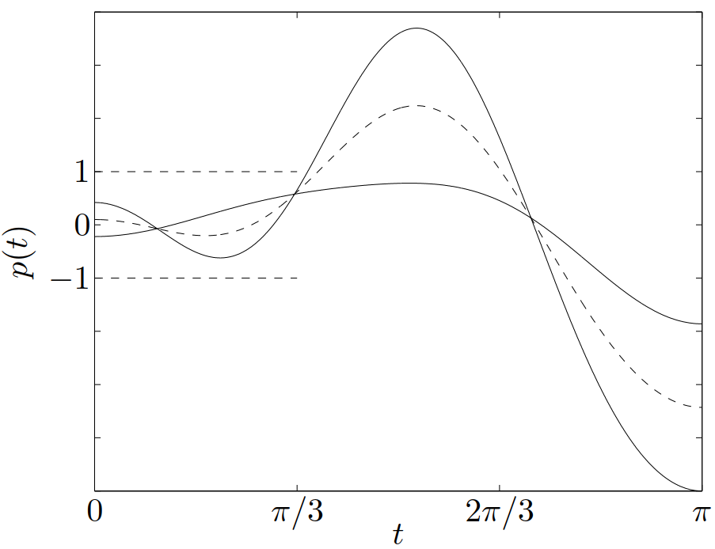
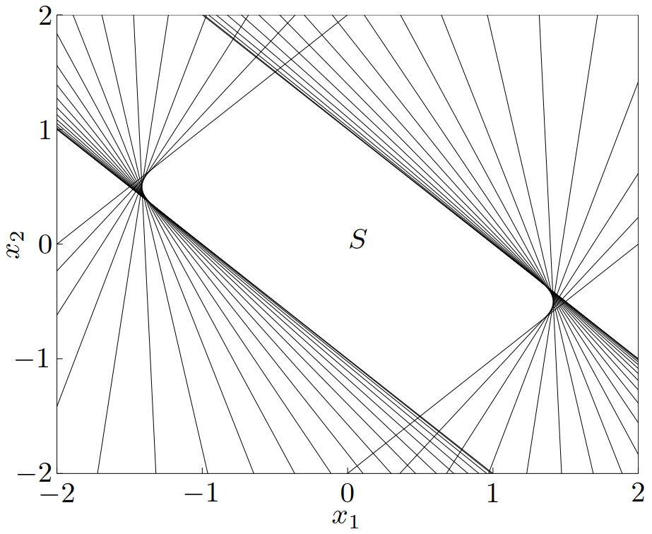
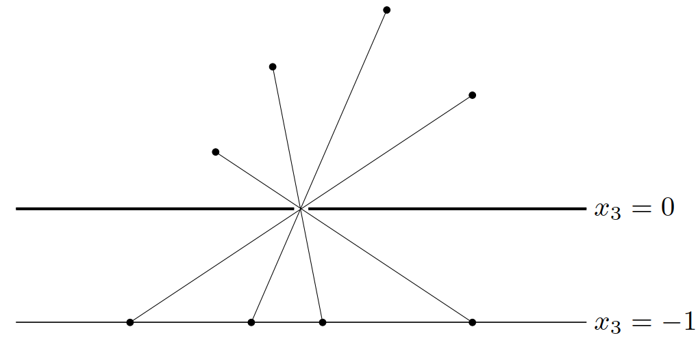
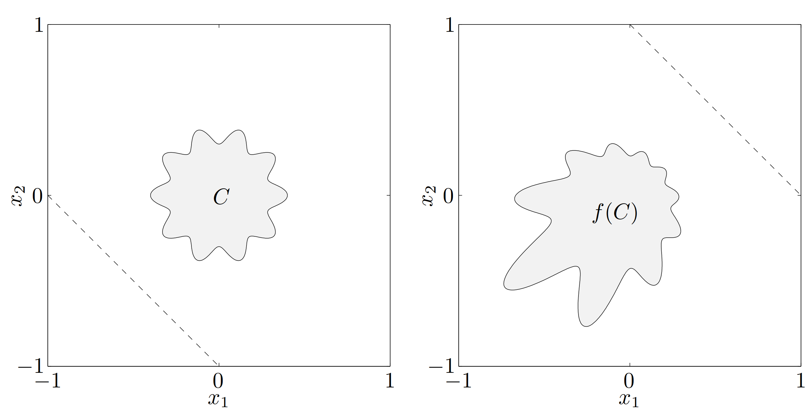

$
\newcommand{\bfR}{\mathbf{R}}
\newcommand{\bfS}{\mathbf{S}}
\newcommand{\TT}{\mathrm{T}}
\newcommand{\H}{\mathcal{H}}
\newcommand{\E}{\mathcal{E}}
\newcommand{\P}{\mathcal{P}}
\def\dom{\mathop{\bf dom}}
\def\prob{\mathop{\bf prob}}
$&emsp;&emsp;本文将描述一些保凸运算，利用保凸运算可以使用凸集构造出其他凸集。这些运算与[*Part 1.2 凸集—一些重要的凸集*](https://josh-gao.top/posts/9293b739.html)中描述的凸集的简单例子一起构成了凸集的演算，可以用来确定或构建集合的凸性。

# 1. 交集

&emsp;&emsp;交集运算是保凸的：如果 $S_1$ 和 $S_2$ 是凸集，那么 $S_1 \cap S_2$ 也是凸集。这个性质可以扩展到无穷个集合的交：如果对于任意 $\alpha\in A$，$S_\alpha$ 都是凸的，那么 $\displaystyle \bigcap_{\alpha \in A} S_\alpha$ 也是凸集。（子空间、仿射集合和凸锥对与任意交运算也是封闭的。）举一个简单的例子，多面体是半空间和超平面（它们都是凸集）的交集，因而是凸的。

> **举例**&emsp;半正定锥 $\bfS^n_+$ 可以表示为
>
> $$
> \bigcap_{z\ne 0} \left\{ X \in \bfS^n\mid z^\TT Xz \geqslant 0 \right\}
> $$
>
> 对于任意 $z\ne 0$，$z^\TT Xz$ 是关于 $X$ 的（不恒等于零的）线性函数，因此集合
>
> $$
> \left\{ X \in \bfS^n\mid z^\TT Xz \geqslant 0 \right\}
> $$
>
> 实际上就是 $\bfS^n$ 的半空间。由此，半正定锥是无穷个半空间的交集，因此是凸的。

<!-- more -->

> **举例** &emsp;考虑集合
>
> $$\begin{equation}\label{example2.8}
>   S = \left\{ x \in \bfR^m\mid |p(t)|\leqslant 1\ 对于\ |t| \leqslant \pi/3 \right\}
> \end{equation}$$
>
> 其中 $p(t) = \displaystyle\sum_{k=1}^m x_k \cos kt$。集合 $S$ 可以表示为无穷个**平板**（*slab*）的交集：$S = \displaystyle \bigcap_{|t|\leqslant\pi/3} S_t$，其中
>
> $$
> S_t = \left\{x\mid -1\leqslant (\cos t,\cdots, \cos mt)^\TT x \leqslant 1\right\}
> $$
>
> 因此，$S$ 是凸的。对于 $m=2$ 的情况，它的定义和集合可见[图 13](#图13) 和[图 14](#图14)。
>
> 
>
> {width=500px}
>
> 
>
> {width=470px}

&emsp;&emsp;在上面这些例子中，我们通过将集合表示为（可能无穷多个）半空间的交集来表明集合的凸性。反过来我们也将看到：每一个闭的凸集 $S$ 是（通常为无限多个）半空间的交集。事实上，一个闭集 $S$ 是包含它的所有半空间的交集：

$$
S = \bigcap \left\{ \H\mid \H\ 是半空间,\ S\subseteq \H \right\}
$$

# 2. 仿射函数

&emsp;&emsp;函数 $f: \bfR^n \to \bfR^m$ 是**仿射**（*affine*）的，如果它是一个线性函数和一个常数的和，即具有 $f(x) = Ax+ b$ 的形式，其中 $A \in  \bfR^{m\times n}$，$b \in \bfR^m$。假设 $S \subseteq \bfR^n$ 是凸的，并且 $f: \bfR^n \to \bfR^m$ 是仿射函数。那么，$S$ 在 $f$ 下的象

$$
f(S) = \left\{ f(x)\mid x\in S \right\}
$$

是凸的。类似地，如果 $f:\bfR^k\to\bfR^n$ 是仿射函数，那么 $S$ 在 $f$ 下的原象

$$
f^{-1}(S) = \left\{ x\mid f(x)\in S \right\}
$$

是凸的。

&emsp;&emsp;两个简单的例子是**伸缩**（*scaling*）和**平移**（*translation*）。如果 $S \subseteq \bfR^n$ 是凸集，$\alpha \in \bfR$ 并且 $a \in \bfR^n$，那么，集合 $\alpha S$ 和 $S+a$ 是凸的，其中

$$
\alpha S = \left\{ \alpha x\mid x \in S \right\},\qquad S + a = \left\{ x + a\mid x \in S \right\}
$$

一个凸集向它的某几个坐标的**投影**（*projection*）是凸的，即：如果 $S \subseteq \bfR^m \times \bfR^n$ 是凸集，那么

$$
T = \left\{ x_1\in \bfR^m\mid (x_1,x_2)\in S\ 对于某些\ x_2 \in \bfR^n \right\}
$$

是凸集。

&emsp;&emsp;两个集合的**和**（*sum*）可以定义为：

$$
S_1 + S_2 = \left\{ x + y\mid x \in S_1, y \in S_2\right\}
$$

如果 $S_1$ 和 $S_2$ 是凸集，那么，$S_1 + S_2$ 是凸的。可以看出，如果 $S_1$ 和 $S_2$ 是凸的，那么其直积或 Cartesian 乘积

$$
S_1 \times S_2 = \left\{ (x_1,x_2)\mid x_1\in S_1, x_2\in S_2 \right\}
$$

也是凸集。这个集合在线性函数 $f(x_1,x_2) = x_1+x_2$ 下的象是和 $S_1 + S_2$。

&emsp;&emsp;也可以考虑 $S_1,S_2 \in \bfR^m \times \bfR^n$ 的**部分和**（*partial sum*），定义为

$$
S = \left\{ (x,y_1 + y_2)\mid (x,y_1)\in S_1,\ (x,y_2)\in S_2 \right\}
$$

其中 $x\in\bfR^n$，$y_i \in \bfR^m$。$m=0$ 时，部分和给出了 $S_1$ 和 $S_2$的交集；$n=0$ 时，部分和等于集合之和。凸集的部分和是凸集。

> **举例**&emsp;**多面体**。$\{ x\mid Ax \preceq b, Cx = d \}$ 可以表示为非负象限和原点的 Cartesian 乘积在仿射函数 $f(x) = (b -Ax, d - Cx)$ 下的原象：
>
> $$
> \{x\mid Ax\preceq b, Cx = d\} = \{ x\mid f(x)  \in \bfR^m_+ \times \{0\}\}
> $$

> **举例**&emsp;**线性矩阵不等式的解**。条件
>
> $$\begin{equation}
>   A(x) = x_1 A_1 + \cdots + x_nA_n \preceq B
> \end{equation}$$
>
> 称为关于 $x$ 的**线性矩阵不等式**（*Linear Matrix Inequality, LMI*），其中 $B,A_i \in \bfS^m$（注意它与有序线性不等式
>
> $$
> a^\TT x = x_1a_1+\cdots x_na_n \leqslant b
> $$
>
> 的相似性，其中 $b,a_i\in \bfR$。）
>
> 线性矩阵不等式的解 $\{ x\mid A(x) \preceq B\}$ 是凸集。事实上，它是半正定锥在由 $f(x) = B-A(x)$ 给定的仿射映射 $f: \bfR^n \to \bfS^m$ 下的原象。

> **举例**&emsp;**双曲锥**。集合
>
> $$
> \{ x\mid x^\TT Px \leqslant (c^\TT x) ^2, c^\TT x \geqslant 0 \}
> $$
>
> 是凸集，其中 $P\in\bfS^n_+$，$c\in\bfR$ 这是因为它是二阶锥
>
> $$
> \{ (z,t)\mid z^\TT z \leqslant t ^2 , t \geqslant 0 \}
> $$
>
> 在仿射函数 $f(x) = (P^{1/2}x,c^\TT x)$ 下的原象。

> **举例**&emsp;**椭球**。椭球
>
> $$
> \E = \{ x\mid (x-x_c)^\TT P^{-1} (x-x_c) \leqslant 1 \}
> $$
>
> 是单位 Euclid 球 $\{ u\mid \|u\|_2 \leqslant 1 \}$ 在仿射映射 $f(u) = P^{1/2}u + x_c$ 下的象， 其中 $P \in \bfS^n_{++}$。（同时也是单位球在仿射映射 $g(x) = P^{-1/2}(x — x_c)$ 下的原象。）

# 3. 线性分式及透视函数

&emsp;&emsp;本节将讨论一类称为**线性分式**（*linear-fractional*）的函数，它比仿射函数更普遍，并且仍然保凸。

## 3.1 透视函数

&emsp;&emsp;定义 $P:\bfR^{n+1}\to\bfR^n$ 为**透视函数**（*perspective function*），其定义域为 $\dom P = \bfR^n \times \bfR_{++}$。（此处的 $\bfR_{++}$ 表示正实数集合，即 $\bfR_{++} = \{ x\in\bfR\mid x > 0 \}$。）透视函数对向量进行伸缩（scale），或称为规范化（normalize），使得最后一维分量为1 并舍弃之。

> **注释**&emsp;我们用小孔成象来解释透视函数。($\bfR^3$ 中的）小孔照相机由一个不透明的水平面 $x_3 = 0$ 和一个在原点的小孔组成，光线通过这个小孔在 $x_3 = -1$ 呈现出一个水平图像。在相机上方 $x(x_3 > 0)$ 处的一个物体，在相平面的点 $=(x_1/x_3,x_2/x_3,1)$ 处形成一个图像。忽略象点的最后一维分量（因为它恒等于 $-1$），$x$ 处的点的象在象平面上呈现于 $y=-(x_1/x_3,x_2/x_3)$ 处。[图 15](#图15)显示了这个过程。
>
> 
>
> {width=500px}

&emsp;&emsp;如果 $C \subseteq \dom P$ 是凸集，那么它的象

$$
P(C) = \{ P(x)\mid x\in C \}
$$

也是凸集。这个结论很直观：通过小孔观察一个凸的物体，可以得到凸的象。为解释这个事实，我们将说明在透视函数作用下，线段将被映射成线段。（也可以这样理解，通过小孔，一条线段的象是一条线段。）假设 $x = (\tilde{x},x_{n+1}), y = (\tilde{y}, y_{n+1}) \in \bfR^{n+1}$，并且 $x_{n+1}>0, y_{n+1}>0$ 。那么，对于 $0 \leqslant \theta \leqslant 1$

$$
P(\theta x + (1-\theta)y) = \frac{\theta\tilde{x}+ (1-\theta)\tilde{y}}{\theta x_{n+1} + (1-\theta)y_{n+1}} = \mu P(x) + (1-\mu) P(x)
$$

其中

$$
\mu = \frac{\theta x_{n+1}}{\theta x_{n+1} + (1-\theta) y_{n+1}}\in[0,1]
$$

$\theta$ 和 $\mu$ 之间的关系是单调的：当 $\theta$ 在 $0$、$1$ 间变化时（形成线段 $[x,y]$），$\mu$ 也在 $0$、$1$ 间变化（形成线段 $[P(x),P(y)]$。这说明 $P([x,y]) = [P(x),P(y)]$。

&emsp;&emsp;现在假设 $C$ 是凸的，并且有 $C \subseteq \dom P$（即对于所有 $x\in C$，$x_{n+1} > 0$) 及 $x,y\in C$。为显示 $P(C)$ 的凸性，需要说明线段 $[P(x), P(y)]$ 在 $P(C)$ 中。这条线段是线段 $[x,y]$ 在 $P$ 的象，因而属于 $P(C)$。

&emsp;&emsp;一个凸集在透视函数下的原象也是凸的：如果 $C\subseteq \bfR^n$ 为凸集，那么

$$
P^{-1}(C) = \{ (x,t)\in\bfR^{n+1}\mid x/t\in C, t > 0 \}
$$

是凸集。为证明这点，假设 $(x,t)\in P^{-1}(C), (y,s)\in P^{-1}(C), 0 \leqslant \theta \leqslant 1$。我们需要说明

$$
\theta(x,t) + (1-\theta)(y,s) \in P^{-1} (C)
$$

即

$$
\frac{\theta x + (1-\theta)y}{\theta t + (1-\theta)s} = \mu (x/t) + (1-\mu)(y/s)
$$

其中

$$
\mu = \frac{\theta t}{\theta t + (1-\theta)s} \in [0,1]
$$

## 3.2 线性分式函数

&emsp;&emsp;**线性分式函数**（*linear-fractional function*）由透视函数和仿射函数复合而成。设 $g:\bfR^n \to \bfR^{m+1}$ 是仿射的，即

$$\begin{equation}\label{AffineFunction}
  g(x) = \left[\begin{array}{c}
    A \\ c^\TT
  \end{array}\right]x + \left[\begin{array}{c}
    b \\ d
  \end{array}\right]
\end{equation}$$

其中 $A \in \bfR ^{m\times n}, b \in \bfR^m, c \in \bfR^n$ 并且 $d\in\bfR^n$。则由 $f =P\circ g$ 给出的函数 $f:\bfR^n \to \bfR^m$

$$\begin{equation}\label{LinearFractionalFunction}
  f(x) = (Ax+b)/(c^\TT x + d),\qquad \dom f = \{x\mid c^\TT x + d > 0\}
\end{equation}$$

称为**线性分式**（*linear-fractional*）（或**投射**（*projective*））函数。如果 $c = 0, d > 0$，则 $f$ 的定义域为 $\bfR^n$ 并且 $f$ 是仿射函数。因此，我们可以将仿射和线性函数视为特殊的线性分式函数。

> **注释**&emsp;**投射解释**。可以很方便地将一个线性分式函数表示为：将矩阵
>
> $$\begin{equation}
>   Q = \left[\begin{array}{c}
>   A & b \\ c^\TT & d
> \end{array}\right] \in \bfR^{(m+1)\times (n+1)}
> \end{equation}$$
>
> 作用于（即左乘）点 $(x,1)$，得到 $(Ax + b,c^\TT x + d)$；然后将所得结果做伸缩变换或归一化，以使得其最后一个分量为一，得到 $(f(x), 1)$。
>
> 也可以从儿何上进行解释，即这个表达式将 $\bfR^n$ 与 $\bfR^{n+1}$ 空间上的一组射线联系了起来。也就是说，对于 $\bfR^n$ 空间的一个点 $z$，我们可以构造一个 $\bfR^{n+1}$ 空间的（开）射线 $P(z) = \{t(z,1)\mid t > 0\}$。这条射线上每个点的最后一个分量均是正值。反之， $\bfR^{n+1}$ 空间中每条以原点为顶点并且最后一个分量为正值的射线均可以由一些 $v\in\bfR^n$ 表示为 $\P(v) = \{t(v, 1)\mid t \geqslant 0\}$。$\P$ 表示了 $\bfR^n$ 与最后一个分量为正的射线之间的（投射）关系，这种关系是一一对应和满的。
>
> 线性分式函数 $\eqref{LinearFractionalFunction}$ 可以表示为
>
> $$
> f(x) = \P^{-1}(Q\P(x))
> $$
>
> 因此，从 $x\in\dom f$ 出发，即由一个满足 $c^\TT x +d > 0$ 的点，可以得到 $\bfR^{n+1}$ 空间的一条射线 $\P(x)$。将线性变换矩阵 $Q$ 作用于这条射线，就可以得到另一条射线 $Q\P(x)$。因为 $x \in \dom f$, 这条射线的最后一个分量为正。最后，我们也可以通过逆投射变换恢复出 $f(x)$。

&emsp;&emsp;类似于透视函数，线性分式函数也是保凸的。如果 $C$ 是凸集并且在 $f$ 的定义域中（即任意 $x\in C$ 满足 $c^\TT x+d > 0$），那么 $C$ 的象 $f(C)$ 也是凸集。根据前述的结果可以直接得到这个结论： $C$ 在仿射映射 $\eqref{AffineFunction}$ 下的象是凸的，并且在透视函数 $P$ 下的映射（即 $f(C)$）是凸的。类似地，如果 $C \subseteq \bfR^m$ 是凸集，那么其原象 $f^{-1}(C)$ 也是凸的。

> **举例**&emsp;**条件概率**。设 $u$ 和 $v$ 是分别在 $\{1, \cdots, n\}$ 和 $\{1, \cdots, m\}$ 中取值的随机变量，并且 $p_ij$ 表示概率 $\prob(u = i,v = j)$。那么条件概率 $f_{ij} = \prob(u = i\mid v = j)$ 由下式给出
>
> $$
> f_{ij} = \frac{p_{ij}}{\displaystyle\sum_{k=1}^n p_{kj}}
> $$
>
> 因此，$f$ 可以通过一个线性分式映射从 $p$ 得到。
>
> 可以知道，如果 $C$ 是一个关于 $(u,v)$ 的联合密度的凸集，那么相应的 $u$ 的条件密度（给定 $v$）的集合也是凸集。

&emsp;&emsp;[图 16](#图16) 表示了集合 $C\subseteq \bfR^2$ 及其在下面的线性分式函数下的象

$$
f(x) = \frac{1}{x_1 + x_2 + 1} x,\qquad \dom f = \{(x_1,x_2)\mid x_1+x_2+1>0\}
$$

{width=800px}

# 参考文献

1. Stephen P. Boyd and Lieven Vandenberghe, *Convex optimization*. Cambridge, UK: Cambridge University Press, 2004.
2. Stephen P. Boyd and Lieven Vandenberghe, *凸优化*. 北京: 清华大学出版社, 2013.
