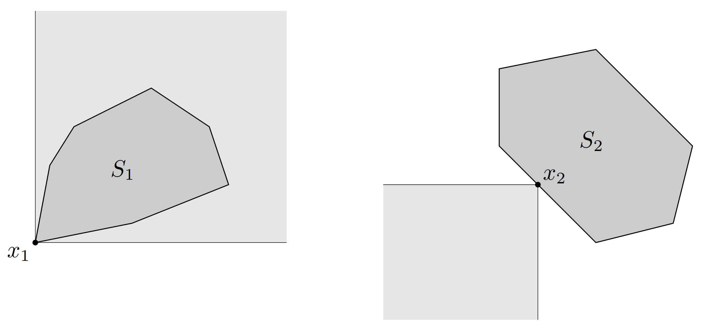
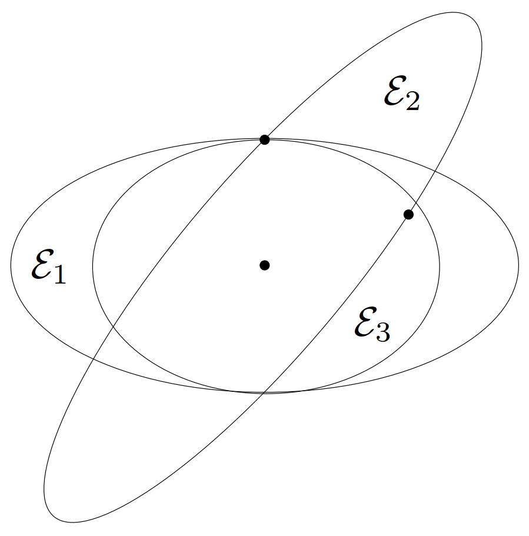

# 1. 正常锥与广义不等式

$
\newcommand{\bfR}{\mathbf{R}}
\newcommand{\bfS}{\mathbf{S}}
\newcommand{\E}{\mathcal{E}}
\newcommand{\TT}{\mathrm{T}}
\def\iint{\mathop{\bf int}}
$&emsp;&emsp;称锥 $K \subseteq \bfR^n$ 即为**正常锥**（*proper cone*），如果它满足下列条件

- K 是凸的。
- K 是闭的。
- K 是**实**（*solid*）的，即具有非空内部。
- K 是**尖**（*pointed*）的，即不包含直线（或者等价地，$x\in K, -x \in K \Longrightarrow x = 0$）。

正常锥 $K$ 可以用来定义**广义不等式**（*generalized inequality*），即 $\bfR^n$ 上的偏序关系。这种偏序关系和 $\bfR$ 上的标准序有很多相同的性质。用正常锥 $K$ 可以定义 $\bfR^n$ 上的偏序关系如下

$$
x \preceq_K y \Longleftrightarrow y - x \in K
$$

$y \prec_K x$ 也可以写为 $x \succeq_K y$。类似地，定义相应的严格偏序关系为

$$
x \prec_K y \Longleftrightarrow y - x \in \iint K
$$

并且可以同样地定义 $x \succ_K y$。（为将广义不等式 $\preceq_K$ 与严格的广义不等式区分开，有时也称 $\preceq_K$ 为不严格的广义不等式）。

<!-- more -->

&emsp;&emsp;当 $K = \bfR_+$ 时，偏序关系 $\preceq_K$ 就是通常意义上 $\bfR$ 中的序 $\leqslant$ 相应地，严格偏序关系 $\prec_K$ 与 $\bfR$ 上的严格序 $<$ 相同。因此，广义不等式包含了 $\bfR$ 上的（不严格和严格）不等式，它是广义不等式的一种特殊情况。

> **举例**&emsp;**非负象限及分量不等式**。非负象限 $K = \bfR^n_+$ 是一个正常锥。相应的广义不等式 $\preceq_K$ 对应于向量间的分量不等式，即 $x \preceq_K y$ 等价于 $x_i \leqslant y_i, i = 1,\cdots,n$。相应地，其严格不等式对应于严格的分量不等式，即 $x \prec_K y$ 等价于 $x_i < y_i, i = 1,\cdots,n$。
>
> 我们将常常使用对应于非负象限的不严格和严格的偏序关系，因此省略下标 $\bfR^n_+$。当 $\preceq$ 或 $\prec$ 出现在向量间的时候，该符号应被理解为分量不等式。

> **举例**&emsp;**半正定锥和矩阵不等式**。半正定锥是 $S^n$ 空间中的正常锥，相应的广义不等式 $\preceq_K$ 就是通常的矩阵不等式，即 $X \preceq_K Y$ 等价于 $Y - X$ 为半正定矩阵。（在 $S^n$ 中）$S^n_+$ 的内部由正定矩阵组成，因此严格广义不等式也等同于通常的对称矩阵的严格不等式，即 $X \prec_K Y$ 等价于 $Y - X$ 为正定矩阵。
>
> 这里，也是由于经常使用这种偏序关系，因此省略其下标，即对于对称矩阵，我们将广义不
等式简写为 $X \preceq Y$ 或 $X \prec Y$, 它们表示关于半正定锥的广义不等式。

> **举例**&emsp;**$[0, 1]$ 上非负的多项式锥**。$K$ 定义如下
>
> $$\begin{equation}
> K = \{ c\in\bfR^n\mid c_1 + c_2 t + \cdots + c_n t^{n-1} \geqslant 0\ 对于\ t \in [0,1]\}
> \end{equation}$$
>
> 即 $K$ 是 $[0, 1]$ 上最高 $n - 1$ 阶的非负多项式（系数）锥。可以看出 $K$ 是一个正常锥，其内部是 $[0, 1]$ 上为正的多项式的系数集合。
>
> 两个向量 $c, d \in \bfR^n$ 满足 $c \preceq_K d$ 的充要条件是，对于所有 $t \in [0, 1]$ 有
>
> $$
> c_1 + c_2 t + \cdots + c_n t^{n-1} \leqslant d_1 + d_2 t + \cdots + d_n t^{n-1}
> $$

## 1.1 广义不等式的性质

&emsp;&emsp;广义不等式 $\preceq_K$ 满足许多性质，例如

- **$\preceq_K$ 对于加法是保序的**：如果 $x \preceq_K y$ 并且 $u \preceq_K v$，那么 $x + u \preceq_K y + v$。
- **$\preceq_K$ 具有传递性**：如果 $x \preceq_K y$ 并且 $y \preceq_K z$，那么 $x \preceq_K z$。
- **$\preceq_K$ 对于非负数乘是保序的**：如果 $x \preceq_K y$ 并且 $\alpha \geqslant 0$，那么 $\alpha x \preceq_K \alpha y$。
- **$\preceq_K$ 是自反的**：$x \preceq_K x$。
- **$\preceq_K$ 是反对称的**：如果 $x \preceq_K y$ 并且 $y \preceq_K x$，那么 $x = y$。
- **$\preceq_K$ 对于极限运算是保序的**：如果对于 $i = 1,2,\dots$ 均有 $x_i \preceq_K y_i$，当 $i \to \infty$ 时，有 $x_i \to x$ 和 $y_i \to y$，那么 $x \preceq_K y$。

相应的广义不等式 $\prec_K$ 也满足一些性质，例如

- 如果 $x \prec_K y$，那么 $x \preceq_K y$。
- 如果 $x \prec_K y$ 并且 $u \prec_K v$, 那么 $x + u \prec_K y + v$。
- 如果 $x \prec_K y$ 并且 $\alpha > 0$，那么 $\alpha x \prec_K \alpha y$。
- $x \nprec_K x$。
- 如果 $x \prec_K y$，那么对于足够小的 $u$ 和 $v$ 有 $x + u \prec_K y + v$。

这些性质可以从 $\preceq_K$ 和 $\prec_K$ 的定义以及正常锥的性质中直接得到。

# 2. 最小与极小元

&emsp;&emsp;广义不等式的符号（$\preceq_K$，$\prec_K$）似乎表明它们与 $\bfR$ 上的普通不等式（$\leqslant$，$<$）有着相同的性质。虽然普通不等式的许多性质对于广义不等式确实成立，但很多重要的性质并不如此。最明显的区别在于，$\bfR$ 上的 $\leqslant$ 是一个**线性序**（*linear ordering*），即任意两点都是**可比的**（*comparable*），也就是说 $x\leqslant y$ 和 $y \leqslant x$ 二者必居其一。这个性质对于其他广义不等式并不成立。这导致了最小、最大这些概念在广义不等式环境下变得更加复杂。本节将对此进行简要的
讨论。

&emsp;&emsp;如果对于每个 $y \in S$，均有 $x \preceq_K y$，称 $x\in S$ 是 $S$（关于广义不等式 $\preceq_K$）的**最小元**（*minimum element*）。类似地，我们可以定义关于广义不等式的**最大元**（**maximum element**）。如果一个集合有最小（或最大）元，那么它们是唯一的。

&emsp;&emsp;相对应的概念是**极小元**（*minimal element*）。如果 $y \in S$，$y \preceq_K x$ 可以推得 $y=x$，那么称 $x\in S$ 是 $S$ 上（关于广义不等式 $\preceq_K$）的**极小元**（*minimal element*）。同样地，可以定义**极大元**（*maximal element*）。一个集合可以有多个极小（或极大）元。

&emsp;&emsp;用简单的集合符号，我们可以对最小元和极小元进行描述。元素 $x\in S$ 是 $S$ 中的一个最小元，当且仅当

$$
S \subseteq x + K
$$

这里 $x+K$ 表示可以与 $x$ 相比并且大于或等于（根据 $\preceq_K$）$x$ 的所有元素。元素 $x\in S$ 是极小元，当且仅当

$$
(x - K) \cap S = \{x\}
$$

这里 $x-K$ 表示可以与 $x$ 相比并且小于或等于（根据立$\preceq_K$）$x$ 的所有元素，它与 $S$ 的唯一共同点即是 $x$。

&emsp;&emsp;$K=\bfR^n$ 导出的实际上就是 $\bfR$ 上一般的序。此时，极小和最小的概念是一致的，也符合集合最小元素的通常定义。

> **举例**&emsp;考虑锥 $\bfR^2_+$，它导出的是 $\bfR^2$ 上的关于分量的不等式。对此，可以给出一些关于极小元和最小元的简单的几何描述。不等式 $x \preceq y$ 的含义是 $y$ 在 $x$ 之上、之右。$x \in S$是集合 $S$ 的最小元，表明 $S$ 的其他所有点都在它之上、之右。而 $x$ 为集合 $S$ 的极小元，是指 $S$ 中没有任何一个点在 $x$ 之下、之左，其区别可见[图 17](#图17)。
>
> 
>
> {width=700px}

> **举例**&emsp;**对称矩阵集合中的最小元和极小元**。用 $A \in \bfS^n_{++}$ 表示一个圆心在原点的椭圆，即
>
> $$
> \E_A = \{ x\mid x^\TT A^{-1} x \leqslant 1 \}
> $$
>
> 我们知道 $A \preceq B$ 等价于 $\E_A \subseteq \E_B$。
>
> 给定 $v_1,\cdots,v_k \in \bfR^n$ 并定义
>
> $$
> S = \{ P \in \bfS ^n_{++}\mid v_i^\TT P^{-1} v_i \leqslant 1,\ i = 1,\dots k \}
> $$
>
> 它对应于包含了点 $v_1,\cdots,v_k$ 的椭圆的集合。集合 $S$ 没有最小元：对于任意包含点$v_1,\cdots,v_k$ 的椭圆，总可以找到另一个包含这些点但不可比的椭圆。一个椭圆是极小的，如果它包含这些点但没有更小的椭圆也包含这些点。[图 18](#图18)显示了 $\bfR^2$ 上 $k = 2$ 时的一个例子。
>
> 
>
> {width=300px}

# 参考文献

1. Stephen P. Boyd and Lieven Vandenberghe, *Convex optimization*. Cambridge, UK: Cambridge University Press, 2004.
2. Stephen P. Boyd and Lieven Vandenberghe, *凸优化*. 北京: 清华大学出版社, 2013.
