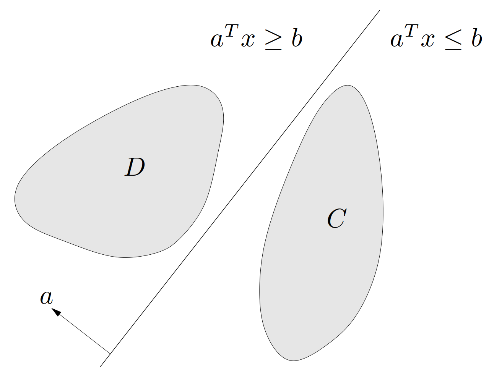
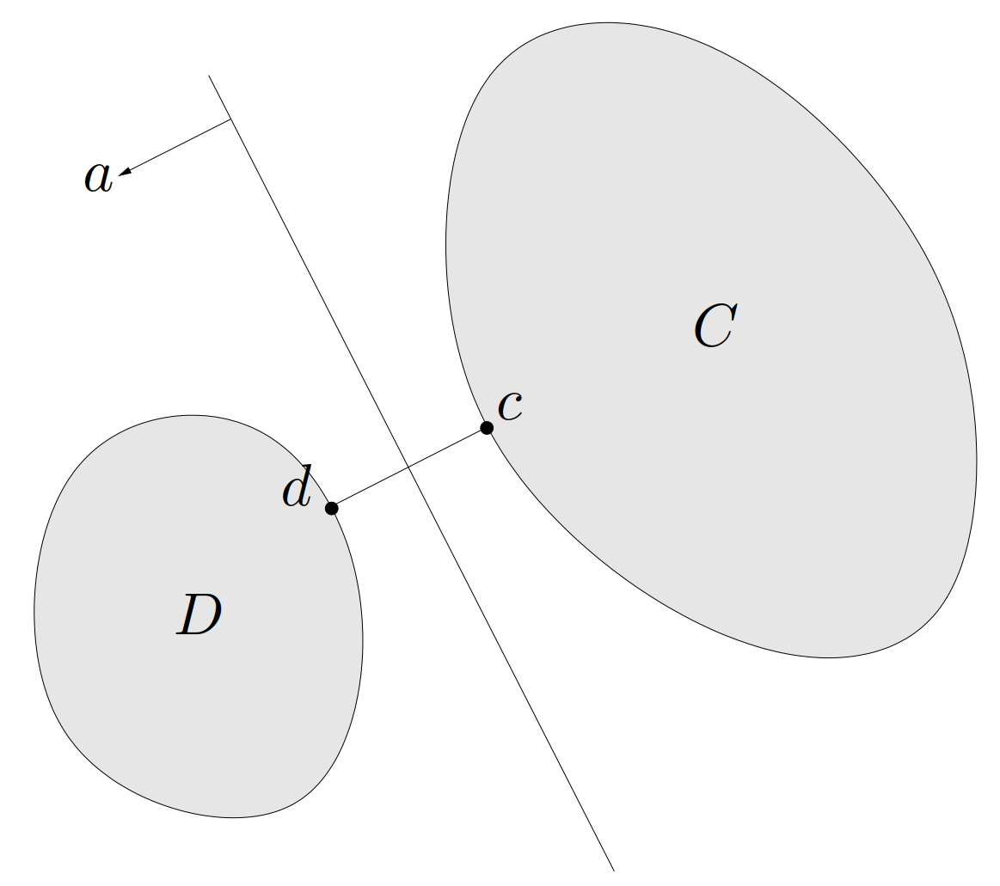
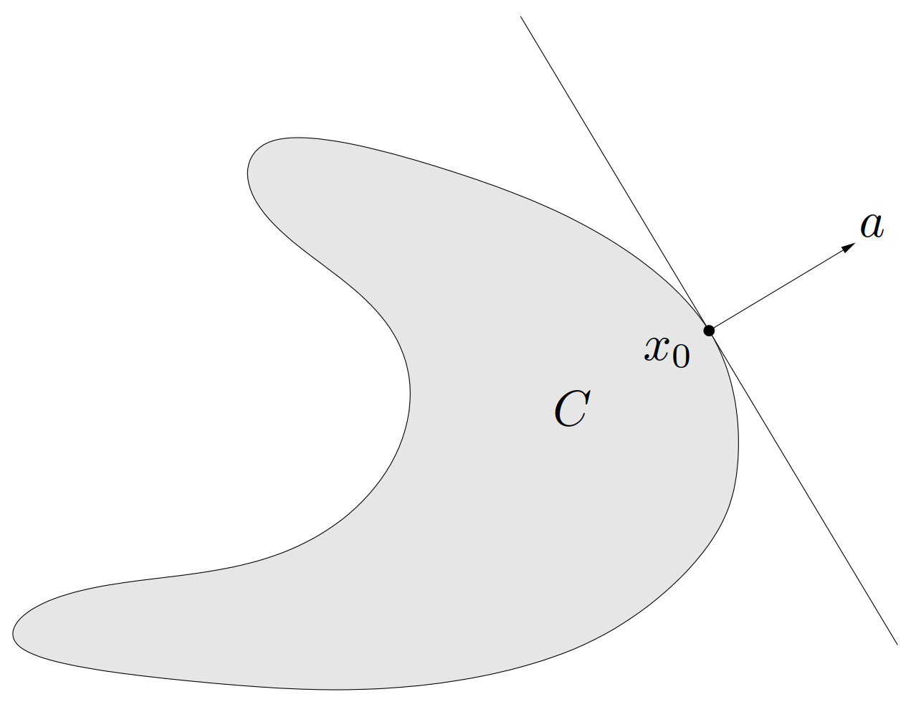

# 1. 超平面分离定理

$
\newcommand{\bfR}{\mathbf{R}}
\newcommand{\TT}{\mathrm{T}}
\newcommand{\d}{\mathrm{d}}
\def\dist{\mathop{\bf dist}}
\def\iint{\mathop{\bf int}}
\def\bd{\mathop{\bf bd}}
\def\cl{\mathop{\bf cl}}
$&emsp;&emsp;本节将阐述一个在之后非常重要的想法：用超平面或仿射函数将两个不相交的凸集分离开来。其基本结果就是**超平面分离定理**（*separating hyperplane theorem*）：假设 $C$ 和 $D$ 是两个不相交的凸集，即 $C \cap D = \emptyset$，那么存在 $a \ne 0$ 和 $b$ 使得对于所有 $x\in C$ 有 $a^\TT x \leqslant b$，对于所有 $x\in D$ 有 $a^\TT x \geqslant b$。换言之，仿射函数 $a^\TT x-b$ 在 $C$ 中非正，而在 $D$ 中非负。超平面 $\{ x\mid a^\TT x = b \}$ 称为集合 $C$ 和 $D$ 的**分离超平面**（*separating hyperplane*），或称超平面**分离**（*separate*）了集合 $C$ 和 $D$，如[图 19](#图19)。

{width=400px}

<!-- more -->

## 1.1 超平面分离定理的证明

&emsp;&emsp;这里我们考虑一个特殊的情况下的证明。假设 $C$ 和 $D$ 的（Euclid）**距离**（*distance*）为正，这里的距离定义为

$$
\dist(C,D) = \inf\{ \|u,v\|_2\mid u \in C,\ v \in D\}
$$

并且存在 $c\in C$ 和 $d\in D$ 达到这个最小距离，即 $\|c-d\|_2=\dist(C,D)$。（这些条件是可以被满足的，例如当 $C$ 和 $D$ 是闭的并且其中之一是有界的。）

&emsp;&emsp;定义

$$
a = d - c,\qquad b = \frac{\|d\|_2^2 - \|c\|_2^2}{2}
$$

我们将显示仿射函数

$$
f(a) = a^\TT x - b = (d-c)^\TT(x - (1/2)(d+c))
$$

在 $C$ 中非正而在 $D$ 中非负，即超平面 $\{ x\mid a^\TT x = b \}$ 分离了 $C$ 和 $D$。这个超平面与连接 $c$ 和 $d$ 之间的线段相垂直并且穿过其中点，如[图 20](#图20) 所示。

{width=400px}

&emsp;&emsp;首先证明 $f$ 在 $D$ 中非负。关于 $f$ 在 $C$ 中非正的证明是相似的（只需将 $C$ 和 $D$ 交换并考虑 $-f$ 即可）。

> **证明**&emsp;假设存在一个点 $u\in D$，并且
>
> $$\begin{equation}\label{ufunction}
>   f(u) = (d-c)^\TT (u - (1/2)(d+c)) < 0
> \end{equation}$$
>
> 可以将 $f(u)$ 表示为
>
> $$
> f(u) = (d-c)^\TT (u - d + (1/2)(d-c)) = (d-c)^\TT(u-d) + (1/2) \| d-c \|_2^2
> $$
>
> 可以看出式 $\eqref{ufunction}$ 意味着 $(d-c)^\TT(u-d) < 0$。于是，观察到
>
> $$
> \left. \frac{\d}{\d t} \|d + t(u-d) - c\|_2^2 \right|_{t=0} = 2(d-c)^\TT(u-d) < 0
> $$
>
> 因此，对于足够小的 $t>0$ 及 $t\leqslant 1$，有
>
> $$
> \| d + t(u-d) - c \|_2 < \| d -c \|_2
> $$
>
> 即点 $d+t(u-d)$ 比 $d$ 更靠近 $c$。因为 $D$ 是包含 $d$ 和 $u$ 的凸集，我们有 $d+t(u-d) \in D$。但这是不可能的，因为根据假设，$d$ 应当是 $D$ 中离 $C$ 最近的点。

> **举例**&emsp;**仿射集与凸集的分离**。设 $C$ 是凸集，而 $D$ 是仿射的，即 $D = \{ Fu + g\mid u \in \bfR^m\}$，其中 $F \in \bfR^{n\times m}$。设 $C$ 和 $D$ 不相交，那么根据超平面分离定理，存在 $a \ne 0$ 和 $b$ 使得对于所有 $x \in C$ 有 $a^\TT x \leqslant b$，对于所有 $x \in D$ 有 $a^\TT x \geqslant b$。
>
> 这里 $a^\TT x \geqslant b$ 对于所有 $x \in D$ 均成立，表明对于任意 $u \in \bfR^m$ 均有 $a^\TT Fu \geqslant b - a^\TT g$。但是在 $\bfR^m$ 上，只有当一个线性函数为零时，它才是有界的。因此，可以推知 $a^\TT F=0$ （并且因此有 $b \leqslant a^\TT g$）。
>
> 所以可知，存在 $a \ne 0$ 使得 $F^\TT a =0$ 和 $a^\TT x \leqslant a^\TT g$ 对于所有 $x\in C$ 均成立。

## 1.2 严格分离

&emsp;&emsp;如果之前构造的分离超平面满足更强的条件，即对于任意 $x\in C$ 有 $a^\TT x < b$ 并且对于任意 $x\in D$ 有 $a^\TT x > b$, 则称其为集合 $C$ 和 $D$ 的**严格分离**（*strict separation*）。简单的例子就可以看出，对于一般的情况，不相交的凸集并不一定能够被超平面严格分离（即使集合是闭集）。但是，在很多特殊的情况下，可以构造严格分离。

> **举例**&emsp;**点和闭凸集的严格分离**。令 $C$ 为闭凸集，而 $x_0 \notin C$，那么存在将 $x_0$ 与 $C$ 严格分离的超平面。
>
> 为说明这一点，需要注意，对于足够小的 $\epsilon > 0$，存在两个不相交的集合 $C$ 和 $B(x_0, \epsilon)$。根据超平面分离定理，存在 $a \ne 0$ 和 $b$，使得对于任意 $x\in C$ 有 $a^\TT x \leqslant b$；对于任意 $x \in B(x_0, \epsilon)$ 有 $a^\TT x \geqslant b$。
>
> 利用 $B(x_0, \epsilon) = \{ x_0 + u\mid \|u\|_2 \leqslant \epsilon \}$，可以将前述第二个条件表示为
>
> $$
> a^\TT (x_0 + u) \geqslant b\ 对于所有\ \|u\|_2 \leqslant \epsilon
> $$
>
> $u = -\epsilon a / \|a\|_2$ 极小化了上式的左端，代入可得
>
> $$
> a^\TT x_0 - \epsilon \| a \|_2 \geqslant b
> $$
>
> 所以，仿射函数
>
> $$
> f(x) = a^\TT x - b - \epsilon \|a\|_2/2
> $$
>
> 在 $C$ 上是负的，而在 $x_0$ 点是正的。
>
> 由此可以得到前面已提及的事实：一个闭凸集是包含它的所有半空间的交集。事实上，令 $C$ 为闭和凸的，$S$ 为所有包含 $C$ 的半空间。显然，$x\in C \Rightarrow x \in S$。为证明反方向，假设存在 $x\in S$ 并且 $x \notin C$。根据严格分离的结果，存在一个将 $x$ 与 $C$ 严格分离的超平面，即存在一个包含 $C$ 但不包含 $x$ 的半空间。也就是说，$x \notin S$。

## 1.3 超平面分离定理的逆定理

&emsp;&emsp;超平面分离定理的逆定理（即分离超平面的存在表明 $C$ 和 $D$ 不相交）是不成立的，除非在凸性之外再给 $C$ 或 $D$ 附加其他约束。

> **反例**&emsp;考虑 $C = D = \{0\} \subseteq \bfR$，超平面 $x=0$ 可以分离 $C$ 和 $D$。

&emsp;&emsp;通过给 $C$ 和 $D$ 增加一些条件，可以得到超平面分离定理的多种逆定理。

> **举例**&emsp;设 $C$ 和 $D$ 是凸集，$C$ 是开集，如果存在一个仿射函数 $f$，它在 $C$ 中非正而在 $D$ 中非负，那么 $C$ 和 $D$ 不相交。（为说明此结论，首先可知 $f$ 在 $C$ 上是负的。否则，如果 $f$ 在 $C$ 中的某一点为零，那么 $f$ 在这个点附近会取得正值，这与前述矛盾。因此 $C$ 和 $D$ 一定是不相交的，因为 $f$ 在 $C$ 中为负，而在 $D$ 中非负。）将逆定理与超平面分离定理相结合，我们可以得到下面的结论：任何两个凸集 $C$ 和 $D$，如果其中至少有一个是开集，那么当且仅当存在分离超平面时，它们不相交。

> **举例**&emsp;**严格线性不等式的择一定理**。我们导出严格线性不等式
>
> $$\begin{equation}\label{StrictLinearInequality}
>   Ax \prec b
> \end{equation}$$
>
> 有解的充要条件。该不等式不可行的充要条件是（凸）集
>
> $$
> C = \{ b = Ax\mid x \in \bfR^n\},\qquad D = \bfR^m_{++} = \{ y \in \bfR^m\mid y \succ 0 \}
> $$
>
> 不相交。集合 $D$ 是开集，而 $C$ 是仿射集合。根据前述的结论，$C$ 和 $D$ 不相交的充要条件是，存在分离超平面，即存在非零的 $\lambda \in \bfR^m$ 和 $\mu \in \bfR$ 使得 $C$ 中 $\lambda^\TT y \leqslant \mu$ 而 $D$ 中 $\lambda^\TT y \geqslant \mu$。
>
> 这些条件可以被简化。第一个条件意味着对于所有 $x$ 都有 $\lambda^TT (b - Ax) \leqslant \mu$。这表明 $A^\TT \lambda = 0$，$\lambda^\TT b \leqslant \mu$。第二个不等式意味着 $\lambda^\TT y \geqslant \mu$ 对于所有 $y \succ 0$ 均成立。这表明 $\mu \leqslant 0$ 且 $\lambda \preceq 0$，$\lambda\ne 0$。
>
> 将这些结果放在一起，我们可以得知严格不等式组 $\eqref{StrictLinearInequality}$ 无解的充要条件是存在 $\lambda \in \bfR^m$ 使得
>
> $$\begin{equation}\label{IFFCondition}
>   \lambda = 0,\qquad \lambda\succeq 0,\qquad A^\TT \lambda = 0,\qquad \lambda^\TT b \leqslant 0
> \end{equation}$$
>
> 这些不等式和等式关于 $\lambda\in\bfR^m$ 也是线性的。我们称式 $\eqref{StrictLinearInequality}$ 和式 $\eqref{IFFCondition}$ 构成一对**择一选择**（alternatives）：对于任意的 $A$ 和 $b$，两者中仅有一组有解。

# 2. 支撑超平面

&emsp;&emsp;设 $C \subseteq \bfR^n$ 而 $x_0$ 是其边界 $\bd C$ 上的一点，即

$$
x_0 \in \bd C = \cl C\ \backslash\ \iint C
$$

如果 $a \ne 0$，并且对任意 $x \in C$ 满足 $a^\TT x \leqslant a^\TT x_0$，那么称超平面 $\{ x\mid a^\TT x = a^\TT x_0 \}$ 为集合 $C$ 在点 $x_0$ 处的**支撑超平面**（*supporting hyperplane*）。这等于说点 $x_0$ 与集合 $C$ 被超平面 $\{ x\mid a^\TT x = a^\TT x_0 \}$ 所分离。其几何解释是超平面 $\{ x\mid a^\TT x = a^\TT x_0 \}$ 与 $C$ 相切于点 $x_0$，而且半空间 $\{ x\mid a^\TT x \leqslant a^\TT x_0 \}$ 包含 $C$，如[图 21](#图21)。

{width=400px}

&emsp;&emsp;一个基本的结论，称为**支撑超平面定理**（*supporting hyperplane theorem*），表明对于任意非空的凸集 $C$ 和任意 $x_0 \in \bd C$，在 $x_0$ 处存在 $C$ 的支撑超平面。支撑超平面定理从超平面分离定理很容易得到证明。需要区分两种情况。如果 $C$ 的内部非空，对于 $\{x_0\}$ 和 $\iint C$ 应用超平面分离定理可以直接得到所需的结论。如果 $C$ 的内部是空集，则 $C$ 必处于小于 $n$ 维的一个仿射集合中，并且任意包含这个仿射集合的超平面一定包含 $C$ 和 $x_0$，这是一个（平凡的）支撑超平面。

&emsp;&emsp;支撑超平面定理也有一个不完全的逆定理：如果一个集合是闭的，具有非空内部，并且其边界上每个点均存在支撑超平面，那么它是凸的。

# 参考文献

1. Stephen P. Boyd and Lieven Vandenberghe, *Convex optimization*. Cambridge, UK: Cambridge University Press, 2004.
2. Stephen P. Boyd and Lieven Vandenberghe, *凸优化*. 北京: 清华大学出版社, 2013.
