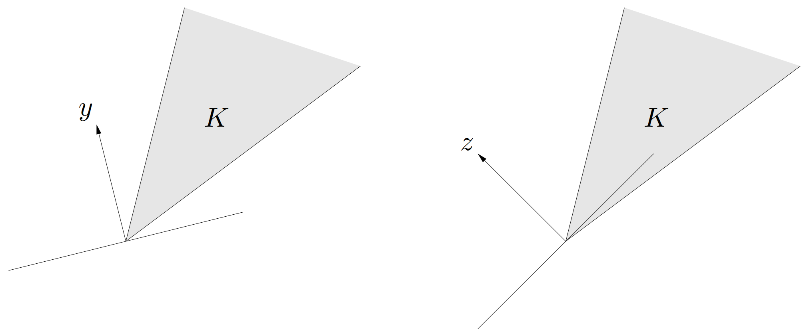
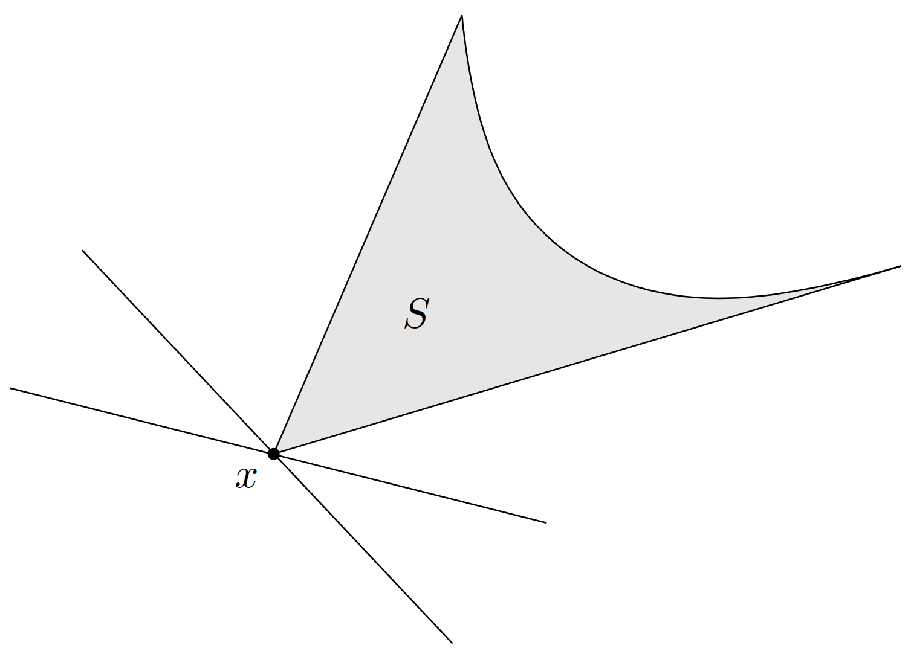
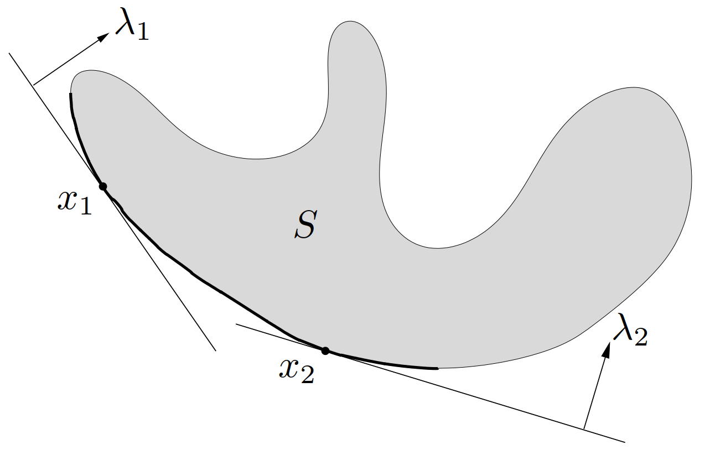
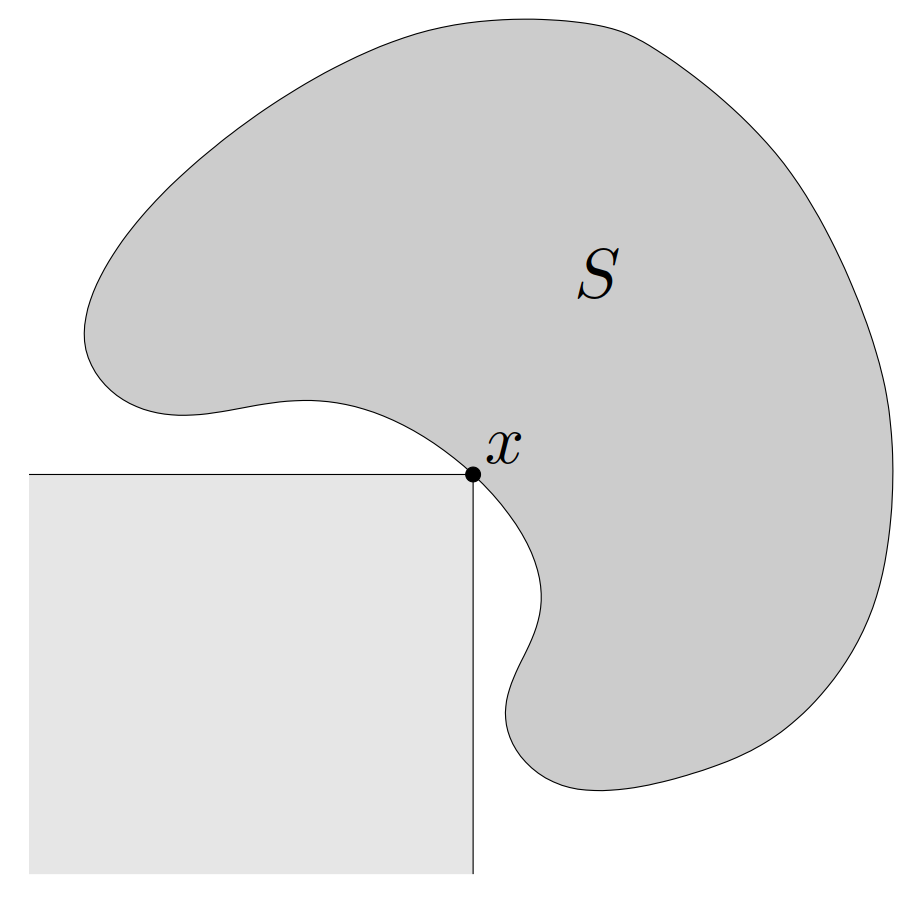
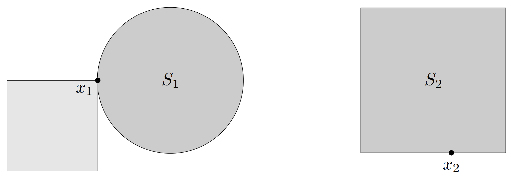

# 1. 对偶锥

$
\newcommand{\bfR}{\mathbf{R}}
\newcommand{\bfS}{\mathbf{S}}
\newcommand{\TT}{\mathrm{T}}
\def\tr{\mathop{\bf tr}}
\def\iint{\mathop{\bf int}}
$&emsp;&emsp;令 $K$ 为一个锥。集合

$$\begin{equation}
  K^\ast = \{ y\mid x^\TT y \geqslant 0,\ \forall x \in K \}
\end{equation}$$

称为 K 的**对偶锥**（*dual cone*）。顾名思义，$K^\ast$ 是一个锥，并且它总是凸的，即使 $K$ 不是凸锥。

&emsp;&emsp;从几何上看，$y \in K^\ast$ 当且仅当 $-y$ 是 $K$ 在原点的一个支撑超平面的法线，如[图 22](#图22) 所示。

{width=600px}

> **举例**&emsp;**子空间**。子空间 $V \subseteq \bfR^n$（这是一个锥）的对偶锥是其正交补 $V^\perp = \{y\mid y^\TT v = 0,\ \forall v \in V\}$。

<!-- more -->

> **举例**&emsp;**非负象限**。锥 $\bfR^n_+$ 的对偶是它本身：
>
> $$
> y^\TT x \geqslant 0,\ \forall x \succeq 0 \Longleftrightarrow y \succeq 0
> $$
>
> 称这种锥**自对偶**（*self-dual*）。

> **举例**&emsp;**半正定锥**。在 $n \times n$ 对称矩阵的集合 $\bfS^n$ 上，其标准内积 $\tr(XY) = \displaystyle\sum_{i,j=1}^{n} X_{ij}Y_{ij}$。半正定锥 $\bfS^n_+$ 是自对偶的，即对于任意的 $X,Y\in\bfS^n$
>
> $$
> \tr (XY) \geqslant 0,\ \forall X \succeq 0 \Longleftrightarrow Y \succeq 0
> $$
>
> 下面说明这一结论。
>
> > **证明**&emsp;假设 $Y \notin \bfS^n_+$，那么存在 $q \in \bfR^n$ 并且
> >
> > $$
> > q^\TT Yq = \tr (qq^\TT Y) < 0
> > $$
> >
> > 于是半正定矩阵 $X = qq^\TT$ 满足 $\tr(XY) < 0$，由此可知 $Y \notin (\bfS^n_+)^\ast$。
> >
> > 假设 $X,Y\in\bfS^n_+$，可以利用特征值分解将 $X$ 表述为 $X = \displaystyle\sum_{i=1}^n \lambda_i q_i q_i^\TT$，其中（特征值）$\lambda_i \geqslant 0,\ i = 1,\cdots,n$。于是有
> >
> > $$
> > \tr (XY) = \tr \left( Y \sum_{i=1}^n \lambda_i q_i q_i^\TT \right) = \sum_{i=1}^n \lambda_i q^\TT Y q_i \geqslant 0
> > $$
> >
> > 以上表明 $Y \in (\bfS^n_+)^\ast$。

> **举例**&emsp;**范数锥的对偶**。令 $\|\cdot\|$ 为定义在 $\bfR^n$ 上的范数。与之相关的锥 $K = \{ (x,t) \in \bfR^{n+1}\mid \|x\|\leqslant t \}$ 的对偶锥由其对偶范数定义，
>
> $$
> K^\ast = \{(u,v) \in \bfR^{n+1}\mid \|u\|_\ast \leqslant v\}
> $$
>
> 这里的对偶范数由 $\|u\|_\ast = \sup\{u^\TT x\mid \| x \|\leqslant 1\}$ 给出。
>
> 为证明这个结论，我们需要说明
>
> $$\begin{equation}\label{DualOfNormCone}
>   x^\TT u + tv \geqslant 0\ 只要\ \|x\|\leqslant t \Longleftrightarrow \|u\|_\ast \leqslant v
> \end{equation}$$
>
> > **证明**&emsp;首先，证明由右端关于 $(u,v)$ 的条件可以得出左端的条件。设 $\|u\|_\ast \leqslant v$，并且对于一些 $t>0$ 有 $\|x\| \leqslant t$。（如果 $t = 0$，$x$ 必须是零，因此显然有 $u^\TT x + vt \geqslant 0$。）根据对偶锥的定义以及 $\|-x/t\|\leqslant 1$，我们有
> >
> > $$
> > u^\TT (-x/t) \leqslant \|u\|_\ast \leqslant v
> > $$
> >
> > 因此，$u^\TT x + vt \geqslant 0$。
> >
> > 其次，我们证明 $\eqref{DualOfNormCone}$ 左端的条件可以导出 $\eqref{DualOfNormCone}$ 右端的条件。假设 $\|u\|_\ast> v$，即右端不成立。那么，根据对偶锥的定义，存在 $x$ 满足 $\|x\|\leqslant 1$ 及 $x^\TT u > v$。取 $t=1$，我们有
> >
> > $$
> > u^\TT (-x) + v < 0
> > $$
> >
> > 这与 $\eqref{DualOfNormCone}$ 的左端相矛盾。

&emsp;&emsp;对偶锥满足一些性质，例如

- $K^\ast$ 是闭凸锥。
- $K_1 \subseteq K_2$ 可导出 $K_2^\ast \subseteq K_1^\ast$。
- 如果 $K$ 有非空内部，那么 $K^\ast$ 是尖的。
- 如果 $K$ 的闭包是尖的，那么 $K^\ast$ 有非空内部。
- $K^{\ast\ast}$ 是 $K$ 的凸包的闭包。（因此，如果 $K$ 是凸和闭的，则 $K^{\ast\ast} = K$。）这些性质表明如果 $K$ 是一个正常锥，那么它的对偶 $K^\ast$ 也是，进一步地，有 $K^{\ast\ast} = K$。

# 2. 广义不等式的对偶

&emsp;&emsp;现在假设凸锥 $K$ 是正常锥，因此它可以导出一个广义不等式 $\preceq_K$。其对偶锥 $K^\ast$ 也是正常的，所以也能导出一个广义不等式。我们称广义不等式立 $\preceq_{K^\ast}$ 为广义不等式 $\preceq_K$ 的**对偶**（*dual*）。

&emsp;&emsp;关于广义不等式及其对偶有一些重要的性质

- $x \preceq_K y$ 当且仅当对于任意 $\lambda \succeq_{K^\ast}$，有 $\lambda^\TT x \leqslant \lambda^\TT y$。
- $x \prec_K y$ 当且仅当对于任意 $\lambda \succeq_{K^\ast}$ 和 $\lambda\ne 0$，有 $\lambda^\TT T x < \lambda^\TT y$。

&emsp;&emsp;因为 $K = K^{\ast\ast}$，与 $\preceq_{K^\ast}$ 相关的对偶广义不等式为 $\preceq_{K}$，因此交换广义不等式及其对偶后，这些性质依然成立。作为一个具体的例子，我们可知 $\lambda\preceq_{K^\ast} \mu$ 的充要条件是对于所有 $x \succeq_K 0$ 有 $\lambda^\TT x \leqslant \mu^\TT x$。

> **举例**&emsp;**线性严格广义不等式的择一定理**。设 $K \subseteq \bfR^m$ 为正常锥。考虑严格广义不等式
>
> $$\begin{equation}\label{StrictGeneralInequality}
>   Ax \prec_K b
> \end{equation}$$
>
> 其中 $x \in \bfR^n$
>
> 下面推导对于这个不等式的择一定理。假设它是不可行的，即仿射集合 $\{b-Ax\mid x\in\bfR^n\}$ 与开凸集 $\iint K$ 不相交。那么存在一个分离超平面，即非零的 $\lambda\in\bfR^m$ 和 $\mu\in \bfR$ 使得对于任意 $x$ 有灯 $\lambda^\TT(b-Ax) \leqslant \mu$，对于任意 $y \in \iint K$ 有 $\lambda^\TT y \geqslant \mu$。第一个条件表明 $A^\TT \lambda = 0$ 及 $\lambda^\TT b \leqslant \mu$。第二个条件表明对于任意 $y\in K$ 有 $\lambda^\TT y \geqslant \mu$，这种情况仅当 $\lambda \in K^\ast$ 和 $\mu \leqslant 0$ 时才可能发生。
>
> 综上，我们可知当 $\eqref{StrictGeneralInequality}$ 不可行时，存在 $\lambda$ 使得
>
> $$\begin{equation}\label{StrictGeneralInequalityInfeasible}
> \lambda \ne 0,\qquad \lambda \preceq_{K^\ast} 0,\qquad A^\TT \lambda = 0,\qquad \lambda^\TT b \leqslant 0
> \end{equation}$$
>
> 现在我们证明反方向，即如果 $\eqref{StrictGeneralInequalityInfeasible}$ 成立，那么，不等式组 $\eqref{StrictGeneralInequality}$ 不可能可行。假设不等式均成立，因为 $\lambda\ne 0$，$\lambda \succeq_{K^\ast}$ 及 $b - Ax \succ_K 0$，我们有 $\lambda^\TT (b-Ax)>0$。但是根据 $A^\TT \lambda = 0$，我们可以找到 $\lambda^\TT (b-Ax) = \lambda^\TT b \leqslant 0$，而这是一个矛盾。
>
> 因此，不等式组 $\eqref{StrictGeneralInequality}$ 和 $\eqref{StrictGeneralInequalityInfeasible}$ 构成一对择一：对于任意 $A, b$，它们中仅有一个是可行的。（这是严格线性不等式的择一定理的推广；严格线性不等式的择一定理是 $K = \bfR^m_+$ 时的特殊情况。）

# 3. 对偶不等式定义的最小元和极小元

&emsp;&emsp;可以利用对偶广义不等式来刻画集合 $S\subseteq\mathbf{R}^m$（可能非凸）关于正常锥 $K$ 导出的广义不等式的最小元和极小元。

## 3.1 最小元的对偶性质

&emsp;&emsp;首先考虑**最小**（*minimum*）元的性质。$x$ 是 $S$ 上关于广义不等式 $\preceq _K$ 的最小元的充要条件是，对于所有 $\lambda\succ_{K^*}0$，$x$ 是在 $z\in S$ 上极小化 $\lambda^\TT z$ 的唯一最优解。几何上看，这意味着对于任意 $\lambda\succ_{K^*}0$，超平面

$$
\{z\mid \lambda^\TT (z-x)=0\}
$$

是在 $x$ 处对 $S$ 的一个严格支撑超平面。（用严格支撑超平面表明这个超平面与 $S$ 只相交于 $x$。）注意此处并不要求 $S$ 是凸集。这可由[图 23](#图23)来表示。

{width=400px}

&emsp;&emsp;为说明这个结论，设 $x$ 是 $S$ 的最小元，即对于任意 $z\in S$ 有 $x\preceq_Kz$，同时，令 $\lambda\succ_{K^*} 0$，而$z\in S$，$z\neq x$。因为 $x$ 是 $S$ 上的最小元，所以有 $z-x\succeq_K0$。根据 $\lambda\succ_{K^*}0$ 及 $z-x\succeq_K0$，$z-x\neq0$，可以得到 $\lambda^\TT (z-x)>0$。因为 $z$ 是 $S$ 上任意一个不等于 $x$ 的元素，所以 $x$ 是在 $z\in S$ 上极小化 $\lambda^\TT z$ 的唯一解。反之，假设对于所有 $\lambda\succ_{K^*}0$，$x$ 是 $z\in S$ 上极小化 $\lambda^\TT z$ 的唯一解，但 $x$ 不是 $S$ 的最小元。那么存在 $z\in S$ 满足 $z\nsucceq_Kx$。因为 $z-x\nsucceq_K0$，存在 $\tilde{\lambda}\succeq_{K^*} 0$ 并且 $\tilde{\lambda}^\TT(z-x)<0$。因此，对于 $\lambda\succ_{K^*} 0$，在 $\tilde{\lambda}$ 的邻域内有 $\lambda^\TT (z-x)<0$。这与 $x$ 是 $S$ 上极小化 $\lambda^\TT z$ 的唯一解相矛盾。

## 3.2 极小元的对偶性质

&emsp;&emsp;现在讨论**极小**（*minimal*）元的类似性质。此时，在必要和充分条件间存在一定的间隙。如果 $\lambda\succ_{K^*} 0$ 并且 $x$ 在 $z\in S$ 上极小化 $\lambda^\TT z$，那么 $x$ 是极小的，如[图 24](#图24)所示。

{width=400px}

> **证明**&emsp;假设 $\lambda\succ_{K^*} 0$ 并且 $x$ 在 $S$ 上极小化 $\lambda^\TT z$，但 $x$ 不是极小元，即存在 $z\in S$ 满足 $z\neq x$，$z\preceq_Kx$。那么 $\lambda^\TT (x-z)>0$，这与我们的假设，即 $x$ 在 $S$ 上极小化了 $\lambda^\TT z$，相矛盾。

&emsp;&emsp;其逆命题在一般情况下不成立：$S$ 上的极小元 $x$ 可以对于任何 $\lambda$ 都不是 $z\in S$ 上极小化 $\lambda^\TT z$ 的解，如[图 25](#图25)所示。此图表明了凸性在这个逆定理中的重要作用，当凸性成立时，逆定理是成立的。假设集合 $S$ 是凸集，可以说对于任意极小元 $x$，存在非零的 $\lambda\succeq_{K^*} 0$ 使得 $x$ 在 $z\in S$ 上极小化 $\lambda^\TT z$。

{width=350px}

> **证明**&emsp;假设 $x$ 是极小的，也就是说 $((x-K)\setminus\{x\})\cap S=\emptyset$。对凸集 $(x-K)\setminus\{x\}$ 和 $S$ 应用超平面分离定理，可以得出：存在 $\lambda\neq0$ 和 $\mu$，使得对于所有 $y\in K$ 有 $\lambda^\TT (x-y)\leqslant\mu$，对于所有 $z\in S$ 有 $\lambda^\TT z\geqslant\mu$。根据第一个不等式，可知 $\lambda\succeq_{K^*} 0$。由于 $x\in S$ 和 $x\in x-K$，所以有 $\lambda^\TT x=\mu$，所以第二个不等式表明 $\mu$ 是 $S$ 上 $\lambda^\TT z$ 的最小值。因此，$x$ 是 $S$ 上极小化 $\lambda^\TT z$ 的一个解，这里 $\lambda\neq0$，$\lambda\succeq_{K^*}0$。

&emsp;&emsp;这个逆定理无法加强为 $\lambda\succ_{K^*} 0$。反例表明，凸集 $S$ 上的极小元 $x$，可以对于任意 $\lambda\succ_{K^*}0$，都不是 $z\in S$ 中极小化 $\lambda ^\TT z$ 的解（参见[图 26，左图](#图26)）。同时，并不是对于任意 $\lambda\succeq_{K^*} 0$，在 $z\in S$ 上极小化 $\lambda^\TT z$ 的解都一定是极小的（参见[图 26，左图](#右26)）。

{width=700px}

# 参考文献

1. Stephen P. Boyd and Lieven Vandenberghe, *Convex optimization*. Cambridge, UK: Cambridge University Press, 2004.
2. Stephen P. Boyd and Lieven Vandenberghe, *凸优化*. 北京: 清华大学出版社, 2013.
