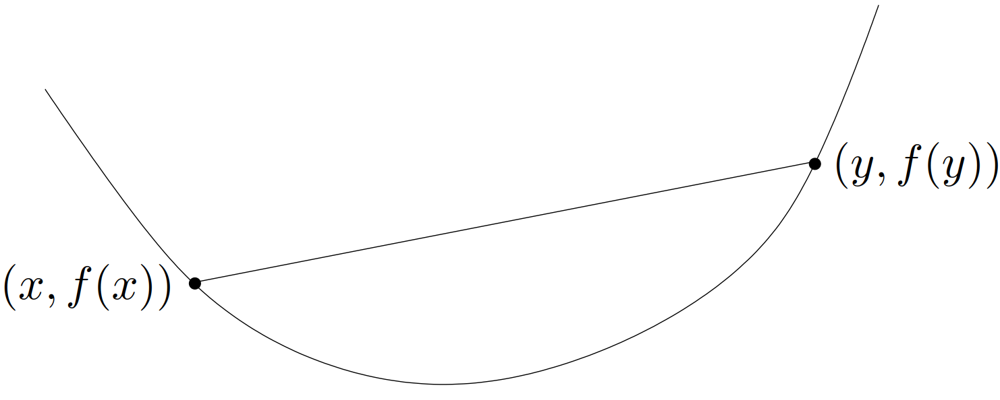
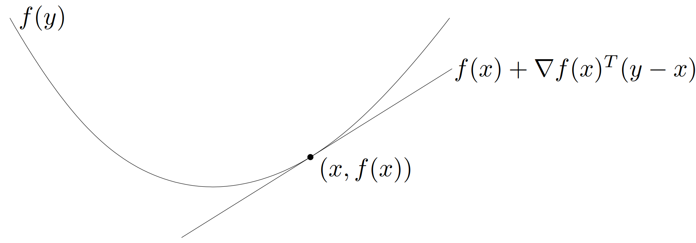
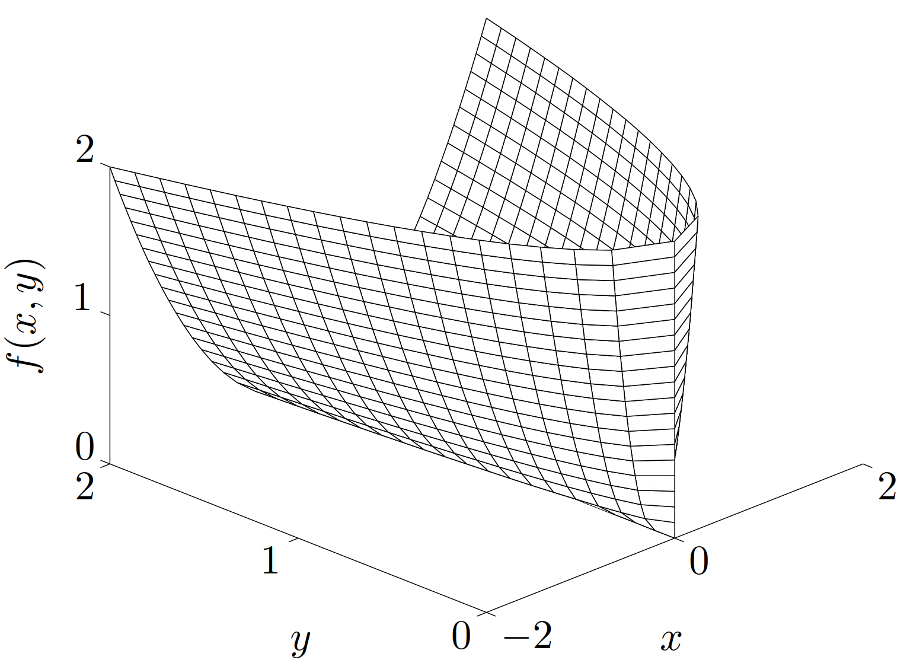
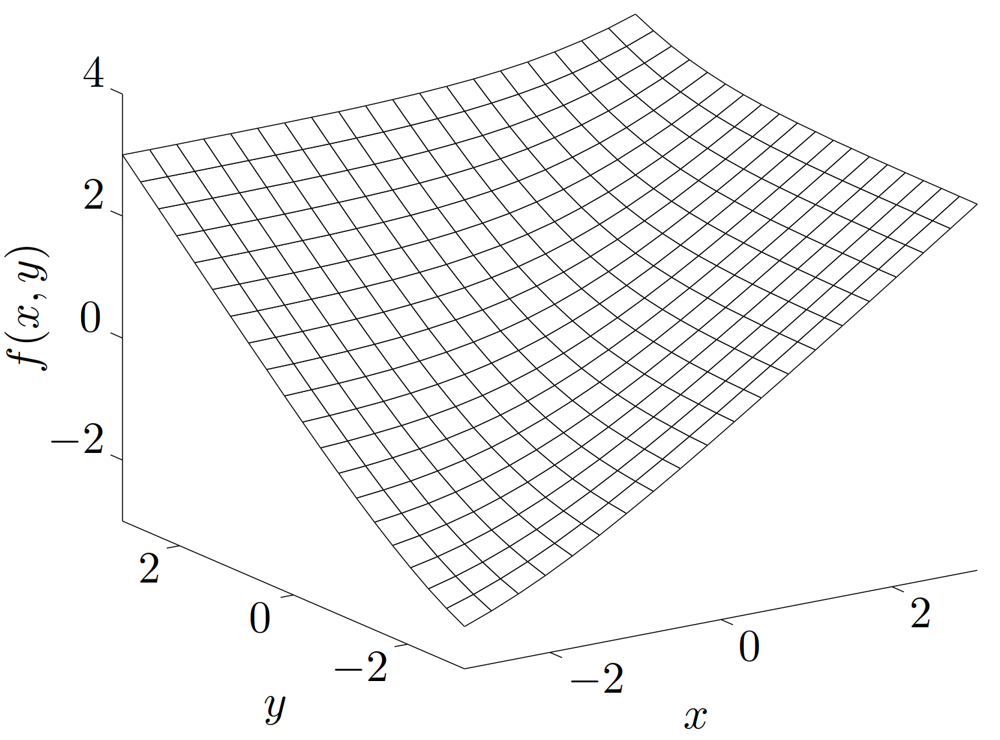
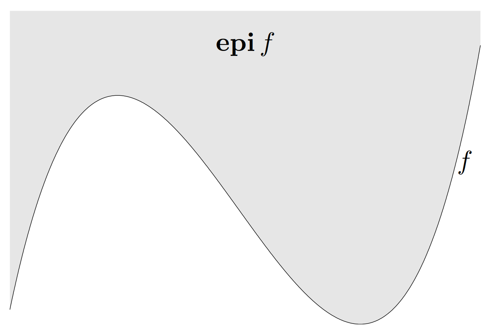
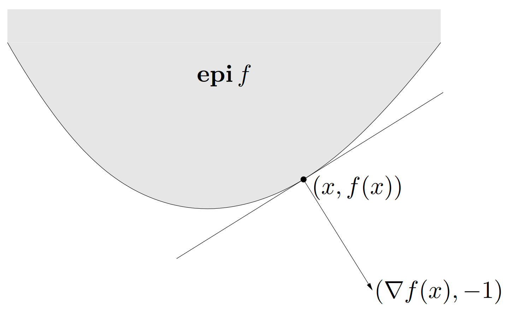

# 1. 定义

$
\newcommand{\TT}{\mathrm{T}}
\newcommand{\dd}{\mathrm{d}}
\def\dom{\mathop{\bf dom}}
\def\diag{\mathop{\bf diag}}
\def\epi{\mathop{\bf epi}}
\def\hypo{\mathop{\bf hypo}}
\def\prob{\mathop{\bf prob}}
$&emsp;&emsp;函数 $f:\mathbf{R}^n\to\mathbf{R}$ 是**凸**（*Convex*）的，如果 $\dom f$ 是凸集，且对于任意 $x,y\in\dom f$ 和任意 $0\leqslant\theta\leqslant1$，有

$$\begin{equation}\label{DefinitionOfConvexFunction}
  f(\theta x+(1-\theta)y)\leqslant\theta f(x)+(1-\theta)f(y)
\end{equation}$$

&emsp;&emsp;从几何意义上看，上述不等式意味着点 $(x,f(x))$ 和 $(y,f(y))$ 之间的线段，即从 $x$ 到 $y$ 的**弦**（*chord*），在函数 $f$ 的图像上方（如[图 1](#图1)所示）。称函数 $f$ 是**严格凸**（*strictly convex*）的，如果式 $\eqref{DefinitionOfConvexFunction}$ 中的不等式当 $x\neq y$ 以及 $0<\theta<1$ 时严格成立。称函数 $f$ 是**凹**（*concave*）的，如果函数 $-f$ 是凸的，称函数 $f$ 是**严格凹**（*strictly concave*）的，如果 $-f$ 严格凸。

{width=400px}

<!-- more -->

&emsp;&emsp;对于仿射函数，式 $\eqref{DefinitionOfConvexFunction}$ 始终可以取等号，因此所有的[仿射函数][]（包括线性函数）是既凸且凹的。反之，若某个函数是既凸又凹的，则其是仿射函数。

&emsp;&emsp;函数是凸的，当且仅当其在与其定义域相交的任何直线上都是凸的。换言之，函数 $f$ 是凸的，当且仅当对于任意 $x\in\dom f$ 和任意向量 $v$，函数 $g(t)=f(x+tv)$ 是凸的（其定义域为 $\{t\mid x+tv\in\dom f\}$）。这个性质非常有用，因为它让我们可以通过将函数限制在直线上来判断其是否是凸函数。



这里可能是由于翻译问题导致不是很好理解，我们先看原文：

> A function is convex if and only if it is convex when restricted to any line that
intersects its domain. In other words $f$ is convex if and only if for all $x\in\mathbf{dom}\, f$ and all $v$, the function $g(t) = f(x + tv)$ is convex (on its domain, $\{t\mid x+tv\in\mathbf{dom}\, f\}$). This property is very useful, since it allows us to check whether a function is convex by restricting it to a line.

仍然不是很好理解。因此询问 ChatGPT 得到如下解释：

- 限制在直线上：考虑一个函数 $f$ 和其定义域内的任意一点 $x$。再选择一个任意方向向量 $v$。我们沿着这个方向 $v$ 从点 $x$ 出发，得到一条直线。任何点 $x+tv$（其中 $t$ 是一个实数）都在这条直线上。这就叫做将函数限制在直线上。

- 直线上的函数：我们定义一个新的函数 $g(t)=f(x+tv)$。这个新的函数 $g(t)$ 表示原函数 $f$ 在直线 $x+tv$ 上的值。

- 检查凸性：如果对于任意 $x$ 和 $v$，新的函数 $g(t)$ 是凸的，那么我们就说原函数 $f$ 是凸的。也就是说，如果 $f$ 在所有限制的直线上都是凸的，那么 $f$ 本身就是凸的。

通过限制在直线上，我们将原来的多变量问题简化为单变量问题。对于单变量函数，判断凸性要比多变量情况简单得多。这使得我们可以用更简单的方法来判断一个函数是否是凸的。

> **举例**&emsp;假设我们有一个二次函数 $f(x)=x_1^2+x_2^2$。我们选一个点 $x=(a,b)$ 和一个方向 $v=(c,d)$，沿着这个方向得到直线 $(a,b)+t(c,d)$，然后我们可以定义一个新函数：
>
> $$
> g(t)=f((a,b)+t(c,d))=f(a+tc,b+td)=(a+tc)^2+(b+td)^2
> $$
>
> 我们需要检查这个新函数 $g(t)$ 是否是凸的。如果对所有 $x$ 和 $v$ 新函数 $g(t)$ 都是凸的，那么原函数 $f$ 就是凸的。在这个例子中，显然 $g(t)=(a+tc)^2+(b+td)^2$ 是一个关于 $t$ 的二次函数，它是凸的。因此，原函数 $f(x)=x_1^2+x_2^2$ 是凸的。

总的来说，"将函数限制在直线上"意味着通过沿着任意方向取直线来简化判断多变量函数的凸性，从而可以更方便地确定函数的整体凸性。



&emsp;&emsp;对凸函数的**分析**（*analysis*）已经相当地透彻，这里不再继续深入。例如有这样一个简单的结论，凸函数在其定义域相对内部是连续的；它只可能在相对边界上不连续。

# 2. 扩展值延伸

&emsp;&emsp;通常可以定义凸函数在定义域外的值为 $\infty$，从而将这个凸函数延伸至全空间 $\mathbf{R}^n$。如果 $f$ 是凸函数，我们定义它的**扩展值延伸**（*extended-value extension*）$\tilde{f}:\mathbf{R}^n\to\mathbf{R}\cup\{\infty\}$ 如下
$$
\tilde{f}(x)=\begin{cases}
  f(x)&x\in\textbf{dom}f\\\infty&x\not\in\textbf{dom}f
\end{cases}
$$

延伸函数 $\tilde{f}$ 是定义在全空间 $\mathbf{R}^n$ 上的，取值集合为 $\mathbf{R}\cup\{\infty\}$。我们也可以从延伸函数 $\tilde{f}$ 的定义中确定原函数 $f$ 的定义域，即 $\dom f=\{x\mid\tilde{f}(x)<\infty\}$。

&emsp;&emsp;这种延伸可以简化符号描述，此时我们就不需要明确描述定义域或者每次提到 $f(x)$ 时都限定“对于所有的 $x\in\dom f$”。以基本不等式 $\eqref{DefinitionOfConvexFunction}$ 为例，对于延伸函数 $\tilde{f}$，可以描述为：对于**任意**（*any*）$x$ 和 $y$，以及 $0<\theta<1$，有

$$
\tilde{f}(\theta x+(1-\theta)y)\leqslant\theta\tilde{f}(x)+(1-\theta)\tilde{f}(y)
$$

（当 $\theta=0$ 或 $\theta=1$ 时不等式总成立。）当然此时应当利用扩展运算和扩展序来理解这个不等式。

- 若 $x$ 和 $y$ 在 $\dom f$ 内，上述不等式即为不等式 $\eqref{DefinitionOfConvexFunction}$；
- 若 $x$ 或 $y$ 在 $\dom f$ 外，上述不等式的右端为 $\infty$，不等式仍然成立。

> **举例**&emsp;设 $f_1$ 和 $f_2$ 是 $\mathbf{R}^n$ 上的两个凸函数。逐点和函数 $f=f_1+f_2$ 的定义域为 $\dom f=\dom f_1\cap\dom f_2$，对于任意 $x\in\dom f$，有 $f(x)=f_1(x)+f_2(x)$。利用扩展值延伸我们可以简单地描述为，对于任意 $x$，$\tilde{f}(x)=\tilde{f}_1(x)+\tilde{f}_2(x)$。在这个方程里，函数 $f$ 的定义域被自动定义为 $\dom f=\dom f_1\cap\dom f_2$，因为当 $x\not\in\dom f_1$ 或者 $x\not\in\dom f_2$ 时，$\tilde{f}(x)=\infty$。在此例中，我们就可以利用扩展运算来自动定义定义域。

&emsp;&emsp;在不会造成歧义的情况下，可以用同样的符号来表示一个凸函数及其延伸函数。即假设所有的凸函数都隐含地被延伸了，也就是在定义域外都被定义为 $\infty$。

> **举例**&emsp;**凸集的示性函数**。设 $C\subseteq\mathbf{R}^n$ 是一个凸集，考虑（凸）函数 $I_C$，其定义域为 $C$，对于所有的 $x\in C$，有 $I_C(x)=0$。换言之，此函数在集合 $C$ 上一直为零。其扩展值延伸可以描述如下
>
> $$
> \tilde{I}_C(x)=\begin{cases}0&x\in C\\\infty&x\not\in C.\end{cases}
> $$
>
> 凸函数 $\tilde{I}_C$ 被称作集合 $C$ 的**示性函数**（*indicator function*）。
>
> 利用示性函数 $\tilde{I}_C$，可以更加灵活地定义符号描述。例如，对于在集合 $C$ 上极小化函数 $f$ 的问题（假设 $f$ 定义在整个 $\mathbf{R}^n$ 空间），可以给出等价的问题，即在 $\mathbf{R}^n$ 上极小化函数 $f+\tilde{I}_C$。事实上，按照不会造成歧义的约定，函数 $f+\tilde{I}_C$ 等价于定义在集合 $C$ 上的函数 $f$。

&emsp;&emsp;类似地，可以通过定义凹函数在定义域外都为 $-\infty$ 对其进行延伸。

# 3. 一阶条件

&emsp;&emsp;假设 $f$ 可微（即其梯度 $\nabla f$ 在开集 $\dom f$ 内处处存在），则函数 $f$ 是凸函数的充要条件是 $\dom f$ 是凸集且对于任意 $x,y\in\dom f$，下式成立

$$\begin{equation}\label{FirstOrderCondition}
  f(y)\geqslant f(x)+\nabla f(x)^\TT (y-x)
\end{equation}$$

[图 2](#图2) 描述了上述不等式，也即沿函数上任意一点作切线，函数始终位于切线上方。

{width=500px}

&emsp;&emsp;由 $f(x)+\nabla f(x)^\TT (y-x)$ 得出的仿射函数 $y$ 即为函数 $f$ 在点 $x$ 附近的 Taylor 近似。不等式 $\eqref{FirstOrderCondition}$ 表明，对于一个凸函数，其一阶 Taylor 近似实质上是原函数的一个**全局下估计**（*global underestimator*）。反之，如果某个函数的一阶 Taylor 近似总是其全局下估计，那么这个函数是凸的。

&emsp;&emsp;不等式 $\eqref{FirstOrderCondition}$ 说明从一个凸函数的**局部信息**（*local information*）（即它在某点的函数值及导数），可以得到一些**全局信息**（*global information*）（如它的全局下估计）。这也许是凸函数的最重要的信息，由此可以解释凸函数以及凸优化问题的一些非常重要的性质。

> **举例**&emsp;由不等式 $\eqref{FirstOrderCondition}$ 可以知道，如果 $\nabla f(x)=0$，那么对于所有的 $y\in\dom f$，存在 $f(y)\geqslant f(x)$，即 $x$ 是函数 $f$ 的全局极小点。

&emsp;&emsp;严格凸性同样可以由一阶条件刻画：函数 $f$ 严格凸的充要条件是 $\dom f$ 是凸集且对于任意 $x,y\in\dom f$，$x\neq y$，有

$$\begin{equation}\label{StrictFirstOrderCondition}
  f(y)>f(x)+\nabla f(x)^\TT (y-x)
\end{equation}$$

&emsp;&emsp;对于凹函数，亦存在与之对应的一阶条件：函数 $f$ 是凹函数的充要条件是 $\dom f$ 是凸集且对于任意 $x,y\in\dom f$，下式成立

$$
f(y)\leqslant f(x)+\nabla f(x)^\TT (y-x)
$$

## 3.1 一阶凸性条件的证明

&emsp;&emsp;为了证明式 $\eqref{FirstOrderCondition}$，先考虑 $n=1$ 的情况：我们证明可微函数 $f:\mathbf{R}\to\mathbf{R}$ 是凸函数的充要条件是对于 $\dom f$ 内的任意 $x$ 和 $y$，有

$$\begin{equation}\label{FirstOrderConditionWhenNEquals1}
  f(y)\geqslant f(x)+f'(x)(y-x)
\end{equation}$$

&emsp;&emsp;首先证明必要性。假设 $f$ 是凸函数，且 $x,y\in\dom f$。因为 $\dom f$ 是凸集（某个区间），对于任意 $0<t\leqslant1$，我们有 $x+t(y-x)\in\dom f$，由函数 $f$ 的凸性可得

$$
f(x+t(y-x))\leqslant(1-t)f(x)+tf(y)
$$

将上式两端同除 $t$ 可得

$$
f(y)\geqslant f(x)+\frac{f(x+t(y-x))-f(x)}{t}
$$

令 $t\to 0$，可以得到不等式 $\eqref{FirstOrderConditionWhenNEquals1}$。

&emsp;&emsp;为了证明充分性，假设对 $\dom f$（某个区间）内的任意 $x$ 和 $y$，函数满足不等式 $\eqref{FirstOrderConditionWhenNEquals1}$。选择任意 $x\neq y$，$0\leqslant\theta\leqslant1$，令 $z=\theta x+(1-\theta)y$。两次应用不等式 $\eqref{FirstOrderConditionWhenNEquals1}$ 可得

$$
f(x)\geqslant f(z)+f'(z)(x-z),\quad f(y)\geqslant f(z)+f'(z)(y-z)
$$

将第一个不等式乘以 $\theta$，第二个不等式乘以 $1-\theta$，并将二者相加可得

$$
\theta f(x)+(1-\theta)f(y)\geqslant f(z)
$$

从而说明了函数 $f$ 是凸的。

&emsp;&emsp;现在来证明一般情况，即 $f:\mathbf{R}^n\to\mathbf{R}$。设 $x,y\in\mathbf{R}^n$，考虑过这两点的直线上的函数 $f$，即函数 $g(t)=f(ty+(1-t)x)$，此函数对 $t$ 求导可得 $g'(t)=\nabla f(ty+(1-t)x)^\TT(y-x)$。

&emsp;&emsp;首先假设函数 $f$ 是凸的，则函数 $g$ 是凸的，由前面的讨论可得 $g(1)\geqslant g(0)+g'(0)$，即

$$
f(y)\geqslant f(x)+\nabla f(x)^\TT (y-x)
$$

再假设此不等式对于任意 $x$ 和 $y$ 均成立，因此若 $ty+(1-t)x\in\dom f$ 以及 $\tilde{t}y+(1-\tilde{t})x\in\dom f$，有

$$
f(ty+(1-t)x)\geqslant f(\tilde{t}y+(1-\tilde{t})x)+\nabla f(\tilde{t}y+(1-\tilde{t})x)^\TT (y-x)(t-\tilde{t})
$$

即 $g(t)\geqslant g(\tilde{t})+g'(\tilde{t})(t-\tilde{t})$，说明了函数 $g$ 是凸的。

# 4 二阶条件

&emsp;&emsp;现在假设函数 $f$ 二阶可微，即对于开集 $\dom f$ 内的任意一点，它的 **Hessian 矩阵**或者二阶导数 $\nabla^2f$ 存在，则函数 $f$ 是凸函数的充要条件是，其 Hessian 矩阵是半正定阵：即对于所有的 $x\in\dom f$，有

$$
\nabla^2f(x)\succeq0
$$

对于 $\mathbf{R}$ 上的函数，上式可以简化为一个简单的条件 $f''(x)\geqslant0$（$\dom f$ 是凸的，即一个区间），此条件说明函数 $f$ 的导数是非减的。条件 $\nabla^2f(x)\succeq0$ 从几何上可以理解为函数图像在点 $x$ 处具有正（向上）的曲率。

&emsp;&emsp;类似地，函数 $f$ 是凹函数的充要条件是，$\dom f$ 是凸集且对于任意 $x\in$ $\dom f$，$\nabla ^{2}f( x)$ $\preceq$ 0。严格凸的条件可以部分由二阶条件刻画。如果对于任意的 $x\in\dom f$ 有 $\nabla^2f(x)\succ0$，则函数 $f$ 严格凸。反过来则不一定成立：例如，函数 $f:\mathbf{R}\to\mathbf{R}$，其表达式为 $f(x)=x^4$，它是严格凸的，但是在 $x=0$ 处，二阶导数为零。

> **举例**&emsp;**二次函数**。考虑二次函数 $f:\mathbf{R}^n\to\mathbf{R}$，其定义域为 $\dom f=\mathbf{R}^n$，其表达式为
>
> $$
> f(x)=(1/2)x^\TT Px+q^\TT x+r
> $$
>
> 其中 $P\in\mathbf{S}^{n}$，$q\in\mathbf{R}^{n}$，$r\in\mathbf{R}$。因为对于任意 $x$，$\nabla^2f(x)=P$，所以函数 $f$ 是凸的，当且仅当 $P\succeq0$（$f$ 是凹的当且仅当 $P\preceq0$）。
>
> 对于二次函数，严格凸比较容易表达：函数 $f$ 是严格凸的，当且仅当 $P\succ0$（函数是严格凹的当且仅当 $P\prec0$）。

> **注释**&emsp;在判断函数的凸性和凹性时，不管是一阶条件还是二阶条件，$\dom f$ 必须是凸集这个前提条件必须满足。例如，考虑函数 $f(x)=1/x^2$，其定义域为 $\dom f=\{x\in$ $\mathbf{R}\mid x\neq0\}$，对于所有 $x\in\dom f$ 均满足 $f''(x)>0$，但是函数 $f(x)$ 并不是凸函数。

# 5. 例子

&emsp;&emsp;前文已经提到所有的线性函数和仿射函数均为凸函数（同时也是凹函数），并描述了凸和凹的二次函数。本节绘出更多的凸函数和凹函数的例子。

## $\mathbf{R}$ 上的例子

&emsp;&emsp;首先考虑 $\mathbf{R}$ 上的一些函数，其自变量为 $x$。

- **指数函数**（*Exponential*）。对任意 $a\in\mathbf{R}$，函数 $e^{ax}$ 在 $\mathbf{R}$ 上是凸的。
- **幂函数**（*Power*）。当 $a\geqslant1$ 或 $a\leqslant0$ 时，$x^a$ 在 $\mathbf{R}_{++}$ 上是凸函数；当 $0\leqslant a\leqslant1$ 时，$x^a$ 在 $\mathbf{R}_{++}$ 上是凹函数。
- **绝对值幂函数**（*Power of absolute value*）。当 $p\geqslant1$ 时，函数 $|x|^p$ 在 $\mathbf{R}$ 上是凸函数。
- **对数函数**（*Logarithm*）。函数 $\log x$ 在 $\mathbf{R}_{++}$ 上是凹函数。
- **负熵**（*Negative entropy*）。函数 $x\log x$ 在其定义域上是凸函数。（定义域为 $\mathbf{R}_{++}$ 或者 $\mathbf{R}_+$，当 $x=0$ 时定义函数值为 0。）

&emsp;&emsp;我们可以通过基本不等式 $\eqref{DefinitionOfConvexFunction}$ 或者二阶导数半正定或半负定来判断上述函数是凸的或是凹的。以函数 $f(x)=x\log x$ 为例，其导数和二阶导数为

$$
f'(x)=\log x+1,\quad f''(x)=1/x
$$

即对于 $x>0$，有 $f''(x)>0$。所以负熵函数是（严格）凸的。

## $\mathbf{R}^n$ 上的例子

&emsp;&emsp;下面给出 $\mathbf{R}^n$ 上的一些例子。

**范数**（*Norm*）。 $\mathbf{R}^n$ 上的任意范数均为凸函数。

**最大值函数**（*Max function*）。函数 $f(x)=\max\{x_1,\cdots,x_n\}$ 在 $\mathbf{R}^n$ 上是凸的。

**二次-线性分式函数**（*Quadratic-over-linear function*）。函数 $f(x,y)=x^2/y$，其定义域为
$$
\dom f= \mathbf{R} \times \mathbf{R} _{+ + }= \{ ( x, y) \in \mathbf{R} ^{2}\mid y> 0\}
$$
是凸函数（如[图 3](#图3)所示）。

{width=400px}

**指数和的对数**（*Log-sum-exp*）。函数 $f(x)=\log\left(e^{x_1}+\cdots+e^{x_n}\right)$ 在 $\mathbf{R}^n$上是凸函数。这个函数可以看成最大值函数的可微（实际上是解析）近似，因为对任意 $x$，下面的不等式成立
$$
\max\{x_{1},\cdots,x_{n}\}\leqslant f(x)\leqslant\max\{x_{1},\cdots,x_{n}\}+\log n
$$
（第二个不等式当 $x$ 的所有分量都相等时是紧的。）[图 4](#图4) 描述了当 $n=2$ 时 $f$ 的图像。

{width=400px}

**几何平均**（*Geometric mean*）。几何平均函数$f(x)=\left(\displaystyle\prod_{i=1}^n x_i\right)^{1/n}$在定义域 $\dom f=\mathbf{R}_{++}^n$ 上是凹函数。

**对数-行列式**（*Log-determinant*）。函数 $f(X)=\log\det X$ 在定义域 $\dom f=\mathbf{S}_{++}^n$ 上是凹函数。

&emsp;&emsp;判断上述函数的凸性（或者凹性）可以有多种途径，可以直接验证不等式 $\eqref{DefinitionOfConvexFunction}$ 是否成立，亦可以验证其 Hessian 矩阵是否半正定，或者可以将函数转换到与其定义域相交的任意直线上，通过得到的单变量函数判断原函数的凸性。

**范数**。如果函数 $f:\mathbf{R}^n\to\mathbf{R}$ 是范数，任取 $0\leqslant\theta\leqslant1$，有

$$
f(\theta x+(1-\theta)y)\leqslant f(\theta x)+f((1-\theta)y)=\theta f(x)+(1-\theta)f(y)
$$

上述不等式可以由三角不等式得到，当范数满足齐次性时，上述不等式取等号。

**最大值函数**。对任意 $0\leqslant\theta\leqslant1$，函数 $f(x)=\displaystyle\max_i x_i$ 满足

$$\begin{aligned}
f(\theta x+(1-\theta)y)&=\max_{i}(\theta x_{i}+(1-\theta)y_{i})
\\
&\leqslant\theta\max_{i}x_{i}+(1-\theta)\max_{i}y_{i}
\\
&=\theta f(x)+(1-\theta)f(y)
\end{aligned}$$

**二次线性分式函数**。为了说明二次-线性分式函数 $f( x, y) = x^2/ y$ 是凸的，我们注意到，对于 $y>0$，有

$$
\nabla^2f(x,y)=\dfrac{2}{y^3}\left[\begin{array}{cc}
y^2&-xy\\-xy&x^2
\end{array}\right]=\dfrac{2}{y^3}\left[\begin{array}{c}
y\\-x
\end{array}\right]\left[\begin{array}{c}
y\\-x
\end{array}\right]^\TT \succeq0
$$

**指数和的对数**。指数和的对数函数的 Hessian 矩阵为

$$
\nabla^{2}f(x)=\frac{1}{(\mathbf{1}^\TT z)^{2}}\left((\mathbf{1}^\TT z)\diag(z)-zz^\TT\right)
$$

其中 $z=(e^{x_1},\cdots,e^{x_n})$。为了说明 $\nabla^2f(x)\succeq0$，我们证明对任意 $v$，有 $v^\TT \nabla^2f(x)v\geqslant0$，即

$$
v^\TT \nabla^{2}f(x)v=\frac{1}{(\mathbf{1}^\TT z)^{2}}\left(\left(\sum_{i=1}^{n}z_{i}\right)\left(\sum_{i=1}^{n}v_{i}^{2}z_{i}\right)-\left(\sum_{i=1}^{n}v_{i}z_{i}\right)^{2}\right)\geqslant0
$$

上述不等式可以应用 Cauchy-Schwarz 不等式 $(a^\TT a)(b^\TT b)\geqslant(a^\TT b)^2$ 得到，此时向量 $a$ 和 $b$ 的分量为 $a_i= v_i\sqrt {z_i}$，$b_i= \sqrt {z_i}$。

**几何平均**。类似地，我们说明，几何平均函数 $f(x)=\left(\displaystyle\prod_{i=1}^nx_i\right)^{1/n}$ 在定义域 $\dom f=\mathbf{R}_{++}^{n}$上是凹的。其 Hessian 矩阵 $\nabla^2f(x)$ 可以通过下面两个式子给出

$$
\frac{\partial^{2}f(x)}{\partial x_{k}^{2}}=-(n-1)\frac{\left(\displaystyle\prod_{i=1}^{n}x_{i}\right)^{1/n}}{n^{2}x_{k}^{2}},\quad\frac{\partial^{2}f(x)}{\partial x_{k}\partial x_{l}}=\frac{\left(\displaystyle\prod_{i=1}^{n}x_{i}\right)^{1/n}}{n^{2}x_{k}x_{l}}\quad\forall\:k\neq l
$$

因此 $\nabla^2f(x)$ 具有如下表达式

$$\nabla^{2}f(x)=-\frac{\displaystyle\prod_{i=1}^{n}x_{i}^{1/n}}{n^{2}}\left(n \diag(1/x_{1}^{2},\cdots,1/x_{n}^{2})-qq^\TT\right)
$$

其中，$q_i=1/x_i$。我们需要证明 $\nabla^2f(x)\preceq0$，即对于任意向量 $v$，有

$$
v^\TT \nabla^2f(x)v=-\frac{\displaystyle\prod_{i=1}^nx_i^{1/n}}{n^2}\left(n\sum_{i=1}^nv_i^2/x_i^2-\left(\sum_{i=1}^nv_i/x_i\right)^2\right)\leqslant0
$$

这同样可以应用 Cauchy-Schwarz 不等式 $(a^\TT a)(b^\TT b)\geqslant(a^\TT b)^2$ 得到，只需令向量 $a=\mathbf{1}$，向量 $b$ 的分量 $b_i=v_i/x_i$。

**对数-行列式**。对于函数 $f(X)=\log\det X$，我们可以将其转化为任意直线上的单变量函数来验证它是凹的。令 $X=Z+tV$，其中 $Z,V\in\mathbf{S}^n$，定义 $g(t)=f(Z+tV)$，自变量 $t$ 满足 $Z+tV\succ0$。不失一般性，假设 $t=0$ 满足条件，即 $Z\succ0$。我们有

$$\begin{aligned}
g(t)&=\log\det(Z+tV)
\\
&=\log\det(Z^{1/2}(I+tZ^{-1/2}VZ^{-1/2})Z^{1/2})
\\
&=\sum_{i=1}^{n}\log(1+t\lambda_{i})+\log\det Z
\end{aligned}$$

其中 $\lambda_1,\cdots,\lambda_n$ 是矩阵 $Z^{-1/2}VZ^{-1/2}$ 的特征值。因此下式成立

$$
g'(t)=\sum_{i=1}^{n}\frac{\lambda_{i}}{1+t\lambda_{i}},\qquad g''(t)=-\sum_{i=1}^{n}\frac{\lambda_{i}^{2}}{(1+t\lambda_{i})^{2}}
$$

因为 $g''(t)\leqslant0$，函数 $f$ 是凹的。

# 6. 下水平集

&emsp;&emsp;函数 $f: \mathbf{R} ^{n}\to \mathbf{R}$ 的 **$\alpha$-下水平集**（*$\alpha$-sublevel set*）定义为

$$
C_{\alpha}=\{x\in\dom f\mid f(x)\leqslant\alpha\}
$$

对于任意 $\alpha$ 值，凸函数的下水平集仍然是凸集。证明可以由凸集的定义直接得到：如果 $x,y\in C_{\alpha }$，则有 $f( x) \leqslant \alpha$，$f( y) \leqslant \alpha$，因此对于任意$0\leqslant\theta\leqslant1$，$f(\theta x+(1-\theta)y)\leqslant\alpha$，即 $\theta x+(1-\theta)y\in C_{\alpha}$。

&emsp;&emsp;反过来不一定正确：某个函数的所有下水平集都是凸集，但这个函数可能不是凸函数。例如，函数 $f(x)=-e^x$ 在 $\mathbf{R}$ 上不是凸函数（实质上，它是严格凹函数），但是其所有下水平集均为凸集。

&emsp;&emsp;如果 $f$ 是凹函数，则由 $\{x\in\dom f\mid f(x)\geqslant\alpha\}$ 定义的 **$\alpha$-上水平集**（*$\alpha$-superlevel set*）也是凸集。下水平集的性质可以用来判断集合的凸性，若某个集合可以描述为一个凸函数的下水平集，或者一个凹函数的上水平集，则其是凸集。

> **举例**&emsp;对于 $x\in\mathbf{R}_+^n$，其几何平均和算术平均分别为
>
> $$
> G(x)=\left(\prod_{i=1}^{n}x_{i}\right)^{1/n},\qquad A(x)=\frac{1}{n}\sum_{i=1}^{n}x_{i}
> $$
>
> （在 $G$ 中，定义 $0^{1/n}=0$）。算术几何平均不等式为 $G(x)\leqslant A(x)$。
>
> 设 $0\leqslant\alpha\leqslant1$，考虑集合
>
> $$
> \{x\in\mathbf{R}_{+}^{n}\mid G(x)\geqslant\alpha A(x)\}
> $$
>
> 即使得几何平均至少大于等于算术平均的 $\alpha$ 倍的集合。此集合是凸集，因为它是凹函数 $G(x)=\alpha A(x)$ 的 $0$-上水平集。事实上，这个每合是正齐次的，因此它是凸锥

# 7. 上境图

&emsp;&emsp;函数 $f:\mathbf{R}^{n}\to\mathbf{R}$ 的图像定义为

$$
\{(x,f(x))\mid x\in\dom f\}
$$

它是 $\mathbf{R}^{n+1}$ 空间的子集。函数 $f:\mathbf{R}^n\to\mathbf{R}$ 的**上境图**（*epigraph*）定义为

$$
\epi f=\{(x,t)\mid x\in\dom f,f(x)\leqslant t\}
$$

它也是 $\mathbf{R}^{n+1}$ 空间的子集。（“Epi”是之上的意思，所以上境图的英文 epigraph 是“在函数图像之上”的意思。）[图 5](#图5)说明了上境图的定义。

{width=400px}

&emsp;&emsp;凸集和凸函数的联系可以通过上境图来建立：一个函数是凸函数，当且仅当其上境图是凸集。一个函数是凹函数，当且仅当其**亚图**（*hypograph*）

$$
\hypo f=\{(x,t)\mid t\leqslant f(x)\},
$$

是凸集。

> **举例**&emsp;**矩阵分式函数**。矩阵分式函数 $f:\mathbf{R}^n\times\mathbf{S}^n\to\mathbf{R}$
>
> $$
> f(x,Y)=x^\TT Y^{-1}x
> $$
>
> 在定义域 $\dom f=\mathbf{R}^n\times\mathbf{S}_{++}^n$ 上是凸的。（这实质上是定义域为 $\dom f=\mathbf{R}\times\mathbf{R}_{++}$ 的二次-线性分式函数 $f(x,y)=x^2/y$ 的一个扩展。）
>
> 一个简单的方式来验证矩阵分式函数 $f$ 的凸性是通过其上境图
>
> $$\begin{aligned}
>   \epi f &= \left\{(x,Y,t)\mid Y\succ0,\ x^\TT Y^{-1}x\leqslant t\right\}
>   \\
>   &=\left\{(x,Y,t)\:\middle|\left[\begin{array}{cc}
>     Y&x
>     \\
>     x^\TT&t
>   \end{array}\right]\succeq0,\:Y\succ0\right\}
> \end{aligned}$$
>
> 并应用 Schur 补条件判断分块矩阵的半正定性。最后一个条件是关于 $(x,Y,t)$ 的线性矩阵不等式，因此 $\epi f$ 是凸集。
>
> 对于 $n=1$ 的特殊情况，矩阵分式函数简化为二次-线性分式函数 $x^2/y$，相应的线性矩阵不等式表示为
> $$
> \left[\begin{array}{cc}y&x\\x&t\end{array}\right]\succeq0,\quad y>0
> $$
>
> （函数图像如[图 3](#图3) 所示）。

&emsp;&emsp;关于凸函数的很多结果可以从几何的角度利用上境图并结合凸集的一些结论来证明（或理解），例如，考虑凸函数的一阶条件

$$
f(y)\geqslant f(x)+\nabla f(x)^\TT (y-x)
$$

其中函数 $f$ 是凸的，$x,y\in\dom f$。我们可以利用 $\epi f$ 从几何角度理解上述基本不等式。如果 $(y,t)\in\epi f$，有

$$
t\geqslant f(y)\geqslant f(x)+\nabla f(x)^\TT (y-x)
$$

上式可以描述为

$$
(y,t)\in\epi f\implies\left[\begin{array}{c}\nabla f(x)\\-1\end{array}\right]^\TT \left(\left[\begin{array}{c}y\\t\end{array}\right]-\left[\begin{array}{c}x\\f(x)\end{array}\right]\right)\leqslant0
$$

这意味着法向量为 $(\nabla f(x),-1)$ 的超平面在边界点 $(x,f(x))$ 支撑着 $\epi f$，如[图 6](#图6) 所示。

{width=400px}

# 8. Jensen 不等式及其扩展

&emsp;&emsp;基本不等式

$$
f(\theta x+(1-\theta)y)\leqslant\theta f(x)+(1-\theta)f(y)
$$

有时也称作 **Jensen 不等式**（*Jensen’s inequality*）。此不等式可以很方便地扩展至更多点的凸组合：如果函数 $f$ 是凸函数，$x_1,\cdots,x_k\in\dom f$，$\theta_1,\cdots,\theta_k\geqslant0$ 且 $\theta_1+\cdots+\theta_k=1$，则下式成立

$$
f(\theta_1x_1+\cdots+\theta_kx_k)\leqslant\theta_1f(x_1)+\cdots+\theta_kf(x_k)
$$

考虑凸集时，此不等式可以扩展至无穷项和、积分以及期望。例如，如果在 $S\subseteq\dom f$ 上 $p(x)\geqslant0$ 且 $\displaystyle\int_Sp(x) \dd x = 1$，则当相应的积分存在时，下式成立

$$
f\left(\int_Sp(x)x\dd x\right)\leqslant\int_Sf(x)p(x)\dd x
$$

扩展到更一般的情况，我们可以采用其支撑属于 $\dom f$ 的任意概率测度。如果 $x$ 是随机变量，事件 $x\in\dom f$ 发生的概率为 1，函数 $f$ 是凸函数，当相应的期望存在时，我们有

$$\begin{equation}\label{GeneralJensenInequality}
  f(\mathbb{E}x)\leqslant\mathbb{E}f(x)
\end{equation}$$

设随机变量 $x$ 的可能取值为 $\{ x_1, x_2\}$ 相应地取值概率为 $\prob ( x= x_1) = \theta$，$\prob( x=x_2)=1-\theta$，则由一般形式 $\eqref{GeneralJensenInequality}$ 可以得到基本不等式 $\eqref{DefinitionOfConvexFunction}$。所以不等式 $\eqref{GeneralJensenInequality}$ 可以刻画凸性：如果函数 $f$ 不是凸函数，那么存在随机变量 $x$，$x\in\dom f$ 以概率 $1$ 发生，使得 $f(\mathbb{E}x)>\mathbb{E}f(x)$。

&emsp;&emsp;上述所有不等式均被称为 **Jensen 不等式**（*Jensen’s inequality*），而实际上最初由 Jensen 提出的不等式相当简单

$$
f\left(\frac{x+y}2\right)\leqslant\frac{f(x)+f(y)}2
$$

> **注释**&emsp;我们可以这样理解式 $\eqref{GeneralJensenInequality}$。假设 $x\in\dom f\subseteq\mathbf{R}^n$，$z$ 是 $\mathbf{R}^n$ 中的随机变量，其均值为零，则有
>
> $$
> \mathbb{E}f(x+z)\geqslant f(x)
> $$
>
> 因此，随机化或者扰动（即在自变量上增加一个零均值的随机变量）从平均效果上不会减小凸函数的值。

# 9. 不等式

&emsp;&emsp;很多著名的不等式都可以通过将 Jensen 不等式应用于合适的凸函数得到。（事实上，凸性和 Jensen 不等式可以构成不等式理论的基础。）

> **举例**&emsp;考虑算术-几何平均不等式
>
> $$\begin{equation}\label{ArithmeticGeometricMeanInequality}
>   \sqrt{a b} \leqslant( a+b ) / 2
> \end{equation}$$
>
> 其中 $a, b \geqslant0$。我们可以利用凸性和 Jensen 不等式得到此不等式。函数 $-\log x$ 是凸函数：利用 Jensen 不等式，令 $\theta=1 / 2$ ，可得
>
> $$
> -\log \left( \frac{a+b} {2} \right) \leqslant\frac{-\log a-\log b} {2}
> $$
>
> 等式两边取指数即可得到式 $\eqref{ArithmeticGeometricMeanInequality}$。

> **举例**&emsp;证明 Hölder 不等式：对 $p > 1$，$1 / p+1 / q=1$，以及 $x,y \in\mathbf{R}^{n}$ 有
>
> $$
> \sum_{i=1}^{n} x_{i} y_{i} \leqslant\left( \sum_{i=1}^{n} | x_{i} |^{p} \right)^{1 / p} \left( \sum_{i=1}^{n} | y_{i} |^{q} \right)^{1 / q}
> $$
>
> 由 $-\log x$ 的凸性以及 Jensen 不等式，可以得到更为一般的算术-几何平均不等式
>
> $$
> a^{\theta} b^{1-\theta} \leqslant\theta a+( 1-\theta) b,
> $$
>
> 其中 $a,b \geqslant0$，$0 \leqslant\theta\leqslant1$。令
>
> $$
> a=\frac{| x_{i} |^{p}} {\displaystyle\sum_{j=1}^{n} | x_{j} |^{p}}, \qquad b=\frac{| y_{i} |^{q}} {\displaystyle\sum_{j=1}^{n} | y_{j} |^{q}}, \qquad\theta=1 / p,
> $$
>
> 可以得到如下不等式
>
> $$
> \left( \frac{| x_{i} |^{p}} {\displaystyle\sum_{j=1}^{n} | x_{j} |^{p}} \right)^{1 / p} \left( \frac{| y_{i} |^{q}} {\displaystyle\sum_{j=1}^{n} | y_{j} |^{q}} \right)^{1 / q} \leqslant\frac{| x_{i} |^{p}} {p \displaystyle\sum_{j=1}^{n} | x_{j} |^{p}}+\frac{| y_{i} |^{q}} {q \displaystyle\sum_{j=1}^{n} | y_{j} |^{q}}.
> $$
>
> 对 $i$ 进行求和可以得到 Hölder 不等式。

# 参考文献

1. Stephen P. Boyd and Lieven Vandenberghe, *Convex optimization*. Cambridge, UK: Cambridge University Press, 2004.
2. Stephen P. Boyd and Lieven Vandenberghe, *凸优化*. 北京: 清华大学出版社, 2013.

[仿射函数]: https://josh-gao.top/posts/a4a69a4f.html?#%E4%BB%BF%E5%B0%84%E5%87%BD%E6%95%B0
