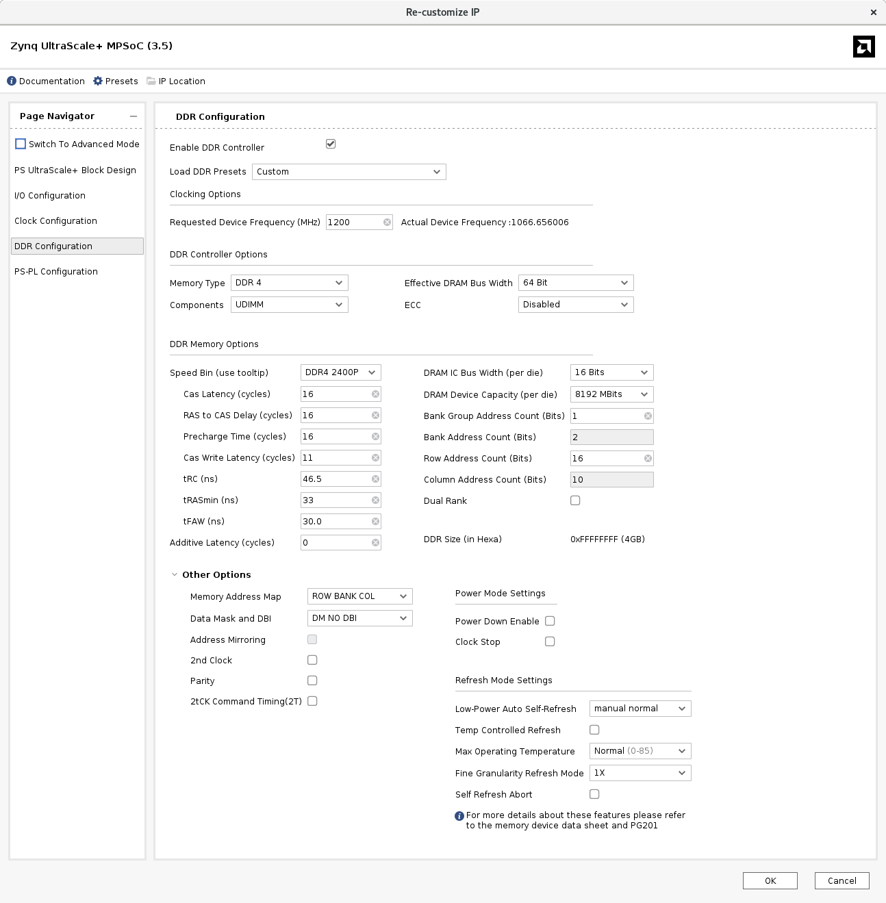
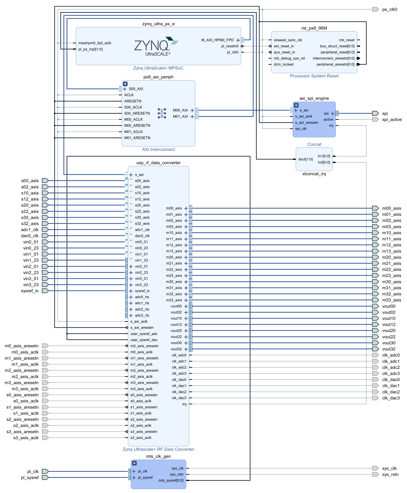
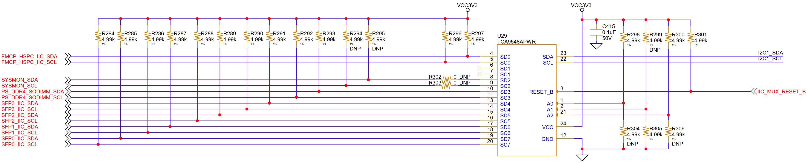
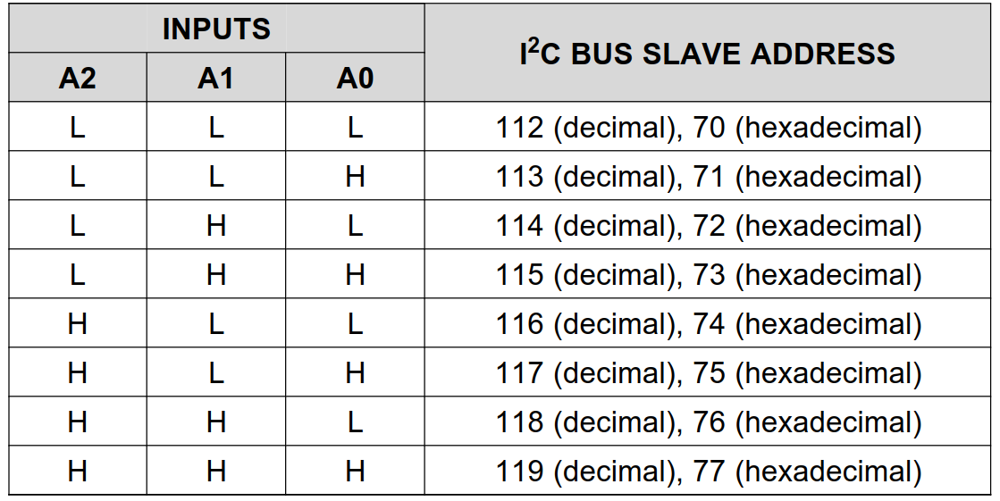
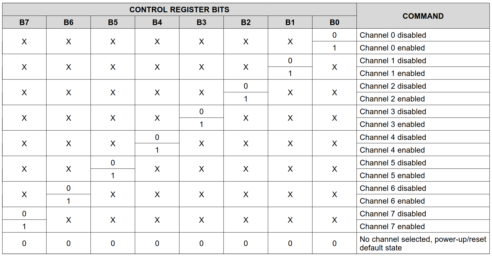
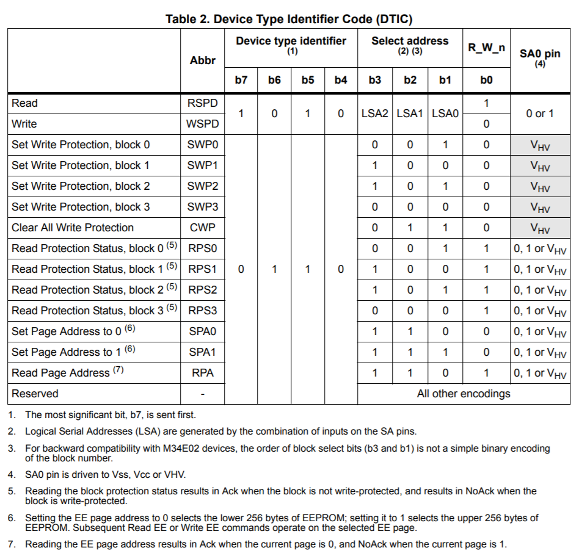
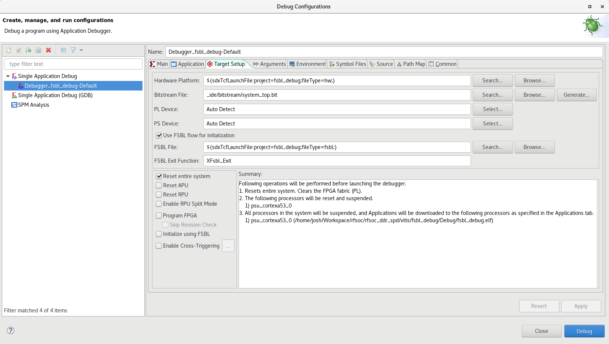
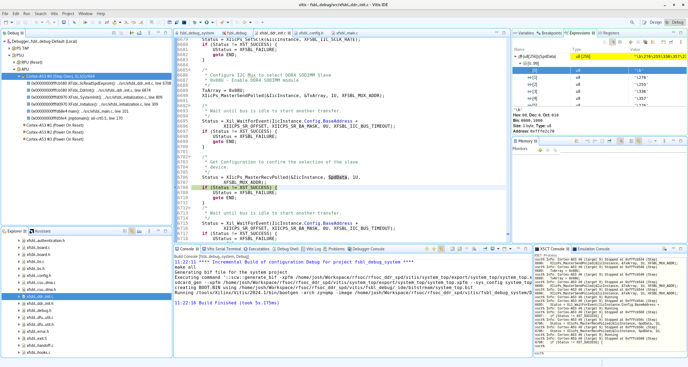
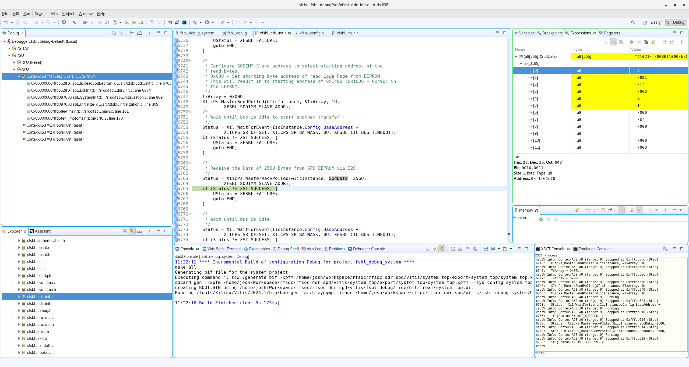

对于 DIMM 拓扑的 DDR，通常可以使用 I2C 对搭载在 DIMM 上的 SPD EEPROM 进行读取后获得配置参数，然后对 DDR 控制器进行配置。

AMD Xilinx UG1085 的 [Dynamic DDR Configuration](https://docs.amd.com/r/en-US/ug1085-zynq-ultrascale-trm/Dynamic-DDR-Configuration) 一节指出，当 DDR 控制器处于复位状态时，可以在运行时通过 FSBL 获取 DDR 参数并对 DDR 控制器进行初始化。

本文基于 Zynq RFSoC，对 PS 端的 SO-DIMM DDR 进行动态配置。

<!-- more -->

# 名词释义

- [BSP](https://xilinx-wiki.atlassian.net/wiki/spaces/A/pages/18842276/Standalone+Board+Support+Package+BSP)：Board Support Package，板级支持包
- [EEPROM](https://en.wikipedia.org/wiki/EEPROM)：Electrically-Erasable Programmable Read-Only Memory，电子擦除式可复写只读存储器
- [FSBL](https://xilinx-wiki.atlassian.net/wiki/spaces/A/pages/18842019/Zynq+UltraScale+FSBL#ZynqUltraScale+FSBL-WhatisFSBL?)：First Stage Bootloader，第一阶段引导加载程序
- [DDR DRAM](https://en.wikipedia.org/wiki/DDR_SDRAM)：Double Data Rate Synchronous Dynamic Random-Access Memory，双倍数据率同步动态随机存取存储器
- [DIMM](https://en.wikipedia.org/wiki/DIMM)：Dual In-line Memory Modules，双列直插式存储模块
- PCW：Processing System Configuration Wizard，处理系统配置向导
- [SO-DIMM](https://en.wikipedia.org/wiki/DIMM#SO-DIMM)：Small Outline Dual In-line Memory Modules，小外形双列直插式内存模块
- [SPD](https://en.wikipedia.org/wiki/Serial_presence_detect)：Serial Presence Detect，串行存在检测

# 硬软件版本

| 硬软件 | 型号/版本 |
| :--: | :-------: |
| FPGA | Zynq RFSoC XCZU48DR-2-FSVG1517-I |
| DDR4 | Micron MTA4ATF51264HZ-2G6E1 |
| I2C Mux | TI TCA9548APWR |
| Vivado | 2024.1 |
| Vitis Classic | 2024.1 |

# Zynq MPSoC / RFSoC 动态 DDR 配置简介

Zynq MPSoC / RFSoC 动态 DDR 配置具有如下特性：

- 无需在 Vivado 中进行改动即可更换 DIMM，并使用动态 DDR 配置初始化 DDR；
- 支持 DDR3 和 DDR4 DIMM；
- 单一的 PetaLinux BSP 即可支持任何可安装的 DIMM 器件。



动态 DDR 配置功能仅可用于 PS DIMM DDR，不支持颗粒 DDR。



# 具体操作方法

## PCW GUI 配置

在使用动态 DDR 配置之前，需要在如[图 1](#图1) 的 Vivado 的 PCW GUI 中启用 DDR 控制器，且将“DDR Controller Options”部分设置为：

- Memory Type：DDR4 或 DDR3
- Components：UDIMM 或 RDIMM
- ECC：Enabled 或 Disabled
- Effective DRAM Bus Width：64 Bit

<a id="图1"></a>



动态 DDR 配置将自动读取 SPD 表，并设置“DDR Memory Option”部分的所有参数，如下表。

| Option                 | Value Example | Option                    | Value Example        |
| -------------- | --------- | -------------- | --------- |
| Speed Bin (Use Tooltip)    | DDR42133P | DRAM IC Bus Width (per die)     | 8 Bits           |
| Cas Latency                | 15        | DRAM Device Capacity(per die)   | 4096 MBits       |
| RAS to CAS Delay (Cycles)  | 15        | Bank Group Address Count (Bits) | 2                |
| Pre-charge Time (Cycles)   | 15        | Bank Address Count (Bits)       | 2                |
| Cas Write Latency (Cycles) | 14        | Row Address Count (Bits)        | 15               |
| tRC (ns)                   | 46.5      | Column Address Count            | 10               |
| tRASmin (ns)               | 33        | Dual Rank                       |                  |
| tFAW (ns)                  | 21        | DDR Size (in hexa)              | 0XFFFFFFFF (4GB) |
| Additive Latency (Cycles)  | 0         |                                 |                  |

而“Other Options”部分的所有值都需要用户根据需要设置，无法从 SPD 表中获得，如下表。

| Option               | Value Example    | Option                    | Value Example         |
| -------------- | --------- | -------------- | --------- |
| Memory Address Map       | ROW BANK COL | Power Mode Settings           | Power Down Enable |
| Data Mask and DBI        | DM NO DBI    | Clock Stop                    |
| Address Mirroring        |              | **Refresh Mode Settings**     |
| 2nd Clock                |              | Lower-Power Auto Self-Refresh | Manual Normal     |
| Parity                   |              | Temp Controlled Refresh       |                   |
| 2Tck Command Timing (2T) |              | Max. Operating Temperature    | Normal (0-85)     |
|                          |              | Fine Granularity Refresh Mode | 1x                |
|                          |              | Self-Refresh Abort            |                   |

## 启用动态 DDR 配置功能

要启用动态 DDR 配置功能，需要在 Vivado 中使用 TCL 命令将参数 `CONFIG.PSU_DYNAMIC_DDR_CONFIG_EN` 置为 1：

``` tcl
set_property CONFIG.PSU_DYNAMIC_DDR_CONFIG_EN 1 [get_bd_cells /zynq_ultra_ps_e]
```

这里的 `zynq_ultra_ps_e` 需要替换为实际 Block Design 中 Zynq UltraScale+ MPSoC IP 核的名称，如[图 2](#图2)。

<a id="图2"></a>



然后重新生成 Output Products 即可（若除 PS 处理器外还有其他逻辑，则需要重新生成比特流）。FSBL 将会在启动过程中使用该参数，并执行动态 DDR 配置。



如果设置了上述参数却出现了如下警告，是因为 GUI 中 DDR 类型必须为 UDIMM 或 RDIMM，不能为 Component。

``` plain
WARNING: [BD 41-721] Attempt to set value '1' on disabled parameter 'PSU_DYNAMIC_DDR_CONFIG_EN' of cell '/zynq_ultra_ps_e_0' is ignored
```



## I2C 硬件要求

由于动态 DDR 配置需要在 FSBL 中使用 I2C 读取 DDR SPD EEPROM 中的数据，而在 Xilinx 自动生成 FSBL 中，I2C 读取 DDR SPD EEPROM 的方式是固定的，因此**若不想对生成的 FSBL 进行修改，则需要在硬件上适配 FSBL**。

Xilinx FSBL 使用 I2C1（1 号 I2C 控制器），借助一个 I2C Mux 与 SPD EEPROM 进行通信，使用的地址为：

- I2C Mux 地址： 0x75
- I2C Slave 地址： 0b1010001 (0x51)
- SODIMM SA[2:0]： 0b001



从 Vivado 2019.1 开始，动态 DDR 配置对于所有使用 DIMM DDR 的 Zynq MPSoC / RFSoC 评估板均启用，在使用预置硬件配置时无需额外用户操作。



## 根据硬件修改 FSBL

若 I2C 硬件连接不满足上述要求，还可以按照实际连接关系修改 FSBL。FSBL 中使用 I2C 读取 DDR SPD EEPROM 的函数为 `u32 XFsbl_IicReadSpdEeprom(u8 *SpdData)`。

``` c xfsbl_ddr_init.c
u32 XFsbl_DdrInit(void)
{
  // ...
  /* Get the Model Part Number from the SPD stored in EEPROM */
  Status = XFsbl_IicReadSpdEeprom(SpdData);
  if (Status != XFSBL_SUCCESS) {
    Status = XFSBL_FAILURE;
    goto END;
  }
  // ...
}
```

下面对函数进行拆解，结合注释可以更好理解操作的过程。

### 初始化 I2C 控制器

首先对 I2C 控制器 I2C1 进行初始化。值得一提的是，从 Vivado / Vitis 2023.2 版本开始，对设备进行寻址时，不再依赖于设备的 Device ID，而是直接使用基地址 Base Address，少了从 Device ID 到 Base Address 这一步操作，从开发的角度来看更为合理了。



若设计使用了 I2C 控制器 I2C0，则可以改为使用基地址 `XPAR_I2C0_BASEADDR` 或 Device ID `XPAR_PSU_I2C_0_DEVICE_ID` 来寻找设备。



``` c xfsbl_ddr_init.c
static u32 XFsbl_IicReadSpdEeprom(u8 *SpdData)
{
  // ...
  /* Lookup for I2C-1U device */
#ifdef SDT
  ConfigIic = XIicPs_LookupConfig(XPAR_I2C1_BASEADDR);
#else
  ConfigIic = XIicPs_LookupConfig(XPAR_PSU_I2C_1_DEVICE_ID);
#endif
  if (!ConfigIic) {
    UStatus = XFSBL_FAILURE;
    goto END;
  }

  /* Initialize the I2C device */
  Status = XIicPs_CfgInitialize(&IicInstance, ConfigIic,
      ConfigIic->BaseAddress);
  if (Status != XST_SUCCESS) {
    UStatus = XFSBL_FAILURE;
    goto END;
  }

  /* Set the Serial Clock for I2C */
  Status = XIicPs_SetSClk(&IicInstance, XFSBL_IIC_SCLK_RATE);
  if (Status != XST_SUCCESS) {
    UStatus = XFSBL_FAILURE;
    goto END;
  }
  // ...
}
```

### 选择 I2C Mux 的 Slave

由于开发板搭载了较多 I2C 外设，而 Zynq MPSoC / RFSoC 的 I2C 控制器数量有限，因此需要通过 I2C Mux 来扩展所连 I2C Slave 的数量。

本板卡 I2C1 原理图如[图 3](#图3)，所用 I2C Mux 的型号为 TCA9548A，其地址配置方式如[图 4](#图4)，Slave 选择方式如[图 5](#图5)，这里均和评估板保持一致，因此可以与自动生成的 FSBL 兼容。

结合[图 3](#图3) 和[图 4](#图4) 可知 I2C Mux 的地址为 `0x75`，从[图 3](#图3) 中可知 PS DDR4 SODIMM 的 I2C 连接在了第 3 号 Slave 的位置，因此按照[图 5](#图5) 需要将 B3 置 1，也即需要向地址为 `0x75` 的 I2C Mux TCA9548A 的控制寄存器中写入 `0x08`。

<a id="图3"></a>



<a id="图4"></a>

{width=600px}

<a id="图5"></a>

{width=1000px}

按照上述分析，下面的代码就不难理解了，首先向地址为 `XFSBL_MUX_ADDR`（默认为 `0x75`）的 I2C Mux 写入选通配置 `0x08`，然后从同样的地址回读，验证配置是否正确。



- 若设计中没有使用到 I2C Mux，而是直接将 I2C 控制器连接到了 DIMM，则可以删去这部分代码；
- 若设计中 I2C Mux 地址不同，则可以修改 `XFSBL_MUX_ADDR` 的宏定义；
- 若设计中 I2C Mux 连接的 Slave 不同，可以修改 I2C 发送的 `TxArray`。



``` c xfsbl_ddr_init.c
static u32 XFsbl_IicReadSpdEeprom(u8 *SpdData)
{
  // ...
  /*
   * Configure I2C Mux to select DDR4 SODIMM Slave
   * 0x08U - Enable DDR4 SODIMM module
   */
  TxArray = 0x08U;
  XIicPs_MasterSendPolled(&IicInstance, &TxArray, 1U, XFSBL_MUX_ADDR);

  /*
   * Wait until bus is idle to start another transfer.
   */
  Status = Xil_WaitForEvent(IicInstance.Config.BaseAddress +
      XIICPS_SR_OFFSET, XIICPS_SR_BA_MASK, 0U, XFSBL_IIC_BUS_TIMEOUT);
  if (Status != XST_SUCCESS) {
    UStatus = XFSBL_FAILURE;
    goto END;
  }

  /*
   * Get Configuration to confirm the selection of the slave
   * device.
   */
  Status = XIicPs_MasterRecvPolled(&IicInstance, SpdData, 1U,
      XFSBL_MUX_ADDR);
  if (Status != XST_SUCCESS) {
    UStatus = XFSBL_FAILURE;
    goto END;
  }
  /*
   * Wait until bus is idle to start another transfer.
   */
  Status = Xil_WaitForEvent(IicInstance.Config.BaseAddress +
      XIICPS_SR_OFFSET, XIICPS_SR_BA_MASK, 0U, XFSBL_IIC_BUS_TIMEOUT);
  if (Status != XST_SUCCESS) {
    UStatus = XFSBL_FAILURE;
    goto END;
  }
  // ...
}
```

### 读取 EEPROM 的第一页

配置完 I2C Mux 后，即可开始读取 SPD EEPROM 中的内容了。[图 6](#图6) 给出了 EEPROM 支持的指令表，由于 EEPROM 一次读的最大长度为一页，也即一个 Page，因此需要分两次对其中的两个 Page 进行读取。

<a id="图6"></a>

{width=800px}

首先设置 Page Address 为 0，也即向地址 `0x36` 中写入 `0x00`，表示从 Page 0 中进行读取，一次读取 256 Byte。



通常 SPD EEPROM 的 Page 选择地址是固定的，如果 Page Address 0 的地址有变更，修改 `XFSBL_SODIMM_CONTROL_ADDR_LOW` 的宏定义即可。



``` c xfsbl_ddr_init.c
static u32 XFsbl_IicReadSpdEeprom(u8 *SpdData)
{
  // ...
  /*
   * Set SODIMM control address to enable access to lower
   * EEPROM page (0U to 255U Bytes).
   * 0x00U - Enable Read of Lower Page from EEPROM
   */
  TxArray = 0x00U;
  XIicPs_MasterSendPolled(&IicInstance, &TxArray, 1U,
      XFSBL_SODIMM_CONTROL_ADDR_LOW);
  /*
   * Wait until bus is idle to start another transfer.
   */
  Status = Xil_WaitForEvent(IicInstance.Config.BaseAddress +
      XIICPS_SR_OFFSET, XIICPS_SR_BA_MASK, 0U, XFSBL_IIC_BUS_TIMEOUT);
  if (Status != XST_SUCCESS) {
    UStatus = XFSBL_FAILURE;
    goto END;
  }

  /*
   * Configure SODIMM Slave address to select starting address of the
   * read bytes.
   * 0x00U - Set starting byte address of read Lowe Page from EEPROM
   * This will result in to starting address of 0x149U (0x100U + 0x49U) in
   * the EEPROM.
   */
  TxArray = 0x00U;
  XIicPs_MasterSendPolled(&IicInstance, &TxArray, 1U,
      XFSBL_SODIMM_SLAVE_ADDR);
  /*
   * Wait until bus is idle to start another transfer.
   */
  Status = Xil_WaitForEvent(IicInstance.Config.BaseAddress +
      XIICPS_SR_OFFSET, XIICPS_SR_BA_MASK, 0U, XFSBL_IIC_BUS_TIMEOUT);
  if (Status != XST_SUCCESS) {
    UStatus = XFSBL_FAILURE;
    goto END;
  }

  /*
   * Receive the Data of 256U Bytes from SPD EEPROM via I2C.
   */
  Status = XIicPs_MasterRecvPolled(&IicInstance, SpdData, 256U,
      XFSBL_SODIMM_SLAVE_ADDR);
  if (Status != XST_SUCCESS) {
    UStatus = XFSBL_FAILURE;
    goto END;
  }

  /*
   * Wait until bus is idle.
   */
  Status = Xil_WaitForEvent(IicInstance.Config.BaseAddress +
      XIICPS_SR_OFFSET, XIICPS_SR_BA_MASK, 0U, XFSBL_IIC_BUS_TIMEOUT);
  if (Status != XST_SUCCESS) {
    UStatus = XFSBL_FAILURE;
    goto END;
  }
  // ...
}
```

### 读取 EEPROM 的第二页

然后设置 Page Address 为 1，也即向地址 `0x37` 中写入 `0x00`，表示从 Page 0 中进行读取，一次读取 256 Byte。



通常 SPD EEPROM 的 Page 选择地址是固定的，如果 Page Address 1 的地址有变更，修改 `XFSBL_SODIMM_CONTROL_ADDR_HIGH` 的宏定义即可。



``` c xfsbl_ddr_init.c
static u32 XFsbl_IicReadSpdEeprom(u8 *SpdData)
{
  // ...
  /*
   * Set SODIMM control address to enable access to upper
   * EEPROM page (256U to 511U Bytes).
   * 0x01U - Enable Read of Upper Page from EEPROM
   */
  TxArray = 0x01U;
  XIicPs_MasterSendPolled(&IicInstance, &TxArray, 1U,
      XFSBL_SODIMM_CONTROL_ADDR_HIGH);
  /*
   * Wait until bus is idle to start another transfer.
   */
  Status = Xil_WaitForEvent(IicInstance.Config.BaseAddress +
      XIICPS_SR_OFFSET, XIICPS_SR_BA_MASK, 0U, XFSBL_IIC_BUS_TIMEOUT);
  if (Status != XST_SUCCESS) {
    UStatus = XFSBL_FAILURE;
    goto END;
  }

  /*
   * Configure SODIMM Slave address to select starting address of the
   * read bytes.
   * 0x00U - Set starting byte address of read Upper Page from EEPROM
   * This will result in to starting address of 0x149U (0x100U + 0x49U) in
   * the EEPROM.
   */
  TxArray = 0x00U;
  XIicPs_MasterSendPolled(&IicInstance, &TxArray, 1U,
      XFSBL_SODIMM_SLAVE_ADDR);
  /*
   * Wait until bus is idle to start another transfer.
   */
  Status = Xil_WaitForEvent(IicInstance.Config.BaseAddress +
      XIICPS_SR_OFFSET, XIICPS_SR_BA_MASK, 0U, XFSBL_IIC_BUS_TIMEOUT);
  if (Status != XST_SUCCESS) {
    UStatus = XFSBL_FAILURE;
    goto END;
  }

  /*
   * Receive the Data of 256U Bytes from SPD EEPROM via I2C.
   */
  Status = XIicPs_MasterRecvPolled(&IicInstance, &SpdData[256U], 256U,
      XFSBL_SODIMM_SLAVE_ADDR);
  if (Status != XST_SUCCESS) {
    UStatus = XFSBL_FAILURE;
    goto END;
  }

  /*
   * Wait until bus is idle.
   */
  Status = Xil_WaitForEvent(IicInstance.Config.BaseAddress +
      XIICPS_SR_OFFSET, XIICPS_SR_BA_MASK, 0U, XFSBL_IIC_BUS_TIMEOUT);
  if (Status != XST_SUCCESS) {
    UStatus = XFSBL_FAILURE;
    goto END;
  }
  // ...
}
```

# 调试

配置完成后可以实测了，这里对 FSBL 进行 Debug，观察整个读写的过程。在单独调试 FSBL 的时候，可以不勾选“Program FPGA”和“Initialize using FSBL”，如[图 7](#图7)。

<a id="图7"></a>



将断点设置在函数 `XFsbl_IicReadSpdEeprom()` 被调用的地方。

<a id="图8"></a>


观察 I2C Mux 回读的数据。回读的数据存储在 `SpdData` 数组中，可以观察到数组的第 0 个字节为 `0x08`，与写入的数据一致。

<a id="图9"></a>



然后观察 I2C EEPROM 回读的数据，并与 Micron 给出的 [MTA4ATF51264HZ-2G6E1 的 SPD 数据][]进行对比，可以观察到数据是一致的。

<a id="图10"></a>



最后，`XFsbl_DdrInit()` 函数的剩余部分会完成 DDR 参数的解析与 DDR 控制器的初始化。

# 参考文档

[75768 - Zynq MPSoC Dynamic DDR Configuration Support for DIMM Devices](https://support.xilinx.com/s/article/75768)

[SPD I2c Address for DDR4 SODIMM](https://electronics.stackexchange.com/questions/554703/spd-i2c-address-for-ddr4-sodimm)

[MTA4ATF51264HZ-2G6E1 的 SPD 数据]: https://www.micron.com/products/memory/dram-modules/sodimm/part-catalog/part-detail/spd-data/mta4atf51264hz-2g6e1
