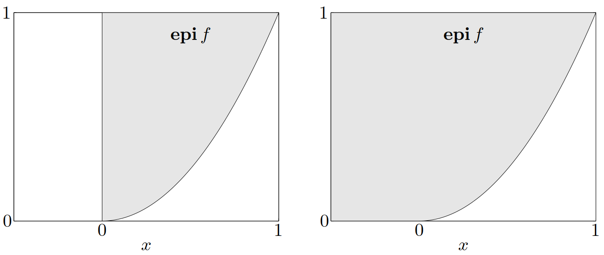

$
\newcommand{\dd}{\mathrm{d}}
\newcommand{\TT}{\mathrm{T}}
\def\diag{\mathop{\bf diag}}
\def\dom{\mathop{\bf dom}}
\def\epi{\mathop{\bf epi}}
$&emsp;&emsp;本文讨论几种保持函数凸性或者凹性的运算，这样可以构造新的凸函数或者凹函数。首先从一些简单的运算开始，如求和、伸缩以及逐点上确界，之后再介绍一些更为复杂的运算（其中一些运算的特例即为简单运算）。

# 1. 非负加权求和

&emsp;&emsp;显然，如果函数 $f$ 是凸函数且 $\alpha\geqslant0$，则函数 $\alpha f$ 也是凸函数。如果函数 $f_1$ 和 $f_2$ 都是凸函数，则它们的和 $f_1+f_2$ 也是凸函数。将非负伸缩以及求和运算结合起来，可以看出，凸函数的集合本身是一个凸锥：凸函数的非负加权求和仍然是凸函数，即函数

$$
f=w_1f_1+\cdots+w_mf_m
$$

是凸函数。类似地，凹函数的非负加权求和仍然是凹函数。严格凸（凹）函数的非负，非零加权求和是严格凸（凹）函数。

&emsp;&emsp;这个性质可以扩展至无限项的求和以及积分的情形。例如，如果对于每一个 $y\in\mathcal{A}$，函数 $f(x,y)$ 是关于 $x$ 的凸函数，且有 $w(y)\geqslant 0$，则函数

$$
g(x)=\int_{\mathcal{A}}w(y)f(x,y)\dd y
$$

关于 $x$ 是凸函数（若此积分存在）。

<!-- more -->

&emsp;&emsp;可以很容易直接验证非负伸缩以及求和运算是保凸运算，或者可以根据相关的上境图得到此结论。例如，如果 $w\geqslant 0$ 且 $f$ 是凸函数，则有

$$
\epi (wf)=\left[\begin{array}{cc}
I&0\\
0&w
\end{array}\right]\epi f
$$

因为凸集通过线性变换得到的像仍然是凸集，所以 $\epi(wf)$ 是凸集。

# 2. 复合仿射映射

&emsp;&emsp;假设函数 $f:\mathbf{R}^n\to\mathbf{R}$，$A\in\mathbf{R}^{n\times m}$，$b\in\mathbf{R}^n$，定义 $g:\mathbf{R}^m\to\mathbf{R}$ 为

$$
g(x)=f(Ax+b)
$$

其中 $\dom g=\{x\mid Ax+b\in\dom f\}$。若函数 $f$ 是凸函数，则函数 $g$ 是凸函数；若函数 $f$ 是凹函数，则函数 $g$ 是凹函数。

# 3. 逐点最大和逐点上确界

&emsp;&emsp;如果函数 $f_{1}$ 和 $f_{2}$ 均为凸函数，则二者的**逐点最大**（*pointwise maximum*）函数

$$
f(x)=\max\{f_1(x),f_2(x)\}
$$

其定义域为 $\dom f=\dom f_1\cap\dom f_2$，仍然是凸函数。这个性质很容易验证：任取 $0\leqslant \theta \leqslant 1$ 以及 $x,y\in\dom f$，有

$$\begin{aligned}
f(\theta x+(1-\theta)y)&=\max\{f_1(\theta x+(1-\theta)y),f_2(\theta x+(1-\theta)y)\}
\\
&\leqslant\max\{\theta f_1(x)+(1-\theta)f_1(y),\theta f_2(x)+(1-\theta)f_2(y)\}
\\
&\leqslant\theta\max\{f_1(x),f_2(x)\}+(1-\theta)\max\{f_1(y),f_2(y)\}
\\
&=\theta f(x)+(1-\theta)f(y)
\end{aligned}$$

从而说明了函数 $f$ 的凸性。同样很容易证明，如果函数 $f_1,\cdots,f_m$ 为凸函数，则它们的逐点最大函数

$$
f(x)=\max\{f_1(x),\cdots,f_m(x)\}
$$

仍然是凸函数。

> **举例**&emsp;**分片线性函数**（*Piecewise-linear functions*）。函数
>
> $$
> f(x)=\max\left\{a_1^\TT x+b_1,\cdots,a_L^\TT x+b_L\right\}
> $$
>
> 定义了一个（具有 $L$ 个或者更少的子区域）分片线性函数（实际上是仿射函数）。因为它是一系列仿射函数的逐点最大函数，所以它是凸函数。反之亦成立：任意具有 $L$ 个或者更少子区域的分片线性凸函数都可以表述成上述形式。

> **举例**&emsp;**最大 $r$ 个分量之和**。对于任意 $x\in\mathbf{R}^n$，用 $x_{[i]}$ 表示 $x$ 中第 $i$ 大的分量，即将 $x$ 的分量按照非升序进行排列得到下式
>
> $$
> x_{[1]}\geqslant x_{[2]}\geqslant\cdots\geqslant x_{[n]}
> $$
>
> 则对 $x$ 的最大 $r$ 个分量进行求和所得到的函数
>
> $$
> f(x)=\sum_{i=1}^rx_{[i]}
> $$
>
> 是凸函数。事实上，此函数可以表述为
>
> $$
> f(x)=\sum_{i=1}^rx_{[i]}=\max\{x_{i_1}+\cdots+x_{i_r}\mid1\leqslant i_1<i_2<\cdots<i_r\leqslant n\}
> $$
>
> 即从 $x$ 的分量中选取 $r$ 个不同分量进行求和的所有可能组合的最大值。因为函数 $f$ 是 $\displaystyle\frac{n!}{r!(n-r)!}$ 个线性函数的逐点最大，所以是凸函数。
>
> 作为一个扩展，可以证明当 $w_1\geqslant w_2\geqslant\cdots\geqslant w_r\geqslant 0$ 时，函数 $\displaystyle\sum_{i=1}^rw_ix_{[i]}$ 是凸函数。

&emsp;&emsp;逐点最大的性质可以扩展至无限个凸函数的逐点上确界。如果对于任意 $y\in\mathcal{A}$，函数 $f(x,y)$ 关于 $x$ 都是凸的，则函数

$$\begin{equation}\label{PointwiseMaximum}
g(x)=\sup_{y\in\mathcal{A}}f(x,y)
\end{equation}$$

关于 $x$ 亦是凸的。此时，函数 $g$ 的定义域为

$$
\dom g=\{x\mid(x,y)\in\dom f\:\forall y\in\mathcal{A},\sup_{y\in\mathcal{A}}f(x,y)<\infty\}
$$

类似地，一系列凹函数的逐点下确界仍然是凹函数。

&emsp;&emsp;从上境图的角度理解，一系列函数的逐点上确界函数对应着这些函数上境图的交集：对于函数 $f$，$g$ 以及式 $\eqref{PointwiseMaximum}$ 定义的 $\mathcal{A}$，有

$$
\epi g=\bigcap_{y\in\mathcal{A}}\epi f(\:\cdot\:,y)
$$

因此，函数 $g$ 的凸性可由一系列凸集的交集仍然是凸集得到。

> **举例**&emsp;**集合的支撑函数**。令集合 $C\subseteq\mathbf{R}^n$，且 $C\neq\emptyset$，定义集合 $C$ 的**支撑函数**（*support function*）$S_C$ 为
>
> $$
> S_C(x)=\sup\{x^\TT y\mid y\in C\}
> $$
>
> （自然地，函数 $S_C$ 的定义域为 $\dom S_{C}=\left\{x\mid\sup_{y\in C}x^\TT y<\infty\right\}$）。
>
> 对于任意 $y\in C$，$x^\TT y$ 是 $x$ 的线性函数，所以 $S_{C}$ 是一系列线性函数的逐点上确界函数，因此是凸函数。

> **举例**&emsp;**到集合中最远点的距离**。令集合 $C\subseteq\mathbf{R}^n$，定义点 $x$ 与集合中最远点的距离（范数）为
>
> $$
> f(x)=\sup_{y\in C}\|x-y\|
> $$
>
> 此函数是凸函数。为了说明这一点，我们注意到，对于任意 $y$，函数 $\|x-y\|$ 关于 $x$ 是凸函数。因为函数 $f$ 是一族凸函数（对应不同的 $y\in C$）的逐点上确界，所以是凸函数。

> **举例**&emsp;**以权为变量的最小二乘代价函数**。令 $a_1,\cdots,a_n\in\mathbf{R}^m$，在加权最小二乘问题中我们对所有的 $x\in\mathbf{R}^m$ 极小化目标函数 $\displaystyle\sum_{i=1}^nw_i(a_i^\TT x-b_i)^2$。我们称 $w_i$ 为**权**（*weight*），并允许 $w_i$ 为负（则目标函数有可能无下界）。
>
> 定义（最优）**加权最小二乘代价**（*weighted least-squares cost*）函数为
>
> $$
> g(w)=\inf_{x}\sum_{i=1}^{n}w_{i}(a_{i}^{\TT}x-b_{i})^{2}
> $$
>
> 其定义域为
>
> $$\dom g=\left\{w\,\middle|\,\inf_{x}\sum_{i=1}^{n}w_{i}(a_{i}^{\TT}x-b_{i})^{2}>-\infty\right\}$$
>
> 因为函数 $g$ 是一族关于 $w$ 的线性函数的下确界（对应于不同的 $x\in\mathbf{R}^m$），它是 $w$ 的凹函数。
>
> 至少在部分定义域上，我们可以得到函数 $g$ 的一个显式表达式。令 $W=\diag(w)$ 是一对角阵，其对角线元素为 $w_1,\cdots,w_n$，令 $A\in\mathbf{R}^{n\times m}$，其行向量为 $a_i^\TT$，有
>
> $$
> g(w)=\inf_{x}(Ax-b)^{\TT}W(Ax-b)=\inf_{x}(x^{\TT}A^{\TT}WAx-2b^{\TT}WAx+b^{\TT}Wb)
> $$
>
> 从上式可以看出，若 $A^TWA\not\succeq0$，括号里的二次函数关于 $x$ 无下界，故 $g(w)=-\infty$，即 $w\not\in\dom g$。当 $A^\TT WA\succ0$ 时（即定义了一个严格的线性矩阵不等式），通过解析求解二次函数的极小值，可以得到函数 $g$ 的一个简单的表达式
>
> $$\begin{aligned}
>   g(w)&=b^{\TT}Wb-b^{\TT}WA(A^{\TT}WA)^{-1}A^{\TT}Wb
>   \\
>   &=\sum_{i=1}^{n}w_{i}b_{i}^{2}-\sum_{i=1}^{n}w_{i}^{2}b_{i}^{2}a_{i}^{\TT}\left(\sum_{j=1}^{n}w_{j}a_{j}a_{j}^{\TT}\right)^{-1}a_{i}
> \end{aligned}$$
>
> 从上述表达式并不能立即得到函数 $g$ 的凹性（不过可以从矩阵分式函数的凸性来推导函数 $g$ 的凹性）。

> **举例**&emsp;**对称矩阵的最大特征值**。 定义函数 $f(X)=\lambda_{\max}(X)$，其定义域为 $\dom f=\mathbf{S}^m$，它是凸函数。为了说明这一点，我们将 $f$ 表述为
>
> $$
> f(X)=\sup\{y^\TT Xy\mid\|y\|_2=1\}
> $$
>
> 即针对不同的 $y\in\mathbf{R}^m$ 关于 $X$ 的一族线性函数（即$y^\TT Xy$）的逐点上确界。

> **举例**&emsp;**矩阵范数**。考虑函数 $f(X)=\|X\|_2$，其定义域为 $\dom f=\mathbf{R}^{p\times q}$，其中 $\|\cdot\|_2$ 表示谱范数或者最大奇异值。函数 $f$ 可以表述为
>
> $$
> f(X)=\sup\{u^{\TT}Xv\mid\|u\|_{2}=1,\|v\|_{2}=1\}
> $$
>
> 由于它是 $X$ 的一族线性函数的逐点上确界，所以是凸函数。
>
> 作为一个推广，假设 $\|\cdot\|_a$和$\|\cdot\|_b$ 分别是 $\mathbf{R}^p$ 和 $\mathbf{R}^q$ 上的范数，定义矩阵 $X\in\mathbf{R}^{p\times q}$ 的诱导范数为
>
> $$
> \|X\|_{a,b}=\sup_{v\neq0}\frac{\|Xv\|_{a}}{\|v\|_{b}}
> $$

## 3.1 表示成一族仿射函数的逐点上确界

&emsp;&emsp;上述例子描述了一个建立函数凸性的好方法：将函数表示为一族仿射函数的逐点上确界。除了一个技术条件，反过来也是成立的：几乎所有的凸函数都可以表示成一族仿射函数的逐点上确界。例如，如果函数 $f:\mathbf{R}^n\to\mathbf{R}$ 是凸函数，其定义域为 $\dom f=\mathbf{R}^n$，我们有

$$
f(x)=\sup\{g(x)\mid g\:\text{仿射},\:g(z)\leqslant f(z)\:\forall z\}
$$

换言之，函数 $f$ 是它所有的仿射全局下估计的逐点上确界。下面我们将证明这个结论。

&emsp;&emsp;设函数 $f$ 是凸函数，定义域为 $\dom f=\mathbf{R}^{n}$ ，显然下面的不等式成立

$$
f ( x ) \geqslant \sup \{g ( x ) \mid g\:\text{仿射}, \ g ( z ) \leqslant f ( z ) \ \forall z \},
$$

因为函数 $g$ 是函数 $f$ 的任意仿射下估计，我们有 $g ( x ) \leqslant f ( x )$。为了建立等式，我们说明，对于任意 $x \in\mathbf{R}^{n}$，存在仿射函数 $g$ 是函数 $f$ 的全局下估计，并且满足 $g ( x )=f ( x )$。

&emsp;&emsp;毫无疑问，函数 $f$ 的上境图是凸集，因此我们在点 $( x, f ( x ) )$ 处可以找到此凸集的支撑超平面，即存在 $a \in\mathbf{R}^{n}$，$\; b \in\mathbf{R}$ 且 $( a, b ) \neq0$，使得对任意 $( z, t ) \in\epi f$，有

$$
\left[ \begin{array} {c} a \\ b \\ \end{array} \right]^{\TT} \left[ \begin{array} {c} {x-z} \\ {f ( x )-t} \\ \end{array} \right] \leqslant0.
$$

即对任意 $z\in\dom f=\mathbf{R}^n$ 以及所有 $s\geqslant0$（$(z,t)\in\mathbf{epi}f$ 等价于存在 $s\geqslant0$ 使得 $t=f(z)+s$），下式成立

$$\begin{equation}\label{ProofOfAffineFunctionRepresentation}
  a^\TT(x-z)+b(f(x)-f(z)-s)\leqslant0
\end{equation}
$$

为了保证不等式 $\eqref{ProofOfAffineFunctionRepresentation}$ 对所有的 $s\geqslant0$ 均成立，必须有 $b\geqslant0$。如果 $b=0$，对所有的$z\in\mathbf{R}^n$，不等式 $\eqref{ProofOfAffineFunctionRepresentation}$ 可以简化为 $a^\TT(x-z)\leqslant0$，这意味着 $a=0$，于是和假设 $(a,b)\neq0$ 矛盾。因此 $b>0$，即支撑超平面不是竖直的。

&emsp;&emsp;我们知道 $b>0$，因此，对任意 $z$，令 $s=0$，式 $\eqref{ProofOfAffineFunctionRepresentation}$ 可以重新表述为

$$
g(z)=f(x)+(a/b)^{T}(x-z)\leqslant f(z)
$$

由此说明函数 $g$ 是函数 $f$ 的一个仿射下估计，并且满足 $g(x)=f(x)$。

# 4. 复合

&emsp;&emsp;本节给定函数 $h:\mathbf{R}^k\to\mathbf{R}$ 以及 $g:\mathbf{R}^n\to\mathbf{R}^k$，定义复合函数 $f=h\circ g:\mathbf{R}^n\to\mathbf{R}$
为

$$
f(x)=h(g(x)),\quad\dom f=\{x\in\dom g\mid g(x)\in\dom h\}
$$

我们考虑当函数 $f$ 保凸或者保凹时，函数 $h$ 和 $g$ 必须满足的条件。

## 4.1 标量复合

&emsp;&emsp;首先考虑 $k=1$ 的情况，即 $h:\mathbf{R}\to\mathbf{R}$，$g:\mathbf{R}^n\to\mathbf{R}$。仅考虑 $n=1$ 的情况（事实上，将函数限定在与其定义域相交的任意直线上得到的函数决定了原函数的凸性）。

&emsp;&emsp;为了找出复合规律，首先假设函数 $h$ 和 $g$ 是二次可微的，且 $\dom g= \dom h= \mathbf{R}$。在上述假设下，函数 $f$ 是凸的等价于 $f^{\prime\prime}\geqslant 0$（即对所有的 $x\in\mathbf{R}$，$f^{\prime\prime}(x)\geqslant 0$）。

&emsp;&emsp;复合函数$f=h\circ g$的二阶导数为

$$\begin{equation}\label{SecondDerivativeOfCompositionFunction}
  f''(x)=h''(g(x))g'(x)^2+h'(g(x))g''(x)
\end{equation}$$

假设函数 $g$ 是凸函数（$g^{\prime\prime}\geqslant 0$），函数 $h$ 是凸函数且非减（即$h^{\prime\prime}\geqslant0$ 且 $h^{\prime}\geqslant0$），从式 $\eqref{SecondDerivativeOfCompositionFunction}$ 可以得出 $f^{\prime\prime}\geqslant 0$，即函数 $f$ 是凸函数。类似地，由式 $\eqref{SecondDerivativeOfCompositionFunction}$ 可以得出如下结论

$$\begin{equation}\label{Conclusion1}\begin{aligned}
  如果\,h\,是凸函数且非减，g\,是凸函数，则\,f\,是凸函数，\\
  如果\,h\,是凸函数且非增，g\,是凹函数，则\,f\,是凸函数，\\
  如果\,h\,是凹函数且非减，g\,是凹函数，则\,f\,是凹函数，\\
  如果\,h\,是凹函数且非增，g\,是凸函数，则\,f\,是凹函数。
\end{aligned}\end{equation}$$

上述结论在函数 $g$ 和 $h$ 二次可微且定义域均为 $\mathbf{R}$ 时成立。事实上，对于更一般的情况，如 $n>1$，不再假设函数 $h$ 和 $g$ 可微或者 $\dom g=\mathbf{R}^n$，$\dom h=\mathbf{R}$，一些相似的复合规则仍然成立

$$\begin{equation}\label{Conclusion2}\begin{aligned}
  如果\,h\,是凸函数且\,\tilde{h}\,非减，\,g\,是凸函数，则\,f\,是凸函数，\\
  如果\,h\,是凸函数且\,\tilde{h}\,非增，\,g\,是凹函数，则\,f\,是凸函数，\\
  如果\,h\,是凹函数且\,\tilde{h}\,非减，\,g\,是凹函数，则\,f\,是凹函数，\\
  如果\,h\,是凹函数且\,\tilde{h}\,非增，\,g\,是凸函数，则\,f\,是凹函数。
\end{aligned}\end{equation}$$

其中，$\tilde{h}$ 表示函数 $h$ 的扩展值延伸，若点不在 $\dom h$内，对其赋值 $\infty$（若 $h$ 是凸函数）或者$-\infty$（若 $h$ 是凹函数）。这些结论和式 $\eqref{Conclusion1}$ 中的结论的唯一不同是我们要求**扩展值延伸**（*extended-value extension*）$\tilde{h}$ 在整个 $\mathbf{R}$ 上非增或者非减。

&emsp;&emsp;为了更好地理解式 $\eqref{Conclusion2}$ 中的结论，假设 $h$ 是凸函数，所以 $\tilde{h}$ 在定义域 $\dom h$ 外取值为$\infty$。$\tilde{h}$ 非减意味着对于任意 $x,y\in\mathbf{R}$，$x<y$，有 $\tilde{h}(x)\leqslant\tilde{h}(y)$。特别地，若 $y\in\dom h$，则$x\in\dom h$。换言之，我们可以认为 $h$ 的定义域在负方向上无限延伸。它或者是 $\mathbf{R} 或者是形如 $(-\infty,a)$ 或 $\left(-\infty,a\right]$ 的区间。类似地，若 $h$ 是凸函数且 $\tilde{h}$ 非增，我们可以理解为 $h$ 是非增的且 $\dom h$在正方向上趋于无穷。[图 7](#图7) 描述了不同的扩展值延伸的情况。

{width=700px}

> **举例**&emsp;通过一些简单例子，我们可以更好地理解复合定理中函数 $h$ 需要满足的条件。
>
> - 函数 $h(x)=\log x$，定义域为 $\dom h=\mathbf{R}_{++}$，为凹函数且 $\tilde{h}$ 非减。
> - 函数 $h(x)=x^1/2$，定义域为 $\dom h=\mathbf{R}_+$，为凹函数且 $\tilde{h}$ 非减。
> - 函数 $h(x)=x^{3/2}$，定义域为 $\dom h=\mathbf{R}_+$，为凸函数，但是不满足 $\tilde{h}$ 非减的条件。例如，$\tilde{\tilde{h}}(-1)=\infty$ 但 $\tilde{h}(1)=1$。
> - 当 $x\geqslant 0$ 时，$h(x)=x^3/2$，当 $x<0$ 时 $h(x)=0$，定义域为 $\dom h=\mathbf{R}$，$h$ 是凸函数且满足 $\tilde{h}$ 非减的条件。

&emsp;&emsp;即使不假设可微并运用表达式 $\eqref{SecondDerivativeOfCompositionFunction}$，也可以直接证明复合函数结论式 $\eqref{Conclusion2}$。作为一个例子，我们证明如下结论：如果 $g$ 是凸函数，$h$ 是凸函数且 $\tilde{h}$ 非减，则 $f=h\circ g$ 是凸函数。假设 $x,y\in\dom f$，$0\leqslant\theta\leqslant1$。由 $x,y\in\dom f$，有 $x,y\in\dom g$ 且 $g( x)$, $g( y) \in \dom h$。因为 $\dom g$ 是凸集，有 $\theta x+(1-\theta)y\in\dom g$，由函数 $g$ 的凸性可得

$$\begin{equation}\label{ConvexityOfFunctionG}
  g(\theta x+(1-\theta)y)\leqslant\theta g(x)+(1-\theta)g(y)
\end{equation}
$$

由 $g(x),g(y)\in\dom h$ 可得 $\theta g(x)+(1-\theta)g(y)\in\dom h$，即式 $\eqref{ConvexityOfFunctionG}$ 的右端在 $\dom h$ 内。根据假设 $\tilde{h}$ 是非减的，可以理解为其定义域在负方向上无限延伸。由式 $\eqref{ConvexityOfFunctionG}$ 的右端在 $\dom h$ 内，我们知道其左侧仍在定义域内，即 $g(\theta x+(1-\theta)y)\in\dom h$，因此 $\dom f$ 是凸集。

&emsp;&emsp;根据前提条件，$\tilde{h}$ 非减，利用不等式 $\eqref{ConvexityOfFunctionG}$，有

$$\begin{equation}\label{NondecreasingOfFunctionH}
  h(g(\theta x+(1-\theta)y))\leqslant h(\theta g(x)+(1-\theta)g(y))
\end{equation}
$$

由函数 $h$ 的凸性可得

$$\begin{equation}\label{ConvexityOfFunctionH}
  h(\theta g(x)+(1-\theta)g(y))\leqslant\theta h(g(x))+(1-\theta)h(g(y))
\end{equation}
$$

综合式 $\eqref{NondecreasingOfFunctionH}$ 和式 $\eqref{ConvexityOfFunctionH}$ 可得

$$
h(g(\theta x+(1-\theta)y))\leqslant\theta h(g(x))+(1-\theta)h(g(y))
$$

复合定理得证。

> **举例**&emsp;简单的复合结论。
>
> - 如果 $g$ 是凸函数则 $\exp g(x)$ 是凸函数。
> - 如果 $g$ 是凹函数且大于零，则 $\log g(x)$ 是凹函数。
> - 如果 $g$ 是凹函数且大于零，则 $1/g(x)$是凸函数。
> - 如果 $g$ 是凸函数且不小于零，$p\geqslant1$，则 $g(x)^p$ 是凸函数。
> - 如果 $g$ 是凸函数，则 $-\log(-g(x))$ 在 $\{x\mid g(x)<0\}$ 上是凸函数。

> **注释**&emsp;扩展值延伸 $\tilde{h}$ 的单调性要求必须满足，注意到是 $\tilde{h}$，而不仅仅是 $h$。例如，考虑 $g( x) = x^2$，$\dom g = \mathbf{R}$，$h( x) = 0$，$\dom h= [ 1, 2]$ 复合的情形。此时 $g$ 是凸函数，$h$ 是凸函数且非减，但是函数 $f=h\circ g$
>
> $$
> f(x)=0,\quad\mathbf{dom}f=[-\sqrt{2},-1]\:\cup\:[1,\sqrt{2}]
> $$
>
> 不是凸函数，因为其定义域非凸。当然，此时函数 $\tilde{h}$ 不是非减的。

# 参考文献

1. Stephen P. Boyd and Lieven Vandenberghe, *Convex optimization*. Cambridge, UK: Cambridge University Press, 2004.
2. Stephen P. Boyd and Lieven Vandenberghe, *凸优化*. 北京: 清华大学出版社, 2013.
